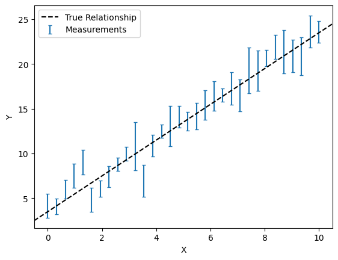
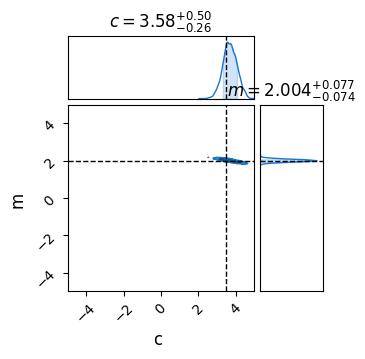

Next Entry: [WebGuide](.\..\02_mcmcsamplers\page.html)  
  
  
Go Back: [Comfortably NumPyro](.\..\blog_numpyrohome.html)  
Return to [blog home](.\..\..\bloghome.html)  
  
This is the default header  
  
  
# Getting Started
  
  This tutorial covers the bare minimum basics of working with NumPyro: how to install, run and how to apply to a simple model.
  - Aimed at brand new users
  - Mention [DFM tutorial](https://dfm.io/posts/intro-to-numpyro/)
  - Mention [numpyro tutes](https://num.pyro.ai/en/stable/)
  
  
  ## Installing NumPyro
  
  - Best to work on some sort of linux system or mac
  - If working on a windows machine, try using the [Windows Subsystem for Linux](https://learn.microsoft.com/en-us/windows/wsl/install) which will let you run all sorts of
  - Also strongly advise using a conda environment or something similar (e.g. virtual environment). NumPyro can have significant changes between versions, particularly when using external modules like JAXNS's nested sampling, and so good version control is a must
  
  
  **Setting Up an Environment**
  
  ```
      conda create -n numpyroenv"
      conda install python
      conda install pip
  ```
  
  And then activate this environment with:
  
  ```
      conda activate numpyroenv
  ```
  
  You now have a conda environment running which safely contains all of the packages we'll need. `conda list` or `pip list` will show you everything you've got installed at the moment, including version numbers. If something is going wrong, this is a good place to start.
  
  **Installing NumPyro & Its Dependencies**
  
  First, install basic python packages that you'll need to do most anything with NumPyro. Note that many tutorials use the packages `corner` or `arviz` instead of `chainconsumer`. 
  
  ```
      pip install numpy, matplotlib, chainconsumer
  ```
  
  Now, install JAX, numpyro and their associated packages
  
  ```
      pip install jax, jaxlib, jaxopt
      pip install numpyro
  ```
  
  If you're planning on using nested sampling with numpyro, you'll need the following. Note that we're installing a *specific version of jaxns*. At time of writing, NumPyro is not compatible with the versions of jaxns 2.1.0 or greater.
  
  ```
      pip install etils, tensorflow_probability
      pip install jaxns==2.0.1
  ```
  
  ## Your First Model
  
  - Show imports & Data
  - In this example, show a simple linear regression
  
  
  ```python
  import jax, numpyro, chainconsumer
  import jax.numpy as jnp
  
  import matplotlib.pyplot as plt
  import numpy as np
  ```
  
  
  ```python
  m = 2
  c = 3.5
  
  ebar, escatter = 1.5, 10
  
  np.random.seed(1)
  X = np.linspace(0,10,32)
  E = np.random.poisson(lam=escatter, size=len(X)) / escatter * ebar
  Y = m*X + c + E*np.random.normal(size=len(X))
  
  #--------------
  plt.figure()
  plt.errorbar(X,Y,E,fmt='none', capsize=2, label='Measurements')
  plt.axline([0,c],slope=m, c='k', ls='--', label='True Relationship')
  plt.legend(loc='best')
  plt.xlabel("X"), plt.ylabel("Y")
  plt.show()
  ```
  
  
      
  
      
  
  
  - Likelihood given by $\chi^2$ distribution:
  $$\begin{equation}
      \mathcal{L}(m,c \| y_i) = \sum_i{\left(\frac{y_i-m*x_i+c}{E_i}\right)^2}
  \end{equation}$$
  - Need to fit numpyro model
  - 
  
  
  ```python
  def model(X,Y,E):
      m = numpyro.sample('m', numpyro.distributions.Uniform(-5,5)) # prior on m
      c = numpyro.sample('c', numpyro.distributions.Uniform(-5,5)) # Prior on c
  
      with numpyro.plate('plate', len(X)):
          y_model = m*X + c
          numpyro.sample('y', numpyro.distributions.Normal(y_model,E), obs = Y)
  ```
  
  - Looks like a python 'function', but doesn't necessarily work like one, e.g. we don't "return" a likelihood. Instead, each "numpyro.sample" statement implies an effect on the likelihood
  - Emphasize lack of "return" statement
  - Explain each component of the code
  - Note also that the 'plate' is a little ambigious about what is or isn't vectorized. The `y = m*x+c` line can actually go inside or outside the loop
  - e.g. the following model will produce the same distribution
  
  
  ```python
  def model(X,Y,E):
      m = numpyro.sample('m', numpyro.distributions.Uniform(-5,5)) # prior on m
      c = numpyro.sample('c', numpyro.distributions.Uniform(-5,5)) # Prior on c
  
      y_model = m*X+c
      
      for i in range(len(X)):
          numpyro.sample('y_%i' %i, numpyro.distributions.Normal(y_model[i], E[i]), obs=Y[i])
  ```
  
  
  
  
  ```python
  sampler = numpyro.infer.MCMC(numpyro.infer.NUTS(model), 
                               num_chains  = 1, 
                               num_samples = 5000, 
                               num_warmup  = 500)
  sampler.run(jax.random.PRNGKey(1), X,Y,E)
  ```
  
      sample: 100%|█████████| 5500/5500 [00:02<00:00, 2633.63it/s, 7 steps of size 1.51e-01. acc. prob=0.94]
  
  
  
  ```python
  results = sampler.get_samples() # Dictionary of MCMC samples
  C = chainconsumer.ChainConsumer()
  C.add_chain(results, name = "MCMC Results")
  C.plotter.plot(extents={'m': [-5,5], 'c':[-5,5]}, truth = {'m':m, 'c':c})
  plt.show()
  ```
  
  
      
  
      
  
    
For more detailed information, feel free to check my [GitHub repos](https://github.com/HughMcDougall/) or [contact me directly](hughmcdougallemail@gmail.com).  
  
