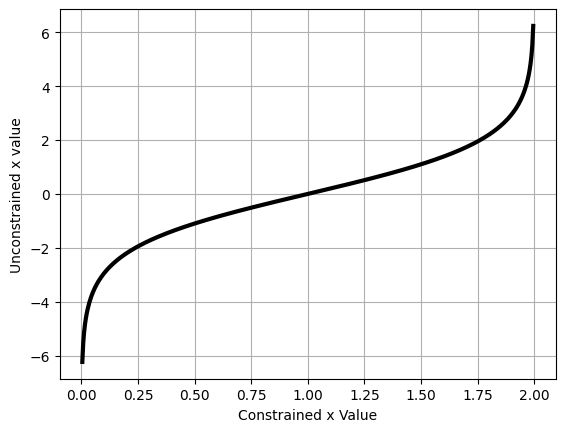
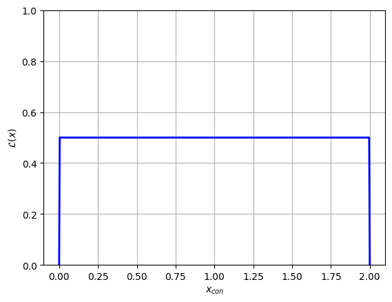
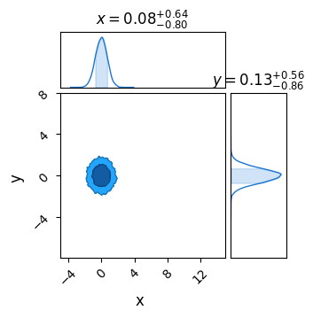
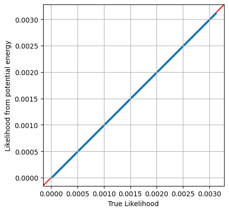

Author's Note: This is a WIP, two quick examples stapled together. It provides all the key information, but may be a bit messy in places

# The Constrained / Unconstrained Domains & Getting Likelihoods from MCMC

A demonstration of how NumPyro converts values drawn from a constrained distribution (e.g. a uniform distribution) and converts to unconstrained distributions to create an unbounded prior space.

Also shown is how these unconstrained values can be fed to internal functions to evaluate likelihoods directly from a NumPyro model function


```python
# Statistical + JAX Tools
import jax, numpyro
import jax.numpy as jnp
from numpyro.infer.util import transform_fn

# Utility, Math & Plotting
import numpy as np
import matplotlib.pyplot as plt
from chainconsumer import ChainConsumer
```

    /home/hughmc/anaconda3/envs/nestconda_latest/lib/python3.11/site-packages/tqdm/auto.py:21: TqdmWarning: IProgress not found. Please update jupyter and ipywidgets. See https://ipywidgets.readthedocs.io/en/stable/user_install.html
      from .autonotebook import tqdm as notebook_tqdm


-Explain constrained vs unconstrained  
-Demonstrate an example uniform distribution  
-Describe step function likelihood  

This same process of transforming unconstrained (actual) values to constrained (numpyro internal friendly) values is also used when sending an array of chain starting positions to an MCMC sampler. See accompanying documents for examples of this.


```python
from numpyro.infer.util import transform_fn

dist = numpyro.distributions.Uniform(0,2)
def model_test():
    x = numpyro.sample('x', dist)
    
transforms = {"x": numpyro.distributions.biject_to(dist.support)}

x_con = np.linspace(0, 2, 512)
x_uncon = transform_fn(transforms, {'x': x_con}, invert=True)['x']

plt.plot(x_con,x_uncon, c='k', lw=3)
plt.xlabel("Constrained x Value")
plt.ylabel("Unconstrained x value")
plt.grid()
plt.show()
```

    No GPU/TPU found, falling back to CPU. (Set TF_CPP_MIN_LOG_LEVEL=0 and rerun for more info.)


    

    


Converting the variables between the constrained and unconstrained domains is easy enough, as shown above, but feeding these directly into a likelihood function won't give us the right answer. Instead, we need to weight by the *derivative* of this transformation to recover the correct probability:

\begin{equation}
    P(x_{con}) = P(x_{uncon}) \cdot \frac{dx_{uncon}}{dx_{con}}
\end{equation}

As a first pass, we'll do this using crude finite differences:


```python
diff = (x_uncon[2:]-x_uncon[:-2]) / (x_con[2:]-x_con[:-2])
```

Now we feed our unconstrained parameters into the likelihood function, which we access from the `potential_energy` utility function that NumPyro gives us. This potential energy returns the **negative log likelihood**. For our model `model_test()`, this looks something like:

$PE(x_{uncon}) = -ln|\mathcal{L(x_{uncon})}|=$ `numpyro.infer.util.potential_energy(model_test, model_args=(), model_kwargs={}, params={'x': x})`

Even though we have no model `args` or `kwargs`, these fields still have to be explicitly given as empty tuples like above. In a more complicated case with data, e.g. `model_with_data(X,Y,E)`, these would be fed into the `model_args` field.

Using this approach, we can evaluate our likelihoods in the unconstrained domain, and then correct them back to the constrained domain with our derivative.


```python
# Get potential energies
PE = [numpyro.infer.util.potential_energy(model_test, model_args=(), model_kwargs={}, params={'x': x}) for x in x_uncon]
PE = np.array(PE)

# Convert to likelihood
L = np.exp(-PE)

# Weight by transformation derivative
y= L[2:] * diff

# Plot
plt.plot(x_con[2:], y, c='blue', lw=2)
plt.grid()
plt.xlabel("$x_{con}$")
plt.ylabel("$\mathcal{L}(x) (Approx)$")
plt.show()
```


    

    


Looking above, we can see that the likelihood function plateaus at $\mathcal{L}\approx 0.5$ for most of the domain, and is constrained to $x \in [0,2]$, both of which are what we expect from our $x \sim U(0,2)$ distribution. 

The unusual behaviour at the edges of the domain is a result of our poor esimate of $\frac{dx_{uncon}}{dx_{con}}$. Fortunately, we can use JAX's native autodifferentiation to get an *analytically accurate* derivative function.

First, re-define the transformation function to be a bit easier to read:


```python
def tform(x):
    out = transform_fn(transforms, {'x': x}, invert=True)['x']
    return(out)
```

To apply auto-diff to this, it's as easy as using `jax.grad(function)`:


```python
tform_diff = jax.grad(tform)
```

Now take these two functions, along with the likelihood evaluation we saw before, and bring it all together in a single function:


```python
def l_uncon(x):
    xdash = tform(x)
    diff = tform_diff(x)
    
    ll  = numpyro.infer.util.potential_energy(model_test, model_args=(), model_kwargs={}, params={'x': xdash} )
    out = jnp.exp(-ll) * diff
    return(out)

l_uncon = jax.vmap(l_uncon)
```

We've defined two functions here. The `_tform(x)` function takes one input and gives one output, while the `tform(x)` function has been `vmapped` by JAX, making it an efficienct vectorized function. Just like using JAX's `jax.jit(function)` decorator, we can only transform functions that are at the top level.


```python
# Evaluate and set any nan (out of domain) values to zero
y = l_uncon(jnp.array(x_con))
y = jnp.nan_to_num(y, copy=False, nan=0.0)

# Plot
plt.plot(x_con, y, c='blue', lw=2)
plt.ylim(ymin=0, ymax = np.max(y)*2)
plt.grid()
plt.xlabel("$x_{con}$")
plt.ylabel("$\mathcal{L}(x)$")
plt.show()
```


    

    


# Potential Energy To Likelihood

In this document, I demonstrate how to extract potential energies from A NumPyro MCMC run and convert them into a meaningful set of likelihoods, accounting for the issues with conversions between constrained and unconstrained domains

To avoid questions of multi-modality in the MCMC, I'm using only a simple unimodal gaussian:


```python
xmin,xmax = -5, 15
ymin,ymax = -8,8
V0 = (xmax-xmin) * (ymax-ymin)

# Log Probability
def log_prob_func(x,y):
    out=0
    out+=jnp.exp(-(x)**2-y**2)
    
    return(jnp.log(out))

# Probability w/o prior
def prob_func(x,y):
    return(np.exp(log_prob_func(x,y)))

# Numpyro model + prior distributions
distx = numpyro.distributions.Uniform(xmin,xmax)
disty = numpyro.distributions.Uniform(ymin,ymax)
def np_model():
    x = numpyro.sample('x', distx)
    y = numpyro.sample('y', disty)

    numpyro.factor(name="prob_fac", log_factor = log_prob_func(x,y))
```

## Generating MCMC-Like Chain

Now fire a standard MCMC run at this using NUTS. In a simple distribution like this, a single chain should be fine. Note that, when running the MCMC sampler, we instruct it to also log "`extra_fields`" like the potential energy etc. We can do this for **any value tracked by the sampler state**. E.g. we're using `NUTS`, a type of HMC, so we can instruct NumPyro to track any of the values listed in the [HMCstate](https://num.pyro.ai/en/stable/mcmc.html#numpyro.infer.hmc.HMCState) class.

In HMC, potential energy is analagous to likelihood:

\begin{equation}
    U_x(x) = -ln|\mathcal{L_x(x)}|=\frac{-\chi^2}{2}
\end{equation}

NumPyro uses this terminology consistently across all of its samplers, e.g. the sampler adapative sampler ([SAstate](https://num.pyro.ai/en/stable/mcmc.html#numpyro.infer.sa.SAState)). 

As an aside, the 'extra fields' tuple can sometimes play up if you don't have a comma after the last argument. E.g. `extra_fields=("potential_energy",)` will work, but `extra_fields=("potential_energy")` won't.


```python
# Construct the NUTS sampler
MCMC_sampler = numpyro.infer.MCMC(
    numpyro.infer.NUTS(np_model), 
    num_warmup=1000, 
    num_samples=int(2*1E4))

# Run and acquire results, also storing potential energy
MCMC_sampler.run(jax.random.PRNGKey(1), 
                 extra_fields=("potential_energy",)
                 ,)
MCMC_results = MCMC_sampler.get_samples()
print("Sampling done")
```

    sample: 100%|█████████████████████████| 21000/21000 [00:04<00:00, 4645.35it/s, 3 steps of size 8.46e-01. acc. prob=0.92]


    Sampling done


Now plotting these results in chainconsumer to confirm everything is working well:


```python
c = ChainConsumer()
c.add_chain(MCMC_results, name = "MCMC")
c.plotter.plot(extents = {'x':[xmin,xmax], 'y':[ymin,ymax]})
plt.show()
```


    

    


Any extra info is stored in a dictionary accesible through `sampler.get_extra_fields()`. I'm also going to calculate the *true* likelihood of each point to demonstrate an issue with this approach.


```python
# Extract info from MCMC sampler object
extra_fields = MCMC_sampler.get_extra_fields()
pot_en = extra_fields['potential_energy']

# Get true likelihood for all points for comparison / demonstration purposes
X,Y = MCMC_results['x'], MCMC_results['y']
Ltrue = np.array([prob_func(x,y) for x,y in zip(X, Y)]) / V0 # factor of V0 represents attenuation by the prior
logLtrue = np.array([log_prob_func(x,y) for x,y in zip(X, Y)])

# Use to sort data by likelihood
isort = np.argsort(Ltrue)

X,Y = X[isort], Y[isort]
Ltrue = Ltrue[isort]
logLtrue = logLtrue[isort]
pot_en = pot_en[isort]
```

However, it's important to remember that this is the potential energy defined in terms of the **unconstrained parameter space**, and so we need to do a transformation back to real parameter space using a conversion factor $U_\theta(\theta) = U_x(x) \cdot D$:

\begin{equation}
    D=\Pi_i \left( \frac{dx'_i}{d\theta_i} \right)
\end{equation}

This is simple enough to do, all have to do is:
* Get the transformation functions from $x\leftrightarrow\theta$
* Take their gradient using `jax.grad`
* Get a function that takes their product to get the conversion factor

In the following, I just JAX's `jax.vmap` so that our final function can process all of the MCMC chain at once


```python
transforms = {"x": numpyro.distributions.biject_to(distx.support), "y": numpyro.distributions.biject_to(disty.support)}

@jax.grad
def _tformx(x):
    out1 = transform_fn(transforms, {'x': x}, invert=True)['x']
    return(out1)
    
@jax.grad
def _tformy(y):
    out2 = transform_fn(transforms, {'y': y}, invert=True)['y']
    return(out2)
    
@jax.vmap
def tform_diff(x,y):
    out = _tformx(x) * _tformy(y)
    return(out)
```

Equipped with this, we can get and apply the transformation for all of our samples, and then plot against the log likelihood that we evaluated directly to make sure everything is working:


```python
# X,Y are coordinates from MCMC chain
diff_scaling = tform_diff(X,Y) # get coordinate change scaling
L_from_MCMC = np.exp(-pot_en) * diff_scaling # Convert potential energy to likelihoods

# plot against direct likelihood
plt.scatter(Ltrue,L_from_MCMC, s=1)
plt.axline([0,0],slope=1,c='r',zorder=-1)
plt.axis('square')
plt.grid()
plt.xlabel("True Likelihood")
plt.ylabel("Likelihood from potential energy")
plt.show()
```


    

    

