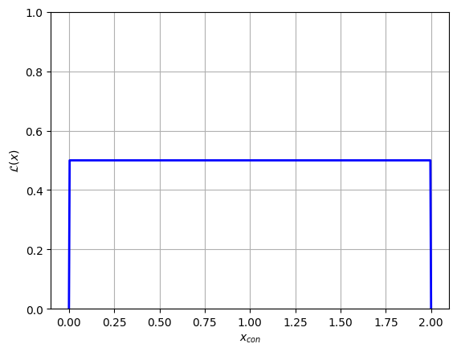

# Constrained / Unconstrained Parameters & Using Jax's Vmap & Autograd
A demonstration of how NumPyro converts values drawn from a constrained distribution (e.g. a uniform distribution) and converts to unconstrained distributions to create an unbounded prior space.

Also shown is how these unconstrained values can be fed to internal functions to evaluate likelihoods directly from a NumPyro model function


```python
# Imports 
import jax.numpy as jnp
import jax
import numpyro
from numpyro.contrib.nested_sampling import NestedSampler

import matplotlib.pyplot as plt
import numpy as np
from chainconsumer import ChainConsumer
```

-Explain constrained vs unconstrained
-Demonstrate an example uniform distribution
-Describe step function likelihood

This same process of transforming unconstrained (actual) values to constrained (numpyro internal friendly) values is also used when sending an array of chain starting positions to an MCMC sampler. See accompanying documents for examples of this.


```python
from numpyro.infer.util import transform_fn

dist = numpyro.distributions.Uniform(0,2)
def model_test():
    x = numpyro.sample('x', dist)
    
transforms = {"x": numpyro.distributions.biject_to(dist.support)}

x_con = np.linspace(0, 2, 512)
x_uncon = transform_fn(transforms, {'x': x_con}, invert=True)['x']
```


```python
plt.plot(x_con,x_uncon, c='k', lw=3)
plt.xlabel("Constrained x Value")
plt.ylabel("Unconstrained x value")
plt.grid()
plt.show()
```


    

    


Converting the variables between the constrained and unconstrained domains is easy enough, as shown above, but feeding these directly into a likelihood function won't give us the right answer. Instead, we need to weight by the *derivative* of this transformation to recover the correct probability:

\begin{equation}
    P(x_{con}) = P(x_{uncon}) \cdot \frac{dx_{uncon}}{dx_{con}}
\end{equation}

As a first pass, we'll do this using crude finite differences:


```python
diff = (x_uncon[2:]-x_uncon[:-2]) / (x_con[2:]-x_con[:-2])
```

Now we feed our unconstrained parameters into the likelihood function, which we access from the `potential_energy` utility function that NumPyro gives us. This potential energy returns the **negative log likelihood**. For our model `model_test()`, this looks something like:

test $PE(x_{uncon}) = -ln(\mathcal{L(x_{uncon})})=$ `numpyro.infer.util.potential_energy(model_test, model_args=(), model_kwargs={}, params={'x': x})`

Even though we have no model `args` or `kwargs`, these fields still have to be explicitly given as empty tuples like above. In a more complicated case with data, e.g. `model_with_data(X,Y,E)`, these would be fed into the `model_args` field.

Using this approach, we can evaluate our likelihoods in the unconstrained domain, and then correct them back to the constrained domain with our derivative.


```python
# Get potential energies
PE = [numpyro.infer.util.potential_energy(model_test, model_args=(), model_kwargs={}, params={'x': x}) for x in x_uncon]
PE = np.array(PE)

# Convert to likelihood
L = np.exp(-PE)

# Weight by transformation derivative
y= L[2:] * diff

# Plot
plt.plot(x_con[2:], y, c='blue', lw=2)
plt.grid()
plt.xlabel("$x_{con}$")
plt.ylabel("$\mathcal{L}(x) (Approx)$")
plt.show()
```

    INFO[2023-08-22 10:07:12,631]: Substituting symbol L from STIXNonUnicode
    INFO[2023-08-22 10:07:12,684]: Substituting symbol L from STIXNonUnicode


    

    


Looking above, we can see that the likelihood function plateaus at $\mathcal{L}\approx 0.5$ for most of the domain, and is constrained to $x \in [0,2]$, both of which are what we expect from our $x \sim U(0,2)$ distribution. 

The unusual behaviour at the edges of the domain is a result of our poor esimate of $\frac{dx_{uncon}}{dx_{con}}$. Fortunately, we can use JAX's native autodifferentiation to get an *analytically accurate* derivative function.

First, re-define the transformation function to be a bit easier to read:


```python
def tform(x):
    out = transform_fn(transforms, {'x': x}, invert=True)['x']
    return(out)
```

To apply auto-diff to this, it's as easy as using `jax.grad(function)`:


```python
tform_diff = jax.grad(tform)
```

Now take these two functions, along with the likelihood evaluation we saw before, and bring it all together in a single function:


```python
def l_uncon(x):
    xdash = tform(x)
    diff = tform_diff(x)
    
    ll  = numpyro.infer.util.potential_energy(model_test, model_args=(), model_kwargs={}, params={'x': xdash} )
    out = jnp.exp(-ll) * diff
    return(out)

l_uncon = jax.vmap(l_uncon)
```

We've defined two functions here. The `_tform(x)` function takes one input and gives one output, while the `tform(x)` function has been `vmapped` by JAX, making it an efficienct vectorized function. Just like using JAX's `jax.jit(function)` decorator, we can only transform functions that are at the top level.


```python
# Evaluate and set any nan (out of domain) values to zero
y = l_uncon(jnp.array(x_con))
y = jnp.nan_to_num(y, copy=False, nan=0.0)

# Plot
plt.plot(x_con, y, c='blue', lw=2)
plt.ylim(ymin=0, ymax = np.max(y)*2)
plt.grid()
plt.xlabel("$x_{con}$")
plt.ylabel("$\mathcal{L}(x)$")
plt.show()
```

    INFO[2023-08-22 10:07:13,080]: Substituting symbol L from STIXNonUnicode
    INFO[2023-08-22 10:07:13,126]: Substituting symbol L from STIXNonUnicode


    

    


```python
numpyro.infer.util.log_likelihood(model_test, {'x':1})
```


    {}


