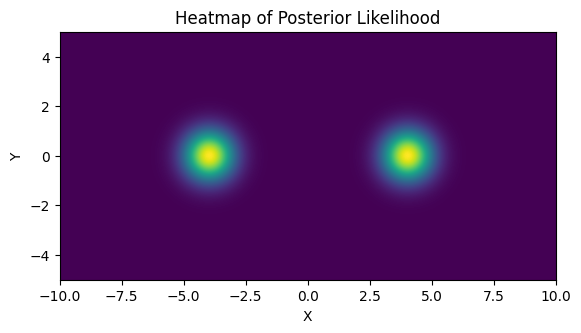
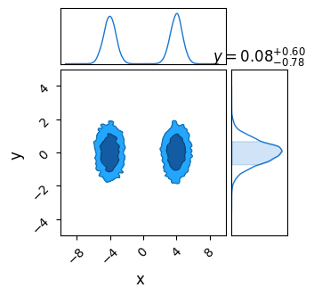
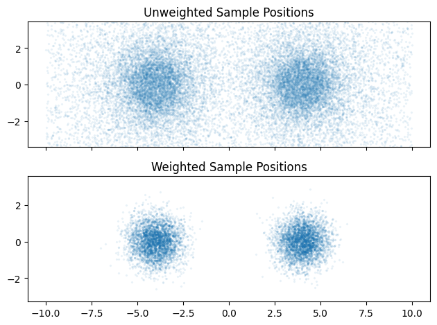
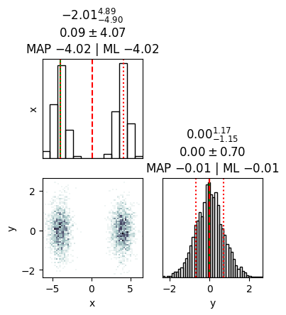

# Nested Sampling Interface Example
In this document, we use JAXNS to get evidence from a simple NumPyro model, investigating the effects of tuning parameters and making use of the utility functions provided in JAXNS' NumPyro implementation.

First up, we import all the relevant packages:

## How it Works
<span style="color: red; text-align: center; width: 50%;">
Lorem ipsum dolor sit amet, consectetur adipiscing elit. Nam suscipit metus ut odio porttitor consequat. Morbi euismod, neque at egestas porttitor, dolor leo venenatis tellus, nec convallis erat ligula ac ante. Nullam nibh est, lacinia vitae blandit id, ullamcorper accumsan turpis. Sed nec mauris arcu. Integer rutrum convallis lectus. Donec augue enim, laoreet eu lectus et, hendrerit cursus felis. Mauris id imperdiet erat. Vestibulum eleifend sapien magna, nec aliquet nisi porttitor at. Maecenas pretium augue efficitur hendrerit cursus. Nulla interdum nisl a massa efficitur rutrum. Mauris aliquam eu eros sit amet congue. Maecenas iaculis rhoncus ultrices. Nulla dapibus nec orci nec viverra. Nunc vitae ultricies dui, ac sagittis sapien. Donec ultrices lorem dolor, eget gravida leo efficitur in.

Duis iaculis eros lectus. Maecenas in arcu eu metus semper tristique. Suspendisse fringilla, enim vel posuere finibus, eros ligula luctus nulla, quis iaculis erat enim a metus. Vivamus pretium elementum hendrerit. Pellentesque facilisis ornare nulla, eu sagittis ante molestie a. Vestibulum ultricies, ipsum molestie luctus molestie, magna purus accumsan ex, rhoncus sagittis magna diam hendrerit odio. Sed iaculis efficitur arcu a vehicula. Nunc sagittis, velit in ornare lacinia, purus dui elementum ipsum, eget volutpat tellus massa in massa.

Nunc sit amet commodo libero. Nullam dapibus nisl ante, sit amet placerat metus tempor eu. Nullam consectetur efficitur ex, eu viverra dui tempus eu. Aenean mi libero, faucibus quis nibh non, vulputate vehicula tellus. Phasellus ullamcorper odio nisi, id egestas leo aliquam luctus. Donec eget luctus libero. Phasellus justo nulla, tincidunt sit amet tristique eu, luctus ac velit. Interdum et malesuada fames ac ante ipsum primis in faucibus. Phasellus ac arcu pretium, blandit magna et, sodales sem. Aliquam in tempor lectus. Sed a malesuada dui. Mauris dictum eleifend ex nec rhoncus. Mauris aliquet egestas tellus eget eleifend.

Orci varius natoque penatibus et magnis dis parturient montes, nascetur ridiculus mus. Nullam et orci rhoncus, sagittis ipsum sed, rhoncus tellus. Cras fringilla metus mi, non luctus purus fringilla vitae. Nulla vitae ligula justo. Phasellus quis felis at arcu placerat blandit ut quis felis. Aliquam odio nulla, eleifend et iaculis nec, mattis sit amet velit. Sed pretium scelerisque tempor. Aenean placerat eleifend metus euismod lacinia. Curabitur ut orci ut nibh gravida cursus ac in risus. Duis eu hendrerit massa, a accumsan purus. Integer blandit diam id libero rhoncus, vel aliquam libero vehicula. Suspendisse dictum nulla eu velit placerat, eu suscipit magna tincidunt. Mauris vitae auctor libero, et tempus magna. Sed blandit elementum justo, ut commodo odio accumsan ac. Nulla a sodales lectus. Aliquam erat justo, blandit ac euismod a, mattis vel dolor. 
</span>


So far, we've seen that none of NumPyro's native MCMC samplers work particularly well in multimodal distributions. Though they may locate the modes decently well, they fail to sample from them in a representative way, inflating the smaller modes by over-sampling them. 

Fortunately, we have another tool at our disposal that is purpose built for multimodal distributions: [Nested Sampling](https://en.wikipedia.org/wiki/Nested_sampling_algorithm) (NS). In the strictest sense, NS is an _integrator_ rather than a true MCMC method, but its results can be easily weighted into a MCMC-like chain. However, because it takes many samples in the low probability regions of parameter space to properly map where the likelihood _isn't_
it tends to produce "rougher" contours for the same number of samples.

I have a more detailed writeup of the interface / mechanisms of NS in NumPyro over [here](#), but the central idea behind NS is:
1. Generate a set of $N$ "Live Points", distributed evenly across the prior
2. Remove the first point and log it as a sample
3. Find another point drawn _uniformly_ from the regions of parameter space at _higher likelihood_ than this dead point
4. Repeat the last two steps until the ensemble has converged to a small volume

The idea here is that removing the $N^{th}$ point in your "Live Points" will shrink the volume subtended by your ensembled by a factor of $\approx 1-1/N$. E.g. if we have $100$ live points and remove the worst one, the volume should contract by about $1 \%$. Because we know the likelihood of each dead point and have this estimate of the volume at at similar likelihoods, we can re-weight our chain of dead points to get an MCMC-like output. 

I've emphasized some points in step $3.$ because this is a deceptively complicated thing to do efficiently: going uphill locally is easy, but going anywhere uphill with equal unbiased probability is very hard. Various NS implementations rely on mixed of slice sampling or clever clustering algorithms to acomplish this, and NumPyro has an interface to [JAXNS](https://github.com/Joshuaalbert/jaxns) in its `numpyro.contrib` module, a JAX-based nested sampling algorithm that we can use out of the box.

As NS isn't an MCMC method, we can't perfectly map tuning parameters like "burn-in" or "number of chains" onto it. Instead, for the sake of fairness, we can set it to have the same number of _total_ samples across the entire run:


```python
# Statistical + JAX Tools
import jaxns as jn
import jax
import numpyro
import jax.numpy as jnp
from numpyro.contrib.nested_sampling import NestedSampler

# Utility, Math & Plotting
import numpy as np
import matplotlib.pyplot as plt
from chainconsumer import ChainConsumer
```

    INFO[2023-10-10 09:38:26,715]: Unable to initialize backend 'cuda': module 'jaxlib.xla_extension' has no attribute 'GpuAllocatorConfig'
    INFO[2023-10-10 09:38:26,716]: Unable to initialize backend 'rocm': module 'jaxlib.xla_extension' has no attribute 'GpuAllocatorConfig'
    INFO[2023-10-10 09:38:26,739]: Unable to initialize backend 'tpu': INVALID_ARGUMENT: TpuPlatform is not available.
    WARNING[2023-10-10 09:38:26,740]: No GPU/TPU found, falling back to CPU. (Set TF_CPP_MIN_LOG_LEVEL=0 and rerun for more info.)
    /home/hughmc/anaconda3/envs/nestconda_latest/lib/python3.11/site-packages/tqdm/auto.py:21: TqdmWarning: IProgress not found. Please update jupyter and ipywidgets. See https://ipywidgets.readthedocs.io/en/stable/user_install.html
      from .autonotebook import tqdm as notebook_tqdm


We'll use a simple 2D multimodal distribution here, two uncorrelated gaussians. To check for how normalization works, note that the volume of the prior is:

$$
    V=\Delta x \cdot \Delta y = 20 \cdot 10=200
$$

And that the evidence / area under the curve has been set to $Z=3$


```python
xmin,xmax = -10, 10
ymin,ymax = -5,5
V0 = (xmax-xmin) * (ymax-ymin)

def log_prob_func(x,y):
    out=0

    # Two gaussian modes
    out+=jnp.exp(-(x-4)**2-y**2) 
    out+=jnp.exp(-(x+4)**2-y**2)

    # Normalizing
    out/=2*np.pi
    out*=3
    
    return(jnp.log(out))

def prob_func(x,y):
    return(np.exp(log_prob_func(x,y)))
```

As a test, confirm this is working by plotting / integrating with a gridsearch:


```python
Ngrid = 512
Xgrid = np.linspace(xmin,xmax,Ngrid)
Ygrid = np.linspace(ymin,ymax,Ngrid)
Lgrid = np.array([[prob_func(x,y) for x in Xgrid] for y in Ygrid])
```


```python
fig1,ax1 = plt.subplots(1,1)
ax1.imshow(Lgrid, extent=[xmin,xmax,ymin,ymax])
ax1.set_title("Heatmap of Posterior Likelihood")
ax1.set_xlabel("X")
ax1.set_ylabel("Y")
plt.show()

Zgrid = np.sum(Lgrid) / np.sum(Lgrid>0) * V0
print("Evidence from grid integration is %0.4f" %Zgrid)
```


    

    


    Evidence from grid integration is 2.9883


We need to wrap this in a numpyro model. This is most easily done with the `numpyro.factor()` primitive:


```python
def np_model():
    x = numpyro.sample('x', numpyro.distributions.Uniform(xmin,xmax))
    y = numpyro.sample('y', numpyro.distributions.Uniform(ymin,ymax))
    numpyro.factor(name="prob_fac", log_factor = log_prob_func(x,y))
```

Now we can create and run the sampler as we would a normal MCMC sampler in NumPyro. The tuning parameters are passed in the form of dictionaries, `constructor_kwargs` and `termination kwargs`. Though `JAXNS` has a lot of tunable parameters under these two umbrellas, only a small subset are available via is NumPyro implementation. We'll see the full list below, but the most important are the number of **live points**, which acts like the resolution of our sampling, and the **live evidence fraction**, which controls when the sampling terminates. The **max samples** is a safety limit, and doesn't affect our answer much. I've set it conservatively high to ensure convergence.


```python
NS = NestedSampler(model=np_model, 
                   constructor_kwargs={'num_live_points': 5000, 'max_samples': 50000},
                   termination_kwargs={'live_evidence_frac': 0.01}
                  )
NS.run(jax.random.PRNGKey(0))
```

Unlike an MCMC algorithm, Nested Sampling's chain of accepted samples is _not_ distributed representatively across the posterior. Instead, samples are weighted by both their likelihood and the volume of parameter space that they are an integral proxy for to get an MCMC-like chain.

Confusingly, the function to call these _weighted_ samples is called `get_samples`, while the _unweighted_ chain is acquired via `get_weighted samples`. The NS-like samples are spread all across the prior range, MCMC-like samples are distributed near the modal peaks.


```python
# Weighted MCMC-like samples. Can draw as many samples as we want, but will draw the same point multiple times
weighted_samps = NS.get_samples(jax.random.PRNGKey(1), int(1E4))

# Un-weighted nested sampling-like chain. Returns _all_ samples from the NS algorithm, and has an unpredictable length
unweighted_samps = NS.get_weighted_samples()

#=========================================
c = ChainConsumer()
c.add_chain(weighted_samps)
c.plotter.plot(extents={'x':[xmin,xmax], 'y':[ymin,ymax]})

#=========================================
fig2, ax2 = plt.subplots(2,1, sharex=True)

ax2[0].scatter(unweighted_samps[0]['x'],unweighted_samps[0]['y'],alpha=0.1, s = 2, marker='x')
ax2[1].scatter(weighted_samps['x'],weighted_samps['y'], alpha=0.1, s = 2, marker='x')

ax2[0].axis('equal')
ax2[1].axis('equal')


ax2[0].set_title("Unweighted Sample Positions")
ax2[1].set_title("Weighted Sample Positions")
fig2.tight_layout()

plt.show()
```

    WARNING[2023-10-10 09:38:53,468]: Parameter x in chain Chain 0 is not constrained


    

    


    

    


If we were only concerned with using NS like an MCMC sampler, this is as far as we'd need to go. However, there are a few other utilities: some available up front, and some buried as internal functions. 


```python
dir(NS)
```


    ['__class__',
     '__delattr__',
     '__dict__',
     '__dir__',
     '__doc__',
     '__eq__',
     '__format__',
     '__ge__',
     '__getattribute__',
     '__getstate__',
     '__gt__',
     '__hash__',
     '__init__',
     '__init_subclass__',
     '__le__',
     '__lt__',
     '__module__',
     '__ne__',
     '__new__',
     '__reduce__',
     '__reduce_ex__',
     '__repr__',
     '__setattr__',
     '__sizeof__',
     '__str__',
     '__subclasshook__',
     '__weakref__',
     '_log_weights',
     '_results',
     '_samples',
     'constructor_kwargs',
     'diagnostics',
     'get_samples',
     'get_weighted_samples',
     'model',
     'print_summary',
     'run',
     'termination_kwargs']


We can get a plain-text summary of the integration results and efficiency using the `print_summary()` method, and can get some traditional plots showing the integral convergence using `.diagnostics()`. These graphs are a good check for the reliability of your results: if the curves are noisy you likely have too few live points, if they seem weirdly shaped try tightening the termination conditions or increase the maximum number of samples. 


```python
NS.print_summary()
NS.diagnostics()
```

    --------
    Termination Conditions:
    Small remaining evidence
    --------
    # likelihood evals: 132575
    # samples: 21513
    # slices: 25000.0
    # slices / acceptance: 5.0
    # likelihood evals / sample: 6.2
    # likelihood evals / slice: 3.3
    --------
    logZ=-4.212 +- 0.027
    H=4.5
    ESS=3997
    --------
    x: mean +- std.dev. | 10%ile / 50%ile / 90%ile | MAP est. | max(L) est.
    x: 0.0 +- 4.1 | -4.6 / 2.1 / 4.6 | -4.0 | -4.0
    --------
    y: mean +- std.dev. | 10%ile / 50%ile / 90%ile | MAP est. | max(L) est.
    y: -0.01 +- 0.71 | -0.91 / -0.01 / 0.89 | -0.01 | -0.01
    --------


    WARNING[2023-10-10 09:38:55,447]: No artists with labels found to put in legend.  Note that artists whose label start with an underscore are ignored when legend() is called with no argument.


    

    


    

    


The full set of tunable parameters are available. Mostly, it is only the live points and evidence fraction we need to tune. If we are scraping the max_samples, something is likely going wrong with convergence.


```python
print("constructor_kwargs")
for key in NS.constructor_kwargs: print("\t"+str(key)+":\t"+str(NS.constructor_kwargs[key]))
print("termination_kwargs")
for key in NS.termination_kwargs: print("\t"+str(key)+":\t"+str(NS.termination_kwargs[key]))
```

    constructor_kwargs
    	num_live_points:	5000
    	max_samples:	50000
    	num_parallel_samplers:	1
    	uncert_improvement_patience:	2
    termination_kwargs
    	live_evidence_frac:	0.01


To get a hold of the result themselves, we have to dig into the internals of the `NS` object. The samples, weights and results are stored in the `._results` component:


```python
for a in dir(NS._results): 
    if "_" not in a: 
        print(a)
```

    ESS
    count
    index
    samples


For our purposes, we are interested only in the evidence, which is here available in log-form. Note the total evidence is off by a factor of $200$. This is because JAXNS has no knowledge of the prior volume, and treats it as unity. This is not an issue when using NS for model comparison, but this difference of normalization


```python
# Extract log-evidence & Uncertainty
Lz_mean = NS._results.log_Z_mean
Lz_uncert = NS._results.log_Z_uncert * 1.96

# Convert back from log
Z_NS = np.exp(np.array([Lz_mean-Lz_uncert,Lz_mean,Lz_mean+Lz_uncert]))

print("Un-Normalized Evidence (min, mean, max)")
print("\t", Z_NS)

print("Evidence (min, mean, max)")
print("\t", Z_NS * V0)
```

    Un-Normalized Evidence (min, mean, max)
    	 [0.01405105 0.01482362 0.01563869]
    Evidence (min, mean, max)
    	 [2.810209  2.964725  3.1277373]


`_results` also contains the reason for the sampler termination in the `._results.termination_reason` object. The codes are as follows: we ideally want `termination_reason == 2` or `termination_reason == 4`. The important feature is that *odd* termination codes indicate that the integration has timed out due to a maximum number of samples. If this happens, it indicates that we need to adjust the `max_evals` in our sampler.

        0-bit -> 1: used maximum allowed number of samples
        1-bit -> 2: evidence uncert below threshold
        2-bit -> 4: live points evidence below threshold
        3-bit -> 8: effective sample size big enough
        4-bit -> 16: used maxmimum allowed number of likelihood evaluations
        5-bit -> 32: maximum log-likelihood contour reached
        6-bit -> 64: sampler efficiency too low
        7-bit -> 128: entire live-points set is a single plateau


```python
print("Termination Condition:")
print("\t",int(NS._results.termination_reason))
```

    Termination Condition:
    	 4

