Previous Entry: [Testing Different MCMC Samplers](.\..\03_mcmcsamplers\page.html)	&nbsp;	 Next Entry: [Parallelization](.\..\05_parallelizing\page.html)  
  
  
Go Back: [Comfortably NumPyro](.\..\blog_numpyrohome.html)	&nbsp;	Return to [Blog Home](.\..\..\bloghome.html)  
  
---------------------------------------------------------------------------  
  
---------  
  
  
# Nested Sampling In NumPyro  
In this document, we use JAXNS to get evidence from a simple NumPyro model, investigating the effects of tuning parameters and making use of the utility functions provided in JAXNS' NumPyro implementation.  
  
First up, we import all the relevant packages:  
  
**todo**  
  
## How Nested Sampling Works  
  
Lorem ipsum dolor sit amet, consectetur adipiscing elit. Phasellus massa leo, condimentum eget vehicula id, mollis et diam. Proin sodales tortor at sollicitudin convallis. Aenean malesuada commodo metus, eget vehicula erat ultrices a. In fermentum bibendum sagittis. Pellentesque sit amet erat quis nisi pharetra lacinia. Duis sagittis sapien id purus condimentum tristique. Nam sit amet elit non nisl placerat rhoncus eu non justo. Quisque ut aliquet orci. Maecenas viverra pharetra nisl, et tempus nisi convallis feugiat. Etiam eros felis, feugiat et cursus a, ornare eget sem. Quisque a condimentum orci. Morbi massa enim, aliquet id est ac, tincidunt ullamcorper urna.  
  
- Put walkthrough here  
  
**Building a Toy Problem**  
- First going to make a simple toy problem to see how this works  
  
  
```python  
import numpy as np  
import jax.numpy as jnp  
import matplotlib.pyplot as plt  
from chainconsumer import ChainConsumer  
```  
  
- Look at a simple toy problem of a bimodal gaussian in 2D  
- For the sake of comparison, round this to have a _known_ integral of $Z_{true} = 3.0$  
  
  
```python  
Ztrue = 3.0  
  
def prob_func(x,y):  
    # Two gaussian modes  
    out=0  
    out+=jnp.exp(-(x - 2)**2-y**2)   
    out+=jnp.exp(-(x + 2)**2-y**2)  
  
    # Normalizing  
    out/=2*np.pi  
    out*=Ztrue  
    return(out)  
      
def log_prob_func(x,y):  
    return(jnp.log(prob_func(x,y)))  
```  
  
- In a toy case like this, integration is obviously tractable through simple brute force, but keep in mind that integration scales exponentially with dimension, and often involves expensive evaluations  
  
  
```python  
#---------------------  
# Set prior boundary  
xmin,xmax = -5.5, 5.5  
ymin,ymax = -2.5,2.5  
V0 = (xmax-xmin) * (ymax-ymin)  
  
#---------------------  
# Generate Heatmap  
Ngrid = 128  
dx, dy = (xmax-xmin)/(Ngrid-1), (ymax-ymin)/(Ngrid-1)  
Xgrid, Ygrid = np.meshgrid(np.linspace(xmin,xmax,Ngrid), np.linspace(ymin,ymax,Ngrid))  
heatmap_grid =prob_func(Xgrid,Ygrid)  
  
#---------------------  
# Plot heatmap  
def do_heatmap(cmap = 'viridis', contrast = 1, clipping=[0,1], interpolation = 'antialiased'):  
    fig, ax = plt.subplots(1,1)  
    ax.imshow(heatmap_grid**contrast, extent=[xmin,xmax,ymin,ymax],   
              cmap = cmap,   
              vmin = heatmap_grid.max()*clipping[0],   
              vmax = heatmap_grid.max()*clipping[1],   
              interpolation = interpolation,  
              zorder=-10)  
    ax.set_title("Heatmap of Posterior Likelihood")  
    ax.set_xlabel("X")  
    ax.set_ylabel("Y")  
    return(fig, ax)  
fig, ax = do_heatmap()  
plt.show()  
  
#---------------------  
Zgrid = np.sum(Lgrid) / np.sum(Lgrid>0) * V0  
print("Evidence from grid integration is %0.4f, an error of %0.2f%% with %i evaluations" %(Zgrid,abs(Zgrid/Ztrue-1)*100, Ngrid**2) )  
```  
  
  
      
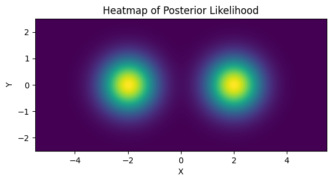  
      
  
  
    Evidence from grid integration is 0.8122, an error of 72.93% with 16384 evaluations  
  
  
**A (Very Rough) Nested Sampling Implementation**  
  
- [MISSINGNO]  
- Start by making a list of "live points", randomly distributed across the prior, sorting them in order of likelihood  
  
  
```python  
Nlive = 24  
Nevals = Nlive*4  
plot_sparse = 6  
  
np.random.seed(3)  
# Draw random samples from the prior  
print("Drawing random Samples")  
Xlive = np.random.rand(Nlive)*(xmax-xmin) + xmin  
Ylive = np.random.rand(Nlive)*(ymax-ymin) + ymin  
Llive = prob_func(Xlive, Ylive)  
  
def sort_livepoints(X,Y,L):  
    Isort=np.argsort(L)  
    return(X[Isort], Y[Isort], L[Isort])  
Xlive,Ylive,Llive = sort_livepoints(Xlive, Ylive, Llive)  
  
Ihilight = np.percentile(np.arange(Llive.size), [25, 80, 90], method='nearest')  
Lhilight = Llive[Ihilight]  
Xhilight = Xlive[Ihilight]  
Yhilight = Ylive[Ihilight]  
  
#-------------------------------------------------  
fig, ax = do_heatmap('Greys', contrast = 0.5, clipping = [-0.25, 1.25])  
ax.contour(Xgrid, Ygrid, np.log(heatmap_grid), levels = np.log(Lhilight), cmap='autumn', zorder=-1, alpha=0.5)  
ax.scatter(Xlive, Ylive,c='b', s=15, marker = 'x')  
ax.scatter(Xhilight, Yhilight, c='r', s=40, marker = 'x')  
  
for i in range(Nlive):  
    if i in Ihilight:  
        c = 'r'   
    else:  
        c = 'b'  
    ax.annotate(i, (Xlive[i]+dx, Ylive[i]), color=c)  
  
      
plt.show()  
```  
  
    Drawing random Samples  
  
  
  
      
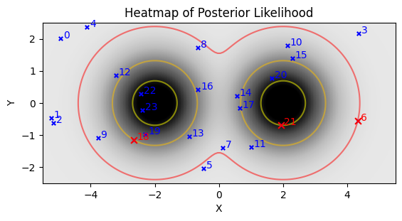  
      
  
  
  
```python  
{  
    "tags": [  
        "hide-input",  
    ]  
}  
def make_steps(X, L):  
    lprev = 0  
    out = np.zeros_like(X)  
    i=0  
    for l in L:  
        i+=1  
        I = (X>=l)  
        out[np.where(X>=l)] = l  
        print(i, np.sum(I) / X.size)  
        lprev = l  
    return(out)  
print("Generatting stepped potential")  
_levels = np.percentile(Llive, [50, 80, 90])  
heatmap_stepped = make_steps(heatmap_grid, _levels )  
  
print("Plotting heatmap")  
plt.imshow(heatmap_stepped, extent = [xmin,xmax,ymin,ymax], interpolation = 'none')  
plt.scatter(Xlive, Ylive, c='red', s = 20, zorder=1, marker='x')  
  
print("Doing 3D plot")  
fig, ax = plt.subplots(subplot_kw={"projection": "3d"}, figsize=(5,5))  
surf = ax.plot_surface(Xgrid, Ygrid, heatmap_stepped, cmap='viridis',  
                       linewidth=0, antialiased=True, zorder=-1)  
  
#ax.set_zlim(0, heatmap_stepped.max()*1.5)  
ax.set_aspect('equalxy')  
fig.tight_layout()  
  
plt.show()  
```  
  
    Generatting stepped potential  
    1 0.28198242  
    2 0.15722656  
    3 0.061279297  
    Plotting heatmap  
    Doing 3D plot  
  
  
  
      
  
      
  
  
  
      
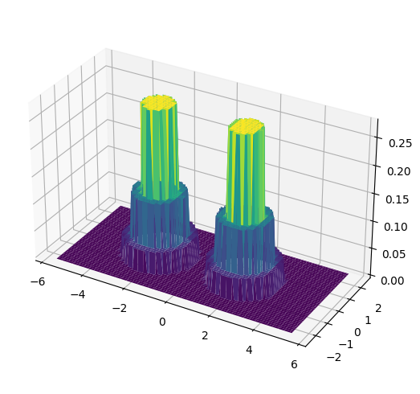  
      
  
  
  
```python  
_Z.argsort()  
```  
  
  
  
  
    array([11153, 11138, 11139, ...,  7459,  7460,  7461])  
  
  
  
  
```python  
_Z = heatmap_stepped.ravel()  
_x = Xgrid.ravel()  
_y = Ygrid.ravel()  
  
  
print("Doing 3D plot")  
fig, ax = plt.subplots(subplot_kw={"projection": "3d"}, figsize=(5,5))  
ax.bar3d(_x, _y, np.zeros_like(_Z), dx*5, dy*5, _Z, shade=True, color = plt.cm.coolwarm(_Z/_Z.max())[::-1])  
plt.show()  
print("Done")  
  
```  
  
    Doing 3D plot  
  
  
  
      
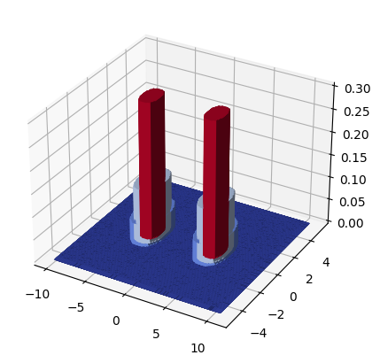  
      
  
  
    Done  
  
  
  
```python  
  
# Plot  
# Plot heatmap  
fig1,ax1 = plt.subplots(1,1)  
ax1.imshow(Lgrid, extent=[xmin,xmax,ymin,ymax])  
ax1.set_title("Heatmap of Posterior Likelihood")  
ax1.set_xlabel("X")  
ax1.set_ylabel("Y")  
  
ax[1].scatter(Xlive,Ylive, c='r', marker='x')  
  
Xchain = np.zeros(Nevals)  
Ychain = np.zeros(Nevals)  
Lchain = np.zeros(Nevals)  
  
total_evals = Nlive  
  
#Perform loop  
propmethod = 'stretchmove'  
for k in range(Nevals):  
    lmin = Llive[0]  
    l = lmin-1  
  
    #--------------------  
    # PROPOSAL GENERATION  
    #Draw new random samples until we get one with L>Lmin  
  
    if propmethod == 'unitcube':  
        xmin_live, xmax_live =xmin, xmax  
        ymin_live, ymax_live =ymin, ymax  
    elif propmethod == 'boundedcube':  
        xmin_live, xmax_live =min(Xlive), max(Xlive)  
        ymin_live, ymax_live =min(Ylive), max(Ylive)  
  
    while l<=lmin:  
        if 'cube' in propmethod:  
            x, y = np.random.rand()*(xmax_live-xmin_live) + xmin_live, np.random.rand()*(ymax_live-ymin_live) + ymin_live  
        else:  
                  
            i1, i2 = np.random.randint(Nlive), np.random.randint(Nlive)  
            x1, y1 = Xlive[i1], Ylive[i1]  
            x2, y2 = Xlive[i2], Ylive[i2]  
  
            if propmethod == 'stretchmove':  
                r = np.random.rand() * (8**0.5-8**-0.5) + 8**-0.5  
                z = r**(2/3)  
  
                x, y = x1 + (x2-x1) * z, y1 + (y2-y1) * z  
              
        l = prob_func(x,y)  
        total_evals+=1  
  
    #--------------------  
  
    Xchain[k] = Xlive[0]  
    Ychain[k] = Ylive[0]  
    Lchain[k] = Llive[0]  
  
    #Pop Lmin from our live points and add the new good one  
    Xlive[0], Ylive[0], Llive[0] = x, y, l  
  
  
  
    if Llive[0]>Llive[1]:  
        Isort=np.argsort(Llive)  
        Xlive, Ylive, Llive = Xlive[Isort], Ylive[Isort], Llive[Isort]  
  
    #Store the new probability in the chain  
  
    if k%(Nevals//20) == 0: print('\t Itteration %i/%i done, new highest prob: %f' %(k,Nevals,Lchain[k]))  
  
#Add remaining chain points  
Isort=np.argsort(Llive)  
Xlive, Ylive, Llive = Xlive[Isort], Ylive[Isort], Llive[Isort]  
  
Xchain = np.concatenate([Xchain,Xlive])  
Ychain = np.concatenate([Ychain, Ylive])  
Lchain = np.concatenate([Lchain, Llive])  
  
print("NS chain complete.")  
print("Total number of evaluations: %i" %total_evals)  
print("Compared to: %i" %Nplot**2)  
print("Ratio of: %0.4f %%" %(total_evals/Nplot**2 * 100))  
print("Acceptance Ratio of Samples: %0.4f %%" %(len(Lchain)/total_evals*100))  
  
ax[1].scatter(Xchain, Ychain, c='grey', marker='.', alpha = 0.15, s=5)  
ax[1].scatter(Xlive, Ylive, c='limegreen', marker='o', alpha = 0.25)  
  
ax[1].set_xlim(xmin,xmax)  
ax[1].set_ylim(ymin,ymax)  
  
#--------------------------  
# Calculate & compare evidence integrals  
V0 = (xmax-xmin) * (ymax-ymin)  
V = V0 * (1-1/Nlive) ** np.arange(0,len(Lchain))  
dV = np.abs(V[1:]-V[:-1])  
  
# Newtonian integration from grid  
dx      = (xmax-xmin) / (Nplot-1)  
dy      = (ymax-ymin) / (Nplot-1)  
Z_grid  = np.sum(Lplot)*dx*dy  
  
# Estimate from nested sampling  
Z_nest_1 = 0  
Z_nest_2 = 0  
  
Z_nest_1 = np.sum(np.abs(Lchain[1:]-Lchain[:-1]) * V[1:])  
Z_nest_2 = np.sum(Lchain[1:]*dV)  
  
#--------------------------  
  
print("\n")  
print("Evidence From")  
print("Direct grid integral:\t%f" %Z_grid)  
print("Nested Sampling, First Integral:\t%f" %Z_nest_1)  
print("Nested Sampling, Second Integral:\t%f" %Z_nest_2)  
  
print("\n")  
truth = 3.0  
print("Relative Errors")  
print("Direct grid integral:\t%f" %abs(Z_grid/truth-1))  
print("Nested Sampling, First Integral:\t%f" %abs(Z_nest_1/truth-1))  
print("Nested Sampling, Second Integral:\t%f" %abs(Z_nest_2/truth-1))  
  
fig2, ax2 = plt.subplots(4,1)  
  
ax2[0].plot(dV,          Lchain[1:]          )  
ax2[0].set_title("True Integral Function")  
  
ax2[1].plot(np.log(dV),  Lchain[1:]  )  
ax2[1].set_title("Likelihood vs Itteration No / Log Shell Volume")  
  
ax2[2].plot(dV,  dV * Lchain[1:]      )  
ax2[2].set_title("Shell Size vs Shell Mass")  
  
ax2[3].plot(np.log(dV),  dV * Lchain[1:]      )  
ax2[3].set_title("Shell Size (log) vs Shell Mass")  
  
fig2.tight_layout()  
  
#--------------------------  
# Attempt at importance sampling  
Lnorm = (Lchain[1:] + Lchain[:-1])/2   
W = dV*Lnorm  
W/=np.max(W)  
  
Nsample = 10000  
  
Xsample = np.zeros(Nsample)  
Ysample = np.zeros(Nsample)  
  
Isample = np.zeros(Nsample,dtype='int32')-1  
  
for i in range(Nsample):  
    while Isample[i]==-1:  
        #choose a random unweighted point  
        j = np.random.randint(len(W))  
        w = W[j]  
        r = np.random.rand()  
  
        if w>=r:  
            Isample[i]=j  
  
Xsample = Xchain[1:][Isample]  
Ysample = Ychain[1:][Isample]  
  
ax[2].scatter(Xsample, Ysample, alpha=W*0.5*(max(Nsample/len(Lchain),1))**-1, s=5, c='r')  
  
ax[2].axhline(np.mean(Ysample), ls='-', c='k')  
ax[2].axvline(np.mean(Xsample), ls='-', c='k')  
  
ax[2].axhline(np.mean(Ysample)+np.std(Ysample), ls='--', c='k')  
ax[2].axhline(np.mean(Ysample)-np.std(Ysample), ls='--', c='k')  
  
ax[2].axvline(np.mean(Xsample)+np.std(Xsample), ls='--', c='k')  
ax[2].axvline(np.mean(Xsample)-np.std(Xsample), ls='--', c='k')  
  
Ntruth=10000  
Xtruth = np.zeros(Ntruth)  
Ytruth = np.zeros(Ntruth)  
  
print("Brute forcing sampling of the posterior")  
for i in range(Ntruth):  
    if i%(Ntruth//20) == 0:  
        print("\t Sample %i of %i" %(i, Ntruth))  
    use = False  
  
    while use==False:  
            x, y = np.random.rand()*(xmax-xmin) + xmin, np.random.rand()*(ymax-ymin) + ymin  
            l = prob_func(x,y)  
            r = np.random.rand()  
            if l/np.max(Lplot) > r:  
                use=True  
                Xtruth[i], Ytruth[i] = x, y  
  
c = ChainConsumer()  
c.add_chain(chain = {'X':Xsample,'Y':Ysample}, name='Weighted Samples')  
c.add_chain(chain = {'X':Xtruth, 'Y':Ytruth}, name='True Dist')  
c.plotter.plot()  
  
#--------------------------  
# Remaining Evidence Estimations  
Vnorm = (V[1:] + V[:-1])/2   
Z_running = np.array([np.sum((Lnorm*dV)[:i]) for i in range(len(Lnorm))])  
Z_rem = Z_running/ (Z_running + Lnorm*Vnorm)  
  
figrem, axrem = plt.subplots(1,1)  
axrem.plot(Z_running/truth, label = 'True Remaining', c='k')  
axrem.plot(Z_rem, label = 'Est Remaining')  
axrem.legend()  
axrem.set_xlabel("Itt. No")  
axrem.set_ylabel("Z/Z_tot")  
  
plt.show()  
  
```  
  
    Drawing random Samples  
    	 Itteration 0/4000 done, new highest prob: 0.000000  
    	 Itteration 200/4000 done, new highest prob: 0.000000  
    	 Itteration 400/4000 done, new highest prob: 0.000012  
    	 Itteration 600/4000 done, new highest prob: 0.001138  
    	 Itteration 800/4000 done, new highest prob: 0.020894  
    	 Itteration 1000/4000 done, new highest prob: 0.090270  
    	 Itteration 1200/4000 done, new highest prob: 0.185161  
    	 Itteration 1400/4000 done, new highest prob: 0.278618  
    	 Itteration 1600/4000 done, new highest prob: 0.359123  
    	 Itteration 1800/4000 done, new highest prob: 0.417867  
    	 Itteration 2000/4000 done, new highest prob: 0.443127  
    	 Itteration 2200/4000 done, new highest prob: 0.458515  
    	 Itteration 2400/4000 done, new highest prob: 0.467934  
    	 Itteration 2600/4000 done, new highest prob: 0.472579  
    	 Itteration 2800/4000 done, new highest prob: 0.474889  
    	 Itteration 3000/4000 done, new highest prob: 0.476094  
    	 Itteration 3200/4000 done, new highest prob: 0.476759  
    	 Itteration 3400/4000 done, new highest prob: 0.477079  
    	 Itteration 3600/4000 done, new highest prob: 0.477270  
    	 Itteration 3800/4000 done, new highest prob: 0.477360  
    NS chain complete.  
    Total number of evaluations: 7574  
    Compared to: 16384  
    Ratio of: 46.2280 %  
    Acceptance Ratio of Samples: 58.0935 %  
      
      
    Evidence From  
    Direct grid integral:	0.093750  
    Nested Sampling, First Integral:	4.673324  
    Nested Sampling, Second Integral:	4.683460  
      
      
    Relative Errors  
    Direct grid integral:	0.968750  
    Nested Sampling, First Integral:	0.557775  
    Nested Sampling, Second Integral:	0.561153  
    Brute forcing sampling of the posterior  
    	 Sample 0 of 10000  
    	 Sample 500 of 10000  
    	 Sample 1000 of 10000  
    	 Sample 1500 of 10000  
    	 Sample 2000 of 10000  
    	 Sample 2500 of 10000  
    	 Sample 3000 of 10000  
    	 Sample 3500 of 10000  
    	 Sample 4000 of 10000  
    	 Sample 4500 of 10000  
    	 Sample 5000 of 10000  
    	 Sample 5500 of 10000  
    	 Sample 6000 of 10000  
    	 Sample 6500 of 10000  
    	 Sample 7000 of 10000  
    	 Sample 7500 of 10000  
    	 Sample 8000 of 10000  
    	 Sample 8500 of 10000  
    	 Sample 9000 of 10000  
    	 Sample 9500 of 10000  
  
  
    WARNING:chainconsumer:Parameter X in chain True Dist is not constrained  
  
  
  
      
  
      
  
  
  
      
  
      
  
  
  
      
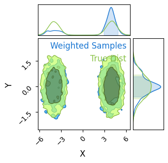  
      
  
  
  
      
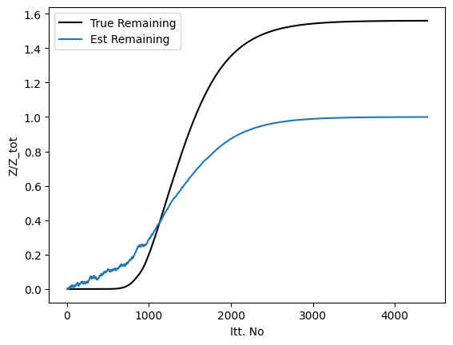  
      
  
  
## Nested Sampling In NumPyro with JAXNS  
So far, we've seen that none of NumPyro's native MCMC samplers work particularly well in multimodal distributions. Though they may locate the modes decently well, they fail to sample from them in a representative way, inflating the smaller modes by over-sampling them.   
  
Fortunately, we have another tool at our disposal that is purpose built for multimodal distributions: [Nested Sampling](https://en.wikipedia.org/wiki/Nested_sampling_algorithm) (NS). In the strictest sense, NS is an _integrator_ rather than a true MCMC method, but its results can be easily weighted into a MCMC-like chain. However, because it takes many samples in the low probability regions of parameter space to properly map where the likelihood _isn't_  
it tends to produce "rougher" contours for the same number of samples.  
  
I have a more detailed writeup of the interface / mechanisms of NS in NumPyro over [here](#), but the central idea behind NS is:  
1. Generate a set of $N$ "Live Points", distributed evenly across the prior  
2. Remove the first point and log it as a sample  
3. Find another point drawn _uniformly_ from the regions of parameter space at _higher likelihood_ than this dead point  
4. Repeat the last two steps until the ensemble has converged to a small volume  
  
The idea here is that removing the $N^{th}$ point in your "Live Points" will shrink the volume subtended by your ensembled by a factor of $\approx 1-1/N$. E.g. if we have $100$ live points and remove the worst one, the volume should contract by about $1 \%$. Because we know the likelihood of each dead point and have this estimate of the volume at at similar likelihoods, we can re-weight our chain of dead points to get an MCMC-like output.   
  
I've emphasized some points in step $3.$ because this is a deceptively complicated thing to do efficiently: going uphill locally is easy, but going anywhere uphill with equal unbiased probability is very hard. Various NS implementations rely on mixed of slice sampling or clever clustering algorithms to acomplish this, and NumPyro has an interface to [JAXNS](https://github.com/Joshuaalbert/jaxns) in its `numpyro.contrib` module, a JAX-based nested sampling algorithm that we can use out of the box.  
  
As NS isn't an MCMC method, we can't perfectly map tuning parameters like "burn-in" or "number of chains" onto it. Instead, for the sake of fairness, we can set it to have the same number of _total_ samples across the entire run:  
  
  
```python  
# Statistical + JAX Tools  
import jaxns as jn  
import jax  
import numpyro  
import jax.numpy as jnp  
from numpyro.contrib.nested_sampling import NestedSampler  
  
# Utility, Math & Plotting  
import numpy as np  
import matplotlib.pyplot as plt  
from chainconsumer import ChainConsumer  
```  
  
    INFO[2023-10-10 09:38:26,715]: Unable to initialize backend 'cuda': module 'jaxlib.xla_extension' has no attribute 'GpuAllocatorConfig'  
    INFO[2023-10-10 09:38:26,716]: Unable to initialize backend 'rocm': module 'jaxlib.xla_extension' has no attribute 'GpuAllocatorConfig'  
    INFO[2023-10-10 09:38:26,739]: Unable to initialize backend 'tpu': INVALID_ARGUMENT: TpuPlatform is not available.  
    WARNING[2023-10-10 09:38:26,740]: No GPU/TPU found, falling back to CPU. (Set TF_CPP_MIN_LOG_LEVEL=0 and rerun for more info.)  
    /home/hughmc/anaconda3/envs/nestconda_latest/lib/python3.11/site-packages/tqdm/auto.py:21: TqdmWarning: IProgress not found. Please update jupyter and ipywidgets. See https://ipywidgets.readthedocs.io/en/stable/user_install.html  
      from .autonotebook import tqdm as notebook_tqdm  
  
  
  
  
We'll use a simple 2D multimodal distribution here, two uncorrelated gaussians. To check for how normalization works, note that the volume of the prior is:  
  
$$  
    V=\Delta x \cdot \Delta y = 20 \cdot 10=200  
$$  
  
And that the evidence / area under the curve has been set to $Z=3$  
  
  
```python  
  
```  
  
As a test, confirm this is working by plotting / integrating with a gridsearch:  
  
  
```python  
  
```  
  
  
```python  
  
```  
  
  
      
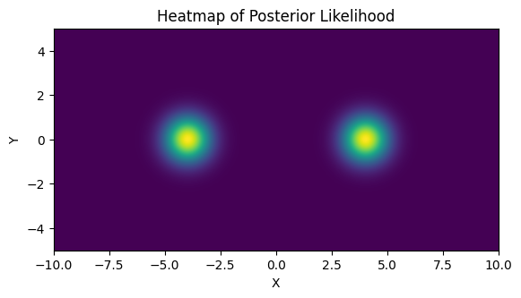  
      
  
  
    Evidence from grid integration is 2.9883  
  
  
We need to wrap this in a numpyro model. This is most easily done with the `numpyro.factor()` primitive:  
  
  
```python  
def np_model():  
    x = numpyro.sample('x', numpyro.distributions.Uniform(xmin,xmax))  
    y = numpyro.sample('y', numpyro.distributions.Uniform(ymin,ymax))  
    numpyro.factor(name="prob_fac", log_factor = log_prob_func(x,y))  
```  
  
Now we can create and run the sampler as we would a normal MCMC sampler in NumPyro. The tuning parameters are passed in the form of dictionaries, `constructor_kwargs` and `termination kwargs`. Though `JAXNS` has a lot of tunable parameters under these two umbrellas, only a small subset are available via is NumPyro implementation. We'll see the full list below, but the most important are the number of **live points**, which acts like the resolution of our sampling, and the **live evidence fraction**, which controls when the sampling terminates. The **max samples** is a safety limit, and doesn't affect our answer much. I've set it conservatively high to ensure convergence.  
  
  
```python  
NS = NestedSampler(model=np_model,   
                   constructor_kwargs={'num_live_points': 5000, 'max_samples': 50000},  
                   termination_kwargs={'live_evidence_frac': 0.01}  
                  )  
NS.run(jax.random.PRNGKey(0))  
```  
  
Unlike an MCMC algorithm, Nested Sampling's chain of accepted samples is _not_ distributed representatively across the posterior. Instead, samples are weighted by both their likelihood and the volume of parameter space that they are an integral proxy for to get an MCMC-like chain.  
  
Confusingly, the function to call these _weighted_ samples is called `get_samples`, while the _unweighted_ chain is acquired via `get_weighted samples`. The NS-like samples are spread all across the prior range, MCMC-like samples are distributed near the modal peaks.  
  
  
```python  
# Weighted MCMC-like samples. Can draw as many samples as we want, but will draw the same point multiple times  
weighted_samps = NS.get_samples(jax.random.PRNGKey(1), int(1E4))  
  
# Un-weighted nested sampling-like chain. Returns _all_ samples from the NS algorithm, and has an unpredictable length  
unweighted_samps = NS.get_weighted_samples()  
  
#=========================================  
c = ChainConsumer()  
c.add_chain(weighted_samps)  
c.plotter.plot(extents={'x':[xmin,xmax], 'y':[ymin,ymax]})  
  
#=========================================  
fig2, ax2 = plt.subplots(2,1, sharex=True)  
  
ax2[0].scatter(unweighted_samps[0]['x'],unweighted_samps[0]['y'],alpha=0.1, s = 2, marker='x')  
ax2[1].scatter(weighted_samps['x'],weighted_samps['y'], alpha=0.1, s = 2, marker='x')  
  
ax2[0].axis('equal')  
ax2[1].axis('equal')  
  
  
ax2[0].set_title("Unweighted Sample Positions")  
ax2[1].set_title("Weighted Sample Positions")  
fig2.tight_layout()  
  
plt.show()  
```  
  
    WARNING[2023-10-10 09:38:53,468]: Parameter x in chain Chain 0 is not constrained  
  
  
  
      
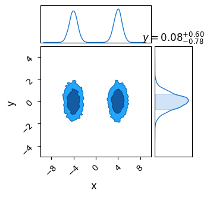  
      
  
  
  
      
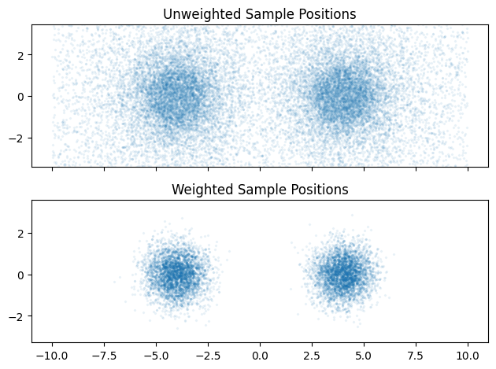  
      
  
  
If we were only concerned with using NS like an MCMC sampler, this is as far as we'd need to go. However, there are a few other utilities: some available up front, and some buried as internal functions.   
  
  
```python  
dir(NS)  
```  
  
  
  
  
    ['__class__',  
     '__delattr__',  
     '__dict__',  
     '__dir__',  
     '__doc__',  
     '__eq__',  
     '__format__',  
     '__ge__',  
     '__getattribute__',  
     '__getstate__',  
     '__gt__',  
     '__hash__',  
     '__init__',  
     '__init_subclass__',  
     '__le__',  
     '__lt__',  
     '__module__',  
     '__ne__',  
     '__new__',  
     '__reduce__',  
     '__reduce_ex__',  
     '__repr__',  
     '__setattr__',  
     '__sizeof__',  
     '__str__',  
     '__subclasshook__',  
     '__weakref__',  
     '_log_weights',  
     '_results',  
     '_samples',  
     'constructor_kwargs',  
     'diagnostics',  
     'get_samples',  
     'get_weighted_samples',  
     'model',  
     'print_summary',  
     'run',  
     'termination_kwargs']  
  
  
  
We can get a plain-text summary of the integration results and efficiency using the `print_summary()` method, and can get some traditional plots showing the integral convergence using `.diagnostics()`. These graphs are a good check for the reliability of your results: if the curves are noisy you likely have too few live points, if they seem weirdly shaped try tightening the termination conditions or increase the maximum number of samples.   
  
  
```python  
NS.print_summary()  
NS.diagnostics()  
```  
  
    --------  
    Termination Conditions:  
    Small remaining evidence  
    --------  
    # likelihood evals: 132575  
    # samples: 21513  
    # slices: 25000.0  
    # slices / acceptance: 5.0  
    # likelihood evals / sample: 6.2  
    # likelihood evals / slice: 3.3  
    --------  
    logZ=-4.212 +- 0.027  
    H=4.5  
    ESS=3997  
    --------  
    x: mean +- std.dev. | 10%ile / 50%ile / 90%ile | MAP est. | max(L) est.  
    x: 0.0 +- 4.1 | -4.6 / 2.1 / 4.6 | -4.0 | -4.0  
    --------  
    y: mean +- std.dev. | 10%ile / 50%ile / 90%ile | MAP est. | max(L) est.  
    y: -0.01 +- 0.71 | -0.91 / -0.01 / 0.89 | -0.01 | -0.01  
    --------  
  
  
    WARNING[2023-10-10 09:38:55,447]: No artists with labels found to put in legend.  Note that artists whose label start with an underscore are ignored when legend() is called with no argument.  
  
  
  
      
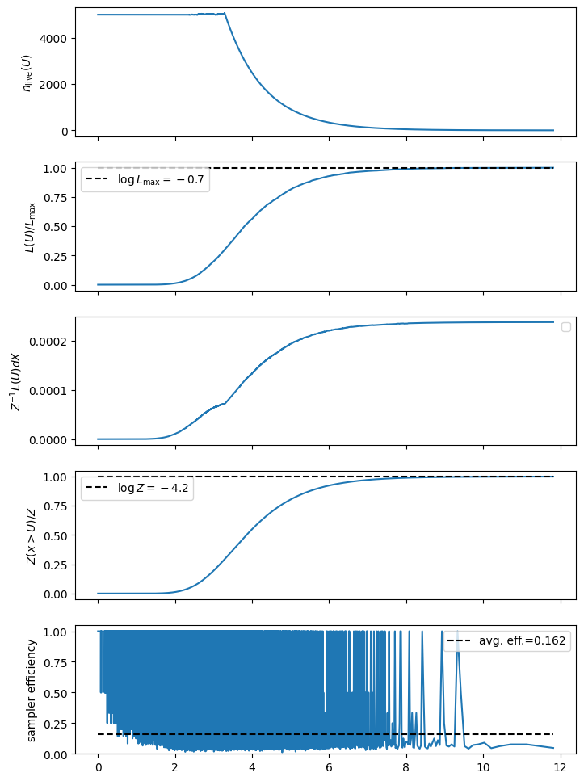  
      
  
  
  
      
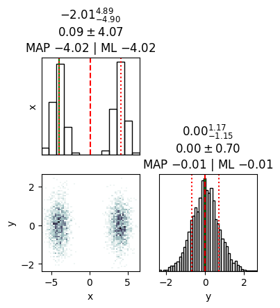  
      
  
  
The full set of tunable parameters are available. Mostly, it is only the live points and evidence fraction we need to tune. If we are scraping the max_samples, something is likely going wrong with convergence.  
  
  
```python  
print("constructor_kwargs")  
for key in NS.constructor_kwargs: print("\t"+str(key)+":\t"+str(NS.constructor_kwargs[key]))  
print("termination_kwargs")  
for key in NS.termination_kwargs: print("\t"+str(key)+":\t"+str(NS.termination_kwargs[key]))  
```  
  
    constructor_kwargs  
    	num_live_points:	5000  
    	max_samples:	50000  
    	num_parallel_samplers:	1  
    	uncert_improvement_patience:	2  
    termination_kwargs  
    	live_evidence_frac:	0.01  
  
  
To get a hold of the result themselves, we have to dig into the internals of the `NS` object. The samples, weights and results are stored in the `._results` component:  
  
  
```python  
for a in dir(NS._results):   
    if "_" not in a:   
        print(a)  
```  
  
    ESS  
    count  
    index  
    samples  
  
  
For our purposes, we are interested only in the evidence, which is here available in log-form. Note the total evidence is off by a factor of $200$. This is because JAXNS has no knowledge of the prior volume, and treats it as unity. This is not an issue when using NS for model comparison, but this difference of normalization  
  
  
```python  
# Extract log-evidence & Uncertainty  
Lz_mean = NS._results.log_Z_mean  
Lz_uncert = NS._results.log_Z_uncert * 1.96  
  
# Convert back from log  
Z_NS = np.exp(np.array([Lz_mean-Lz_uncert,Lz_mean,Lz_mean+Lz_uncert]))  
  
print("Un-Normalized Evidence (min, mean, max)")  
print("\t", Z_NS)  
  
print("Evidence (min, mean, max)")  
print("\t", Z_NS * V0)  
```  
  
    Un-Normalized Evidence (min, mean, max)  
    	 [0.01405105 0.01482362 0.01563869]  
    Evidence (min, mean, max)  
    	 [2.810209  2.964725  3.1277373]  
  
  
`_results` also contains the reason for the sampler termination in the `._results.termination_reason` object. The codes are as follows: we ideally want `termination_reason == 2` or `termination_reason == 4`. The important feature is that *odd* termination codes indicate that the integration has timed out due to a maximum number of samples. If this happens, it indicates that we need to adjust the `max_evals` in our sampler.  
  
        0-bit -> 1: used maximum allowed number of samples  
        1-bit -> 2: evidence uncert below threshold  
        2-bit -> 4: live points evidence below threshold  
        3-bit -> 8: effective sample size big enough  
        4-bit -> 16: used maxmimum allowed number of likelihood evaluations  
        5-bit -> 32: maximum log-likelihood contour reached  
        6-bit -> 64: sampler efficiency too low  
        7-bit -> 128: entire live-points set is a single plateau  
  
  
```python  
print("Termination Condition:")  
print("\t",int(NS._results.termination_reason))  
```  
  
    Termination Condition:  
    	 4  
  
  
  
---------  
  
This page by Hugh McDougall, 2023  
  
  
  
For more detailed information, feel free to check my [GitHub repos](https://github.com/HughMcDougall/) or [contact me directly](hughmcdougallemail@gmail.com).  
  
