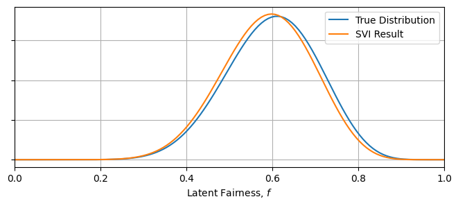
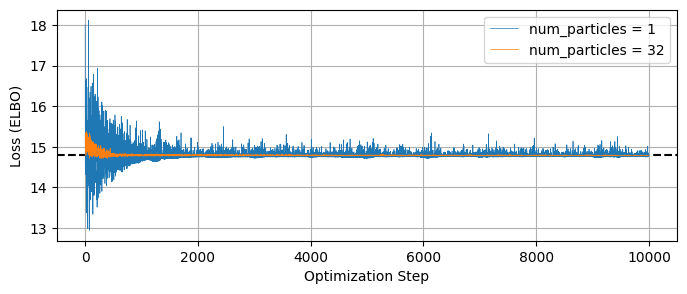

# Stochastic Variational Inference

- Introduction Here
- MCMC a general purpose tool, but perhaps a bit _too_ general
- We often encounter problems where we already know the rough "shape" of the final distribution, e.g. a multivariate gaussian
- Can leverage this knowledge to instead find a good approximation for the simplified "good enough" distribution

General idea of SVI is to have some complicated posterior distribution, $p(z)$, and approximate it with some simple "surrogate distribution", $q(z \vert \phi)$, which is 'similar' to $p(z)$. Here, $\phi$ are tuneable variables of our surrogate distribution (_not_ model parameters) e.g. the mean and width of a normal distribution. The name "variational inference" comes from the method's pen-and-paper origins in functional analysis, but a more informative name might be something like "Surrogate Distribution Optimization of Parameters". 

SVI has two core benefits:
 1. As an optimization problem, SVI is much cheaper and scales better into higher dimensions
 2. Once tuned, the surrogate distribution will often have a known integral

- Put More Here
- Image of an approximate fit

----

## How it Works

In SVI, we seek to tweak the tuning variables $\phi$ of our surrogate model $q_{\phi}(z)$ until it is a close match to the true posterior $p(z)$, but how exactly do we define the two distributions to be 'similar'? The traditional method in SVI to use to use the **Kullback–Leibler Divergence** (KLD) between the two distributions:

\begin{equation}
    KL_{p \rightarrow q_{\theta}} 
    = \mathbb{E_{q_{\theta}}} \left[ \ln \lvert \frac{q_{\theta}(z)}{p(z)} \rvert \right]  
    = \int{   q_{\theta}(z) \ln \lvert \frac{q_{\theta}(z)}{p(z)} \rvert } dz
\end{equation}

The KL Divergence also shows itself in discussions about the "information" or "entropy" of distributions, measures of how well they constrain parameters, but in this case we can just think of it as a measure of the "distance" we seek to minimize between our two distributions. It's worth noting that $KL=0$ when $q_{\theta}(z) = p(z)$, which tells us that KL is strictly positive: $KL \ge 0$. In most applications, we don't _actually_ have access to the normalized posterior distribution $p(z)$, and instead will have it in the un-normalized form that we normally perform MCMC on. We can evaluate the "shape" of the posterior, but only up to its normalizing constant / evidence '$Z$':

$$
    P(z) = \pi(z) \cdot \mathcal{L}(z) = Z p(z), \;\; Z = \int{P(z)}dz
$$

Having the evidence is basically the same as having already solved for $p(z)$, and so we want to express the KL divergence in a way that it can be minimized without knowing $Z$:

\begin{eqnarray}
    KL_{p \rightarrow q_{\theta}} 
    = & \mathbb{E_{q_{\theta}}} \left[ \ln \lvert \frac{P(z)}{q_{\theta}(z)} \rvert \right] + \mathbb{E_{q_{\theta}}} \left[ \ln \lvert Z \rvert \right]\\
    = & -\text{ELBO} + \ln \lvert Z \rvert \\
\end{eqnarray}

Here we've defined the **Evidence Lower Bound** (ELBO), an evidence-free proxy for the KL-divergence. Rather than "minimzing the KL-divergence", we speak in terms of "maximizing the ELBO", to the smae end. The name comes from the fact that it acts as a lower bound for the _true_ posterior's log-evidence:

\begin{equation}
    0 \le KL_{p \rightarrow q_{\theta}}  = -\text{ELBO} + \ln \lvert Z \rvert  
    \;\; \rightarrow \;\; 
    \text{ELBO} \le \ln \lvert Z \rvert
\end{equation}

This is the core of SVI: we optimize the surrogate model's tuning parameters to maximize the ELBO. There are some special-case versions of SVI with analytical solutions, but in NumPyro terms this is a pure numerical optimziation problem, well suited to JAX's autodiff. Obviously, $\text{ELBO} = \mathbb{E_{q_{\theta}}} \left[ \ln \lvert \frac{q_{\theta}(z)}{P(z)} \rvert \right]$ is an expectation value and still requires some integration over $q_{\theta}(z)$. This is done via Monte-Carlo integration, hence the "stochastic" part of "stochastic variational inference". Because we're only using to to navigate instead of defining the entire distribution, this integral can afford to be sparsely sampled without breaking our engine.

The broad overview of SVI is then:
 1. Choose a surrogate distribution form that we think can (with tuning) approximate the true posterior
 2. Use monte carlo integration to estimate the ELBO (and its gradients with respect to $\theta$)
 3. Using numerical optimization, tweak $\theta$ until the ELBO reaches a stable maximum

-----

## Doing SVI in NumPyro
NumPyro has ready-made tools for doing SVI without much more complexity than an MCMC run. As a quick overview, an SVI job consistent of four components:

1. A standard NumPyro model that can generate a posterior and defines latent variables in the form of `numpyro.sample`s
2. A numpyro "guide" that defines surrogate sample distributions in in terms of the optimizeable `numpyro.parameter`s
3. A JAX optimizer from the `numpyro.optim` module
4. And a `numpyro.infer.SVI`object that takes in all of the above to perform the SVI run. This is analagous to the `numpyro.infer.MCMC` object we use in MCMC, a "handler" for our various objects and results

After running the SVI job, we can use the optimized surrogate distribution to generate recover MCMC chain-like sets of points in parameter space or to make mock data corresponding to these points.


```python
import numpyro
import numpyro.distributions as dist
from numpyro.distributions import constraints
from numpyro.infer import Predictive, SVI, Trace_ELBO

import jax.numpy as jnp
import jax, jaxopt
from jax import random

import numpy as np
import matplotlib.pyplot as plt
from chainconsumer import ChainConsumer
```


### Heads or Tails: A Simple Model
As a first example, we'll go over a variation of the the heads / tails example from the [old pyro documentation](http://pyro.ai/examples/svi_part_i.html) and the modern (but incomplete) equivalent from the [NumPyro documentation](https://num.pyro.ai/en/stable/svi.html). The basic setup is simple: we have a coin being tossed a certain number of times, lending heads $A$ times and tails $B$ times in no particular order. We're seeking to constrain the "fairness" of the coin, $f$, the probability of it landing heads on any given flip.

This problem has a well known analytical solution: the PDF for $f$ is given by a [_beta distribution_](https://en.wikipedia.org/wiki/Beta_distribution), a close cousin to the binomial distribution, but distribution of the fairness rather than the number of events:

\begin{equation}
    \beta(f,A,B) = \frac{1}{Z}  f^{A-1}\cdot f^{B-1}
\end{equation}

Where the normalizing constant $Z$ is given in terms of Gamma Functions:

\begin{equation}
    Z = \frac{\Gamma(A+B)}{\Gamma(A) \Gamma(B)}
\end{equation}

The beta distribution has known mean and variance:

\begin{equation}
    \text{mean}(\beta) = \frac{A}{A+B} \;\;\;\;
    \text{var}(\beta) = \frac{AB}{(A+B)^2 (A+B+1)}
\end{equation}

And, in the limit $\lim_{A,B} \rightarrow \infty$, converges to a normal distribution with:

\begin{equation}
    \text{mean}(N) = \frac{A}{A+B} \;\;\;\;
    \text{var}(N) = \frac{\text{mean}(N)\cdot(1-\text{mean}(N))}{A+B}
\end{equation}

In this example, we'll model the data with a binomial distribution, and then use SVI to fit a $\beta$ distribution to $f$, and use SVI again to instead fit an approximate gaussian.

**Generating Data & Model**

First we generate some test data. In our case, this is a series of coin flips with $A=6$ heads and $B=4$ tails, so the maximum likelihood is $\hat{f}=60\%$:


```python
# Actual head and tails
A_true, B_true = 6*2, 4*2
data_headstails = jnp.concatenate([jnp.ones(A_true), jnp.zeros(B_true)])

# Mean & Var
mean_true, var_true = A_true/(A_true + B_true), (A_true*B_true / (A_true + B_true)**2 / (A_true + B_true+1))**0.5

```

    [1. 1. 1. 1. 1. 1. 1. 1. 1. 1. 1. 1. 0. 0. 0. 0. 0. 0. 0. 0.]


Now, construct a model in numpyro. For a given fairness, the probability of any coin toss landing heads or tails follows a [bernoulli distribution](https://en.wikipedia.org/wiki/Bernoulli_distribution), such that the entire run of heads and tails follows a binomial:


```python
def model_headstails(data):
    '''
    'f' is the fairness of the coin flip, with a uniform prior
    '''
    # Uniform prior on fairness
    f = numpyro.sample("latent_fairness", dist.Uniform(0, 1))

    # Each coin toss has an f:1-f chance of landing heads / tails:
    with numpyro.plate("N", data.shape[0] if data is not None else 10): # Second half used for generating mock data later
        # Now acquire the likelihood of getting `data` if 'f' was accurate
        numpyro.sample("obs", dist.Bernoulli(f), obs=data)
```

**Fitting A Beta Distribution with SVI**
- Construct a "guide", which contains the tunable parameters
- In this part, we'll fit a $\beta$ distribution, which has two variable to optimize, $A$ and $B$
- Notice that we feed in constraints on the variables from `numpyro.distributions.constraints`. Common examples would be 'f'


```python
def guide_beta(data):
    '''
    The 'guide' describes the set of surrogate functions we can approximate likelihood function with
    In this case, surrogate functions are the family beta(f,A,B).
    '''
    alpha_q = numpyro.param("alpha_q", # Site Name
                            20.0/2.0, # Initial value in optimization
                            constraint=constraints.positive) 
    beta_q = numpyro.param("beta_q", 
                           20.0/2.0,  # Note that this init value _needs_ to be a float as its a continuous param
                           constraint=constraints.positive)
    
    numpyro.sample("latent_fairness", dist.Beta(alpha_q, beta_q))
```

Now the fun part: we construct an `SVI` object just like we would an `MCMC` object: feeding it the statistical modelling (in his case a model and guide) and a solution method (in this case an optimizer and a loss function). We also make an `Adam` optimizer, `JAX`'s native autodiff stochastic optimization routine which we will be plugging into the solver in a moment.

Then, we fire this off with `.run()` and collect our results. The loss being defined as `Trace_Elbo()` just refers to us minimizing the KL divergence in a model with entirely continuous variables. We won't need to touch this in most cases.


```python
# Make a JAX optimizer
optimizer = numpyro.optim.Adam(step_size=0.0005)

# Make and run the SVI object
svi = SVI(model_headstails, guide_beta, optimizer, loss=Trace_ELBO())
svi_result = svi.run(random.PRNGKey(1), num_steps = 10000, data_headstails)
```


- Now acquire results
- In this instance we know the ground truth for the parameters _and_ an analytical solution for the pdf of $f$ to make our lives much easier
- We can see that SVI has, in short order, recovered the parameters to within $\approx 10 \%$, and has similarly recovered import summary statistics like the mean and variance


```python
from scipy.stats import beta, norm

#----------------------------------
params = svi_result.params

# Get Mean & Var of beta(A,B) for A,B recovered by SVI
inferred_mean = params["alpha_q"] / (params["alpha_q"] + params["beta_q"])
inferred_var  = (params["alpha_q"] * params["beta_q"] / (params["alpha_q"] + params["beta_q"])**2 / (params["alpha_q"] + params["beta_q"]+1))**0.5

#----------------------------------
print("-"*76)
print("\t Truth \t SVI:")
print("A \t %0.1f \t %0.1f" %(A_true, params["alpha_q"]))
print("B \t %0.1f \t %0.1f" %(B_true, params["beta_q"]))
print("Mean \t %0.2f \t %0.2f" %(mean_true, inferred_mean))
print("Var \t %0.2f \t %0.2f" %(var_true, inferred_var))
print("-"*76)
#----------------------------------

Xplot = np.linspace(0,1,128)
plt.figure()
plt.plot(Xplot, beta(A_true,B_true).pdf(Xplot), label = "True Distribution")
plt.plot(Xplot, beta(params["alpha_q"],params["beta_q"]).pdf(Xplot), label = "SVI Result")
plt.xlim(0,1)
plt.gca().yaxis.set_ticklabels([])
plt.xlabel("Latent Fairness, $f$")
plt.grid()
plt.legend()

plt.show()
```

    ----------------------------------------------------------------------------
    	 Truth 	 SVI:
    A 	 12.0 	 12.3
    B 	 8.0 	 8.6
    mean 	 0.60 	 0.59
    Var 	 0.11 	 0.11
    ----------------------------------------------------------------------------


    

    


**Fitting Approximate Models with SVI**

- In the previous section, we recovered the _true_ solution of the $\beta$ distribution with SVI
- One benefit of SVI is that our surrogate model can be any reasonable fit
- Here, we fit a normal distribution instead of the true \beta


```python
def guide_normal(data):
    mean = numpyro.param("mean", 
                            0.5, 
                            constraint= constraints.unit_interval)
    var = numpyro.param("var", 
                           0.1,
                           constraint=constraints.positive)
    
    numpyro.sample("latent_fairness", dist.Normal(mean, var))

svi_norm = SVI(model_headstails , guide_normal, optimizer, loss=Trace_ELBO())
svi_result_norm = svi_norm.run(random.PRNGKey(1), 50000, data_headstails)
```


```python
params_norm = svi_result_norm.params

#----------------------------------
print("-"*76)
print("\t Truth \t SVI:")
print("Mean \t %0.2f \t %0.2f" %(mean_true, params_norm["mean"]))
print("B \t %0.2f \t %0.2f" %(var_true, params_norm["var"]))
print("-"*76)
#----------------------------------

Xplot = np.linspace(0,1,128)
plt.figure()
plt.plot(Xplot, beta(A_true,B_true).pdf(Xplot), label = "True Distribution")
plt.plot(Xplot, norm(params_norm["mean"],params_norm["var"]).pdf(Xplot), label = "SVI Normal Approx")
plt.xlim(0,1)
plt.gca().yaxis.set_ticklabels([])
plt.xlabel("Latent Fairness, $f$")
plt.grid()
plt.legend()

plt.show()
```

    ----------------------------------------------------------------------------
    	 Truth 	 SVI:
    mean 	 0.60 	 0.59
    B 	 0.11 	 0.10
    ----------------------------------------------------------------------------


    

    


### Building a Complicated Models From Mixtures

So I want to build a guide for a dummy function of the form:

$$
q(x,y \vert b, \theta) =  [e^{-(u_1-b)^2} + e^{-(u_1+b)^2}]\cdot \frac{1}{1+u_2^2}
$$

Where:

$$
u_1 = cos(\theta) x - sin(\theta) y, \;\;\; u_2 = cos(\theta) x + sin(\theta) y
$$

We have an objective function in the form of the KL divergence / ELBO, which we can minimize / maximize as a function of our dummy model parameters $\phi=\{b,\theta\}$:

$$
KL(b,\theta) = \iint q(x,y|b,\theta)\cdot ln\lvert \frac{p(x,y)}{q(x,y|b,\theta)} \rvert dx dy
$$

Here, I demonstrate how to compose simple distributions (Normal, Uniform, Cauchy etc) into arbitrary likelihood functions within the guide using mixture models


```python
sig1, sig2 , b = 0.5, 10.0, 8.0

def model_multimodal():
    '''Two cauchy dist / gaussian modes of equal prevalence'''
    x = numpyro.sample('x', dist.Uniform( -20 , 20))
    y = numpyro.sample('y', dist.Uniform( -20 , 20))

    f1 = jnp.exp(-1/2* 1/2 * ((x+y - b)/sig1)**2 )
    f2 = jnp.exp(-1/2* 1/2 * ((x+y + b)/sig1)**2 )
    
    log_fac = jnp.log(f1+f2) + jnp.log(1 / (1 + ((x-y)/sig2)**2 /2 ))
        
    numpyro.factor('logfac', log_fac)
    
#---------------------
def guide_multimodal():
    '''Multimodal guide'''
    
    sig1_q = numpyro.param('sig1_q', 1.0, constraint = constraints.positive)
    sig2_q = numpyro.param('sig2_q', 1.0, constraint = constraints.positive)
    b      = numpyro.param('b'     , 1.0, constraint = constraints.positive)

    theta = numpyro.param('theta', 0.0, constraint = constraints.interval(-np.pi/2, np.pi/2))

    c, s = jnp.cos(theta), jnp.sin(theta)

    # Long Axis Gaussian Mixture
    mymix = numpyro.distributions.MixtureGeneral(
        dist.Categorical(probs=jnp.ones(2) / 2.0),
        [
            dist.Normal(loc=b, scale=sig1_q),
            dist.Normal(loc=-b, scale=sig1_q)
        ]
    )

    # Sample along and across axis
    u1 = numpyro.sample("u1", mymix ,infer={'is_auxiliary': True})
    u2 = numpyro.sample("u2", dist.Normal(0,sig2_q) ,infer={'is_auxiliary': True})

    x = numpyro.sample('x', dist.Delta(c*u1 - s*u2))
    y = numpyro.sample('y', dist.Delta(c*u2 + s*u1))
    
#---------------------
optimizer = numpyro.optim.Adam(step_size=0.0005)
```


```python
svi_two = SVI(model_two, guide_two, optimizer, loss=Trace_ELBO())
svi_two_result = svi_two.run(random.PRNGKey(1), 20000)
for key, val in zip(svi_two_result.params.keys(), svi_two_result.params.values()):
    print("%s:\t%0.3f" %(key,val) )
print(svi_two_result.params["theta"]*180/np.pi)

plt.figure()
plt.plot(svi_two_result.losses, lw=0.5)
plt.show()
```


```python
# get posterior samples
predictive_MCMClike = Predictive(guide_two, params=svi_two_result.params, num_samples=1000)
posterior_samples = predictive_MCMClike(random.PRNGKey(1))

X, Y = posterior_samples['x'], posterior_samples['y']
plt.figure()
plt.scatter(X,Y, s=1, c='k')
plt.grid()
plt.axis('square')
plt.show()
```

### Autoguides: Simpler & Faster
- Add Here
- UNDER CONSTRUCTION. Weird constrained domain effect. Covariances are proportional to ~1/2 prior width


```python
def model_forauto():
    '''Gaussian without using factor()'''
    x = numpyro.sample('x', dist.Uniform( -1000 , 1000))
    y = numpyro.sample('y', dist.Uniform( -1000 , 1000))

    theta = 0*np.pi/180
    c, s = jnp.cos(theta), jnp.sin(theta)

    log_fac = -1.0 / 2.0 * ( ( (c*x- s*y) /  1.0 )**2 + ( (s*x + c*y) / 5.0)**2 )
    numpyro.factor('logfac', log_fac)
```


```python
optimizer_forauto = numpyro.optim.Adam(step_size=0.0005)

autoguide = numpyro.infer.autoguide.AutoMultivariateNormal(model_forauto)

autosvi = SVI(model_forauto, autoguide, optim = optimizer_forauto, loss=Trace_ELBO())
autosvi_result = autosvi.run(random.PRNGKey(1), 50000)
```

    100%|████████████████| 50000/50000 [00:03<00:00, 13311.66it/s, init loss: 196673.3281, avg. loss [47501-50000]: 11.8277]


```python
M = autosvi_result.params['auto_scale_tril']
COVAR_REC = jnp.linalg.inv(jnp.dot(M.T,M))

print("Recovered covariance matrix:")
print(COVAR_REC)

sigs, us = jnp.linalg.eig(COVAR_REC)

print("Recovered sigmas:")
sig1_rec, sig2_rec  = jnp.real(sigs)**(1.0/2.0)
print(sig1_rec, sig2_rec)

print("Recovered angle:")
u1, u2 = jnp.real(us)
thet_rec = np.arctan(u1[1] / u1[0])
print(thet_rec , "rad")
print(thet_rec * 180/ np.pi, "deg")

print(jnp.linalg.norm(u1))
print(jnp.linalg.norm(u2))
```

    Recovered covariance matrix:
    [[237468.78    -1915.1382]
     [ -1915.1383   9768.666 ]]
    Recovered sigmas:
    487.32422 98.75505
    Recovered angle:
    0.008409998 rad
    0.48185741286567607 deg
    0.99999994
    0.99999994


```python
print(M)
print(jnp.abs(jnp.linalg.eig(M)[0])**0.5)
print("-----")
MM = jnp.dot(M,M.T)
MMinv = jnp.linalg.inv(MM)

print(MM)
print(jnp.abs(jnp.linalg.eig(MM)[0])**0.5)
print("-----")

print(MMinv)
print(jnp.abs(jnp.linalg.eig(MMinv)[0])**0.5)
print("-----")

```

    [[0.02046494 0.        ]
     [0.00086125 0.1015159 ]]
    [0.31861562 0.14305572]
    -----
    [[4.18813695e-04 1.76254634e-05]
     [1.76254634e-05 1.03062205e-02]]
    [0.02046417 0.10151971]
    -----
    [[2387.8684     -4.083678]
     [  -4.083678   97.03576 ]]
    [48.865894  9.850304]
    -----


```python
plt.plot(autosvi_result.losses)
```


    [<matplotlib.lines.Line2D at 0x7f6a0949de90>]


    

    


```python
# get posterior samples
predictive_MCMClike = Predictive(autoguide, params=autosvi_result.params, num_samples=5000)
posterior_samples = predictive_MCMClike(random.PRNGKey(1))

X, Y = posterior_samples['x'], posterior_samples['y']
plt.figure()
plt.scatter(X,Y, s=3, c='k', alpha=0.1)

plt.grid()
plt.axis('square')
plt.xlim(-20,20)
plt.ylim(-20,20)
plt.show()
```


    

    


```python
def f(x,y):
    theta = 0*np.pi/180
    c,s = np.cos(theta), np.sin(theta)

    log_fac = -1.0 / 2.0 * ( ( (c*x- s*y) /  1.0 )**2 + ( (s*x + c*y) / 5.0)**2 )
    return(np.exp(log_fac))
X, Y = np.meshgrid(np.linspace(-20,20,128),np.linspace(-20,20,128))

Z = f(X,Y)
plt.imshow(Z[::-1])
```


    <matplotlib.image.AxesImage at 0x7f6a09801050>


    

    

