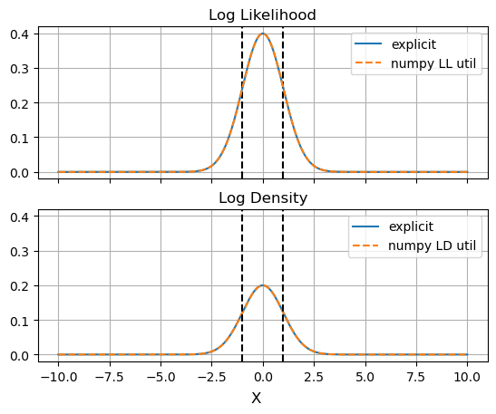
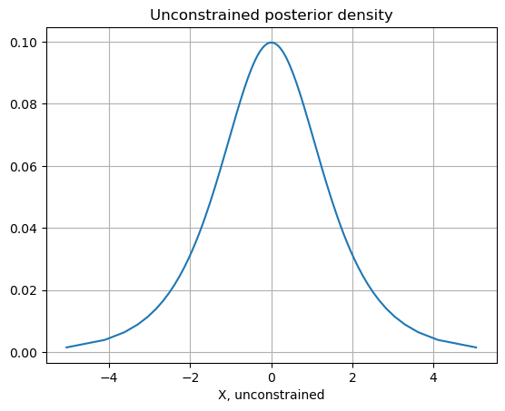
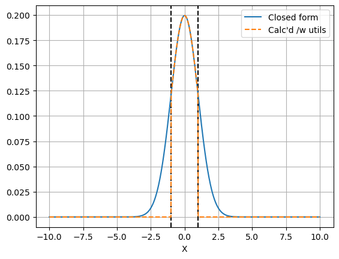
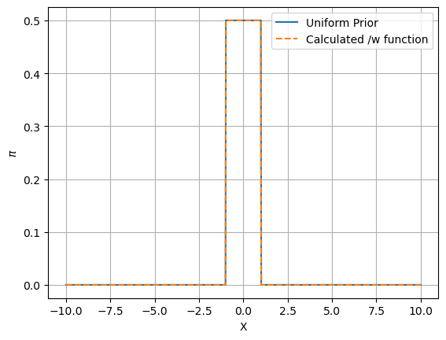

  
  
  
Go Back: [SVI Part 2](.\..\06_SVI\02_part2\page.html)	&nbsp;	Return to [Blog Home](.\..\..\bloghome.html)  
  
---------------------------------------------------------------------------  
  
---------  
  
  
# Infer Utils  
  
A personal reference guide on how to use numpyro's potential likelihood, log density and potential energy calcs. Not for open publication  
  
-HM 29/6/24  
  
  
```python  
import numpy as np  
import jax  
import matplotlib.pyplot as plt  
import jax.numpy as jnp  
import numpyro  
from numpyro import distributions as dist  
from numpyro import infer  
from chainconsumer import ChainConsumer  
```  
  
Numpyro has three easy utilities for evaluating posterior density directly:   
* `log_likelihood` - returns the log-likelihood impact of each observation individually. Is `vmap`ed  
* `log_density` - Like `log_likelihood`, but includes the impact of all priors and all observations individually. Not `vmap`ed  
* `potential_energy` - Like `log_density` but for parameters in the _unconstrained domain_. Not `vmap`ed  
  
Note that `log_likelihihood` and `log_density` will extend beyond the range of the prior boundary.  
  
  
```python  
lim = 10.0  
bound = 1.0  
  
def model():  
    x = numpyro.sample('x', dist.Uniform(-bound,bound))  
    numpyro.sample('y', dist.Normal(x,1), obs=0.0)  
  
X = np.linspace(-lim,lim,1024)  
ll = infer.util.log_likelihood(model, posterior_samples = {'x': X}, *())  
ld = np.array([infer.util.log_density(model, params = {'x': x}, model_args = (), model_kwargs = {})[0] for x in X])  
```  
  
    An NVIDIA GPU may be present on this machine, but a CUDA-enabled jaxlib is not installed. Falling back to cpu.  
  
  
  
  
  
      
  
      
  
  
To make use of `potential_energy`, we need to be able to easily shift in and out of the constrained / unconstrained domain. `infer.util` also offers some some pre-packaged transformations to do this without much fuss:  
  
  
```python  
tformer = lambda x: infer.util.unconstrain_fn(model, params ={'x':x}, model_args = (), model_kwargs={})['x']  
tform_grad = jax.grad(tformer)  
tformer = jax.vmap(tformer)  
  
untformer = lambda x: infer.util.constrain_fn(model, params ={'x':x}, model_args = (), model_kwargs={})['x']  
untform_grad = jax.grad(untformer)  
untformer = jax.vmap(untformer)  
  
pe = np.array([infer.util.potential_energy(model, params = {'x': x}, model_args = (), model_kwargs = {}) for x in tformer(X)]) # negative log posterior in unconstrained space  
```  
  
  
  
  
      
  
      
  
  
We can use the transformation utils to convert this back into real-space with gradients  
  
  
```python  
density_true = np.exp(-pe) * np.array([tform_grad(x) for x in X])  
# Alternately and equivalently:  
# density_true = np.exp(-pe) / np.array([untform_grad(x) for x in tformer(X)])  
  
# Mask out out of bounds nan's as zero density  
density_true = np.where(np.isnan(density_true), 0.0, density_true)  
```  
  
  
  
  
      
  
      
  
  
Now, an example of how to use `jax.lax.cond` to make a jitted and vmapped prior evaluation function. This is obviously needlessly wasteful in practice, but a good demonstration of how to link all of these moving parts together:  
  
  
```python  
def _log_pi(x, xuncon):  
    pe = infer.util.potential_energy(model, params = {'x': xuncon}, model_args = (), model_kwargs = {})  
    ll = infer.util.log_likelihood(model, posterior_samples = {'x': x}, *())['y']  
    grad = tform_grad(x)  
    out = -pe - ll + jnp.log(grad)  
    return(out)  
  
def _neginf(x, xuncon):  
    return(-jnp.inf)  
  
@jax.vmap  
@jax.jit  
def log_pi(x):  
    xuncon = tformer(jnp.array([x]))[0]  
    r = jax.lax.cond(jnp.isnan(xuncon), _neginf, _log_pi, x, xuncon)  
    return(r)  
```  
  
  
  
  
      
  
      
  
  
  
---------  
  
This page by Hugh McDougall, 2024  
  
  
  
For more detailed information, feel free to check my [GitHub repos](https://github.com/HughMcDougall/) or [contact me directly](mailto: hughmcdougallemail@gmail.com).  
  
