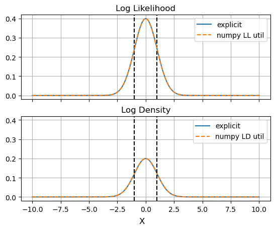
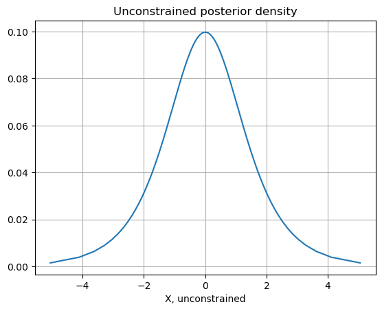
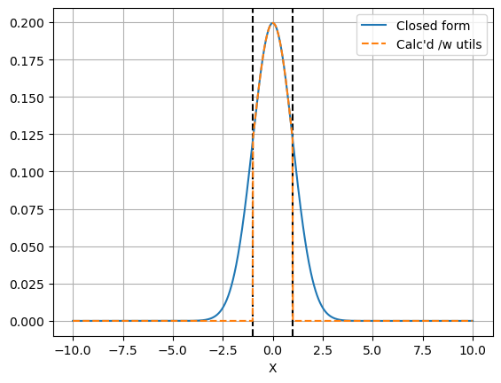
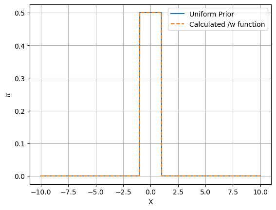

# Infer Utils

A personal reference guide on how to use numpyro's potential likelihood, log density and potential energy calcs. Not for open publication

-HM 29/6/24


```python
import numpy as np
import jax
import matplotlib.pyplot as plt
import jax.numpy as jnp
import numpyro
from numpyro import distributions as dist
from numpyro import infer
from chainconsumer import ChainConsumer
```

Numpyro has three easy utilities for evaluating posterior density directly: 
* `log_likelihood` - returns the log-likelihood impact of each observation individually. Is `vmap`ed
* `log_density` - Like `log_likelihood`, but includes the impact of all priors and all observations individually. Not `vmap`ed
* `potential_energy` - Like `log_density` but for parameters in the _unconstrained domain_. Not `vmap`ed

Note that `log_likelihihood` and `log_density` will extend beyond the range of the prior boundary.


```python
lim = 10.0
bound = 1.0

def model():
    x = numpyro.sample('x', dist.Uniform(-bound,bound))
    numpyro.sample('y', dist.Normal(x,1), obs=0.0)

X = np.linspace(-lim,lim,1024)
ll = infer.util.log_likelihood(model, posterior_samples = {'x': X}, *())
ld = np.array([infer.util.log_density(model, params = {'x': x}, model_args = (), model_kwargs = {})[0] for x in X])
```

    An NVIDIA GPU may be present on this machine, but a CUDA-enabled jaxlib is not installed. Falling back to cpu.


```python
# REDACT
f,a = plt.subplots(2,1, sharex=True,sharey=True)
plt.sca(a[0])
plt.gca().set_title("Log Likelihood")
plt.axvline(-bound, ls='--', c='k')
plt.axvline(bound, ls='--', c='k')
plt.plot(X,np.exp(-X**2/2)  / np.sqrt(2*np.pi), label = 'explicit')
plt.plot(X,np.exp(ll['y']), label = 'numpy LL util', ls='--')
plt.grid()
plt.legend()


plt.sca(a[1])
plt.gca().set_title("Log Density")
plt.plot(X,np.exp(-X**2/2) / np.sqrt(2*np.pi) / (2*bound), label = 'explicit')
plt.plot(X,np.exp(ld), label = 'numpy LD util', ls='--')
plt.axvline(-bound, ls='--', c='k')
plt.axvline(bound, ls='--', c='k')
plt.legend()
plt.grid()
f.supxlabel('X')
plt.show()
```


    

    


To make use of `potential_energy`, we need to be able to easily shift in and out of the constrained / unconstrained domain. `infer.util` also offers some some pre-packaged transformations to do this without much fuss:


```python
tformer = lambda x: infer.util.unconstrain_fn(model, params ={'x':x}, model_args = (), model_kwargs={})['x']
tform_grad = jax.grad(tformer)
tformer = jax.vmap(tformer)

untformer = lambda x: infer.util.constrain_fn(model, params ={'x':x}, model_args = (), model_kwargs={})['x']
untform_grad = jax.grad(untformer)
untformer = jax.vmap(untformer)

pe = np.array([infer.util.potential_energy(model, params = {'x': x}, model_args = (), model_kwargs = {}) for x in tformer(X)]) # negative log posterior in unconstrained space
```


```python
# REDACT
plt.figure()
plt.title("Unconstrained posterior density")

plt.grid()
plt.plot(tformer(X), np.exp(-pe))
plt.xlabel("X, unconstrained")
plt.show()
```


    

    


We can use the transformation utils to convert this back into real-space with gradients


```python
density_true = np.exp(-pe) * np.array([tform_grad(x) for x in X])
# Alternately and equivalently:
# density_true = np.exp(-pe) / np.array([untform_grad(x) for x in tformer(X)])

# Mask out out of bounds nan's as zero density
density_true = np.where(np.isnan(density_true), 0.0, density_true)
```


```python
# REDACT

plt.axvline(-bound, ls='--', c='k')
plt.axvline(bound, ls='--', c='k')
plt.plot(X,np.exp(-X**2/2) / np.sqrt(2*np.pi) / (2*bound), label = 'Closed form')
plt.plot(X, density_true, label = "Calc\'d /w utils", ls='--')
plt.grid()
plt.xlabel('X')
plt.legend()
plt.show()
```


    

    


Now, an example of how to use `jax.lax.cond` to make a jitted and vmapped prior evaluation function. This is obviously needlessly wasteful in practice, but a good demonstration of how to link all of these moving parts together:


```python
def _log_pi(x, xuncon):
    pe = infer.util.potential_energy(model, params = {'x': xuncon}, model_args = (), model_kwargs = {})
    ll = infer.util.log_likelihood(model, posterior_samples = {'x': x}, *())['y']
    grad = tform_grad(x)
    out = -pe - ll + jnp.log(grad)
    return(out)

def _neginf(x, xuncon):
    return(-jnp.inf)

@jax.vmap
@jax.jit
def log_pi(x):
    xuncon = tformer(jnp.array([x]))[0]
    r = jax.lax.cond(jnp.isnan(xuncon), _neginf, _log_pi, x, xuncon)
    return(r)
```


```python
# REDACT
plt.figure()
plt.grid()
plt.plot(X, np.where(abs(X)<bound, 1/(2*bound),0.0), label = 'Uniform Prior')
plt.plot(X, np.exp(log_pi(X)), ls='--', label = 'Calculated /w function')
plt.xlabel('X')
plt.ylabel('$\pi$')
plt.legend()
plt.show()
```


    

    

