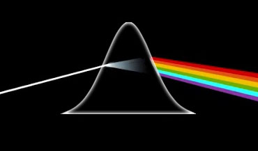

  
  
  
Go Back: [Hugh McDougall Astro Blog](.\..\bloghome.html)	&nbsp;	Return to [Blog Home](.\..\bloghome.html)  
  
---------------------------------------------------------------------------  
**Navigation**  
* [Getting Started](.\01_gettingstarted\./page.html)  
* [Constrained Domain](.\02_constraineddomain\./page.html)  
* [MCMC Samplers](.\03_mcmcsamplers\./page.html)  
* [WebGuide](.\04_nestedsampling\./page.html)  
* [WebGuide](.\05_parallelizing\./page.html)  
* [SVI](.\06_SVI\./page.html)  
  
---------  
  
  
# Comfortably NumPyro  
  

  
    

  
  
It is a generally accepted fact amongst most reasonable people that Bayesian analysis is the correct approach to most any non trivial statistical problem. In the modern world, we enjoy with a suite of tools that alleviate the tedium of constructing and running these models: Bayesian analysis lets us do things right, probabalistic programming languages let us do it easily, and the magical power of JIT compiled languages allows us to to it _fast_. The [JAX](https://github.com/Joshuaalbert/jaxns)-based PPL [NumPyro](num.pyro.ai/) brings all three together: a python interface that gives great speed and versatility and makes ubiquitous tasks like parameter constraint or model comparison cheap in both human-time and machine-time.  
  
For the experienced user, the interaction cost hurdle between having an idea and getting a nice ChainConsumer corner plot has never been shorter. There is only one issue: NumPyro is, to the _unfamiliar_ user, consistently opaque all the way from first introdction to advanced features. In this blog, I provide a handful of short and to-the-point tutorials that walk the new user through their first steps into the world of NumPyro, and guide the "almost new" user through the less-obvious features that otherwise might cost hours of fruitlessly trawling stack exchange.  
  
If you're already confident, you might also consider Dan Foreman Mackey's [Astronomer's Guide to NumPyro](https://dfm.io/posts/intro-to-numpyro/), dive right into the [extensive exampeles](https://num.pyro.ai/en/stable/) provided by NumPyro's documentation itself.  
  
  
---------  
  
This page by Hugh McDougall, 2023  
  
  
  
For more detailed information, feel free to check my [GitHub repos](https://github.com/HughMcDougall/) or [contact me directly](hughmcdougallemail@gmail.com).  
  
