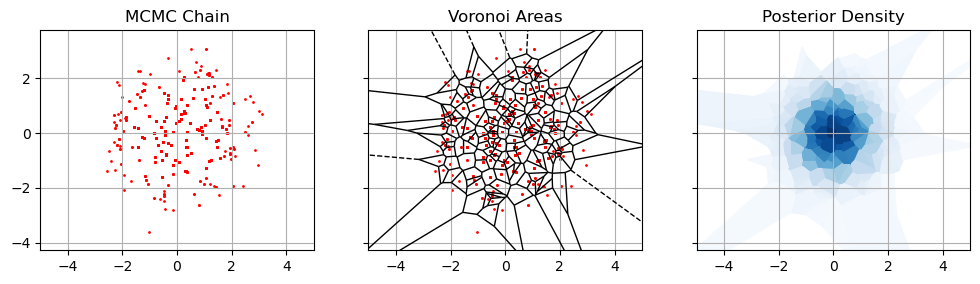
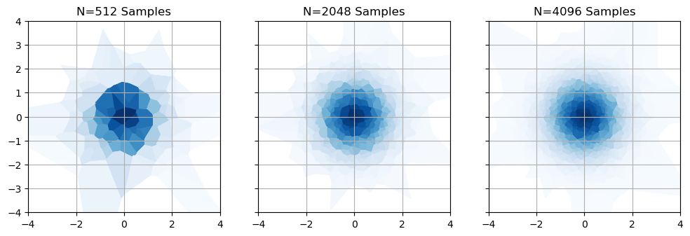
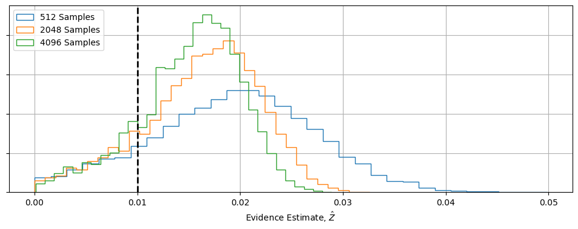
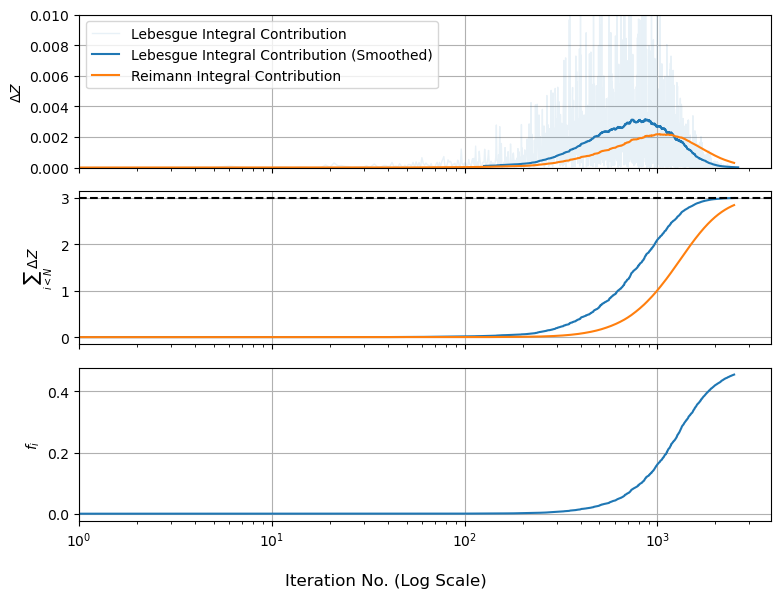
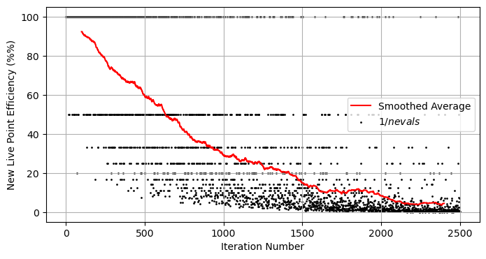
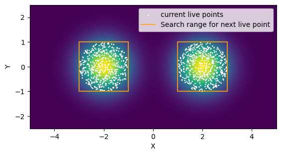
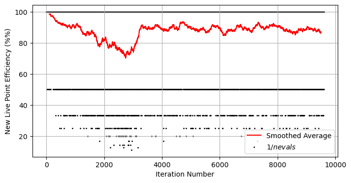
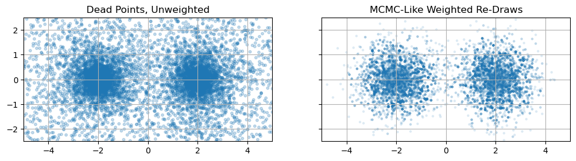

Next Entry: [Data Tension Examples](.\..\02_suspiciousness\page.html)  
  
  
Go Back: [Statistics Articles](.\..\page.html)	&nbsp;	Return to [Blog Home](.\..\..\bloghome.html)  
  
---------------------------------------------------------------------------  
  
---------  
  
  
```python  
#REDACT  
import numpy as np  
import matplotlib.pyplot as plt  
```  
  
# Nested Sampling - Integration with Style  
MCMC is the workhorse of Bayesian fitting in astronomy: general purpose tools like `emcee` are a near panacea for the eternal question of "how do I measure my model parameters?". However, even the best MCMC algorithm in the world has a fundamental flaw: the mission statement of sampling only near the optimum means that MCMC chains contain little to no information about the (sometimes vast) regions of parameter space at _low_ likelihood. This isn't an issue if we're trying to **marginalize** or **constrain** parameters, but leaves us completely at sea if we want to __integrate__, e.g. to get the model [information](https://en.wikipedia.org/wiki/Kullback%E2%80%93Leibler_divergence) or [evidence](https://en.wikipedia.org/wiki/Marginal_likelihood).  
  
Using MCMC for evidence integrals is not just tricky, but a losing battle from the get-go: there's a fundamental mismatch between the goal of MCMC, which focuses where the likelihood is high, and integration, which can be dominated by broad low likelihood contours. There have been some attempts to use MCMC outputs for these integrals, but these have been of limited success and sometimes a source of disastrous failure. One such attempt at wrenching integrals from an MCMC chain is the infamous Harmonic Mean Estimator, a _technically_ valid but practically infamous way of estimating evidence. Enter **Nested Sampling**, a clever, robust and surprisingly simple way of getting integrals by focusing our efforts on the regions of parameter space with the highest evidence contribution.  
  
In the first part of the article, I step through the harmonic mean estimator: showing how it's derived and then demonstrating how it can go dangerously wrong. In the second part, I walk the reader through the fundamentals of nested sampling, including building their own simple algorithm in python. In the final part, I take a quick look at the more advanced pre-built nested sampling tools that we see in the field.  
  
**Navigation**  
* one  
* two  
* three  
  
## Why We Need it: The Harmonic Mean Estimator  
  
In this section we'll look at the Harmonic Mean Estimator, first introduced by [Newton & Rafferty (1994)](https://www.jstor.org/stable/2346025), including its derivation, a more geometrically-motivated explanation of what its assuming, and a demonstration of how these assumptions cause it to blow up under pretty typical conditions.  
  
In brief, the harmonic mean estimator says that the evidence can be estimated from the harmonic mean of our sample likelihoods, i.e.:  
  
$$  
Z \approx \mathbb{E}\left[\frac{1}{\mathcal{L(\theta)}}\right]_\theta ^{-1}   
$$  
  
Why? Well, an expected value is just the posterior-weighted integral:  
  
$$  
\mathbb{E}\left[\frac{1}{\mathcal{L}}\right]_\theta = \int{ \frac{1}{\mathcal{L(\theta)}} \times P(\theta) d\theta}  
$$  
  
And the posterior is $P(\theta) = \frac{1}{Z} \mathcal{L(\theta)}\pi(\theta)$, so:  
  
$$  
\mathbb{E}\left[\frac{1}{\mathcal{L}}\right]_\theta = \int{ \frac{1}{\mathcal{L(\theta)}} \times \frac{1}{Z} \mathcal{L(\theta)}\pi(\theta) d\theta}  
$$  
  
The $\mathcal{L(\theta)}$ terms cancel, $Z$ factorizes out as a constant, and we're left with the integral of the posterior which comes to $1$:  
  
$$  
\mathbb{E}\left[\frac{1}{\mathcal{L}}\right]_\theta = \frac{1}{Z}\times\int{\pi(\theta) d\theta}=\frac{1}{Z}  
$$  
  
Easy enough: this is **consistent estimator**, its expected value is bang-on the thing we're trying to estimate as $N\rightarrow\infty$. What we'll see in a moment is that this estimator has the correct average, its **variance** can be ridiculous. Rather than slog through this analytically, we can show it visually.   
  
  
  
### Voronoi Estimator  
  
For the sake of simplicity, lets look at a toy model so that the evidence is an area integral. Suppose we have some set of MCMC samples, ${\theta_i}$ distributed proportional to the posterior, and we've been smart enough to keep a track of their likelihoods etc. One way to think of the evidence is by saying that each sample is 'responsible' for some small region of parameter space, $A_i$, so that the integral can be estimated like:  
  
$$  
Z = \int{\mathcal{L}(\theta)\pi(\theta) dA} = \sum_i{\mathcal{L}(\theta_i)\pi(\theta_i) A_i}  
$$  
  
Any evidence integral is going to be _some_ kind of weighted sum, so this is true in general, but in our naive approach lets just say that $A_i$ is the area of the region closer to point $i$ than any other point. A point in a densely packed region has a small $A_i$, a point in a sparsely sampled region has a large $A_i$. This goes by a few names: the rectangular rule, zero-th order integration, nearest neighbor interpolation; absent a catchy name I'll call this the "Voronoi Estimator" after the [sort of diagram](https://en.wikipedia.org/wiki/Voronoi_diagram) we estimate the areas with.  
  
  
```python  
import matplotlib as mpl  
import matplotlib.cm as cm  
from scipy.spatial import Voronoi, voronoi_plot_2d  
  
f, (a1,a2,a3) = plt.subplots(1,3, sharex=True, sharey=True, figsize=(12,4))  
  
V = Voronoi(np.vstack([Xprior[I], Yprior[I]]).T)  
  
# find min/max values for normalization  
C = L[I] * PI[I]  
minima = min(C)  
maxima = max(C)  
  
# normalize chosen colormap  
norm = mpl.colors.Normalize(vmin=minima, vmax=maxima, clip=True)  
mapper = cm.ScalarMappable(norm=norm, cmap=cm.Blues)  
  
voronoi_plot_2d(V, show_vertices =False, show_points = False, ax=a2)  
  
for r in range(len(V.point_region)):  
    region = V.regions[V.point_region[r]]  
    if not -1 in region:  
        polygon = [V.vertices[i] for i in region]  
        a3.fill(*zip(*polygon), color=mapper.to_rgba(C[r]))  
  
for a in (a1,a2,a3):  
    a.grid()  
    a.set_aspect('equal')  
    if a !=a3: a.scatter(Xprior[I],Yprior[I], s=1, c='r')  
    a.set_xlim(-5,5)  
  
a1.set_title("MCMC Chain")  
a2.set_title("Voronoi Areas")  
a3.set_title("Posterior Density")  
plt.show()  
  
```  
  
  
      
  
      
  
  
This is the most direct and naive way to integrate from a chain of MCMC samples, but how does it relate to the harmonic mean? Well, consider that density of the points scales with the posterior, so the area scales **against** this probability density:  
  
$$  
A_i \propto \frac{1}{\mathcal{L}(\theta_i) \pi(\theta_i)}  
$$  
  
For some constant of proportionality $k$, the evidence estimate simplifies dramatically:  
  
$$  
Z \approx \sum_i{ \left( \mathcal{L}(\theta_i) \pi(\theta_i) \times k \frac{1}{\mathcal{L}(\theta_i) \pi(\theta_i)} \right)} = \sum_i{k} = k \cdot N  
$$  
  
Lets consider a really simple case, where the prior is uniform<sup>(1)</sup> such that $\pi(\theta) = \frac{1}{A_{total}}$. We know that all the area elements have the cover this total area:  
  
$$  
A_{total} =\sum_i{ \left( k \frac{1}{\mathcal{L}(\theta_i) \pi(\theta_i)} \right)}  
$$  
  
Which lets us estimate '$k$', and in turn $Z$ as:  
  
$$  
Z \approx \frac{A_{total} \cdot N}{\sum_i{ \left( \frac{1}{\mathcal{L}(\theta_i) \frac{1}{A_{total}}} \right)}} = \left( \frac{1}{N} \sum_i{\frac{1}{\mathcal{L}(\theta_i)}} \right) ^ {-1} = \mathbb{E}\left[\frac{1}{\mathcal{L}(\theta_i)}\right]^{-1}  
$$  
  
We've landed right back at the harmonic mean estimator! **The Voronoi estimator is equivalent to the harmonic mean estimator!**  
  
<sup>1</sup> _Because evidence is immune to re-parameterization, and we can always map to some domain where $\pi(\theta)$ is uniform, this "special case" that we used as an example holds in general barring any weird topological edge cases._  
  
### Where Things go Wrong  
So we have a common-sense way to estimate an integral, and a nice easy way to calculate that estimate. We're home free, right? Unfortunately, no. While this harmonic mean trick converges to the right answer, its variance is absolutely atrocious. To see why, lets take look at our example from above,<sup>2</sup> but with a few different sample densities / MCMC chain lengths. As we get more samples, our measurements of the evidence near the center, at the peak likelihood, become more and more precise. By however, no matter how many samples we take there are always going to be enormous chunks out at the fringes of the mode that are both very large and extremely imprecise.  
  
<sup>2</sup> _The exact case is a Cauchy distribution of width $5$ for the prior, and a Gaussian of width $1$ for the likelihood_  
  
  
  
  
      
  
      
  
  
What does this do to our error estimates? Nothing good. If we simulate these MCMC chains a few thousand times and see how the estimated evidence changes, we can see two major warning signs:  
1. Even though the distribution _slowly_ crawls towards $Z_{True}$ as $N\rightarrow\infty$, its still heavily skewed  
2. Even disregarding this bias, there's still ridiculous amounts of variance  
  
The reason for this is simple: MCMC chains, by their nature, give us a poor picture of what's going on at the fringes of the posterior contours, and _no_ information about whats going on in the low-likelihood "flat land" beyond. That means that some significant fraction of our Voronoi "chunks" are noisy and poorly conditioned, skewing things towards over-estimating $Z$ and leaving lots of elbow room for variance.  
  
  
  
  
      
  
      
  
  
There has been some attempts to rescue the HME from these pitfalls by using importance sampling, but without these its a safe bet that HME will fail in most realistic problems.  
  
## How Nested Sampling Works  
  
We've seen that the harmonic mean estimator falls over in estimating evidence integrals, but this is really a limitation of MCMC itself. MCMC tells us about where the likelihood is high, but can miss the wide and shallow regions that dominate the evidence. Even if we get clever about how we interpret an MCMC chain, there's a fundamental limit to what information it gives us.  
  
Enter [Nested Sampling](https://en.wikipedia.org/wiki/Nested_sampling_algorithm) (NS): the go-to method for estimating evidence integrals in Bayesian statistics. NS works by sampling the entire posterior from the outside-in, "nesting" each sample inside the contour of the previous to map the whole domain of parameter space. While MCMC can't be used to get integrals, nested sampling _can_ be used to get MCMC-like chains. For this reason, advanced NS implementations like [dynesty](https://arxiv.org/abs/1506.00171) and [PolyChord](https://arxiv.org/abs/1506.00171) see wide-spread use in astro-statistics.   
  
In this section, we'll explain how nested sampling works in principle, and also build a crude implementation in python to get a more physical feel for what it's doing.  
  
The first change we have to make is a switch on how we think about integrals. The natural way to think of integration in high dimensions is to talk about the area "under" each point, e.g. in the HME example we chunked parameter space up into little columns, estimated their height and added everything together. This is an instance of a [Reimann Integral](https://en.wikipedia.org/wiki/Riemann_integral). For nested sampling, we quite literally turn things sideways for a [Lebesgue Integral](https://en.wikipedia.org/wiki/Lebesgue_integration), imagining the integral as a series of plates stacked on one another like a [Tower of Hanoi puzzle](https://en.wikipedia.org/wiki/Tower_of_Hanoi):  
  
<html><center>  
    ,   
    <br>  
    <b>Sketch of Reimann Integral (Left) and Lebesgue Integral (Right)</b>  
</center></html>  
  
The nested sampling algorithm is, in brief:  
  
1. Start by making a list of "live points", randomly but uniformly distributed across the prior  
2. Sorting these in order of $f(x,y)$ so that you have $f_{Live,0} < f_{Live,1}<\dots<f_{Live,N}$  
3. Randomly draw another point that has $f(x_{new},y_{new}) > f_{Live,0}$  
4. Use this point to replace the old 'worst' live point, which is stored in a list of 'dead' points $\{g_i\}$, and sort this adjusted list in order  
5. Continue until the live points have converged at some optimum or we hit some other common sense limit  
  
Suppose we have $N_{Live}=100$. Because the these live points are distributed uniformly, that tells us that $\sim 99\%$ of parameter space is at a strictly higher likelihood than the worst point. If the prior has volume $V_0$, that means the area of the 'plate' containing that $99\%$ of points is $\sim 0.99 V_0$, and the Lebesgue Integral volume is $\Delta Z \approx f_{Live,0}\cdot 0.99 \cdot V_0$.  
  
<html><center>  
      
    <br>  
    <b>Sketch of how Nested Sampling contours shrink over each itteration</b>  
</center></html>  
  
<sup>3</sup> _Nested sampling is technically only for systems with discrete prior boundaries like this, but reparameterization or "whitening" makes it useful in the general cases as well._  
  
When we draw a new point from _inside_ that plate, the entire process repeats. At each iteration $i$ we know that the plate "volume" is roughly $0.99^i \cdot V_0$, and its thickness is $g_{i+1}-g_i$ so that the total Lebesgue integral is something like:  
  
$$  
Z \approx \sum_i 0.99^i \cdot V_0\cdot (g_{i+1}-g_{i})  
$$  
  
Where $g_i$ is our list of dead points. This is the core idea of nested sampling: even though we don't actually know the _shape_ of the plate, we have a statistical estimate of how _large_ they are compared to the initial prior volume. You'll often see sources talking about how nested sampling collapses the multi-dimensional integral into a one dimensional one:  
  
$$  
Z=\int V(f) df \approx \sum_i V_i \Delta f_i, \quad V_i = V_0 \lambda^i  
$$  
  
Or, alternately treating the area _between_ plates as the area elements in a Reimann-like integral:  
  
$$  
Z = \int f(V) dV \approx \sum f_i \Delta V_i, \quad \Delta V_i = V_0 (\lambda^i - \lambda^{i-1})  
$$  
  
To be a bit more rigorous, instead of shrinking by a factor $\lambda=1-\frac{1}{N_{Live}}$, the shrinkage actually obeys a [beta distribution](https://en.wikipedia.org/wiki/Beta_distribution), $\lambda \sim \beta(1,N_{Live}-1)$, but this converges for large $N_{Live}$.  
  
### Building a Nested Sampler  
In this section, we're going to build an extremely simple nested sampling algorithm in python to see how they work, and how even a few common sense changes can make them drastically more efficient than grid-based or blind Monte Carlo integration. First up, pull in a few packages we'll need:  
  
  
```python  
import numpy as np  
import jax.numpy as jnp  
import matplotlib.pyplot as plt  
from chainconsumer import ChainConsumer  
```  
  
Nested Sampling is a generic integration scheme, so for the sake of simplicity I'm going to skip the particulars of bayesian modelling and replace $\mathcal{L(\theta)}\cdot\pi(\theta)$ with some function $f(x,y$). We're going to look at a simple toy problem of a bimodal Gaussian in 2D. For the sake of comparison, I'm going to give this a _known_ integral of $Z_{true} = 3.0$ and a prior / integral boundaries:  
  
$$  
x\in [-5.0,5.0], \quad y \in [-2.5, 2.5]  
$$  
  
Making these in python, along with a log-probability function:  
  
  
```python  
Ztrue = 3.0  
  
def prob_func(x,y):  
    # Two gaussian modes  
    out=0  
    out+=np.exp(-(x - 2)**2-y**2)   
    out+=np.exp(-(x + 2)**2-y**2)  
  
    # Normalizing  
    out/=2*np.pi  
    out*=Ztrue  
    return(out)  
      
def log_prob_func(x,y):  
    return(np.log(prob_func(x,y)))  
```  
  
In a toy case like this, integration is obviously tractable through simple brute force, but keep in mind that integration scales exponentially with dimension. In real-world problems where each tick is costly, scaling like this can be a death sentence.  
  
  
```python  
#---------------------  
# Set prior boundary  
xmin,xmax = -5.0, 5.0  
ymin,ymax = -2.5,2.5  
V0 = (xmax-xmin) * (ymax-ymin)  
#---------------------  
Zgrid = np.sum(heatmap_grid) / np.sum(heatmap_grid>0) * V0  
print("Evidence from grid integration is %0.4f, an error of %0.2f%% with %i evaluations" %(Zgrid,abs(Zgrid/Ztrue-1)*100, Ngrid**2) )  
```  
  
    Evidence from grid integration is 2.9522, an error of 1.59% with 16384 evaluations  
  
  
  
  
  
      
  
      
  
  
**A First (Bad) Attempt**    
Now onto the fun part. We're going to build an extremely simple (and initially quite inefficient) nested sampler. To build our sampler, we're going to need a way to draw new live points. As a first pass I'm going to do this with brute force prior sampling: trying points randomly until we get one that performs better than the worst live point.   
  
There's a rule of thumb that the number of live points should be:  
  
$$  
N_{Live}\approx 50\times N_{Modes} \times (N_{Dimensions}+1)  
$$  
  
While the maximum number of evaluations should be "a few" times $N_{Live}$. For demonstration purposes, I'm going with $N_{Live}=500$ and $N_{evals}=2,500$. We'll see in a moment that these are actually a little small, but we're starting with a crude "vibes based" sampler to map out the basic ideas before we tighten the screws.  
  
Our algorithm needs two moving parts:  
1. An initial set of live points  
2. A way of generating new live points  
  
  
```python  
Nlive = 500  
Nevals = Nlive*5  
#-------------------------------  
  
np.random.seed(1)  
  
# Draw samples uniformly from the prior  
Xlive = np.random.rand(Nlive)*(xmax-xmin) + xmin  
Ylive = np.random.rand(Nlive)*(ymax-ymin) + ymin  
Flive = prob_func(Xlive, Ylive)  
  
def sort_livepoints(X,Y,F):  
    Isort=np.argsort(F)  
    return(X[Isort], Y[Isort], F[Isort])  
      
def new_live_point(X,Y,F):  
    fnew = 0.0  
    nevals=0  
    while fnew<F.min():  
        xnew = np.random.rand()*(xmax-xmin) + xmin  
        ynew = np.random.rand()*(ymax-ymin) + ymin  
        fnew = prob_func(xnew,ynew)  
        nevals+=1  
    return(xnew, ynew, fnew, nevals)  
  
#-------------------------------  
Xlive, Ylive, Flive = sort_livepoints(Xlive, Ylive, Flive)  
```  
  
Plotting some some sub-sample of these initial live points, we can see them scattered across the domain with, with the worst point (marked in red) sitting on a contour that encloses most of the prior volume:  
  
  
  
  
      
  
      
  
  
Now the actual nested sampling loop. This follows a few simple steps:  
1. Get the worst live point  
2. Find a replacement point   
3. Save the old live point and current volume  
4. Repeat (1)-(3) until we hit our maximum number of evaluations  
  
At each iteration, our live points draw inwards towards the contour peaks, packing together exponentially tightly. I'm also going to track the number of evaluations in the array `efficiency` to see how efficient our sampler is at different times  
  
  
```python  
dead_points = ([],[],[])  
volumes = []  
V = V0  
shrinkage = 1-1/Nlive  
efficiency = []  
  
i=0  
while i<=Nevals:  
    # Store the worst live point as a dead point  
    dead_points[0].append(Xlive[0])  
    dead_points[1].append(Ylive[0])  
    dead_points[2].append(Flive[0])  
    volumes.append(V)  
  
    # Generate a new live point and replace the old one  
    V*=shrinkage  
    xnew, ynew, fnew, nevals = new_live_point(Xlive,Ylive,Flive)  
    Xlive[0], Ylive[0], Flive[0] =  xnew, ynew, fnew  
  
    efficiency.append(nevals)  
  
    cost +=nevals  
  
    # Sort and repeat  
    Xlive, Ylive, Flive = sort_livepoints(Xlive, Ylive, Flive)  
    if (i%(Nevals//10))==0: print(i, end='\t')  
    i+=1  
  
print("Done")  
```  
  
    0	250	500	750	1000	1250	1500	1750	2000	2250	2500	Done  
  
  
Now we can estimate the integral. For comparison, I'm going to use both the Reimman-type and Lebesgue-type sum:  
  
  
```python  
# Lebesgue  
dZ1 = np.diff(dead_points[2]) * (np.array(volumes)[1:]+np.array(volumes)[:-1])/2  
# Reimann  
dZ2 = (np.array(dead_points[2][1:])+np.array(dead_points[2][:-1]))/2 * -np.diff(volumes)  
Z1, Z2 = dZ1.sum(), dZ2.sum()  
#----------  
print("For %i Total Evaluations:" %sum(efficiency))  
print("Lebesgue Integral is %.2f, an error of %.2f%%" %(Z1, abs(Z1/Ztrue-1)*100))  
print("Reimann Integral is %.2f, an error of %.2f%%" %(Z2, abs(Z2/Ztrue-1)*100))  
```  
  
    For 76154 Total Evaluations:  
    Lesbegue Integral is 2.91, an error of 2.99%  
    Reimann Integral is 2.76, an error of 8.06%  
  
  
Incredible, right? Well, not really. We did barely as well as a grid-integral for significantly more evaluations. The good news is that this is down to our patch implementation, not a fundamental limit of the method. In fact, our implementation has three things that make it less than ideal:  
1. We discard the final live points   
2. We approximate the volume shrinkage as being constant  
3. Our method of selecting new live points is hugely wasteful  
  
**Diagnostics**    
To see where things are going askew, we'll use a couple of the common diagnostic graph for nested sampling. We know that the total evidence integral is:  
  
$$  
Z = \sum \Delta Z_i, \quad \Delta Z_i = f_i \Delta V_i \approx \Delta f_i V_i  
$$  
  
So we can plot this how $\Delta Z$ and its sum change as the walks track inwards. For comparison, we'll also plot $f_i$ by itself.  
  
  
  
  
      
  
      
  
  
We can see something interesting here: the amount of evidence at each nested shell peaks and then levels out, even though the 'height' of the function keeps going up. This is because the evidence in each shell is a product of height _and_ volume. The peak of the $\Delta Z$ bump is called the "typical set", sometimes explained as there being "only one _best_ fit, but many 'okay' fits".   
  
Diagnostic graphs like this are a useful sanity check on nested sampling because they tell us at a glance if / how things are breaking. We can see, for starters, at the second and third panels haven't fully leveled out and the first panel has bumps that are a bit "cut off", suggesting we're missing some evidence at the modal peaks. In fact, we very much are: the live points shrink inwards and leave a trail of dead points in their wake, but our current algorithm just throws the final set of live points out, meaning we miss the evidence associated with them.  
  
  
  
  
      
  
      
  
  
For the Lebesgue integral this only "snips" the top off of the evidence, as we miss a few narrow plates. For the Reimann integral, we're basically taking an apple-corer to the middle of our distribution, meaning it systematically under-estimates $Z$. A brute-force way to fix this is to increase $N_{eval}$ so the missing core shrinks, but there's a less wasteful approach: each of those last live points is already nested and sorted, so we can estimate their shell sizes in the usual way and add that to our shell volumes.  
  
As to the sampling method, we can plot the efficiency of our sampler and see that it drops exponentially over time. This isn't surprising: at the moment we're shooting blindly and hoping to hit an exponentially shrinking target:  
  
  
  
  
      
  
      
  
  
**A Second (Better) Attempt**  
  
So how can we improve things? Well, we can use some common sense ways to learn the shape of the distribution and narrow down or search range for new points. Below I've written a simple `new_live_point` that draws a rectangle around our live points and _only_ tests new samples within that rectangle. If the left and right sides of the distribution are separated by a wide enough margin, we break into two rectangles and continue. This is an example of targeted rejection sampling.  
  
  
```python  
def new_live_point(X,Y,F):  
    fnew = 0.0  
    nevals = 0  
  
    # Separate live points into left and right  
    I_left, I_right= np.where(X<0)[0], np.where(X>0)[0]  
    mu_left, width_left = X[I_left].mean(), X[I_left].ptp()  
    mu_right, width_right = X[I_right].mean(), X[I_right].ptp()  
  
    # Check if they're significantly separated  
    sep = abs(mu_left-mu_right) > (width_left + width_left)  
    Xmax, Xmin = X.max(), X.min()  
    Ymax, Ymin = Y.max(), Y.min()  
      
    while fnew<F.min():  
        if sep:  
            if np.random.rand()<0.5:  
                xnew = (np.random.rand()*2-1)* width_left/2 + mu_left  
            else:  
                xnew = (np.random.rand()*2-1)* width_right/2 + mu_right  
        else:  
            xnew = np.random.rand()*(Xmax-Xmin) + Xmin  
        ynew = np.random.rand()*(Ymax-Ymin) + Ymin  
        fnew = prob_func(xnew,ynew)  
        nevals+=1  
      
    return(xnew, ynew, fnew, nevals)  
```  
  
  
  
  
      
  
      
  
  
Equipped with this new proposal method, we can re-run with a few small change:  
1. We'll use our new method of searching for a new live point  
2. Instead of $V_i = V_{i-1}\times \left(1-\frac{1}{N_{Live}}\right)$, we'll use $V_i = V_{i-1}\times \lambda, \quad \lambda \sim \beta(N_{Live}-1,1)$  
3. After our main set of evaluations, we'll also use add up the evidence contributions from the final live points  
  
We'll see in a moment that our new `new_live_point` is _much_ more efficient. I'm going to increase $N_{Live}$ and $N_{evals}$ to compensate and get a better final result:  
  
  
```python  
Nlive = 1_600  
Nevals = Nlive*6  
  
# Draw samples uniformly from the prior  
Xlive = np.random.rand(Nlive)*(xmax-xmin) + xmin  
Ylive = np.random.rand(Nlive)*(ymax-ymin) + ymin  
Flive = prob_func(Xlive, Ylive)  
Xlive, Ylive, Flive = sort_livepoints(Xlive, Ylive, Flive)  
  
#--------------------------------------------  
dead_points = ([],[],[])  
volumes = []  
V = V0  
shrinkage = 1-1/Nlive  
efficiency = []  
  
i=0  
while i<=Nevals:  
    # Store the worst live point as a dead point  
    dead_points[0].append(Xlive[0])  
    dead_points[1].append(Ylive[0])  
    dead_points[2].append(Flive[0])  
    volumes.append(V)  
  
    # Generate a new live point and replace the old one  
    V*=np.random.beta(Nlive-1,1)  
    xnew, ynew, fnew, nevals = new_live_point(Xlive,Ylive,Flive)  
    Xlive[0], Ylive[0], Flive[0] =  xnew, ynew, fnew  
  
    efficiency.append(nevals)  
  
    cost +=nevals  
  
    # Sort and repeat  
    Xlive, Ylive, Flive = sort_livepoints(Xlive, Ylive, Flive)  
    if (i%(Nevals//10))==0: print(i, end='\t')  
    i+=1  
  
print("Done Main Sampling")  
  
for i in range(Nlive-1):  
    V*=np.random.beta(Nlive-1-i,1)  
    volumes.append(V)  
    dead_points[0].append(Xlive[i])  
    dead_points[1].append(Ylive[i])  
    dead_points[2].append(Flive[i])  
  
print("Done Peak Sampling")  
  
#-------------------------  
# Get Evidence Integrals  
  
# Lebesgues  
dZ1 = np.diff(dead_points[2]) * (np.array(volumes)[1:]+np.array(volumes)[:-1])/2   
#Reimann  
dZ2 = (np.array(dead_points[2][1:])+np.array(dead_points[2][:-1]))/2 * -np.diff(volumes)  
  
Z1, Z2 = dZ1.sum(), dZ2.sum()  
  
print("For %i evaluations:" %sum(efficiency))  
print("Lebesgue Integral is %.2f, an error of %.2f%%" %(Z1, abs(Z1/Ztrue-1)*100))  
print("Reimann Integral is %.2f, an error of %.2f%%" %(Z2, abs(Z2/Ztrue-1)*100))  
```  
  
    0	960	1920	2880	3840	4800	5760	6720	7680	8640	9600	Done Main Sampling  
    Done Peak Sampling  
    For 12550 evaluations:  
    Lebesgue Integral is 3.01, an error of 0.34%  
    Reimann Integral is 3.01, an error of 0.34%  
  
  
We're now hitting very good precision at _less_ evaluations than a raw grid search, even with our still relatively simple sampling method. The advantages of nested sampling might not be apparent in this problem: it's low dimensional and the function we're integrating is particularly well behaved against grid integration, but the beauty of nested sampling is that it can work well in increasingly high dimensions and with unusually shaped contours.  
  
If we plot run our diagnostic plots, we see a few things:  
1. Because our sampling range shrinks along with our contours, our efficiency is pretty steady  
2. Because we're not snipping off the high final likelihood points, the Lebesgue and Reimann integrals align  
3. With a higher number of evaluations, we're getting a good end-result precision  
  
The hard part of building a good nested sampler is really down to point (1): finding some clever way to sample uniformly from our "nested contours" in a way that's both robust and efficient. The trick we used here, breaking our target space into two rectangles, is a common approach. The famous `python` package [`dynesty`](https://dynesty.readthedocs.io/en/latest/dynamic.html) uses the live points to draw a series of "ellipsoids", while cosmology's own [`polychord`](https://cobaya.readthedocs.io/en/latest/sampler_polychord.html#) abandons the rejection sampling approach in favour of [slice sampling](https://en.wikipedia.org/wiki/Slice_sampling). My personal weapon of choice, [`jaxns`](https://github.com/Joshuaalbert/jaxns), uses a combination of the two.  
  
  
  
  
      
  
      
  
  
  
      
  
      
  
  
### Getting MCMC-Like Chains from Nested Sampling  
  
We've seen earlier that MCMC, a posterior estimator, is a poor tool for getting integrals, but does nested sampling, an integrator, work as a posterior estimator? Can we take our nested sampling results and spin get an MCMC-like chain? Conveniently, yes, and really quite easily. The idea goes like this:   
1. Each sample in our dead points acts as a surrogate for an entire chunk of parameter space of volume $\Delta V_i$  
2. The total "amount" of the posterior in this chunk is $\Delta Z_i = f_i \Delta V_i$  
From (1) and (2), we can [importance sample](https://en.wikipedia.org/wiki/Importance_sampling), (i.e. take a weighted re-draw) of our dead-points with weights proportional to ${\Delta Z_i}$ and we'll get a list of points distributed proportional to the posterior density, i.e. an MCMC chain  
  
  
```python  
#From earlier work, dZ2 = {f_i * dV_i}  
weights = dZ2 / dZ2.sum()  
I = np.random.choice(range(len(weight)), len(weight), p=weights, replace=True)  
samples = {'x':np.array(dead_points[0])[1:][I],  
          'y':np.array(dead_points[1])[1:][I]}  
```  
  
  
  
  
      
  
      
  
  
If we throw this into `ChainConsumer`, we sadly get some pretty choppy looking contours. This is a fundamental limit: Nested Sampling only takes so many samples, and we've effectively thrown most of them out. In this specific example even through we have $11,200$ samples from nested sampling, we only have $\sim 471$ "effective points" after taking the weighted re-draws. If you're dead-set on using nested sampling, the cure to this is to use more live points to slow down the progression of the sampler and force it to take more high-likelihood samples, but a much better approach is to _combine_ nested sampling and MCMC for their specific purposes.  
  
  
```python  
# ChainConsumer Plot  
C = ChainConsumer()  
C.add_chain(samples)  
C.plotter.plot()  
plt.show()  
```  
  
  
  
  
      
  
      
  
  
  
---------  
  
This page by Hugh McDougall, 2024  
  
  
  
For more detailed information, feel free to check my [GitHub repos](https://github.com/HughMcDougall/) or [contact me directly](mailto: hughmcdougallemail@gmail.com).  
  
