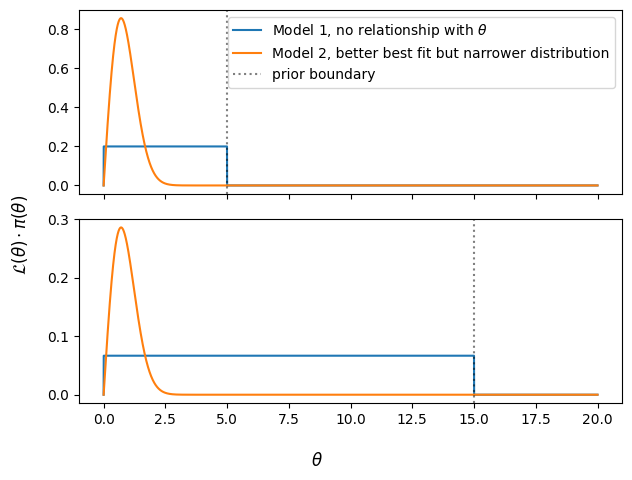
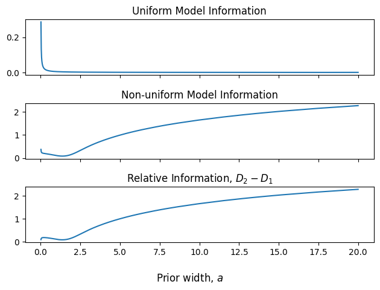
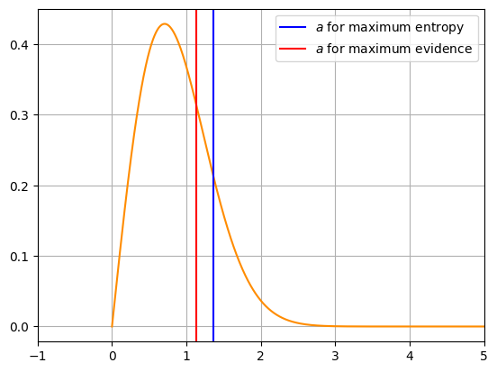
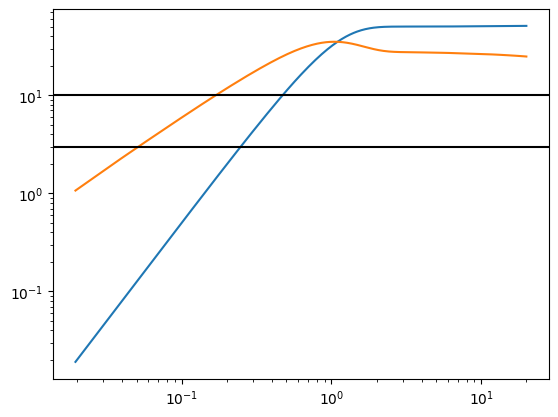
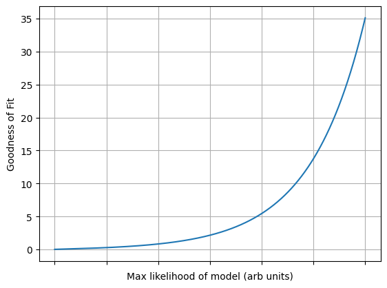

Previous Entry: [WebGuide](.\..\01_nestedsampling\page.html)	&nbsp;	   
  
  
Go Back: [WebGuide](.\..\page.html)	&nbsp;	Return to [Blog Home](.\..\..\bloghome.html)  
  
---------------------------------------------------------------------------  
  
---------  
  
  
```python  
import numpy as np  
import matplotlib.pylab as plt  
```  
  
# Evidence, Entropy & Suspiciousness  
  
A common question in data-science of determining wether one model meaningfully outperforms another. A common Bayesian approach to this question is to compare the **evidence** for two models, the total "probabalistic mass" across the entire prior range:  
  
$$\begin{equation}  
    Z_m = \int_\pi{\mathcal{L_m}(\theta)\cdot\pi(\theta)}d\theta  
\end{equation}$$  
  
This evidence is also the normalizing factor on the likelihood $\rightarrow$ probability conversion:  
  
$$\begin{equation}  
    P_m(\theta) = \frac{\mathcal{L_m}(\theta)\cdot\pi(\theta)}{Z_m}  
\end{equation}$$  
  
If we want to compare models '1' and '2', we find their evidences through integration and compare the **evidence ratio** `$R$':  
  
$$\begin{equation}  
    R_{12} = \frac{Z_2}{Z_1}  
\end{equation}$$  
  
The idea here is straightforward: a better model will have higher overall likelihood across all possible sets of parameters. Interpreting the evidence ratio is a bit arbitrary, but a typical benchmark is for $\log_{10}(R)>0.5$ to indicate that model 2 is mildly but detectable better than model 1, while $\log_{10}(R)>1.0$ indicates a strong improvement.  
  
Another measure is the information (also called the entropy or Kullback-Lieber divergence, plus or minus a negative sign) wich measures how well the model constrains the parameter $\theta$ as compared to a prior:  
  
$$\begin{equation}  
    D_m = \int_\pi{P_m(\theta)\cdot \ln \left|\frac{P_m(\theta)}{\pi(\theta)} \right|}d\theta  
\end{equation}$$  
  
In this example, we'll look at the simple case of a vague uniform prior:  
$$\begin{equation}  
    \pi(\theta) = \frac{1}{a} \left(u(\theta) - u(\theta-a) \right)  
\end{equation}$$  
  
Comparing model 1, in which the parameter doesn't vary and so the likelihood is fixed:  
  
$$\begin{equation}  
    \mathcal{L}_1(\theta) = 1  
\end{equation}$$  
  
To model 2, in which the parameter _does_ vary, with some arbitrary example distribution. The scalar $A$ here represents how well the model performs compared to the exclusion of $\theta$ as a parameter:  
  
$$\begin{equation}  
    \mathcal{L}_2(\theta) = A\cdot\theta\cdot \exp(-\theta^2)  
\end{equation}$$  
  
  
```python  
# Define prior and models  
  
def prior(x, a=5):  
    # Uniform prior, amplitude scales against with for normalization  
    out = (x>0)*(x<a) / a  
    return(out)  
      
def model_1(x):  
    # Uniform model, likelihood doesn't change with 'x'  
    return(x*0+1)  
      
def model_2(x, goodness = 10, aliasing = 0, background = 0):  
    # Measurement model  
    out = np.exp(-x**2)*x*goodness  
  
    # Noise (For testing)  
    s = np.sin(10*x)  
    out += s*s*aliasing  
    out += background  
    return(out)  
```  
  
The danger is that changing the prior 'dilutes' the evidence of model 2. Model 1 is of uniform likelihood, and so encompasses more and more prior volume as the prior expands.   
$$\begin{equation}  
    Z_1 = \int_0^a{1\cdot\pi(\theta)} d\theta = 1  
\end{equation}$$  
  
Model 2, however, only performs well over a small range of parameter space, and so performs more poorly by comparison as the prior expands:  
  
$$\begin{equation}  
    Z_2 = \int_0^a{L_2(\theta)\cdot\pi(\theta)} d\theta = \frac{1}{a}\int_0^a{L_2(\theta)} d\theta \propto \frac{1}{a}  
\end{equation}$$  
  
  
```python  
scale = 1 # Changing of units for testing invariance  
  
# Plot models 1 and 2  
X = np.linspace(0,20,1024*4) * scale  
dx = X[-1]/(len(X)-1)  
  
fig1, ax1 = plt.subplots(2,1, sharex=True, sharey=False)  
  
for i,a in zip([0,1],[5*scale,15*scale]):  
      
    ax1[i].plot(X, model_1(X/scale)*prior(X, a=a), label = "Model 1, no relationship with $\\theta$")  
    ax1[i].plot(X, model_2(X/scale)*prior(X, a=a), label = "Model 2, better best fit but narrower distribution")  
      
    ax1[i].axvline(a, c='k', ls=':', alpha=0.5, label = 'prior boundary')  
      
fig1.supylabel("$ \mathcal{L}(\\theta)\cdot\pi(\\theta)$")  
fig1.supxlabel("$\\theta$")  
fig1.tight_layout()  
ax1[0].legend()  
  
plt.show()  
```  
  
  
      
  
      
  
  
We can test these for a range of prior widths to see this in action. In this cell, we also calculate the entropy of the distributions and how they vary with prior width.  
  
  
```python  
A = np.linspace(0, np.max(X), 1024+1)[1:]  
  
Z1 = np.zeros_like(A)  
Z2 = np.zeros_like(A)  
  
D1 = np.zeros_like(A)  
D2 = np.zeros_like(A)  
D12 = np.zeros_like(A)  
  
#==========================================  
  
print("Doing calcs, itt no:", end="\t")  
M1 = model_1(X / scale)  
M2 = model_2(X / scale, goodness = 100, aliasing = 0.1, background=0.001)  
  
for i,a in zip(range(len(A)),A):  
    if i %10==0: print(i,end=", ")  
      
    Pr  = prior(X, a=a)  
  
    #Integrate to get evidence  
    z1 = dx * np.sum(Pr * M1)  
    z2 = dx * np.sum(Pr * M2)  
  
    P1 = Pr * M1 / z1  
    P2 = Pr * M2 / z2  
  
    d1 = dx * np.sum(P1 * np.nan_to_num(np.log(P1/Pr),0) )  
    d2 = dx * np.sum(P2 * np.nan_to_num(np.log(P2/Pr),0) )  
      
    d12 = dx * np.sum(P1 * np.nan_to_num(np.log(P2/Pr),0) )  
  
    Z1[i], Z2[i], D1[i], D2[i], D12[i] = z1, z2, d1, d2, d12  
  
#==========================================  
  
# Clean up  
Zr = Z2 / Z1  
Zr[np.isinf(Zr)]=0  
Z1[0], Z1[-1] = 0, 0  
print('\n----------')  
  
```  
  
    Doing calcs, itt no:	0, 10, 20, 30, 40, 50, 60, 70, 80, 90, 100, 110, 120, 130, 140, 150, 160, 170, 180, 190, 200, 210, 220, 230, 240, 250, 260, 270, 280, 290, 300, 310, 320, 330, 340, 350, 360, 370, 380, 390, 400, 410, 420, 430, 440, 450, 460, 470, 480, 490, 500, 510, 520, 530, 540, 550, 560, 570, 580, 590, 600, 610, 620, 630, 640, 650, 660, 670, 680, 690, 700, 710, 720, 730, 740, 750, 760, 770, 780, 790, 800, 810, 820, 830, 840, 850, 860, 870, 880, 890, 900, 910, 920, 930, 940, 950, 960, 970, 980, 990, 1000, 1010, 1020,   
    ----------  
  
  
    /tmp/ipykernel_4935/1788262276.py:28: RuntimeWarning: invalid value encountered in divide  
      d1 = dx * np.sum(P1 * np.nan_to_num(np.log(P1/Pr),0) )  
    /tmp/ipykernel_4935/1788262276.py:29: RuntimeWarning: invalid value encountered in divide  
      d2 = dx * np.sum(P2 * np.nan_to_num(np.log(P2/Pr),0) )  
    /tmp/ipykernel_4935/1788262276.py:31: RuntimeWarning: invalid value encountered in divide  
      d12 = dx * np.sum(P1 * np.nan_to_num(np.log(P2/Pr),0) )  
  
  
Plotting these, we see the issue: the expanding prior 'dilutes' the evidence of the model, making it seem like a poor fit even though nothing about the distribution has changed. Even if model 2 does a good job in some cases, it is overwhelmed by the sheer number of possibilities that it performs poorly for.  
  
  
```python  
fig2, ax2 = plt.subplots(3,1, sharex=True, sharey=False)  
  
#Z1[0], Z1[-1]= 0,0  
  
ax2[0].plot(A,Z1)  
ax2[0].set_title("Uniform Model Evidence")  
  
ax2[1].plot(A,Z2)  
ax2[1].set_title("Non-uniform Model Evidence")  
  
ax2[2].plot(A,Zr)  
ax2[2].set_title(" Evidence Ratio, $Z_2/Z_1$")  
  
ax2[0].set_ylim(ymin=0,ymax=np.max(Z1)*1.5)  
ax2[1].set_ylim(ymin=0)  
ax2[1].set_ylim(ymin=0)  
  
fig2.supxlabel("Prior width, a")  
  
fig2.tight_layout()  
plt.show()  
```  
  
  
      
  
      
  
  
The information, by contrast, increases as the prior expands. This is intuitive: information describes how much we constrain $\theta$ relative to the prior, and so the prior getting broader means that our model performs better by comparison. The uniform model is just a repeat of the prior, and so gives zero new information.  
  
  
```python  
fig2, ax2 = plt.subplots(3,1, sharex=True, sharey=False)  
  
ax2[0].plot(A,D1)  
ax2[0].set_title("Uniform Model Information")  
  
ax2[1].plot(A,D2)  
ax2[1].set_title("Non-uniform Model Information")  
  
ax2[2].plot(A,D2-D1)  
ax2[2].set_title("Relative Information, $D_2-D_1$")  
  
fig2.supxlabel("Prior width, $a$")  
  
fig2.tight_layout()  
plt.show()  
```  
  
  
      
  
      
  
  
In some cases, the information is used as a way to get a 'first pass' at the prior. The idea being that the 'best' prior is one that is as vague as possible, and so is the one that maximizes the entropy / minimizes the information. All this really does in our case, however, is find the uniform distribution that is 'most like' the likelihood curve. Similarly, attempting to choose a prior that maximimzes the evidence only gives a region of significance, not a meaningful 'best' prior width:  
  
  
```python  
a_min_ent = A[np.where(D2==np.min(D2))[0]]  
a_max_ev = A[np.where(Z2==np.max(Z2))[0]]  
  
plt.plot(X, model_2(X/scale)*prior(X, a=10*scale), c='darkorange')  
  
plt.axvline(a_min_ent, c='b', label="$a$ for maximum entropy")  
plt.axvline(a_max_ev, c='r', label="$a$ for maximum evidence")  
  
plt.xlim(xmax = 5*scale)  
plt.legend()  
plt.grid()  
  
plt.show()  
```  
  
  
      
  
      
  
  
It can be shown that, for a well behaved likelihood distribution like ours, the information scales linearly with the log of the prior width as $a \rightarrow \infty$:  
  
$$\begin{equation}  
    D_2 = c+m\cdot \ln|a|  
\end{equation}$$  
  
Meaning that we can combine the evidence and information to get a 'goodness of fit' value that _doesn't_ change with '$a$':  
  
$$\begin{equation}  
    Z_2\cdot \exp(D_2)  
\end{equation}$$  
  
Or, in log-form:  
  
$$\begin{equation}  
    \ln|Z_2| + D_2  
\end{equation}$$  
  
It's apparent that this is just a measurement of the log-evidence with an extra bonus for well-constrained distributions curves to cancel out the dilution effect. Plotting these over changing prior widths, we see that our new goodness of fit score converges to a fixed value as $a\rightarrow\infty$  
  
  
```python  
fig, ax = plt.subplots(2,1)  
  
ax[0].plot(A,np.log(Z2)+D2, 'k--', label="$Z\cdot\exp(H)$")  
ax[1].plot(A,np.exp(D2)*Z2, 'k--')  
  
ax[0].plot(A,np.log(Z2), 'r-', label="$Z$")  
ax[1].plot(A, Z2, 'r-')  
  
ax[0].set_title("Log scale")  
ax[1].set_title("Real Scale")  
  
fig.supxlabel("Prior Width, $a$")  
fig.supylabel("KL Corrected Evidence")  
  
ax[0].grid()  
ax[1].grid()  
  
ax[0].axvline(a_max_ev, c= 'r', ls=':')  
ax[1].axvline(a_max_ev, c= 'r', ls=':')  
  
ax[0].axvline(a_min_ent, c= 'b', ls=':')  
ax[1].axvline(a_min_ent, c= 'b', ls=':')  
  
fig.legend()  
fig.tight_layout()  
plt.show()  
```  
  
  
      
  
      
  
  
  
```python  
plt.plot(A,Zr*A)  
plt.plot(A,Z2*np.exp(D2))  
plt.yscale('log')  
plt.xscale('log')  
plt.axhline(3, c='k')  
plt.axhline(10, c='k')  
plt.show()  
  
print(" Convergent evidence is %0.2f \n Convergent Corrected Evidence is %0.2f" %(np.max(Zr*A), (Z2*np.exp(D2))[-1]))  
```  
  
  
      
  
      
  
  
     Convergent evidence is 51.03   
     Convergent Corrected Evidence is 24.85  
  
  
## How Significant is Significant?  
  
Regarding ‘goodness of fit’, the log-goodness scales against with evidence / amplitude at values, meaning the goodness scales exponentially.   
  
  
```python  
GOODNESS = np.linspace(0,30,1024)  
X2 = np.linspace(0,10,1024+1)  
dx2=(X2[-1]-X2[0])/len(X2)  
  
G = np.zeros_like(GOODNESS)  
  
for goodness,i in zip(GOODNESS, range(len(GOODNESS))):  
    P = model_2(X2, goodness = goodness, aliasing = 0.01) * prior(X2,a=np.max(X2))  
    M = prior(X2,a=np.max(X2))  
    z = np.sum(P) * dx2  
    d = np.sum(np.nan_to_num(P*np.log(P/M)),0) * dx2  
  
    g = z * np.exp(d)  
  
    G[i] = g  
  
```  
  
    /tmp/ipykernel_4935/4055815170.py:11: RuntimeWarning: invalid value encountered in divide  
      d = np.sum(np.nan_to_num(P*np.log(P/M)),0) * dx2  
  
  
  
```python  
plt.plot(GOODNESS, G)  
plt.ylabel('Goodness of Fit')  
plt.xlabel('Max likelihood of model (arb units)')  
ax=plt.gca()  
ax.set_xticklabels([])  
plt.grid()  
#plt.yscale('log')  
plt.show()  
```  
  
  
      
  
      
  
  
  
---------  
  
This page by Hugh McDougall, 2023  
  
  
  
For more detailed information, feel free to check my [GitHub repos](https://github.com/HughMcDougall/) or [contact me directly](hughmcdougallemail@gmail.com).  
  
