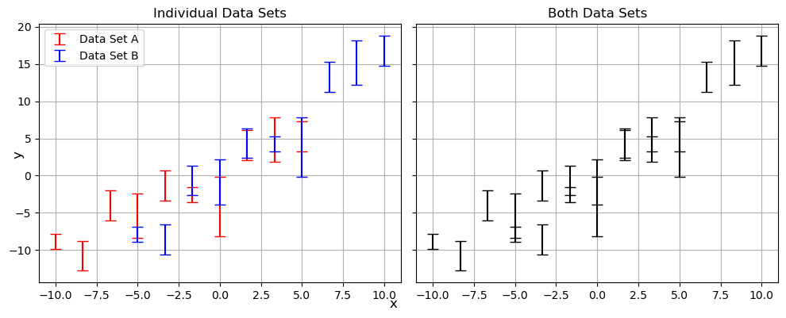
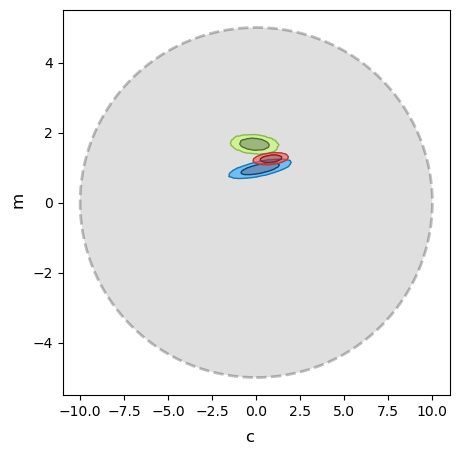
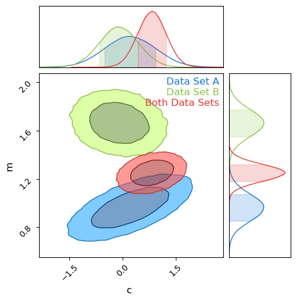
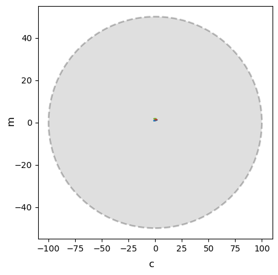

Previous Entry: [Bayesian Suspiciousness](.\..\02_suspiciousness\page.html)	&nbsp;	   
  
  
Go Back: [WebGuide](.\..\page.html)	&nbsp;	Return to [Blog Home](.\..\..\bloghome.html)  
  
---------------------------------------------------------------------------  
  
---------  
  
  
# Tension & Suspicion  
  
In astrophysics and cosmology, we often bump against the limits of our understanding in the form of statistical _tensions_,  disagreements in the our results from two different data sources. There's two ways we might care about tensions:  
1. When asking if two measurements properly agree with one another  
2. When considering if two data-sets are similar enough to pool them together as one big data set  
  
In the simplest of cases, we can can use the rough yardstick of a **sigma tension**, approximating our measurement uncertainties as gaussians and just asking <span style="font-family: verdana"><i>"how many standard deviations are result $A$ and result $B$ separated by"?</i></span>.  
  
  
 <p style="text-align: center; font-family: tahoma"><i>Are these data sets based on the same parameters</i></p>  
  
  
```python  
import numpy as np  
from chainconsumer import ChainConsumer  
import matplotlib.pyplot as plt  
  
import jax  
import jax.numpy as jnp  
import numpyro  
from matplotlib.patches import Ellipse  
```  
  
Do two datasets _actually_ measure the same source? Can we combine them? Not always.  
- Look at a simple example of a linear regression  
- A casual glance suggests these are compatible, but digging in closer we run into trouble  
  
- FROM HERE  
- Plot contours, note existence of tension  
- Not visible at first glance in 'c' contours. Typically approach of stating a '1 sigma tension' is unreliable in high dimensions  
- Need a general purpose tool for detecting tension  
- Will look at two tools and how they fail  
  
  
```python  
def gen_data(Ndata = 10, seed = 12, true_params = {'m':1,'c':0}, escatter=1, ebar = 1, Xrange= {-10,10}):  
    np.random.seed(seed)  
    m, c = true_params['m'], true_params['c']  
    X = np.linspace(Xrange[0], Xrange[1], Ndata)   
    E = (np.random.poisson(lam=escatter, size=len(X))+1) / escatter * ebar + 0.01  
    Y = m * X + c + E*np.random.normal(size=len(X)) # Linear rel /w random noise based on 'E'    
    
    return(X, Y, E)   
  
XA, YA, EA = gen_data(true_params = {'m':1,'c':0}, Xrange = [-10,5])  
XB, YB, EB = gen_data(true_params = {'m':1.7,'c':-0.5}, Xrange = [-5,10])  
XAB, YAB, EAB = np.concatenate([XA,XB]), np.concatenate([YA,YB]), np.concatenate([EA,EB])  
  
fig, ax = plt.subplots(1,2, sharex=True, sharey=True, figsize=(10,4))  
ax[0].errorbar(XA,YA,EA, fmt = 'none', c='r', capsize=5, label = "Data Set A")  
ax[0].errorbar(XB,YB,EB, fmt = 'none', c='b', capsize=5, label = "Data Set B")  
ax[1].errorbar(XAB,YAB,EAB, fmt = 'none', c='k', capsize=5, label = "Both Data Sets")  
ax[0].grid()  
ax[1].grid()  
  
ax[0].set_title("Individual Data Sets")  
ax[1].set_title("Both Data Sets")  
  
ax[0].legend()  
  
fig.tight_layout()  
fig.supxlabel('x')  
fig.supylabel('y')  
plt.show()  
```  
  
  
      
  
      
  
  
## Bayesian Evidence   
  
We define a bayesian model and do MCMC, where "goodness of fit" of parameters $\theta$ is proporional to how well the model fits the data:  
  
$$  
P(\theta \vert y) \propto P(y \vert \theta) \cdot \pi(\theta)  
$$  
  
This has a proportionality constant $Z$, which we usually handwave away as we only care about the _relative_ performance of any two points in parameter space. However, this constant has physical meaning: It's the _total_ "mass of likelihood" of the entire posterior:   
  
$$  
Z = \int \mathcal{L}(\theta \vert y)\cdot \pi(\theta) d\theta  
$$  
  
This is the **Bayesian Evidence**, and describes the overall ability of the model to explain / reproduce the data.  
  
Because the evidence is a measure of how well a model performs overall, we can compare the performance of two models by looking at the ratio of these two. E.g, for models '1' and '2':  
  
$$  
R_{12} = \frac{Z_1}{Z_2}  
$$  
  
This **Evidence Ratio** gives us a direct comparison of two models.   
  
### Failure of Evidence Ratio in Measuring Tension  
  
From a certain point of view, modelling two data sets together or separately can be considered a type of model comparison. Fitting them seperately is the same as saying "let data set A and B have different parameters". As such, we might consider using evidence ratios to measure tension by comparing these two "models" e.g.:  
  
$$  
R = \frac{Z_A Z_B}{Z_{AB}}  
$$  
  
The problem: suppose we have a vague prior with width '$a$':  
  
$$  
P(\theta \vert y) \propto \pi(\theta) \rightarrow Z \propto \frac{1}{a}  
$$  
  
This carries through to the evidence ratio:  
  
$$  
R = \frac{Z_A Z_B}{Z_{AB}} \propto \frac{a^{-1}\cdot a^{-1}}{a^{-1}} \propto a^{-1}  
$$  
  
The evidence ratio becommes "diluted" with wide priors.  
  
## Information  
  
Another measure is the information (also called the entropy or _Kullback-Lieber divergence_, plus or minus a negative sign) wich measures how well the model constrains the parameter $\theta$ as compared to a prior:  
  
$$  
    D_m = \int_\pi{P_m(\theta)\cdot \ln \left|\frac{P_m(\theta)}{\pi(\theta)} \right|}d\theta  
$$  
  
If $D_m>0$, this indicates that information has been 'gained' about $\theta$, i.e. that our data is meaningfully constraining the parameter compared to our prior. This information can be applied to cases of model selection in the case of two models that are the same but for the inclusion of some extra parameter. If the parameter is poorly constrained, i.e. the relative gain in information between the models is low, it indicates that the more complex model with the parameter included can be rejected.  
  
### The Problem With Information  
  
Information is _gained_ when our results are better constrained than the prior. A wider prior means _more_ information is gained.  
  
$$  
\exp(D) \propto a  
$$  
  
This propogates through to the _relative_ information gain:  
  
$$  
\Delta D = D_A + D_B - D_{AB}  
$$  
  
This has the opposite problem to the evidence ratio: it gets arbitrarily better as the prior becomes more vague:  
  
$$  
exp(\Delta D) \propto a  
$$  
  
  
# Suspiciousness  
  
We can combine evidence and information to get a new measurement, **suspiciousness**  
  
$$  
S = ln \vert Z \vert - D  
$$  
  
This new measurement is **invariant with prior width**  
  
$$  
\Delta S = S_A + S_B - S_{AB} \propto a^0  
$$  
  
  
```python  
default_priors = {'m': [0.0,10],  
                 'c': [0.0,20] }  
  
def model(x,y,e, priors = default_priors):  
    m_mu, m_sig = priors['m']  
    c_mu, c_sig = priors['c']  
    m = numpyro.sample('m', numpyro.distributions.Normal(m_mu,m_sig))  
    c = numpyro.sample('c', numpyro.distributions.Normal(c_mu,c_sig))  
    y_pred = m*x+c  
    with numpyro.plate('data',len(x)):  
        numpyro.sample('y', numpyro.distributions.Normal(y,e), obs=y_pred)  
```  
  
  
```python  
def get_KL(chain, poten, prior):  
    Z = get_Z(chain, poten, prior)  
    M, C = chain['m'], chain['c']  
    m_mu, m_sig = prior['m']  
    c_mu, c_sig = prior['c']  
    log_like = -poten - np.log(Z)  
    priorfunc = np.exp(-1/2 * (((M-m_mu)/m_sig)**2 + ((C-c_mu)/c_sig)**2)) / (2*np.pi) / c_sig / m_sig  
  
    out = (np.log(priorfunc) - log_like).mean()  
    return(-out)  
  
def get_Z(chain, poten, prior):  
    M, C = chain['m'], chain['c']  
      
    COV = np.cov(np.stack([M,C]))  
    sig1, sig2 = np.sqrt(np.linalg.eig(COV).eigenvalues)  
      
    out = np.exp(-poten).max() * (sig1*sig2 * 2*np.pi)  
    return(out)  
```  
  
  
```python  
sampler = numpyro.infer.MCMC(numpyro.infer.NUTS(model),  
                             num_samples = 100000,  
                             num_warmup = 500,  
                             num_chains = 1,  
                             progress_bar = False)  
  
print("Doing Set A")  
sampler.run(jax.random.PRNGKey(1), XA,YA,EA, extra_fields = ("potential_energy",))  
res_A = sampler.get_samples()  
poten_A = sampler.get_extra_fields()['potential_energy']  
D_A = get_KL(res_A, poten_A, default_priors)  
Z_A = get_Z(res_A, poten_A, default_priors)  
  
print("Doing Set B")  
sampler.run(jax.random.PRNGKey(1), XB,YB,EB, extra_fields = ("potential_energy",))  
res_B = sampler.get_samples()  
poten_B = sampler.get_extra_fields()['potential_energy']  
D_B = get_KL(res_B, poten_B, default_priors)  
Z_B = get_Z(res_B, poten_B, default_priors)  
  
print("Doing Both Sets")  
sampler.run(jax.random.PRNGKey(1), XAB,YAB,EAB, extra_fields = ("potential_energy",))  
res_AB = sampler.get_samples()  
poten_AB = sampler.get_extra_fields()['potential_energy']  
D_AB = get_KL(res_AB, poten_AB, default_priors)  
Z_AB = get_Z(res_AB, poten_AB, default_priors)  
print("Done")  
```  
  
    No GPU/TPU found, falling back to CPU. (Set TF_CPP_MIN_LOG_LEVEL=0 and rerun for more info.)  
  
  
    Doing Set A  
    Doing Set B  
    Doing Both Sets  
    Done  
  
  
  
```python  
C = ChainConsumer()  
C.add_chain(res_A, name = "Data Set A")  
C.add_chain(res_B, name = "Data Set B")  
C.add_chain(res_AB, name = "Both Data Sets")  
C.plotter.plot(figsize=(5,5))  
plt.show()  
  
  
rel_inf = D_A+D_B - D_AB  
  
Zrat = Z_A*Z_B / Z_AB  
Zrat**=-1  
  
print("Evidence Ratio: %.4e" %Zrat)  
print("Relative Information Gain: %.4f" %(rel_inf))  
  
fig, ax = plt.subplots(1,1, figsize=(5,5))  
C.plotter.plot_contour(ax, 'c', 'm')  
ellipse = Ellipse(xy=(default_priors['c'][0], default_priors['m'][0]), width=default_priors['c'][1], height=default_priors['m'][1],   
                        edgecolor='k', ls='--', fc='grey', alpha = 0.25, lw=2, label="1 sigma prior width", zorder=-10)  
ax.add_patch(ellipse)  
fig.supxlabel('c')  
fig.supylabel('m')  
plt.show()  
  
```  
  
  
      
  
      
  
  
    Evidence Ratio: 1.4196e-02  
    Relative Information Gain: 6.3187  
  
  
  
      
  
      
  
  
  
```python  
expanded_priors = {'m':[0.0,100.0],  
                      'c': [0.0,200.0]   
}  
  
print("Doing Set A")  
sampler.run(jax.random.PRNGKey(1), XA,YA,EA, extra_fields = ("potential_energy",), priors=expanded_priors)  
res_A2 = sampler.get_samples()  
poten_A2 = sampler.get_extra_fields()['potential_energy']  
D_A2 = get_KL(res_A2, poten_A2, expanded_priors)  
Z_A2 = get_Z(res_A2, poten_A2, expanded_priors)  
  
print("Doing Set B")  
sampler.run(jax.random.PRNGKey(1), XB,YB,EB, extra_fields = ("potential_energy",), priors=expanded_priors)  
res_B2 = sampler.get_samples()  
poten_B2 = sampler.get_extra_fields()['potential_energy']  
D_B2 = get_KL(res_B2, poten_B2, expanded_priors)  
Z_B2 = get_Z(res_B2, poten_B2, expanded_priors)  
  
print("Doing Both Sets")  
sampler.run(jax.random.PRNGKey(1), XAB,YAB,EAB, extra_fields = ("potential_energy",), priors=expanded_priors)  
res_AB2 = sampler.get_samples()  
poten_AB2 = sampler.get_extra_fields()['potential_energy']  
D_AB2 = get_KL(res_AB2, poten_AB2, expanded_priors)  
Z_AB2 = get_Z(res_AB2, poten_AB2, expanded_priors)  
  
print("Done")  
```  
  
    Doing Set A  
    Doing Set B  
    Doing Both Sets  
    Done  
  
  
  
```python  
C2 = ChainConsumer()  
C2.add_chain(res_A2, name = "Data Set A")  
C2.add_chain(res_B2, name = "Data Set B")  
C2.add_chain(res_AB2, name = "Both Data Sets")  
C2.plotter.plot(figsize=(5,5))  
plt.show()  
  
rel_inf2 = D_A2+D_B2 - D_AB2  
  
Zrat2 = Z_A2*Z_B2 / Z_AB2  
Zrat2**=-1  
  
print("Evidence Ratio: %.4e" %Zrat2)  
  
print("Relative Information Gain: %.4f" %(rel_inf2))  
  
fig, ax = plt.subplots(1,1, figsize=(5,5))  
C2.plotter.plot_contour(ax, 'c', 'm')  
ellipse = Ellipse(xy=(expanded_priors['c'][0], expanded_priors['m'][0]), width=expanded_priors['c'][1], height=expanded_priors['m'][1],   
                        edgecolor='k', ls='--', fc='grey', alpha = 0.25, lw=2, label="1 sigma prior width", zorder=-10)  
ax.add_patch(ellipse)  
fig.supxlabel('c')  
fig.supylabel('m')  
plt.show()  
  
```  
  
  
      
  
      
  
  
    Evidence Ratio: 1.3865e+00  
    Relative Information Gain: 10.8864  
  
  
  
      
  
      
  
  
  
```python  
print("Suspiciousness for Prior 1: %.4f" %(np.log(Zrat) - rel_inf))  
print("Suspiciousness for Prior 2: %.4f" %(np.log(Zrat2) - rel_inf2))  
```  
  
    Suspiciousness for Prior 1: -10.5735  
    Suspiciousness for Prior 2: -10.5596  
  
  
## Translating to Frequentism - Interpreting Suspiciousness with P Values  
  
- Derive with a 1D gaussian  
  
$$  
\mathcal{L}_A(x)= \frac{S_A}{\sqrt{2 \pi \sigma_A^2}} \exp{ \left( \frac{-1}{2} \left(\frac{x-\mu_A}{\sigma_A}\right)^2 \right)}, \;\;\;  
\mathcal{L}_B(x)= \frac{S_B}{\sqrt{2 \pi \sigma_B^2}} \exp{ \left( \frac{-1}{2} \left(\frac{x-\mu_B}{\sigma_B}\right)^2 \right)}  
$$  
  
  
  
The likelihood for the two combined data sets is just the product of these, another gaussian of the form:  
  
$$  
\mathcal{L}_{AB}(x)= \frac{S_{AB}}{\sqrt{2 \pi \sigma_{AB}^2}} \exp{ \left( \frac{-1}{2} \left(\frac{x-\mu_{AB}}{\sigma_{AB}}\right)^2 \right)}  
$$  
  
With the mean '$\mu_{AB}$' and standard deviation '$\sigma_{AB}$' based on the inverse-variance weighted average of the two:  
  
$$  
\mu_{AB} = \left(\frac{\mu_A}{\sigma_A^2} + \frac{\mu_B}{\sigma_B^2}\right)\cdot \sigma_{AB}^2, \;\;\;   
\sigma_{AB} = \left(\frac{1}{\sigma_A^2} + \frac{1}{\sigma_B^2}\right)^{-\frac{1}{2}}  
$$  
  
But with a scaling factor / integral:  
  
$$  
S_{AB} = S_A S_B \sqrt{2 \pi} \frac{\sigma_{AB}}{\sigma_A \sigma_B}  
$$  
  
By itself this isn't too illuminating, but can be rearranged into a more intuitive form:  
  
$$  
S_{AB} =S_A S_B \cdot \frac{1}{\sqrt{2 \pi (\sigma_A^2 + \sigma_B^2)^2}} \exp{ \frac{-1}{2} \left(\frac{(\mu_A-\mu_B)^2}{\sigma_A^2 + \sigma_B^2} \right)} = S_A S_B \cdot \mathcal{N}(T)  
$$  
  
Aside from the scaling factors we inherited $A$ and $B$, this is a direct measure of the sigma tension. The normal distribution here is the pdf that $\mu_A-\mu_B = 0$, the typical frequentist measure of whether $A$ and $B$ agree with eachother:  
  
$$  
T = \frac{\lvert \mu_A-\mu_B \rvert }{\sqrt{\sigma_A^2 + \sigma_B^2}}  
$$  
  
### Evidence Ratios  
  
-Keep things simple with a uniform prior  
  
$$  
\pi(x) =   
    \begin{cases}  
      \frac{1}{w} & \text{if } x\in \left[ -\frac{w}{2}, \frac{w}{2} \right]\\  
      0 & \text{otherwise}  
    \end{cases}         
$$  
  
- As long as this prior is wide enough, our evidence will be "posterior dominated", making evidences easy to calculate  
  
$$  
Z_A = \frac{S_A}{w}, \;\;\; Z_B = \frac{S_B}{w}, \;\;\; Z_{AB} = \frac{S_{AB}}{w}  
$$  
  
$$  
\mathcal{R} = \frac{Z_{AB}}{Z_A Z_B} = \frac{S_{AB}}{S_A S_B} \cdot w  
$$  
  
$$  
\mathcal{R} = \mathcal{N}(T) \cdot w  
$$  
  
### Information  
  
Information for data set $A$ is:  
  
\begin{eqnarray}  
I_A &=& \int_x { p_A(x) \ln{ \left( \frac{p_A(x)}{\pi(x)} \right) } } dx \\  
&=& E \left[ \ln{ (p_A(x)) } - \ln{ (\pi(x)) } \right]_{p_A}  
\end{eqnarray}  
  
Thanks to our simple example, the probabily normalized posterior for $A$ comes out to be a simple normal distribution:  
  
$$  
p_A(x) = \frac{\mathcal{L_A(x) \pi(x)}}{Z_A} = \frac{\mathcal{L_A (x)}}{S_A} = \frac{1}{\sqrt{2 \pi \sigma_A^2}} \exp{ \left( \frac{-1}{2} \left(\frac{x-\mu_A}{\sigma_A}\right)^2 \right)}  
$$  
  
As such, this expectation value mostly breaks down into constants:  
  
$$  
\ln{ (p_A(x)) }= -\frac{1}{2} \ln{ (2 \pi \sigma_A) }-\frac{1}{2} \left(\frac{x-\mu_A}{\sigma_A}\right)^2, \;\;\; \ln{ (\pi(x)) } = -\ln(w)  
$$  
  
  
\begin{eqnarray}  
I_A &=& E \left[ \ln{ (p_A(x)) } - \ln{ (\pi(x)) } \right]_{p_A}  
 &=&   
 - E \left[\frac{1}{2} \ln{ (2 \pi \sigma_A) } \right]_{p_A}  
 - E \left[\frac{1}{2} \left(\frac{x-\mu_A}{\sigma_A}\right)^2 \right]_{p_A}  
 + E \left[\ln{w} \right]_{p_A}  
\end{eqnarray}  
  
$$  
I_A = \ln(w) - \ln(\sigma_A) - \frac{1}{2} (\ln(2\pi) +1)  
$$  
  
$$  
I_B = \ln(w) - \ln(\sigma_B) - \frac{1}{2} (\ln(2\pi) +1), \;\;\;  
I_{AB} = \ln(w) + \frac{1}{2} \ln \left(\frac{1}{\sigma_A^2} + \frac{1}{\sigma_B^2}\right) - \frac{1}{2} (\ln(2\pi) +1)  
$$  
  
  
Yielding  
  
\begin{eqnarray}  
\Delta I &=& I_{AB} - I_A - I_B \\  
&=& \frac{1}{2} (\ln(2\pi) +1) + \ln \left( \frac{\sigma_A \sigma_B}{\sigma_{AB}^2} \right) + \ln \left( \frac{\sigma_{AB}}{w} \right)  
\end{eqnarray}  
  
### Suspiciousness &  P-Value  
  
$$  
\Delta S = \ln ( \mathcal{R}) + \Delta I  
$$  
  
\begin{eqnarray}  
\Delta S &=& \frac{1}{2}-\frac{1}{2} \frac{(\mu_A-\mu_B)^2}{\sigma_A^2 + \sigma_B^2} \\  
&=& \frac{1}{2}-\frac{T}{2}  
\end{eqnarray}  
  
- Suspciciousness recovers the sigma tension independent of the prior!  
- Natural step to interpret this as a gaussian test statistic  
  
$$  
T =\sqrt{1-2 \Delta S}  
$$  
  
And then define a P value in the typical frequentist way:  
  
$$  
P = p(t > T) = \int_T^\infty \mathcal{N}(t) dt  
$$  
  
<table>  
    <tr>  
        <th> P-Value </th> <th>$\sigma$-Tension</th> <th>Suspiciousness</th>  
    </tr>  
    <tr>  
        <th> 0.05 </th> <td>-1.645</td> <td>-0.853</td>  
    </tr>  
    <tr>  
        <th> 0.01 </th> <td>-2.326</td> <td>-2.206</td>  
    </tr>  
    <tr>  
        <th> 0.01 </th> <td>-3.090</td> <td>-4.275</td>  
    </tr>  
</table>  
  
  
### Extending To Non-Guassian & Multiple Dimensions  
  
  
---------  
  
This page by Hugh McDougall, 2023  
  
  
  
For more detailed information, feel free to check my [GitHub repos](https://github.com/HughMcDougall/) or [contact me directly](hughmcdougallemail@gmail.com).  
  
