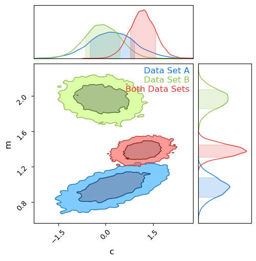

Previous Entry: [Bayesian Suspiciousness](.\..\02_suspiciousness\page.html)	&nbsp;	   
  
  
Go Back: [WebGuide](.\..\page.html)	&nbsp;	Return to [Blog Home](.\..\..\bloghome.html)  
  
---------------------------------------------------------------------------  
  
---------  
  
  
# Tension & Suspicion  
  
  
```python  
import numpy as np  
from chainconsumer import ChainConsumer  
import matplotlib.pyplot as plt  
  
import jax  
import jax.numpy as jnp  
import numpyro  
```  
  
# Tension  
  
  
  
```python  
{  
    "tags": [  
        "hide-input",  
    ]  
}  
  
def gen_data(Ndata = 10, seed = 12, true_params = {'m':1,'c':0}, escatter=1, ebar = 1, Xrange= {-10,10}):  
    np.random.seed(seed)  
    m, c = true_params['m'], true_params['c']  
    X = np.linspace(Xrange[0], Xrange[1], Ndata)   
    E = (np.random.poisson(lam=escatter, size=len(X))+1) / escatter * ebar + 0.01  
    Y = m * X + c + E*np.random.normal(size=len(X)) # Linear rel /w random noise based on 'E'    
    
    return(X, Y, E)   
  
XA, YA, EA = gen_data(true_params = {'m':1,'c':0}, Xrange = [-10,5])  
XB, YB, EB = gen_data(true_params = {'m':2.0,'c':-0.5}, Xrange = [-5,10])  
XAB, YAB, EAB = np.concatenate([XA,XB]), np.concatenate([YA,YB]), np.concatenate([EA,EB])  
  
fig, ax = plt.subplots(1,2, sharex=True, sharey=True, figsize=(10,4))  
ax[0].errorbar(XA,YA,EA, fmt = 'none', c='r', capsize=5)  
ax[0].errorbar(XB,YB,EB, fmt = 'none', c='b', capsize=5)  
ax[1].errorbar(XAB,YAB,EAB, fmt = 'none', c='k', capsize=5)  
ax[0].grid()  
ax[1].grid()  
  
fig.tight_layout()  
fig.supxlabel('x')  
fig.supylabel('y')  
plt.show()  
```  
  
  
      
  
      
  
  
  
```python  
default_priors = {'m': [0.0,10],  
                 'c': [0.0,20] }  
  
def model(x,y,e, priors = default_priors):  
    m_mu, m_sig = priors['m']  
    c_mu, c_sig = priors['c']  
    m = numpyro.sample('m', numpyro.distributions.Normal(m_mu,m_sig))  
    c = numpyro.sample('c', numpyro.distributions.Normal(c_mu,c_sig))  
    y_pred = m*x+c  
    with numpyro.plate('data',len(x)):  
        numpyro.sample('y', numpyro.distributions.Normal(y,e), obs=y_pred)  
  
numpyro.render_model(model, model_args=[jnp.array([1])]*3)  
```  
  
  
  
  
      
  
      
  
  
  
  
```python  
sampler = numpyro.infer.MCMC(numpyro.infer.NUTS(model),  
                             num_samples = 10000,  
                             num_warmup = 500,  
                             num_chains = 1,  
                             progress_bar = False)  
  
print("Doing Set A")  
sampler.run(jax.random.PRNGKey(1), XA,YA,EA, extra_fields = ("potential_energy",))  
res_A = sampler.get_samples()  
poten_A = sampler.get_extra_fields()['potential_energy']  
  
print("Doing Set B")  
sampler.run(jax.random.PRNGKey(1), XB,YB,EB, extra_fields = ("potential_energy",))  
res_B = sampler.get_samples()  
poten_B = sampler.get_extra_fields()['potential_energy']  
  
print("Doing Both Sets")  
sampler.run(jax.random.PRNGKey(1), XAB,YAB,EAB, extra_fields = ("potential_energy",))  
res_AB = sampler.get_samples()  
poten_AB = sampler.get_extra_fields()['potential_energy']  
  
print("Done")  
```  
  
    Doing Set A  
    Doing Set B  
    Doing Both Sets  
    Done  
  
  
  
```python  
C = ChainConsumer()  
C.add_chain(res_A, name = "Data Set A")  
C.add_chain(res_B, name = "Data Set B")  
C.add_chain(res_AB, name = "Both Data Sets")  
C.plotter.plot(figsize=(5,5))  
plt.show()  
  
Zrat = np.exp(-poten_A).mean() * np.exp(-poten_B).mean() / np.exp(-poten_AB).mean()  
print("Evidence Ratio: %.4e" %Zrat)  
```  
  
  
      
  
      
  
  
    Evidence Ratio: 4.8605e+06  
  
  
  
```python  
constrained_priors = {'m':[0.0,1000.0],  
                      'c': [0.0,10000]   
}  
  
print("Doing Set A")  
sampler.run(jax.random.PRNGKey(1), XA,YA,EA, extra_fields = ("potential_energy",), priors=constrained_priors)  
res_A2 = sampler_two.get_samples()  
poten_A2 = sampler_two.get_extra_fields()['potential_energy']  
  
print("Doing Set B")  
sampler.run(jax.random.PRNGKey(1), XB,YB,EB, extra_fields = ("potential_energy",), priors=constrained_priors)  
res_B2 = sampler_two.get_samples()  
poten_B2 = sampler_two.get_extra_fields()['potential_energy']  
  
print("Doing Both Sets")  
sampler.run(jax.random.PRNGKey(1), XAB,YAB,EAB, extra_fields = ("potential_energy",), priors=constrained_priors)  
res_AB2 = sampler_two.get_samples()  
poten_AB2 = sampler_two.get_extra_fields()['potential_energy']  
  
print("Done")  
```  
  
    Doing Set A  
    Doing Set B  
    Doing Both Sets  
    Done  
  
  
  
```python  
C = ChainConsumer()  
C.add_chain(res_A2, name = "Data Set A")  
C.add_chain(res_B2, name = "Data Set B")  
C.add_chain(res_AB2, name = "Both Data Sets")  
C.plotter.plot(figsize=(5,5))  
plt.show()  
  
Zrat2 = np.exp(-poten_A2).mean() * np.exp(-poten_B2).mean() / np.exp(-poten_AB2).mean()  
print("Evidence Ratio: %.4e" %Zrat2)  
  
```  
  
  
      
  
      
  
  
    Evidence Ratio: 9.7857e+01  
  
  
  
```python  
def get_KL(chain, prior):  
    M, C = chain['m'], chain['c']  
    priorfunc = (-1/2 * (M-m_mu)/m_sig)  
```  
  
  
---------  
  
This page by Hugh McDougall, 2023  
  
  
  
For more detailed information, feel free to check my [GitHub repos](https://github.com/HughMcDougall/) or [contact me directly](hughmcdougallemail@gmail.com).  
  
