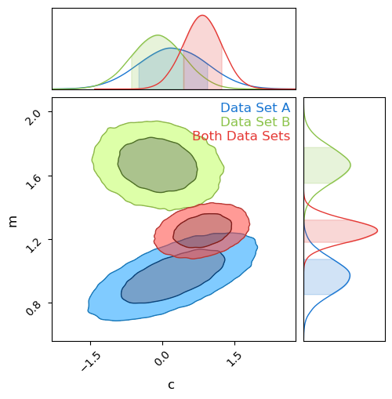

Previous Entry: [Bayesian Suspiciousness](.\..\02_suspiciousness\page.html)	&nbsp;	   
  
  
Go Back: [WebGuide](.\..\page.html)	&nbsp;	Return to [Blog Home](.\..\..\bloghome.html)  
  
---------------------------------------------------------------------------  
  
---------  
  
  
# Tension & Suspicion  
  
# Tension  
Do two datasets _actually_ measure the same source? Can we combine them? Not always.  
  
## Bayesian Evidence   
  
We define a bayesian model and do MCMC, where "goodness of fit" of parameters $\theta$ is proporional to how well the model fits the data:  
  
$$  
P(\theta \vert y) \propto P(y \vert \theta) \cdot \pi(\theta)  
$$  
  
This has a proportionality constant $Z$, which we usually handwave away as we only care about the _relative_ performance of any two points in parameter space. However, this constant has physical meaning: It's the _total_ "mass of likelihood" of the entire posterior:   
  
$$  
Z = \int \mathcal{L}(\theta \vert y)\cdot \pi(\theta) d\theta  
$$  
  
This is the **Bayesian Evidence**, and describes the overall ability of the model to explain / reproduce the data.  
  
### Evidence Ratio  
  
Because the evidence is a measure of how well a model performs overall, we can compare the performance of two models by looking at the ratio of these two. E.g, for models '1' and '2':  
  
$$  
R_{12} = \frac{Z_1}{Z_2}  
$$  
  
## Failure of Evidence Ratio in Measuring Tension  
  
We might consider using evidence ratios to measure tension, e.g.  
  
$$  
R = \frac{Z_A Z_B}{Z_{AB}}  
$$  
  
The problem: suppose we have a vague prior with width '$a$':  
  
$$  
P(\theta \vert y) \propto \pi(\theta) \rightarrow Z \propto \frac{1}{a}  
$$  
  
This carries through to the evidence ratio:  
  
$$  
R = \frac{Z_A Z_B}{Z_{AB}} \propto \frac{a^{-1}\cdot a^{-1}}{a^{-1}} \propto a^{-1}  
$$  
  
The evidence ratio becommes "diluted" with wide priors.  
  
# Information  
  
Another measure is the information (also called the entropy or _Kullback-Lieber divergence_, plus or minus a negative sign) wich measures how well the model constrains the parameter $\theta$ as compared to a prior:  
  
$$  
    D_m = \int_\pi{P_m(\theta)\cdot \ln \left|\frac{P_m(\theta)}{\pi(\theta)} \right|}d\theta  
$$  
  
If $D_m>0$, this indicates that information has been 'gained' about $\theta$, i.e. that our data is meaningfully constraining the parameter compared to our prior. This information can be applied to cases of model selection in the case of two models that are the same but for the inclusion of some extra parameter. If the parameter is poorly constrained, i.e. the relative gain in information between the models is low, it indicates that the more complex model with the parameter included can be rejected.  
  
## The Problem With Information  
  
Information is _gained_ when our results are better constrained than the prior. A wider prior means _more_ information is gained.  
  
$$  
\exp(D) \propto a  
$$  
  
This propogates through to the _relative_ information gain:  
  
$$  
\Delta D = D_A + D_B - D_{AB}  
$$  
  
This has the opposite problem to the evidence ratio: it gets arbitrarily better as the prior becomes more vague:  
  
$$  
exp(\Delta D) \propto a  
$$  
  
# Suspiciousness  
  
We can combine evidence and information to get a new measurement, **suspiciousness**  
  
$$  
S = ln \vert Z \vert - D  
$$  
  
This new measurement is **invariant with prior width**  
  
$$  
\Delta S = S_A + S_B - S_{AB} \propto a^0  
$$  
  
      
  
      
  
  
  
  
  
      
  
      
  
Do a full fit on this calculating evidence and information with a vague prior, i.e. $c\in \pm 10$ and $m\in \pm 20$:  
  
      
  
      
  
  
    Evidence Ratio: 2.0564e-07  
    Relative Information Gain: 3.9688  
  
  
Now repeat this using a _much_ more vague prior (a hundred times more in this example):  
      
  
      
  
  
    Evidence Ratio: 1.0214e-02  
    Relative Information Gain: 6.8395  
  
  
The evidence ratio has gotten weaker and the relative information has gotten bigger. Just by changing our prior from 'vague' to 'very vague', our measures have moved. This isn't good: we want to be measuring something about our data sets, _not_ the arbitrary choice of our priors.  
  
**Use Suscpiciousness Instead**  
  
Take those same two runs and _combine_ the evidence ratio and the information and we get a measure that remains almost entirely invariant!  
  
  
    Suspiciousness for Prior 1: -11.4283  
    Suspiciousness for Prior 2: -11.4235  
  
  
  
---------  
  
This page by Hugh McDougall, 2023  
  
  
  
For more detailed information, feel free to check my [GitHub repos](https://github.com/HughMcDougall/) or [contact me directly](hughmcdougallemail@gmail.com).  
  
