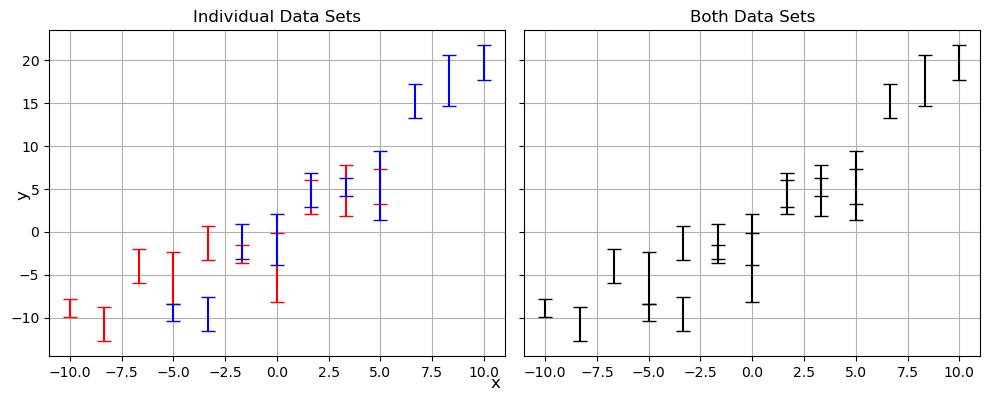
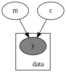
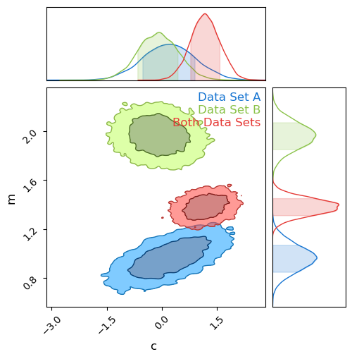
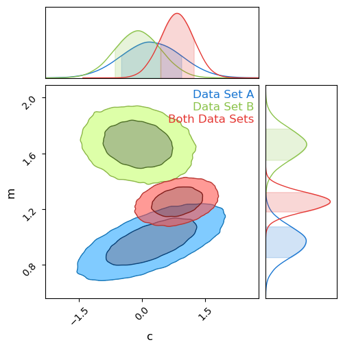

# Tension & Suspicion


```python
import numpy as np
from chainconsumer import ChainConsumer
import matplotlib.pyplot as plt

import jax
import jax.numpy as jnp
import numpyro
```

# Tension
Do two datasets _actually_ measure the same source? Can we combine them? Not always.

## Bayesian Evidence 

We define a bayesian model and do MCMC, where "goodness of fit" of parameters $\theta$ is proporional to how well the model fits the data:

$$
P(\theta \vert y) \propto P(y \vert \theta) \cdot \pi(\theta)
$$

This has a proportionality constant $Z$, which we usually handwave away as we only care about the _relative_ performance of any two points in parameter space. However, this constant has physical meaning: It's the _total_ "mass of likelihood" of the entire posterior: 

$$
Z = \int \mathcal{L}(\theta \vert y)\cdot \pi(\theta) d\theta
$$

This is the **Bayesian Evidence**, and describes the overall ability of the model to explain / reproduce the data.

### Evidence Ratio

Because the evidence is a measure of how well a model performs overall, we can compare the performance of two models by looking at the ratio of these two. E.g, for models '1' and '2':

$$
R_{12} = \frac{Z_1}{Z_2}
$$

## Failure of Evidence Ratio in Measuring Tension

We might consider using evidence ratios to measure tension, e.g.

$$
R = \frac{Z_A Z_B}{Z_{AB}}
$$

The problem: suppose we have a vague prior with width '$a$':

$$
P(\theta \vert y) \propto \pi(\theta) \rightarrow Z \propto \frac{1}{a}
$$

This carries through to the evidence ratio:

$$
R = \frac{Z_A Z_B}{Z_{AB}} \propto \frac{a^{-1}\cdot a^{-1}}{a^{-1}} \propto a^{-1}
$$

The evidence ratio becommes "diluted" with wide priors.

# Information

Another measure is the information (also called the entropy or _Kullback-Lieber divergence_, plus or minus a negative sign) wich measures how well the model constrains the parameter $\theta$ as compared to a prior:

$$
    D_m = \int_\pi{P_m(\theta)\cdot \ln \left|\frac{P_m(\theta)}{\pi(\theta)} \right|}d\theta
$$

If $D_m>0$, this indicates that information has been 'gained' about $\theta$, i.e. that our data is meaningfully constraining the parameter compared to our prior. This information can be applied to cases of model selection in the case of two models that are the same but for the inclusion of some extra parameter. If the parameter is poorly constrained, i.e. the relative gain in information between the models is low, it indicates that the more complex model with the parameter included can be rejected.

## The Problem With Information

Information is _gained_ when our results are better constrained than the prior. A wider prior means _more_ information is gained.

$$
\exp(D) \propto a
$$

This propogates through to the _relative_ information gain:

$$
\Delta D = D_A + D_B - D_{AB}
$$

This has the opposite problem to the evidence ratio: it gets arbitrarily better as the prior becomes more vague:

$$
exp(\Delta D) \propto a
$$

# Suspiciousness

We can combine evidence and information to get a new measurement, **suspiciousness**

$$
S = ln \vert Z \vert - D
$$

This new measurement is **invariant with prior width**

$$
\Delta S = S_A + S_B - S_{AB} \propto a^0
$$


```python
def gen_data(Ndata = 10, seed = 12, true_params = {'m':1,'c':0}, escatter=1, ebar = 1, Xrange= {-10,10}):
    np.random.seed(seed)
    m, c = true_params['m'], true_params['c']
    X = np.linspace(Xrange[0], Xrange[1], Ndata) 
    E = (np.random.poisson(lam=escatter, size=len(X))+1) / escatter * ebar + 0.01
    Y = m * X + c + E*np.random.normal(size=len(X)) # Linear rel /w random noise based on 'E'  
  
    return(X, Y, E) 

XA, YA, EA = gen_data(true_params = {'m':1,'c':0}, Xrange = [-10,5])
XB, YB, EB = gen_data(true_params = {'m':2.0,'c':-0.5}, Xrange = [-5,10])
XAB, YAB, EAB = np.concatenate([XA,XB]), np.concatenate([YA,YB]), np.concatenate([EA,EB])

fig, ax = plt.subplots(1,2, sharex=True, sharey=True, figsize=(10,4))
ax[0].errorbar(XA,YA,EA, fmt = 'none', c='r', capsize=5)
ax[0].errorbar(XB,YB,EB, fmt = 'none', c='b', capsize=5)
ax[1].errorbar(XAB,YAB,EAB, fmt = 'none', c='k', capsize=5)
ax[0].grid()
ax[1].grid()

ax[0].set_title("Individual Data Sets")
ax[1].set_title("Both Data Sets")

fig.tight_layout()
fig.supxlabel('x')
fig.supylabel('y')
plt.show()
```


    

    


```python
default_priors = {'m': [0.0,10],
                 'c': [0.0,20] }

def model(x,y,e, priors = default_priors):
    m_mu, m_sig = priors['m']
    c_mu, c_sig = priors['c']
    m = numpyro.sample('m', numpyro.distributions.Normal(m_mu,m_sig))
    c = numpyro.sample('c', numpyro.distributions.Normal(c_mu,c_sig))
    y_pred = m*x+c
    with numpyro.plate('data',len(x)):
        numpyro.sample('y', numpyro.distributions.Normal(y,e), obs=y_pred)

numpyro.render_model(model, model_args=[jnp.array([1])]*3)
```

    No GPU/TPU found, falling back to CPU. (Set TF_CPP_MIN_LOG_LEVEL=0 and rerun for more info.)


    

    


```python
def get_KL(chain, poten, prior):
    M, C = chain['m'], chain['c']
    m_mu, m_sig = prior['m']
    c_mu, c_sig = prior['c']
    priorfunc = np.exp(-1/2 * (((M-m_mu)/m_sig)**2 + ((M-c_mu)/c_sig)**2)) / (2*np.pi) / c_sig / m_sig

    out = (np.log(priorfunc) - poten).mean()
    return(-out/ 2)
```


```python
sampler = numpyro.infer.MCMC(numpyro.infer.NUTS(model),
                             num_samples = 10000,
                             num_warmup = 500,
                             num_chains = 1,
                             progress_bar = False)

print("Doing Set A")
sampler.run(jax.random.PRNGKey(1), XA,YA,EA, extra_fields = ("potential_energy",))
res_A = sampler.get_samples()
poten_A = sampler.get_extra_fields()['potential_energy']
D_A = get_KL(res_A, poten_A, default_priors)

print("Doing Set B")
sampler.run(jax.random.PRNGKey(1), XB,YB,EB, extra_fields = ("potential_energy",))
res_B = sampler.get_samples()
poten_B = sampler.get_extra_fields()['potential_energy']
D_B = get_KL(res_B, poten_B, default_priors)

print("Doing Both Sets")
sampler.run(jax.random.PRNGKey(1), XAB,YAB,EAB, extra_fields = ("potential_energy",))
res_AB = sampler.get_samples()
poten_AB = sampler.get_extra_fields()['potential_energy']
D_AB = get_KL(res_AB, poten_AB, default_priors)

print("Done")
```

    Doing Set A
    Doing Set B
    Doing Both Sets
    Done


```python
C = ChainConsumer()
C.add_chain(res_A, name = "Data Set A")
C.add_chain(res_B, name = "Data Set B")
C.add_chain(res_AB, name = "Both Data Sets")
C.plotter.plot(figsize=(5,5))
plt.show()


rel_inf = D_A+D_B - D_AB
rel_inf *=-1 

Zrat = np.exp(-poten_A).mean() * np.exp(-poten_B).mean() / np.exp(-poten_AB).mean()
Zrat**=-1

print("Evidence Ratio: %.4e" %Zrat)
print("Relative Information Gain: %.4f" %(rel_inf))
```


    

    


    Evidence Ratio: 2.0574e-07
    Relative Information Gain: 3.9661


```python
expanded_priors = {'m':[0.0,1000.0],
                      'c': [0.0,10000] 
}

print("Doing Set A")
sampler.run(jax.random.PRNGKey(1), XA,YA,EA, extra_fields = ("potential_energy",), priors=expanded_priors)
res_A2 = sampler.get_samples()
poten_A2 = sampler.get_extra_fields()['potential_energy']
D_A2 = get_KL(res_A2, poten_A2, expanded_priors)

print("Doing Set B")
sampler.run(jax.random.PRNGKey(1), XB,YB,EB, extra_fields = ("potential_energy",), priors=expanded_priors)
res_B2 = sampler.get_samples()
poten_B2 = sampler.get_extra_fields()['potential_energy']
D_B2 = get_KL(res_B2, poten_B2, expanded_priors)

print("Doing Both Sets")
sampler.run(jax.random.PRNGKey(1), XAB,YAB,EAB, extra_fields = ("potential_energy",), priors=expanded_priors)
res_AB2 = sampler.get_samples()
poten_AB2 = sampler.get_extra_fields()['potential_energy']
D_AB2 = get_KL(res_AB2, poten_AB2, expanded_priors)

print("Done")
```

    Doing Set A
    Doing Set B
    Doing Both Sets
    Done


```python
C = ChainConsumer()
C.add_chain(res_A2, name = "Data Set A")
C.add_chain(res_B2, name = "Data Set B")
C.add_chain(res_AB2, name = "Both Data Sets")
C.plotter.plot(figsize=(5,5))
plt.show()

rel_inf2 = D_A2+D_B2 - D_AB2
rel_inf *=-1 

Zrat2 = np.exp(-poten_A2).mean() * np.exp(-poten_B2).mean() / np.exp(-poten_AB2).mean()
Zrat2**=-1

print("Evidence Ratio: %.4e" %Zrat2)

print("Relative Information Gain: %.4f" %(rel_inf2))

```


    

    


    Evidence Ratio: 1.0219e-02
    Relative Information Gain: 6.8418


```python
print("Suspiciousness for Prior 1: %.4f" %(np.log(Zrat) - rel_inf))
print("Suspiciousness for Prior 2: %.4f" %(np.log(Zrat2) - rel_inf2))
```

    Suspiciousness for Prior 1: -11.4305
    Suspiciousness for Prior 2: -11.4253

