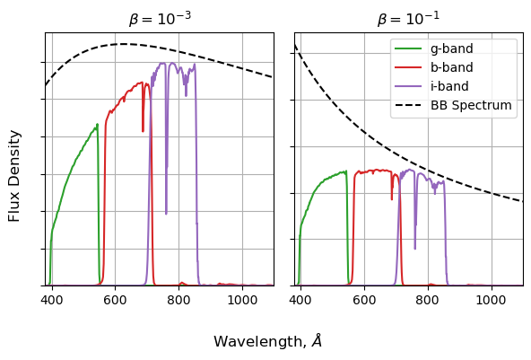

Previous Entry: [Is the Raffle Rigged?](.\..\03_raffle\page.html)	&nbsp;	   
  
  
Go Back: [Statistics Articles](.\..\page.html)	&nbsp;	Return to [Blog Home](.\..\..\bloghome.html)  
  
---------------------------------------------------------------------------  
  
---------  
  
  
# A Brief Introduction to NumPyro  
## Presentation for Astro Group 26/2/24  
  
`pip install chainconsumer==0.34.0`  
  
**Contents**  
* [JAX Stuff](#JAX)  
* [NumPyro Stuff](#JAX)  
  
  
```python  
import numpy as np  
import matplotlib.pyplot as plt  
  
import numpyro  
import jax.numpy as jnp    
from jax.random import PRNGKey  
import jax  
from numpyro import distributions as dist  
  
from chainconsumer import ChainConsumer  
```  
  
## The JAX Part <a id='JAX'></a>  
JAX is a [Just-In-Time Compiled](https://en.wikipedia.org/wiki/Just-in-time_compilation) (JIT) language that you can interface with using python. In short: it lets you write python code, but bake into a compiled function at runtime to get a massive speedup. It also has [automatic differentiation](https://en.wikipedia.org/wiki/Automatic_differentiation) (Autodiff) which means it can calculate _analytical_ gradients for any function you write in it.  
  
  
  
  
      
  
      
  
  
  
  
  
      
  
      
  
  
$$  
\log_{10} \left( \frac{f_g}{f_r} \right) = \frac{ \int(\lambda f_g(\lambda) \cdot BB(\lambda,T)) d\lambda}{\int(\lambda f_r(\lambda) \cdot BB(\lambda,T)) d\lambda}  
$$  
  
For each temperature, need to:  
1. Calculate a BB spectrum /w 𝐵𝐵(𝜆,𝑇)∝𝜆^(−1) (exp(1/𝛽𝜆)−1)^(−1)  
2. Multiply by green filter  
3. Integrate  
4. Repeat for red filter  
5. Take ratio  
6. Take log  
  
  
  
```python  
N_temps = 100  
betas = np.logspace(-2,0,N_temps)  
```  
  
**Doing it with python: The bad way**  
  
  
```python  
%%time  
if False:  
    out_normal = np.zeros(N_temps)  
    for i in range(N_temps):  
        beta = betas[i]  
        bb_spec = 1/LAM**2 * (np.exp(1/LAM/beta)-1)**-1  
        g_flux = 0  
        r_flux = 0  
        for j in range(len(LAM)):  
            g_flux+=g_fil[:,1][j] * bb_spec[j]  
            r_flux+=r_fil[:,1][j] * bb_spec[j]  
        out_normal[i] = np.log10(g_flux / r_flux)  
```  
  
    CPU times: user 1 µs, sys: 1 µs, total: 2 µs  
    Wall time: 4.05 µs  
  
  
**Doing it with numpy: the better way**  
  
  
```python  
%%time  
  
out_numpy = np.zeros(N_temps)  
for i in range(N_temps):  
    beta = betas[i]  
    bb_spec = 1/LAM**2 * (np.exp(1/LAM/beta)-1)**-1  
    g_flux = (g_fil[:,1] * bb_spec).sum()  
    r_flux = (r_fil[:,1] * bb_spec).sum()  
    out_numpy[i] = np.log10(g_flux / r_flux)  
```  
  
    CPU times: user 2.88 ms, sys: 0 ns, total: 2.88 ms  
    Wall time: 2.83 ms  
  
  
**Doing it with JAX, the fastest way**  
  
  
```python  
# Convert some arrays to JAX-friendly versions  
betas_forjax = jnp.array(betas)  
LAM_forjax = jnp.array(LAM)  
g_fil_forjax = jnp.array(g_fil[:,1])  
r_fil_forjax = jnp.array(r_fil[:,1])  
  
#--------------------------  
  
# Make a function that does all our working with jax.numpy (jnp) instead of numpy (np)  
def jax_function(beta):  
    bb_spec = 1/LAM_forjax**2 * (jnp.exp(1/LAM_forjax/beta)-1)**-1  
    g_flux = jnp.sum(g_fil_forjax * bb_spec)  
    r_flux = jnp.sum(r_fil_forjax * bb_spec)  
    out = jnp.log10(g_flux/r_flux)  
      
    return(out)  
  
# Make a "vector mapped" function with jax.vmap  
jax_vectorized_function = jax.vmap(jax_function)  
  
# Run and time twice to see with and without compile time  
%time out_jax = jax_vectorized_function(betas_forjax)  
%time out_jax = jax_vectorized_function(betas_forjax)  
```  
  
  
  
    CPU times: user 665 ms, sys: 0 ns, total: 665 ms  
    Wall time: 717 ms  
    CPU times: user 7.93 ms, sys: 0 ns, total: 7.93 ms  
    Wall time: 8.46 ms  
  
  
**Autodiff**  
  
  
```python  
# Do auto-differentiation  
do_grad = jax.grad(jax_function)  
  
# Do auto-vectorization  
do_grad = jax.vmap(do_grad)  
  
# Run the gradient function  
grads = do_grad(betas_forjax)  
  
```  
  
  
  
  
      
  
      
  
  
## The NumPyro Part <a id='NumPyro'></a>  
  
Note: Much of the following has been lifted directly from the [NumPyro introduction](https://hughmcdougall.github.io/blog/02_numpyro/01_gettingstarted/page.html) on my [blog](https://hughmcdougall.github.io/blog/02_numpyro/blog_numpyrohome.html)  
  
### Linear Regression  
  
Now the fun part: we’ll use NumPy to hack together some data akin to the real world measurements you would apply NumPyro to. We’ll both generate and fit according to a simple linear model:  
$$  
    y(x)=m \cdot x + c  
$$  
  
In this example, we enjoy the luxury of already knowing the true underlying model and the true values its parameters (in this case, $m=2$  
and $c=3.5$). We also choose a density and uncertainty of measurements to give a clear picture of the underlying model. The real world is rarely so friendly, and we have to bear in mind that any model is only an approximation of the messiness of reality. For an example on how to perform this, check the article on Model Comparison & Tension.  
  
In the cell below, `ebar` and `scatter` determine the average and spread of the size of errorbars in our data-points using a [Poisson Distribution](https://en.wikipedia.org/wiki/Poisson_distribution). This sort of distribution is common in astronomy, as it’s associated with count-based events like measuring flux from counting of photons.  
  
  
  
  
      
  
      
  
  
**Bayesian Analysis**  
  
  
  
  
      
  
      
  
  
**GET FROM BLOG**  
  
  
```python  
def model(X,Y,E):    
    m = numpyro.sample("m", numpyro.distributions.Uniform(-5,5))   # prior on m    
    c = numpyro.sample("c", numpyro.distributions.Uniform(-10,10)) # Prior on c    
  
    # For every data point...  
    with numpyro.plate('data', len(X)):    
        y_model = m*X + c  # Get the model value  
        numpyro.sample('y', numpyro.distributions.Normal(y_model,E), obs = Y) # Compare to observation  
```  
  
**GET FROM BLOG**  
  
  
```python  
%%time  
sampler = numpyro.infer.MCMC(numpyro.infer.NUTS(model),     
                             num_chains  = 1,     
                             num_samples = 10_000,  
                             num_warmup  = 5_00)    
sampler.run(jax.random.PRNGKey(1), X,Y,E)    
```  
  
    sample: 100%|█| 10500/10500 [00:03<00:00, 3067.93it/s, 3 steps of size 2.95e  
  
  
    CPU times: user 4.6 s, sys: 378 ms, total: 4.98 s  
    Wall time: 5.33 s  
  
  
**GET FROM BLOG**  
  
  
```python  
results = sampler.get_samples()  
C = ChainConsumer()    
C.add_chain(results, name = "MCMC Results")    
C.plotter.plot(    
    truth = {'m':m_true, 'c':c_true})    
plt.show()    
```  
  
  
      
  
      
  
  
**GET FROM BLOG**  
  
  
```python  
numpyro.render_model(model, model_args=(X,Y,E))  
```  
  
  
  
  
      
  
      
  
  
  
**Reparameterization**  
  
  
  
```python  
#REDACT  
# Plotting    
fig, (a1,a2) = plt.subplots(2, 1, figsize=(4,6), sharex=True, sharey=True)  
ms = np.linspace(0,20,10)  
angles = np.linspace(0,np.arctan(ms.max()),len(ms))  
  
for a in (a1,a2):  
              
    a.errorbar(X,Y,E,fmt='none', capsize=3, label='Measurements',c='tab:red',lw=2)  
  
    a.set_ylim(0,30)  
    a.grid()  
  
for m,angle in zip(ms,angles):  
    alpha = 0.75  
    a1.axline( [0,c_true], slope=m, c='blue', ls='-', alpha=alpha,lw=alpha)  
    a2.axline( [0,c_true], slope=np.tan(angle), c='blue', ls='-', alpha=alpha,lw=alpha)  
  
a1.set_title("Uniformly distributed gradients")  
a2.set_title("Uniformly distributed angles")  
  
a1.set_ylim(0,30)  
fig.supxlabel("X"), fig.supylabel("Y")    
fig.tight_layout()  
plt.show()   
```  
  
  
      
  
      
  
  
  
```python  
def model_reparam(X,Y,E):  
    angle = numpyro.sample('angle', numpyro.distributions.Uniform(-jnp.pi/2,jnp.pi/2))  
    b_perp = numpyro.sample('b_perp', numpyro.distributions.Uniform(-5,5))  
      
    m = numpyro.deterministic("m", jnp.tan(angle))    
    c = numpyro.deterministic("c", b_perp / jnp.cos(angle))   
    
    with numpyro.plate('data', len(X)):    
        y_model = m*X + c    
        numpyro.sample('y', numpyro.distributions.Normal(y_model,E), obs = Y)        
  
#-------------  
  
numpyro.render_model(model_reparam, model_args=(X,Y,E))  
  
```  
  
  
  
  
      
  
      
  
  
  
  
```python  
sampler = numpyro.infer.MCMC(numpyro.infer.NUTS(model_reparam), num_chains = 1, num_samples = 10_000, num_warmup = 500)  
sampler.run(PRNGKey(1), X, Y, E)  
res = sampler.get_samples()  
C = ChainConsumer()  
C.add_chain(res)  
C.plotter.plot(parameters=['m','c'], truth = {'m':m_true, 'c':c_true})  
plt.show()  
```  
  
    sample: 100%|█| 10500/10500 [00:02<00:00, 3679.65it/s, 7 steps of size 2.47e  
  
  
  
      
  
      
  
  
**X-Errors**    
This all might seem like a bit of overkill so far: after all, linear regression is a problem with an analytical solution. It doesn't take much extra complication to make bayesian tools NumPyro necessary: even adding error bars on our $x$ values turns this into a problem with no pen-and-paper answer. Though there are some rough approximations that people use to do this _without_ bayesian modelling (e.g. doing a linear regression with errors in $y$, then again with errors in $x$ and averaging), bayesian tools are the _only_ way to properly handle even this simple case.  
  
  
  
  
      
  
      
  
  
Fortunately, adding this to our numpyro model is as simple as one extra line. $x$ is now a random / uncertain variable that we observe, so we describe it with a `numpyro.sample` with `obs=X` where `X` is our vector of observed $x$ values:  
  
  
```python  
def model_XYerr(X,Y,E_X,E_Y):  
    angle = numpyro.sample('angle', numpyro.distributions.Uniform(-jnp.pi/2,jnp.pi/2))  
    b_perp = numpyro.sample('b_perp', numpyro.distributions.Uniform(-5,5))  
      
    m = numpyro.deterministic("m", jnp.tan(angle))    
    c = numpyro.deterministic("c", b_perp / jnp.cos(angle))   
    
    with numpyro.plate('data', len(X)):  
        x_model = numpyro.sample('x', numpyro.distributions.Normal(X,E_X))  
        y_model = m*x_model + c    
        numpyro.sample('y', numpyro.distributions.Normal(y_model,E_Y), obs = Y)  
  
numpyro.render_model(model_XYerr, model_args = (X,Y,E/2, E))  
```  
  
  
  
  
      
  
      
  
  
  
### R-L Hierarchical Example  
  
  
```python  
gain = 5E5  
mag0 = 2  
E_parallax = 0.025  
logtemp0 = 4  
min_dist, max_dist = 1, 1000  
```  
  
  
  
  
  
  
    ---------------------------------------------------------------------------  
  
    NameError                                 Traceback (most recent call last)  
  
    Cell In[20], line 3  
          1 # REDACT  
          2 np.random.seed(0)  
    ----> 3 J = np.random.choice(np.unique(cluster_index), 6, replace=False)  
          5 plt.figure(figsize=(8,4))  
          7 flag1, flag2 = True, True  
  
  
    NameError: name 'cluster_index' is not defined  
  
  
  
  
  
      
  
      
  
  
  
  
  
      
  
      
  
  
**PLACEHOLDER TEXT**  
  
$$  
\theta_p = \frac{1}{d_{pc}}  
$$  
  
$$  
M = \alpha \cdot (\log_{10}(T)-4)+ \beta  
$$  
  
$$  
m = M + 5.0\times \log_{10} \left(\frac{d}{10 pc}\right)  
$$  
  
$$  
f = c \cdot 10^{-(m-m_0) / 2.5}  
$$  
  
$$  
N_{flux} \sim Poisson(f)  
$$  
  
  
```python  
def HRmodel(cluster_index, logtemps, parallax = None, fluxcounts = None):  
    slope = numpyro.sample('slope', dist.Uniform(-10,0) )  
    offset = numpyro.sample('offset', dist.Uniform(-10,10) )  
    spread = numpyro.sample('spread', dist.HalfNormal(2.5) )  
  
    n_clusters = np.unique(cluster_index).size  
    n_stars = cluster_index.size  
  
    with numpyro.plate("clusters", n_clusters):  
        root_dist = numpyro.sample('root_dist', dist.Uniform(min_dist**(1/3),max_dist**(1/3)) )  
        distance = numpyro.deterministic('distance', jnp.power(root_dist,3))  
        dist_mod = jnp.log10(distance/10) * 5.0  
          
        numpyro.sample('parallax', dist.Normal(jnp.power(distance,-1), E_parallax), obs=parallax)  
          
    with numpyro.plate('stars', n_stars):  
        absolute_magnitude = numpyro.sample('absolute_magnitude', dist.Normal((logtemps-logtemp0) * slope + offset,spread))  
        apparent_magnitude = numpyro.deterministic('apparent_magnitude',absolute_magnitude + dist_mod[cluster_index])  
          
        flux = jnp.power(10,-(apparent_magnitude-mag0)/2.5) * gain  
          
        numpyro.sample('fluxcounts', dist.Poisson(flux), obs = fluxcounts)  
          
```  
  
  
  
    sample: 100%|█| 25000/25000 [02:27<00:00, 169.68it/s, 1023 steps of size 1.0  
  
  
**PLACEHOLDER TEXT**  
  
  
  
  
      
  
      
  
  
**PLACEHOLDER TEXT**  
  
  
  
  
  
  
      
  
      
  
  
  
**PLACEHOLDER TEXT**  
  
  
  
  
      
  
      
  
  
**PLACEHOLDER TEXT**  
  
  
  
  
      
  
      
  
  
  
---------  
  
This page by Hugh McDougall, 2023  
  
  
  
For more detailed information, feel free to check my [GitHub repos](https://github.com/HughMcDougall/) or [contact me directly](mailto: hughmcdougallemail@gmail.com).  
  
