Previous Entry: [Is the Raffle Rigged?](.\..\03_raffle\page.html)	&nbsp;	 Next Entry: [The Bayes-Sics](.\..\06_bayesics\page.html)  
  
  
Go Back: [Statistics Articles](.\..\page.html)	&nbsp;	Return to [Blog Home](.\..\..\bloghome.html)  
  
[Return to Site Home](https://hughmcdougall.github.io/)  
  
---------------------------------------------------------------------------  
  
_The jupyter notebook for this article, including all plotting code, is available [here](https://github.com/HughMcDougall/HughMcDougall.github.io/blob/main/blog/.\03_stats\04_NumPyroWorkshop\present.ipynb)._  
  
---------  
  
  
# A Brief Introduction to NumPyro  
## Presentation for Swinburne Cookies & Code 28/7/25  
  
This is a page to accompany a presentation to the Swinburne University "Cookies and Code" meeting on Monday 28/7/25, outlining some of the features of `JAX` and `NumPyro` and briefly explaining the fundamentals of using them. I've intentionally kept as much brief as I can, with more involved walk-throughs detailed in my main [NumPyro Guide](../../02_numpyro/blog_numpyrohome.html).  
  
  
**Contents**  
* [JAX Stuff](#JAX)  
* [NumPyro Stuff](#JAX)  
  
---  
## Introduction  
  
  
---  
## Setup  
If you're installing NumPyro for the first time, you'll need kind of linux machine and the following packages:  
  
```  
    pip install jax jaxlib jaxopt  
    pip install numpyro  
```  
  
In these examples, I'm using the pre-updated version of [ChainConsumer](https://samreay.github.io/ChainConsumer/). If you're new to this work and want to go directly from my code snippets, you'll need to install an older version with:  
  
```python  
    pip install chainconsumer==0.34.0  
```  
  
  
  
```python  
import numpy as np  
import matplotlib.pyplot as plt  
  
import numpyro  
import jax.numpy as jnp    
from jax.random import PRNGKey  
import jax  
from numpyro import distributions as dist  
  
from chainconsumer import ChainConsumer  
```  
  
## The JAX Part <a id='JAX'></a>  
`JAX` is a [Just-In-Time Compiled](https://en.wikipedia.org/wiki/Just-in-time_compilation) (JIT) language that you can interface with using python. In short: it lets you write python code, but bake into a compiled function at runtime to get a massive speedup. It also has [automatic differentiation](https://en.wikipedia.org/wiki/Automatic_differentiation) (Autodiff) which means it can calculate _analytical_ gradients for any function you write in it.  
  
To show how JIT compilation can give serious speedup for even straightforward problems, I've put together a short example to compare   
1. Raw python (i.e. nested for loops)  
2. `NumPy`'s vectorization  
3. `JAX`'s JIT compilation    
  
Consider the following: You have a series of optical filters (green, red and infrared bands) for some telescope, and you want to calculate what colour a black body will appear to be at various temperatures.  
  
  
  
  
      
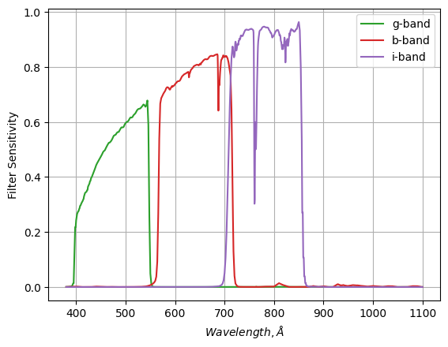  
      
  
  
The process for doing this is pretty straightforward. We need to integrate the black body spectrum, modulated by the filter strength, for two filters (e.g. red and green) to find the flux we capture in each colour, and then compare the two:  
  
$$  
\log_{10} \left( \frac{f_g}{f_r} \right) = \frac{ \int(\lambda f_g(\lambda) \cdot BB(\lambda,T)) d\lambda}{\int(\lambda f_r(\lambda) \cdot BB(\lambda,T)) d\lambda}  
$$  
  
Repeating at different temperatures, we can see how the redder low temperature black body spectra compare the the bluer high temperature ones. The particular units aren't too important in this example, so I've replaced "temperature" with "$\beta$", a term inclusive of all the relevant physical constants.  
  
  
  
  
      
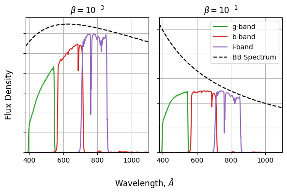  
      
  
  
So, for each temperature, need to:  
1. Calculate a BB spectrum with $BB(\lambda,\beta) \propto \lambda^{−1} \exp{\left( \frac{1}{\beta \lambda  }−1 \right)}^{−1}$   
2. Multiply this by the green filter  
3. Integrate over $\lambda$  
4. Repeat for the red filter  
5. Get the ratio of these integrals  
6. Calculate the log  
  
Even if you do this badly, any modern computer can do this in a fraction of a second. To highlight the speed differences, I've cranked the problem up to run for $100,000$ different temperatures, blowing the cost up to a size we can meaningfully examine.  
  
  
```python  
N_temps = 100_000  
betas = np.logspace(-2,0,N_temps)  
```  
  
**Doing it with python: The bad way**    
For the sake of comparison, lets first do this with regular python, i.e. using as few packages as possible. Python has no native $\exp(x)$ function, so I've had to dip into `numpy` for that, but everything else here is in the vein of an introductory python tutorial: lots of nested loops and accumulators:  
  
  
```python  
%%time  
out_normal = np.zeros(N_temps)  
for i in range(N_temps):  
    beta = betas[i]  
    bb_spec = 1/LAM**2 * (np.exp(1/LAM/beta)-1)**-1  
    g_flux = 0  
    r_flux = 0  
    for j in range(len(LAM)):  
        g_flux+=g_fil[:,1][j] * bb_spec[j]  
        r_flux+=r_fil[:,1][j] * bb_spec[j]  
    out_normal[i] = np.log10(g_flux / r_flux)  
```  
  
    CPU times: user 2min 35s, sys: 0 ns, total: 2min 35s  
    Wall time: 2min 35s  
  
  
Aside from being a little bit messier to read, raw python is also _slow_. In my benchmark, this takes over two whole minutes, practically an eternity in computer time. There isn't anything fancy in our code that should be particularly costly, this is all about how python handles its loops and calculations. Namely, it handles them _poorly_.  
  
**Doing it with numpy: the better way**    
If you've spent any time with python, you've probably learned that doing as much as you can with `numpy.array`'s will earn you a much faster code. In our case, swapping the inner loop for `numpy`'s vectorized functions cuts the run-time down by a factor of _sixty_ over base python:  
  
  
```python  
%%time  
  
out_numpy = np.zeros(N_temps)  
for i in range(N_temps):  
    beta = betas[i]  
    bb_spec = 1/LAM**2 * (np.exp(1/LAM/beta)-1)**-1  
    g_flux = (g_fil[:,1] * bb_spec).sum()  
    r_flux = (r_fil[:,1] * bb_spec).sum()  
    out_numpy[i] = np.log10(g_flux / r_flux)  
```  
  
    CPU times: user 3.29 s, sys: 0 ns, total: 3.29 s  
    Wall time: 3.28 s  
  
  
**Doing it with JAX, the fastest way**    
Now we can take a swing at things with `JAX`. In the snippet below, I first do a bit of house keeping by converting my arrays to `JAX`-friendly ones, and then define my entire process in a function. You'll notice how similar this is to doing things with `numpy`, the only difference is that I've swapped out the `numpy` math functions (`.np`) functions with `jax.numpy` calls (`jnp.`). These are one-to-one with the familiar `numpy` math functions, but are set up to play nicely with `JAX`'s compilation.  
  
We tell JAX to compile out function into a fast version with `jax.vmap`, specifically "vector mapping" mapping it, i.e. compiling to a form that takes in a vector, even though the function as written is for one number at a time. You can also compile _without_ vector mapping with `jax.jit`. `JAX` will do the compilation the first time you call the function, so I've run and timed `jax_vectorized_function` twice to show the time with and without the overhead from compiling.  
  
  
```python  
# Make a function that does all our working with jax.numpy (jnp) instead of numpy (np)  
def jax_function(beta):  
    bb_spec = 1/LAM**2 * (jnp.exp(1/LAM/beta)-1)**-1  
    g_flux = jnp.sum(g_fil[:,1] * bb_spec)  
    r_flux = jnp.sum(r_fil[:,1] * bb_spec)  
    out = jnp.log10(g_flux/r_flux)  
      
    return(out)  
  
# Make a "vector mapped" function with jax.vmap  
jax_vectorized_function = jax.jit(jax_function)  
jax_vectorized_function = jax.vmap(jax_function)  
  
# Run and time twice to see with and without compile time  
%time out_jax = jax_vectorized_function(betas)  
%time out_jax = jax_vectorized_function(betas)  
```  
  
  
    CPU times: user 1.8 s, sys: 2.7 s, total: 4.5 s  
    Wall time: 1.42 s  
    CPU times: user 968 ms, sys: 2.5 s, total: 3.46 s  
    Wall time: 952 ms  
  
  
**Autodiff**    
As well as the speed it wrings out of its compilation, `JAX` has a second powerful feature in the form of its auto-differentiation. For any `JAX`-friendly function (i.e. one we can compile), `JAX` can also calculate the gradient via the chain rule. In the snippet below, we take `jax_function()` from above, take the derivative with `jax.vmap`, then convert this into a vector-input function with `jax.vmap`. In two lines of code, we get a function that can calculate $df(x)/dx$ as easily as $f(x)$:  
  
  
```python  
# Do auto-differentiation  
gradient_of_colours = jax.grad(jax_function)  
  
# Do auto-vectorization  
gradient_of_colours = jax.vmap(gradient_of_colours)  
```  
  
For example, suppose we want to plot our log-colour and its gradient side-by side. Thanks to `JAX`, it's as easy as running our two compiled (fast) functions:  
  
  
```python  
betas_forplot = np.logspace(-2,0,1000)  
  
# Evaluate Function  
colours = jax_vectorized_function(betas_forplot)  
  
# Evaluate Gradient Function  
grads = gradient_of_colours(betas_forplot)  
  
# Plotting  
fig, (a1,a2) = plt.subplots(1,2, figsize=(8,3), sharex=True)  
a1.plot(betas_forplot, colours), a2.plot(betas_forplot, grads)  
a1.grid(), a2.grid()  
a1.set_xscale('log')  
fig.supxlabel("$\\beta$ (Log Scale)"),   
a1.set_ylabel("$\log_{10} (f_r / f_g)$"), a2.set_ylabel("$\partial \log_{10}(f_g / f_r) / \partial \\beta$")  
a1.set_title("Function"), a2.set_title("Gradient")  
fig.tight_layout()  
plt.show()  
```  
  
  
      
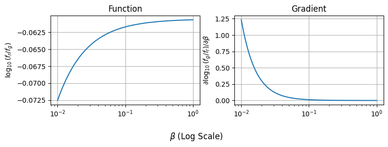  
      
  
  
We can apply `jax.grad` multiple times over to get higher order derivatives as well, and this works in as many dimensions as we want. Autograd means that you can, automatically in your code, get Hessians, Jacobians, Fisher informations and any other derivative based measure you want. This opens up a whole new world of tools that work "out of the box", making autodiff tools like `JAX` immediately better at handling complicated problems.   
  
## The NumPyro Part <a id='NumPyro'></a>  
  
The following section steps through a few examples of using NumPyro for basic modeling. Firstly, for a simple linear regression, then for a few variations on that theme, and then for a more complex hierarchical model.   
  
_Note: Much of the following has been lifted directly from the [NumPyro introduction](https://hughmcdougall.github.io/blog/02_numpyro/01_gettingstarted/page.html) on my main [blog](https://hughmcdougall.github.io/blog/02_numpyro/blog_numpyrohome.html)._  
  
### Linear Regression  
  
In this first part we'll look at fitting a simple linear regression to data with Gaussian error bars. I.e., we have a model with parameters $\theta = (m,c)$, and data $(x, y)$, that we believe follows:  
  
$$  
    y_i=m \cdot x_i + c \pm \mathcal{N}(0,E_i)  
$$  
  
In this example, we enjoy the luxury of already knowing the true underlying model and the true values its parameters (in this case, $m=2$ and $c=3.5$).  
  
  
  
  
      
  
      
  
  
**Bayesian Analysis**  
NumPyro is an example of a Bayesian analysis tool. The old fashioned way of fitting models is to take your data and then work _backwards_ to your fundamental parameters. Bayesian analyis goes the other way: starting by drawing your parameters from a _prior_ distribution, and then working _forwards_ through a "generative model" to simulate the observations that you would see. You then weight the parameters by how well they reproduce your data (the likelihood).  
  
  
  
  
      
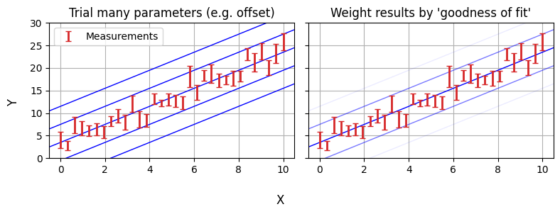  
      
  
  
The purpose of PPL's like NumPyro is that they make the generative model up-front and easy to code / interpret, instead of being abstracted behind test-statistics. Making a NumPyro model that encodes this model is surprisingly simple, and can be done in only a few lines of code:  
  
  
```python  
def model(X,Y,E):    
    m = numpyro.sample("m", numpyro.distributions.Uniform(-5,5))   # prior on m    
    c = numpyro.sample("c", numpyro.distributions.Uniform(-10,10)) # Prior on c    
  
    # For every data point...  
    with numpyro.plate('data', len(X)):    
        y_model = m*X + c  # Get the model value  
        numpyro.sample('y', numpyro.distributions.Normal(y_model,E), obs = Y) # Compare to observation  
```  
  
Though written as a python function, `model(X,Y,E)` doesn’t necessarily work like one, e.g. we don’t “return” a likelihood. Instead, each `numpyro.sample` statement implies an effect on the likelihood:  
  
* The first two lines describe our prior knowledge about m and c    
    * The first argument, e.g. "`m`" is the “site name”, the unique name that NumPyro will internally recognize this variable as and return its results as    
    * The python-like variable name `m` on the left hand side is only for using that variable within the function, like we do when we calculate `y_model`    
  
* The ‘plate’ describes the way we sweep over the data-points in `X` and `Y`    
    * Everything created or called inside the plate is implicitly vectorized where possible, e.g. calling `X` when calculating `y_model` implicitly means `X[i]`  
    * The sample `y` follows a normal distribution $y\sim \mathcal{N}(y_{model},E)$, representing our uncorrelated measurements, and the `obs=Y` means that this distribution is being compared to the measurement `Y[i]`  
    * The sample `y` doesn’t have a name on the LHS because we don’t use it to do any more calculations  
  
Our NumPyro model encodes all of our probability distributions and data, now we need to actually _do_ something with it. In 90% of cases, that "something" will be constraining parameters with some kind of [MCMC](https://en.wikipedia.org/wiki/Markov_chain_Monte_Carlo) algorithm. In NumPyro, we do this by creating an `MCMC` object and then triggering it with the `.run` method:  
  
  
```python  
%%time  
sampler = numpyro.infer.MCMC(numpyro.infer.NUTS(model),     
                             num_chains  = 1,     
                             num_samples = 10_000,  
                             num_warmup  = 5_00)    
sampler.run(jax.random.PRNGKey(1), X,Y,E)    
```  
  
  
    CPU times: user 5.85 s, sys: 148 ms, total: 6 s  
    Wall time: 5.93 s  
  
  
When the `numpyro.infer.MCMC` object is created, we feed it a `numpyro.infer.NUTS` object, which in turn wraps around our probabilistic model. This argument determines what kind of MCMC sampler we use (in this case the No U-Turn Sampler (NUTS)). If you want to use a different sampler (e.g. the [sample adaptive](https://num.pyro.ai/en/latest/mcmc.html#numpyro.infer.sa.SA) sampler), we can swap this first argument out for something else.  
  
Because MCMC is an inherently random process, we need to feed it a random seed to determine how its stochastic elements are generated. This takes the form of the `jax.random.PRNGKey(i)` argument in `sampler.run()`. We also feed in the data (function inputs), `X,Y` and `E` into the sampler when running so it knows what to actually fit the model _on_. Once the sampler has finished running, we just extract its completed MCMC chains using `.get_samples()`, which returns as a dictionary keyed by the NumPyro site names we defined in our model. We can then pass these directly to a `chainconsumer` object for plotting, confirming that our model was fit successfully:  
  
  
```python  
results = sampler.get_samples()  
C = ChainConsumer()    
C.add_chain(results, name = "MCMC Results")    
C.plotter.plot(    
    truth = {'m':m_true, 'c':c_true})    
plt.show()    
```  
  
  
      
  
      
  
  
If you have `graphviz` installed, (e.g. via `conda install -c conda-forge pygraphviz`), NumPyro can automatically render a [graph of the model](https://en.wikipedia.org/wiki/Graphical_model#Bayesian_network) to help visualize it and confirm that everything's set up properly. This is called with:  
  
  
```python  
numpyro.render_model(model, model_args=(X,Y,E))  
```  
  
  
  
  
      
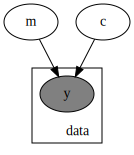  
      
  
  
  
**Reparameterization**    
In the last example we defined our priors over $m$ and $c$, specifically using uniform distributions. It's easy to imagine a case where this might not be the best choice: for example, gradients "thin out" around $m=0$ and "bunch up" as $m \rightarrow \infty$. We might instead want to have a uniform prior over the slope _angle_ and the offset perpendicular to the line, i.e. $m=tan(\theta)$ and $c=b_\perp / cos(\theta)$:  
  
_Note: This example adapted from Dan Foreman Mackey's [Astronomer's Introduction to NumPyro](https://dfm.io/posts/intro-to-numpyro/)_  
  
  
  
  
      
  
      
  
  
With NumPyro, we do this using the `numpyro.deterministic` primitive. This works a lot like sample: the MCMC chains will store `m` and `c` as parameters, but the priors are defined "one level up" rather than `m` and `c` being random variables themselves.  
  
  
```python  
def model_reparam(X,Y,E):  
    angle = numpyro.sample('angle', numpyro.distributions.Uniform(-jnp.pi/2,jnp.pi/2))  
    b_perp = numpyro.sample('b_perp', numpyro.distributions.Uniform(-5,5))  
      
    m = numpyro.deterministic("m", jnp.tan(angle))    
    c = numpyro.deterministic("c", b_perp / jnp.cos(angle))   
    
    with numpyro.plate('data', len(X)):    
        y_model = m*X + c    
        numpyro.sample('y', numpyro.distributions.Normal(y_model,E), obs = Y)        
  
#-------------  
  
numpyro.render_model(model_reparam, model_args=(X,Y,E))  
  
```  
  
  
  
  
      
  
      
  
  
  
Even though they aren't random variables, using:  
  
```python  
    m = numpyro.deterministic("m", jnp.tan(angle))  
```  
  
Instead of just:  
  
```python  
    m = jnp.tan(angle)    
```  
  
Means that NumPyro will keep track of `m` as though it were a parameter during the MCMC process, meaning we can pull it out for analysis, e.g. with a corner plot:  
  
  
```python  
sampler = numpyro.infer.MCMC(numpyro.infer.NUTS(model_reparam), num_chains = 1, num_samples = 10_000, num_warmup = 500)  
sampler.run(PRNGKey(1), X, Y, E)  
res = sampler.get_samples()  
C = ChainConsumer()  
C.add_chain(res)  
C.plotter.plot(parameters=['m','c'], truth = {'m':m_true, 'c':c_true})  
plt.show()  
```  
  
  
  
      
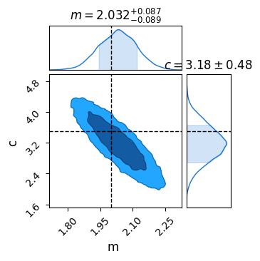  
      
  
  
**X-Errors**    
This all might seem like a bit of overkill so far: after all, linear regression is a problem with an analytical solution. It doesn't take much extra complication to make bayesian tools NumPyro necessary: even adding error bars on our $x$ values turns this into a problem with no pen-and-paper answer. Though there are some rough approximations that people use to do this _without_ bayesian modelling (e.g. doing a linear regression with errors in $y$, then again with errors in $x$ and averaging), bayesian tools are the _only_ way to properly handle even this simple case.  
  
  
  
  
      
  
      
  
  
Fortunately, adding this to our numpyro model is as simple as one extra line. $x$ is now a random / uncertain variable that we observe, so we describe it with a `numpyro.sample` with `obs=X` where `X` is our vector of observed $x$ values:  
  
  
```python  
def model_XYerr(X,Y,E_X,E_Y):  
    angle = numpyro.sample('angle', numpyro.distributions.Uniform(-jnp.pi/2,jnp.pi/2))  
    b_perp = numpyro.sample('b_perp', numpyro.distributions.Uniform(-5,5))  
      
    m = numpyro.deterministic("m", jnp.tan(angle))    
    c = numpyro.deterministic("c", b_perp / jnp.cos(angle))   
    
    with numpyro.plate('data', len(X)):  
        x_model = numpyro.sample('x', numpyro.distributions.Normal(X,E_X))  
        y_model = m*x_model + c    
        numpyro.sample('y', numpyro.distributions.Normal(y_model,E_Y), obs = Y)  
  
numpyro.render_model(model_XYerr, model_args = (X,Y,E/2, E))  
```  
  
  
  
  
      
  
      
  
  
  
### R-L Hierarchical Example    
The examples so far have been intentionally simple: linear regressions are the kind of thing you could code up by hand if you knew what you were doing. Instead, lets look at a more complicated, though slightly contrived example. The set-up goes like this:  
  
<p style="text-align: center; font-family: verdana"><i>  
"Someone spilled a cup of coffee and accidentally deleted every Hertzprung-Russell Diagram on the planet. You need to re-fit it using only some particularly low quality telescope data and some old records of colour temperatures."  
</i></p>  
  
**Data & Goal**  
  
The data you have on hand consists of:  
* A few hundred stars,  
* Spread over a few dozen clusters, with about a half dozen stars per cluster  
* For a handful of the nearest clusters you have distances from parallax measurements  
* For every star you already know the colour temperature, and  
* For each star you have apparent brightness from photon counts on your telescope  
  
I'm going to make the grievous approximation of pretending that the HR diagram is a straight line in this example, i.e. that absolute magnitudes $M$ obey:  
  
$$  
M = \alpha \cdot \log_{10}(T) + \beta \pm \mathcal{N}(0,\sigma)  
$$  
  
Where $\alpha$, $\beta$ and $\sigma$ are the slope, offset and inherent scatter of the relation, and $\mathcal{N}$ means some normally distributed randomness. Our brightness measurements are patchy as well, owing to the photon counts obeying a [Poisson Distribution](https://en.wikipedia.org/wiki/Poisson_distribution) and being vulnerable to shot noise.  
  
  
  
  
  
  
      
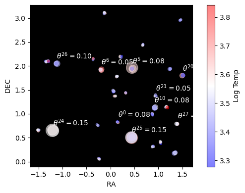  
      
  
  
Our end goal is to measure $\alpha$, $\beta$ and $\sigma$. Why is this hard? Well, our parallax distances are _terrible_, we only know the distances for a a dozen or so clusters, and even then we only know them vaguely. If we knew the distances this would be easy: we'd just turn each star's flux into an apparent brightness, get the distance modulus and correct accordingly. The issue is that we're at the mercy of these distance measurements which fall apart rapidly as we go to bigger distances / smaller parallax angles:  
  
  
  
  
      
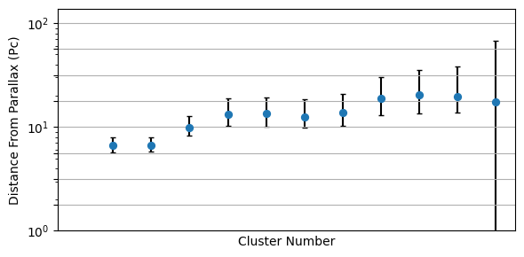  
      
  
  
Then, couple this with the fact that each cluster has only a few stars. If we were to do this the old fashioned way, we'd have no hope at all of properly constraining the straight line in $\log_{10}(T)$ against $M$. We're also forced to throw away all of the stars that we _don't_ have distances for, leaving us with only a tiny fraction of the data being useful.  
  
  
  
  
      
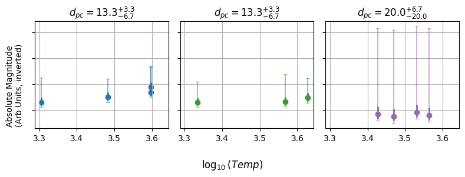  
      
  
  
**The Bayesian Model**  
  
The solution is in the form of a [Bayesian Hierarchical Model](https://en.wikipedia.org/wiki/Bayesian_hierarchical_modeling). Though any one cluster / star has a tiny bit of information, the sum total of them gives us more information. Like always, we start by building a generative model. First, we say that **every cluster has a distance**, which gives a parallax angle, including uncertainty:  
  
$$  
\theta_p^\mathrm{cluster} = \frac{1}{d^\mathrm{cluster}_{pc}} \pm \Delta_\theta  
$$  
  
Second, that **each star has a temperature which determines its absolute magnitude**:  
  
$$  
M^\mathrm{star} = \alpha \cdot (\log_{10}(T^\mathrm{star})-4)+ \beta \pm \mathcal{N}(0,\sigma)  
$$  
  
That **this converts to an apparent magnitude** based on the distance modulus of its host cluster:  
  
$$  
m^\mathrm{star} = M^\mathrm{star} + 5.0\times \log_{10} \left(\frac{d^{\mathrm{cluster}}}{10 pc}\right)  
$$  
  
Which **turns into a flux**:  
  
$$  
f^\mathrm{star} = c \cdot 10^{-(m^\mathrm{star}-m_0) / 2.5}  
$$  
  
Which **we observe as a photon count**, obeying a Poisson distribution:  
  
$$  
N_\mathrm{flux}^\mathrm{star} \sim \mathrm{Poisson}(f^\mathrm{star})  
$$  
  
Despite the number of plates to juggle here, this is pretty easy to code up as a NumPyro model, including all the complexity that we would need to pave-over or approximate with old fashioned "working backwards" methods, e.g. the Poisson distributions and non-gaussian distance errors.  
  
  
```python  
def HRmodel(cluster_index, logtemps, parallax = None, fluxcounts = None):  
    slope = numpyro.sample('slope', dist.Uniform(-10,0) )  
    offset = numpyro.sample('offset', dist.Uniform(-10,10) )  
    spread = numpyro.sample('spread', dist.HalfNormal(2.5) )  
  
    n_clusters = np.unique(cluster_index).size  
    n_stars = cluster_index.size  
  
    with numpyro.plate("clusters", n_clusters):  
        distance = numpyro.sample('root_dist', dist.DoublyTruncatedPowerLaw(alpha=2.0, low=min_dist, high=max_dist) )  
        dist_mod = jnp.log10(distance/10) * 5.0  
          
        numpyro.sample('parallax', dist.Normal(jnp.power(distance,-1), E_parallax), obs=parallax)  
          
    with numpyro.plate('stars', n_stars):  
        absolute_magnitude = numpyro.sample('absolute_magnitude', dist.Normal((logtemps-logtemp0) * slope + offset,spread))  
        apparent_magnitude = numpyro.deterministic('apparent_magnitude',absolute_magnitude + dist_mod[cluster_index])  
  
        fluxmag = numpyro.deterministic('fluxmag', -(apparent_magnitude-mag0)/2.5)  
        flux = jnp.power(10,fluxmag) * gain  
          
        numpyro.sample('fluxcounts', dist.Poisson(flux), obs = fluxcounts)  
          
```  
  
_Note: I've defined the distance prior going like $P(d)\propto d^2$, a result of basic spherical geometry. This is because there are more places a cluster can exist the further out we go._  
  
Because of `NumPyro`'s speed from `JAX` , this whole model takes only about 10 minutes on my laptop, and recovers ground truth to within $1 \sigma$:  
  
  
  
  
  
  
      
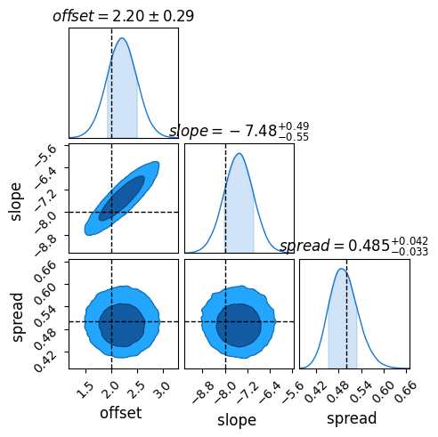  
      
  
  
  
  
**Did This Work?**  
  
Because this is a mock-up example, we're free to compare our results to the ground truth. Sure enough, once fully converged the model does a remarkably close job of recovering the underlying truth, including the inherent scatter. Through hierachical modeling, we've pulled meaningful information out of patchy data.  
  
  
  
  
      
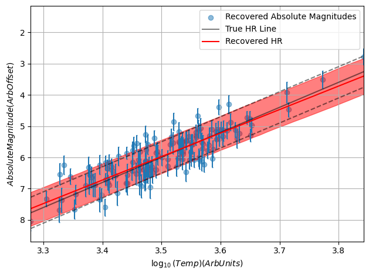  
      
  
  
  
  
  
      
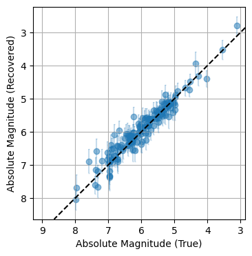  
      
  
  
  
---------  
  
This page by Hugh McDougall, 2024  
  
  
  
For more detailed information, feel free to check my [GitHub repos](https://github.com/HughMcDougall/) or [contact me directly](mailto: hughmcdougallemail@gmail.com).  
  
