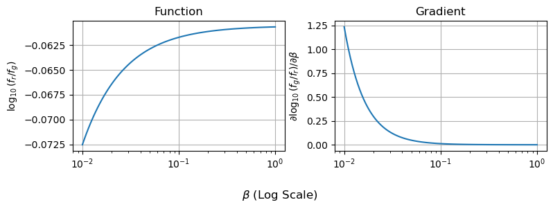

# A Brief Introduction to NumPyro
## Presentation for Astro Group 26/2/24

`pip install chainconsumer==0.34.0`

**Contents**
* [JAX Stuff](#JAX)
* [NumPyro Stuff](#JAX)


```python
import numpy as np
import matplotlib.pyplot as plt

import numpyro
import jax.numpy as jnp  
from jax.random import PRNGKey
import jax
from numpyro import distributions as dist

from chainconsumer import ChainConsumer
```

## The JAX Part <a id='JAX'></a>
JAX is a [Just-In-Time Compiled](https://en.wikipedia.org/wiki/Just-in-time_compilation) (JIT) language that you can interface with using python. In short: it lets you write python code, but bake into a compiled function at runtime to get a massive speedup. It also has [automatic differentiation](https://en.wikipedia.org/wiki/Automatic_differentiation) (Autodiff) which means it can calculate _analytical_ gradients for any function you write in it.


```python
# REDACT
g_fil, r_fil, i_fil = [np.loadtxt("./DES_%s_y3a1.dat"%c, skiprows = 1) for c in ["g","r","i"]]
LAM = g_fil[:,0]
for Y,title,c in zip([g_fil,r_fil,i_fil], ["g-band","b-band","i-band"], ["tab:green","tab:red","tab:purple"]):
    plt.plot(LAM,Y[:,1],label=title,c=c)
plt.grid()
plt.legend()
plt.xlabel("$Wavelength, \AA$")
plt.ylabel("Filter Sensitivity")
plt.show()

```


    

    


```python
# REDACT
fig, ax = plt.subplots(1,2, sharex=True, figsize=(6,4))

for i,beta in enumerate([0.001, 0.1]):
    bb_spec = 1/LAM**2 * (np.exp(1/LAM/beta)-1)**-1
    for Y,title,c in zip([g_fil,r_fil,i_fil], ["g-band","b-band","i-band"], ["tab:green","tab:red","tab:purple"]):
        ax[i].plot(LAM,Y[:,1]*bb_spec,label=title,c=c)
    ax[i].plot(LAM,bb_spec,c='k',ls='--', label = "BB Spectrum")
    ax[i].grid()
    ax[i].set_yticklabels([])
    ax[i].set_ylim(0)
ax[0].set_title("$ \\beta = 10^{-3} $")
ax[1].set_title("$ \\beta = 10^{-1} $")
fig.supxlabel("Wavelength, $\AA$")
fig.supylabel("Flux Density")
ax[1].legend()
plt.xlim(LAM.min(),LAM.max())
fig.tight_layout()
plt.show()
```


    

    


$$
\log_{10} \left( \frac{f_g}{f_r} \right) = \frac{ \int(\lambda f_g(\lambda) \cdot BB(\lambda,T)) d\lambda}{\int(\lambda f_r(\lambda) \cdot BB(\lambda,T)) d\lambda}
$$

For each temperature, need to:
1. Calculate a BB spectrum /w 𝐵𝐵(𝜆,𝑇)∝𝜆^(−1) (exp(1/𝛽𝜆)−1)^(−1)
2. Multiply by green filter
3. Integrate
4. Repeat for red filter
5. Take ratio
6. Take log


```python
N_temps = 100
betas = np.logspace(-2,0,N_temps)
```

**Doing it with python: The bad way**


```python
%%time
if False:
    out_normal = np.zeros(N_temps)
    for i in range(N_temps):
        beta = betas[i]
        bb_spec = 1/LAM**2 * (np.exp(1/LAM/beta)-1)**-1
        g_flux = 0
        r_flux = 0
        for j in range(len(LAM)):
            g_flux+=g_fil[:,1][j] * bb_spec[j]
            r_flux+=r_fil[:,1][j] * bb_spec[j]
        out_normal[i] = np.log10(g_flux / r_flux)
```

    CPU times: user 1 µs, sys: 1 µs, total: 2 µs
    Wall time: 4.05 µs


**Doing it with numpy: the better way**


```python
%%time

out_numpy = np.zeros(N_temps)
for i in range(N_temps):
    beta = betas[i]
    bb_spec = 1/LAM**2 * (np.exp(1/LAM/beta)-1)**-1
    g_flux = (g_fil[:,1] * bb_spec).sum()
    r_flux = (r_fil[:,1] * bb_spec).sum()
    out_numpy[i] = np.log10(g_flux / r_flux)
```

    CPU times: user 2.88 ms, sys: 0 ns, total: 2.88 ms
    Wall time: 2.83 ms


**Doing it with JAX, the fastest way**


```python
# Convert some arrays to JAX-friendly versions
betas_forjax = jnp.array(betas)
LAM_forjax = jnp.array(LAM)
g_fil_forjax = jnp.array(g_fil[:,1])
r_fil_forjax = jnp.array(r_fil[:,1])

#--------------------------

# Make a function that does all our working with jax.numpy (jnp) instead of numpy (np)
def jax_function(beta):
    bb_spec = 1/LAM_forjax**2 * (jnp.exp(1/LAM_forjax/beta)-1)**-1
    g_flux = jnp.sum(g_fil_forjax * bb_spec)
    r_flux = jnp.sum(r_fil_forjax * bb_spec)
    out = jnp.log10(g_flux/r_flux)
    
    return(out)

# Make a "vector mapped" function with jax.vmap
jax_vectorized_function = jax.vmap(jax_function)

# Run and time twice to see with and without compile time
%time out_jax = jax_vectorized_function(betas_forjax)
%time out_jax = jax_vectorized_function(betas_forjax)
```

    No GPU/TPU found, falling back to CPU. (Set TF_CPP_MIN_LOG_LEVEL=0 and rerun for more info.)


    CPU times: user 665 ms, sys: 0 ns, total: 665 ms
    Wall time: 717 ms
    CPU times: user 7.93 ms, sys: 0 ns, total: 7.93 ms
    Wall time: 8.46 ms


**Autodiff**


```python
# Do auto-differentiation
do_grad = jax.grad(jax_function)

# Do auto-vectorization
do_grad = jax.vmap(do_grad)

# Run the gradient function
grads = do_grad(betas_forjax)

```


```python
# REDACT
fig, (a1,a2) = plt.subplots(1,2, figsize=(8,3), sharex=True)

a1.plot(betas_forjax, jax_vectorized_function(betas_forjax))
a2.plot(betas_forjax, grads)

a1.grid(), a2.grid()
a1.set_xscale('log')

fig.supxlabel("$\\beta$ (Log Scale)"), 

a1.set_ylabel("$\log_{10} (f_r / f_g)$")
a2.set_ylabel("$\partial \log_{10}(f_g / f_r) / \partial \\beta$")

a1.set_title("Function")
a2.set_title("Gradient")

fig.tight_layout()
plt.show()
```


    

    


## The NumPyro Part <a id='NumPyro'></a>

Note: Much of the following has been lifted directly from the [NumPyro introduction](https://hughmcdougall.github.io/blog/02_numpyro/01_gettingstarted/page.html) on my [blog](https://hughmcdougall.github.io/blog/02_numpyro/blog_numpyrohome.html)

### Linear Regression

Now the fun part: we’ll use NumPy to hack together some data akin to the real world measurements you would apply NumPyro to. We’ll both generate and fit according to a simple linear model:
$$
    y(x)=m \cdot x + c
$$

In this example, we enjoy the luxury of already knowing the true underlying model and the true values its parameters (in this case, $m=2$
and $c=3.5$). We also choose a density and uncertainty of measurements to give a clear picture of the underlying model. The real world is rarely so friendly, and we have to bear in mind that any model is only an approximation of the messiness of reality. For an example on how to perform this, check the article on Model Comparison & Tension.

In the cell below, `ebar` and `scatter` determine the average and spread of the size of errorbars in our data-points using a [Poisson Distribution](https://en.wikipedia.org/wiki/Poisson_distribution). This sort of distribution is common in astronomy, as it’s associated with count-based events like measuring flux from counting of photons.


```python
# REDACT
# Model 'truth' parameters  
m_true = 2  
c_true = 3.5
  
#----------------------------  
# Data generation  
ebar, escatter = 1.5, 10 # Average & spread of error bar  
  
np.random.seed(123) # Fix the random seed so results are consistent across different examples  
X = np.linspace(0,10,32)  
E = np.random.poisson(lam=escatter, size=len(X)) / escatter * ebar  
Y = m_true*X + c_true + E*np.random.normal(size=len(X)) # Linear rel /w random noise based on 'E'  
  
#--------------  
# Plotting  
plt.figure(figsize=(6,4))
plt.errorbar(X,Y,E,fmt='none', capsize=2, label='Measurements',c='tab:red')
plt.axline( [0,c_true], slope=m_true, c='k', ls='--', label='True Relationship')  
plt.legend(loc='best')  
plt.xlabel("X"), plt.ylabel("Y")  
plt.ylim(0,30)
plt.grid()  
plt.show()  
```


    

    


**Bayesian Analysis**


```python
# REDACT

# Plotting  
fig, (a1,a2) = plt.subplots(2, 1, figsize=(5,6), sharex=True, sharey=True)
c_examp = np.linspace(-1,1,5)*8 + c_true
for a in (a1,a2):

    for c in c_examp:

        if a ==a2:
            alpha = np.exp(-((c-c_true)/5)**2)
        else:
            alpha = 1.0

        a.axline( [0,c], slope=m_true, c='blue', ls='-', alpha=alpha,lw=1)
            
    a.errorbar(X,Y,E,fmt='none', capsize=3, label='Measurements',c='tab:red',lw=2)

    a.set_ylim(0,30)
    a.grid()

a1.set_title("Trial many parameters (e.g. offset)")
a2.set_title("Weight results by 'goodness of fit'")
a1.legend()
fig.supxlabel("X"), fig.supylabel("Y")  
fig.tight_layout()
plt.show() 
```


    

    


**GET FROM BLOG**


```python
def model(X,Y,E):  
    m = numpyro.sample("m", numpyro.distributions.Uniform(-5,5))   # prior on m  
    c = numpyro.sample("c", numpyro.distributions.Uniform(-10,10)) # Prior on c  

    # For every data point...
    with numpyro.plate('data', len(X)):  
        y_model = m*X + c  # Get the model value
        numpyro.sample('y', numpyro.distributions.Normal(y_model,E), obs = Y) # Compare to observation
```

**GET FROM BLOG**


```python
%%time
sampler = numpyro.infer.MCMC(numpyro.infer.NUTS(model),   
                             num_chains  = 1,   
                             num_samples = 10_000,
                             num_warmup  = 5_00)  
sampler.run(jax.random.PRNGKey(1), X,Y,E)  
```

    sample: 100%|█| 10500/10500 [00:03<00:00, 3067.93it/s, 3 steps of size 2.95e


    CPU times: user 4.6 s, sys: 378 ms, total: 4.98 s
    Wall time: 5.33 s


**GET FROM BLOG**


```python
results = sampler.get_samples()
C = ChainConsumer()  
C.add_chain(results, name = "MCMC Results")  
C.plotter.plot(  
    truth = {'m':m_true, 'c':c_true})  
plt.show()  
```


    

    


**GET FROM BLOG**


```python
numpyro.render_model(model, model_args=(X,Y,E))
```


    

    


**Reparameterization**


```python
#REDACT
# Plotting  
fig, (a1,a2) = plt.subplots(2, 1, figsize=(4,6), sharex=True, sharey=True)
ms = np.linspace(0,20,10)
angles = np.linspace(0,np.arctan(ms.max()),len(ms))

for a in (a1,a2):
            
    a.errorbar(X,Y,E,fmt='none', capsize=3, label='Measurements',c='tab:red',lw=2)

    a.set_ylim(0,30)
    a.grid()

for m,angle in zip(ms,angles):
    alpha = 0.75
    a1.axline( [0,c_true], slope=m, c='blue', ls='-', alpha=alpha,lw=alpha)
    a2.axline( [0,c_true], slope=np.tan(angle), c='blue', ls='-', alpha=alpha,lw=alpha)

a1.set_title("Uniformly distributed gradients")
a2.set_title("Uniformly distributed angles")

a1.set_ylim(0,30)
fig.supxlabel("X"), fig.supylabel("Y")  
fig.tight_layout()
plt.show() 
```


    

    


```python
def model_reparam(X,Y,E):
    angle = numpyro.sample('angle', numpyro.distributions.Uniform(-jnp.pi/2,jnp.pi/2))
    b_perp = numpyro.sample('b_perp', numpyro.distributions.Uniform(-5,5))
    
    m = numpyro.deterministic("m", jnp.tan(angle))  
    c = numpyro.deterministic("c", b_perp / jnp.cos(angle)) 
  
    with numpyro.plate('data', len(X)):  
        y_model = m*X + c  
        numpyro.sample('y', numpyro.distributions.Normal(y_model,E), obs = Y)      

#-------------

numpyro.render_model(model_reparam, model_args=(X,Y,E))

```


    

    


```python
sampler = numpyro.infer.MCMC(numpyro.infer.NUTS(model_reparam), num_chains = 1, num_samples = 10_000, num_warmup = 500)
sampler.run(PRNGKey(1), X, Y, E)
res = sampler.get_samples()
C = ChainConsumer()
C.add_chain(res)
C.plotter.plot(parameters=['m','c'], truth = {'m':m_true, 'c':c_true})
plt.show()
```

    sample: 100%|█| 10500/10500 [00:02<00:00, 3679.65it/s, 7 steps of size 2.47e


    

    


**X-Errors**  
This all might seem like a bit of overkill so far: after all, linear regression is a problem with an analytical solution. It doesn't take much extra complication to make bayesian tools NumPyro necessary: even adding error bars on our $x$ values turns this into a problem with no pen-and-paper answer. Though there are some rough approximations that people use to do this _without_ bayesian modelling (e.g. doing a linear regression with errors in $y$, then again with errors in $x$ and averaging), bayesian tools are the _only_ way to properly handle even this simple case.


```python
# REDACT
E_X, E_Y = np.sqrt((np.random.randn(len(X))**2 + np.random.randn(len(X))**2))*0.25, E
X_scatter = X + np.random.randn(len(X)) * E_X

plt.figure(figsize=(6,4))
plt.errorbar(X_scatter,Y,yerr=E_Y, xerr=E_X,fmt='none', capsize=2, label='Measurements',c='tab:red')
plt.axline( [0,c_true], slope=m_true, c='k', ls='--', label='True Relationship')  
plt.legend(loc='best')  
plt.xlabel("X"), plt.ylabel("Y")  
plt.ylim(0,30)
plt.grid()  
plt.show()  

#--------------
```


    

    


Fortunately, adding this to our numpyro model is as simple as one extra line. $x$ is now a random / uncertain variable that we observe, so we describe it with a `numpyro.sample` with `obs=X` where `X` is our vector of observed $x$ values:


```python
def model_XYerr(X,Y,E_X,E_Y):
    angle = numpyro.sample('angle', numpyro.distributions.Uniform(-jnp.pi/2,jnp.pi/2))
    b_perp = numpyro.sample('b_perp', numpyro.distributions.Uniform(-5,5))
    
    m = numpyro.deterministic("m", jnp.tan(angle))  
    c = numpyro.deterministic("c", b_perp / jnp.cos(angle)) 
  
    with numpyro.plate('data', len(X)):
        x_model = numpyro.sample('x', numpyro.distributions.Normal(X,E_X))
        y_model = m*x_model + c  
        numpyro.sample('y', numpyro.distributions.Normal(y_model,E_Y), obs = Y)

numpyro.render_model(model_XYerr, model_args = (X,Y,E/2, E))
```


    

    


### R-L Hierarchical Example


```python
gain = 5E5
mag0 = 2
E_parallax = 0.025
logtemp0 = 4
min_dist, max_dist = 1, 1000
```


```python
# REDACT

true_RM = {'slope': -8.0, 'offset':2.0, 'spread':0.5}

def HRmodel(cluster_index, logtemps, parallax = None, fluxcounts = None):
    slope = numpyro.sample('slope', dist.Uniform(-10,0) )
    offset = numpyro.sample('offset', dist.Uniform(-10,10) )
    spread = numpyro.sample('spread', dist.HalfNormal(2.5) ) # HR scatter in magnitudes

    n_clusters = np.unique(cluster_index).size
    n_stars = cluster_index.size

    with numpyro.plate("clusters", n_clusters):
        root_dist = numpyro.sample('root_dist', dist.Uniform(min_dist**(1/3),max_dist**(1/3)) )
        distance = numpyro.deterministic('distance', jnp.power(root_dist,3))
        dist_mod = jnp.log10(distance/10) * 2.5
        
        if parallax is None:
            numpyro.sample('parallax', dist.Normal(jnp.power(distance,-1), E_parallax))
        else:
            numpyro.sample('parallax', dist.Normal(jnp.power(distance,-1), E_parallax), obs=parallax)
        
    with numpyro.plate('stars', n_stars):
        absolute_magnitude = numpyro.sample('absolute_magnitude', dist.Normal((logtemps-logtemp0) * slope + offset,spread))
        apparent_magnitude = numpyro.deterministic('apparent_magnitude',absolute_magnitude + dist_mod[cluster_index])
        flux = jnp.power(10,-(apparent_magnitude-mag0)/2.5) * gain
        
        if fluxcounts is None:
            numpyro.sample('fluxcounts', dist.Poisson(flux))
        else:
            numpyro.sample('fluxcounts', dist.Poisson(flux), obs = fluxcounts)
        

#-----------------------
# Fake Clusters
np.random.seed(2)

num_clusters = 30
cluster_index = np.concatenate([[i] * (j+3) for i,j in enumerate(np.random.poisson(lam=2.0, size=num_clusters))])
cluster_index.sort()
logtemps = np.random.randn(len(cluster_index)) / 6+3.5

mock_data = numpyro.infer.Predictive(model=numpyro.handlers.do(HRmodel, true_RM), num_samples=1)(PRNGKey(2),cluster_index, logtemps)
for key in mock_data.keys():
    if len(mock_data[key].shape)>1: mock_data[key] = mock_data[key][0]

mock_data['parallax'] = np.where(mock_data['parallax']<=E_parallax*2, 0, E_parallax*np.round(mock_data['parallax']/E_parallax))
mock_data |=true_RM

if False:
    fig, (a1,a2) = plt.subplots(1,2)
    
    a1.scatter(logtemps, mock_data['absolute_magnitude'])
    a1.axline( (logtemp0, true_RM['offset']), slope=true_RM['slope'])
    
    a2.scatter(logtemps, np.log10(mock_data['fluxcounts'] * mock_data['distance'][cluster_index]**2 ))
    a2.axline( (np.median(logtemps), np.median(np.log10(mock_data['fluxcounts'] * mock_data['distance'][cluster_index]**2 ))), slope=-true_RM['slope']/2.5)
    a1.invert_yaxis()
    a1.grid(), a2.grid()
    
    plt.figure()
    plt.hist(mock_data['fluxcounts'], bins = 128)
    plt.xscale('log')
    plt.grid()
    plt.show()
    print(mock_data['fluxcounts'][np.argsort(mock_data['fluxcounts'])])
```


```python
# REDACT
np.random.seed(0)
J = np.random.choice(np.unique(cluster_index), 6, replace=False)

plt.figure(figsize=(8,4))

flag1, flag2 = True, True
for i,j in enumerate(J):
    select = np.argwhere(cluster_index==j)
    if mock_data['parallax'][j] == 0:
        c=None
        edgecolors = np.array(list('rgbcym'*100))[j]
        facecolors= 'none'
        z=-1
        if flag1:
            label = "No Parallax"
            flag1 = False
        else:
            label = None
    else:
        c = None
        facecolors = None
        edgecolors = None
        z = 10
        if flag2:
            label = "Has Parallax"
            flag2 = False
        else:
            label = None

    plt.scatter(logtemps[select], mock_data['fluxcounts'][select], c=c, facecolors=facecolors, edgecolors = edgecolors, label = label, zorder=z, s = 20)
    for k,xk in enumerate(logtemps[select]):
        break
        plt.text(xk, mock_data['fluxcounts'][select][k], "$%i$" %int(mock_data['fluxcounts'][select][k]), fontsize=5)

plt.legend()
plt.xlabel("$\log_{10}(Temp)$")
plt.ylabel("Flux Counts")
plt.grid()
plt.tight_layout()

plt.yscale('log')
```


    ---------------------------------------------------------------------------

    NameError                                 Traceback (most recent call last)

    Cell In[20], line 3
          1 # REDACT
          2 np.random.seed(0)
    ----> 3 J = np.random.choice(np.unique(cluster_index), 6, replace=False)
          5 plt.figure(figsize=(8,4))
          7 flag1, flag2 = True, True


    NameError: name 'cluster_index' is not defined


```python
# REDACT
pars = [1/(np.random.randn(2**8) * E_parallax + par) for par in mock_data['parallax']]
dists = np.array([np.median(par) for par in pars])
Emin, Eplus =  np.array([np.percentile(par, 16) for par in pars]),  np.array([np.percentile(par, 84) for par in pars])
Emin = dists - Emin
Eplus= Eplus - dists
I = np.argsort(Eplus)

#------------
plt.figure(figsize=(6,3))
plt.errorbar(range(len(dists)), dists[I], yerr = (Emin[I],Eplus[I]), fmt='none', capsize=2)
plt.scatter(range(len(dists)), dists[I], s=16)


if True:
    plt.yscale('log')
    plt.gca().set_yticks(np.logspace(0,2,9))
else:
    plt.ylim(ymin=0, ymax=45)

plt.xlim(xmax=7.5)
plt.grid()
plt.gca().set_xticks([])
plt.xlabel("Cluster")
plt.ylabel("Distance (pc)")
plt.tight_layout()

plt.show()
```


    

    


```python
# REDACT
np.random.seed(2)
J = np.random.choice(np.unique(np.argwhere(mock_data['parallax']>0)),3,replace=False)
J = J[np.argsort(mock_data["parallax"][J])[::-1]]

colors = ['tab:blue', 'tab:green', 'tab:purple']
fig, ax = plt.subplots(1,len(J), figsize=(8,3), sharex=True, sharey=True)
for i,j in enumerate(J):
    select = np.argwhere(cluster_index==j)
    #ax[i].scatter(logtemps[select], mock_data['fluxcounts'][select])

    Xplot = logtemps[select]
    Ymean, Yplot, Eplus, Emins, Eplus2sig, Emins2sig = np.zeros(len(Xplot)), np.zeros(len(Xplot)), np.zeros(len(Xplot)), np.zeros(len(Xplot)), np.zeros(len(Xplot)), np.zeros(len(Xplot))
    for k in range(len(Xplot)):
        nreal = 1024

        dists = mock_data["parallax"][j] + np.random.randn(nreal)*E_parallax
        dists = dists * (dists>0)
        dists = 1/(dists+E_parallax*0.1)
        
        fluxes = np.random.randn(nreal) * np.sqrt(mock_data['fluxcounts'][select][k]) + mock_data['fluxcounts'][select][k]
        lums = fluxes *dists**2 * np.pi*4
        Yplot[k] = np.median(lums)
        Ymean[k] = np.mean(lums)
        Emins[k], Eplus[k] = Yplot[k] - np.percentile(lums,16), np.percentile(lums,84) - Yplot[k]
        Emins2sig[k], Eplus2sig[k] = Yplot[k] - np.percentile(lums,5), np.percentile(lums,99.5) - Yplot[k]
    
    ax[i].errorbar(Xplot, Yplot, yerr = (Emins, Eplus), fmt='none', color = colors[i],lw=2)
    ax[i].errorbar(Xplot, Yplot, yerr = (Emins2sig, Eplus2sig), fmt='none', alpha=0.5, capsize=2, color = colors[i])
    
    ax[i].scatter(Xplot, Yplot, color = colors[i])
    #ax[i].scatter(Xplot, Ymean)


    ax[i].set_title("$d_{pc} =  %.1f^{+%.1f}_{-%.1f}$" %(
                    1/mock_data["parallax"][j],
                    1/(mock_data["parallax"][j])-1/(mock_data["parallax"][j] + E_parallax),
                    1/(mock_data["parallax"][j] - E_parallax) - 1/mock_data["parallax"][j]
    ))

    
    ax[i].grid()
    #ax[i].set_ylim(min(mock_data['fluxcounts'][select])/10, mock_data['fluxcounts'][select].min()*100)
    
plt.yscale('log')

fig.supxlabel("$\log_{10}(Temp)$")
fig.supylabel("Absolute Magnitude\n(Arb Units, inverted)", fontsize=10)


plt.gca().set_yticklabels([])
#plt.ylim(ymin=1E8, ymax=1E10)
fig.tight_layout()
plt.show()
```


    

    


**PLACEHOLDER TEXT**

$$
\theta_p = \frac{1}{d_{pc}}
$$

$$
M = \alpha \cdot (\log_{10}(T)-4)+ \beta
$$

$$
m = M + 5.0\times \log_{10} \left(\frac{d}{10 pc}\right)
$$

$$
f = c \cdot 10^{-(m-m_0) / 2.5}
$$

$$
N_{flux} \sim Poisson(f)
$$


```python
def HRmodel(cluster_index, logtemps, parallax = None, fluxcounts = None):
    slope = numpyro.sample('slope', dist.Uniform(-10,0) )
    offset = numpyro.sample('offset', dist.Uniform(-10,10) )
    spread = numpyro.sample('spread', dist.HalfNormal(2.5) )

    n_clusters = np.unique(cluster_index).size
    n_stars = cluster_index.size

    with numpyro.plate("clusters", n_clusters):
        root_dist = numpyro.sample('root_dist', dist.Uniform(min_dist**(1/3),max_dist**(1/3)) )
        distance = numpyro.deterministic('distance', jnp.power(root_dist,3))
        dist_mod = jnp.log10(distance/10) * 5.0
        
        numpyro.sample('parallax', dist.Normal(jnp.power(distance,-1), E_parallax), obs=parallax)
        
    with numpyro.plate('stars', n_stars):
        absolute_magnitude = numpyro.sample('absolute_magnitude', dist.Normal((logtemps-logtemp0) * slope + offset,spread))
        apparent_magnitude = numpyro.deterministic('apparent_magnitude',absolute_magnitude + dist_mod[cluster_index])
        
        flux = jnp.power(10,-(apparent_magnitude-mag0)/2.5) * gain
        
        numpyro.sample('fluxcounts', dist.Poisson(flux), obs = fluxcounts)
        
```


```python
# REDACT
hierarchy_sampler = numpyro.infer.MCMC(numpyro.infer.NUTS(HRmodel),
                             num_chains = 1,
                             num_samples = 20_000,
                             num_warmup = 5_000
                            )
hierarchy_sampler.run(rng_key = jax.random.PRNGKey(1), cluster_index = cluster_index, logtemps = logtemps, parallax = mock_data['parallax'], fluxcounts = mock_data['fluxcounts'])
```

    sample: 100%|█| 25000/25000 [02:27<00:00, 169.68it/s, 1023 steps of size 1.0


**PLACEHOLDER TEXT**


```python
# REDACT
C = ChainConsumer()
res = hierarchy_sampler.get_samples()
res = {key: val for key, val in zip(res.keys(), res.values()) if len(val.shape)==1}
C.add_chain(res)
C.plotter.plot(truth=mock_data)
plt.show()
```


    

    


**PLACEHOLDER TEXT**


```python
# REDACT
numpyro.render_model(HRmodel, model_args=(cluster_index, logtemps, mock_data['parallax'], mock_data['fluxcounts']))
```


    

    


**PLACEHOLDER TEXT**


```python
# REDACT
avmags, medmags, low,high = [f(hierarchy_sampler.get_samples()['absolute_magnitude'], axis=0) for f in [np.mean, np.median, lambda x, axis: np.percentile(x,16,axis=axis), lambda x,axis:np.percentile(x,84,axis=axis)]]

# Plot recovered graph
plt.scatter(logtemps, avmags, alpha=0.5, label = "Recovered Absolute Magnitudes")
plt.errorbar(logtemps, medmags, yerr = (medmags-low, high-medmags), fmt='none', capsize=1)

# Plot True Data
plt.axline((logtemp0,mock_data['offset']), slope=mock_data['slope'], c='k', alpha=0.5, label = "True HR Line")
plt.axline((logtemp0,mock_data['offset']+mock_data['spread']), slope=mock_data['slope'], ls='--', c='k', alpha=0.5)
plt.axline((logtemp0,mock_data['offset']-mock_data['spread']), slope=mock_data['slope'], ls='--', c='k', alpha=0.5)

# Do realizations from MCMC samples
X = np.linspace(logtemps.min(),logtemps.max(),128)
outs = np.vstack([(X-logtemp0) * res['slope'][i] + res['offset'][i] + np.random.randn()*res['spread'][i] for i in np.random.randint(0,sampler.num_samples,1_000)])
plt.plot(X, np.mean(outs,axis=0), c='r', label = "Recovered HR")
plt.fill_between(X, np.percentile(outs,16,axis=0), np.percentile(outs,84,axis=0), color='r', alpha=0.5)

# Axis formatting
plt.gca().invert_yaxis()
plt.xlim(X.min(), X.max())
plt.xlabel("$\log_{10}(Temp) (Arb Units)$")
plt.ylabel("$Absolute Magnitude (Arb Offset)$")
plt.grid()
plt.legend()
plt.tight_layout()
plt.show()
```


    

    


**PLACEHOLDER TEXT**


```python
# REDACT
plt.figure(figsize=(4,4))
plt.scatter(mock_data['absolute_magnitude'], avmags, alpha=0.5, lw=1)
plt.errorbar(mock_data['absolute_magnitude'], medmags, yerr = (medmags-low, high-medmags), fmt='none', capsize=1, alpha=0.25)

plt.axis('square')
plt.axline((0,0),slope=1, c='k', ls='--')

plt.gca().invert_xaxis()
plt.gca().invert_yaxis()

plt.xlabel("Absolute Magnitude (True)")
plt.ylabel("Absolute Magnitude (Recovered)")

plt.grid()
```


    

    

