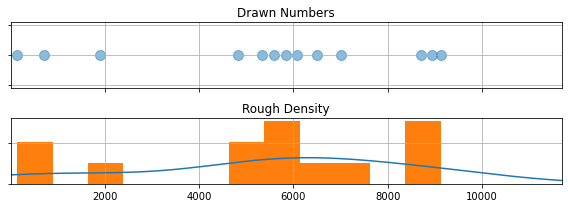
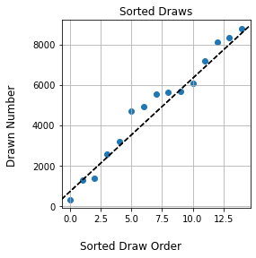
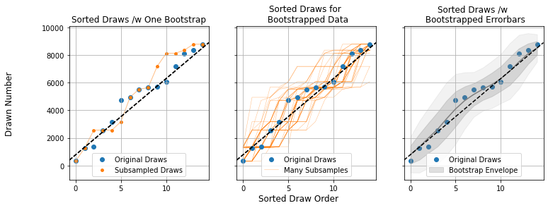

Previous Entry: [Data Tension Examples](.\..\03_suspic02\page.html)	&nbsp;	   
  
  
Go Back: [Statistics Articles](.\..\page.html)	&nbsp;	Return to [Blog Home](.\..\..\bloghome.html)  
  
---------------------------------------------------------------------------  
  
---------  
  
  
  
# Is the Raffle Rigged? Practical Stats for a Toy Problem  
  
Over the Christmas break, I was presented with an interesting question. A family member, frequenting a local sports club raffle, had become suspicious that the ticket numbers were being drawn in unusual "lumps" instead a truly "random" uniform pattern. As the ranking statistician in the family, I was pitted against the problem of answering a simple question:   
>_Is something funny going on?_  
  
You've almost definitely run across something similar in your own life: an ostensibly random process that, by coincidence or conspiracy, seems determined to have a personal vendetta against you. The human mind is pattern-seeking, and famously terrible at reckoning with true randomness. Our brains expect _smoothness_, and raise false alarms whenever this expectation is upset, with superstition and suspicion to follow soon after.  This is where statistics makes itself useful. The statistician has two jobs: firstly to tease out true patterns in systems too large for an individual human to comprehend, and secondly to properly recognise the threat of coincidence in systems so small that the human mind _over_-comprehends them. The trained statistician's lot is to answer life’s most difficult questions with the most confident "maybe"s of all time. This is an unimpressive trick and rarely gets you invited to parties, but it's important all the same.  
  
In this article, I vastly over-complicate an investigation this raffle fairness. Unlike the other articles on this blog, this is aimed at a reader _untrained_ in advanced statistics. Over the next four sections, I'll step through ways of attacking the problem in increasing levels of complexity, starting from "common-sense" approaches that you could imagine yourself creating (e.g. **[bootstrapping](https://en.wikipedia.org/wiki/Bootstrapping_(statistics))**) and steadily advancing to the high-level tools you'd see applied in astrophysics (e.g. the **[Kolmogorov–Smirnov Test](https://en.wikipedia.org/wiki/Kolmogorov%E2%80%93Smirnov_test)**). At each step, you'll see how the organizing principle for is the framing of our original question in a new and specific way, and how this question evolves over time as we ask more specific things about the world.  
  
----  
  
  
**The Setup**    
Tickets begin selling each night at some lower limit, and are purchased contiguously until the raffle begins. Tickets are cheap and players can buy as many as they like, so the number sold can easily enter the thousands. When the raffle arrives, ticket numbers are drawn randomly between the lowest and highest numbers sold, ignoring and duplicates, continuing until every prize has been awarded (typically a dozen and a half or so). If all goes well, these ticket draws should be completely random and completely uniform: any two numbers should be equally likely to come up.  
  
**The Data**    
The data we have to play with a real-world draw numbers for $188$ nights, totalling $2,976$ tickets, as well as the upper and lower bounds of the tickets sold that night. The number of sold tickets on any given night ranges from a few dozen to 10s of thousands, while the number of draws ranges from a handful to a few dozen.  
  
**The Concern**    
Consider the following: a night where $13$ numbers are drawn between $11$ and $11,680$. Instead of a nice uniformity, the numbers seem to be weirdly clustered around $\approx 6,000$, with the remainders falling into two other tight clumps (See the graph below). This seems unusual, but _how_ unusual? Would you have to play a hundred games to get that kind of clustering? A thousand? This is the first step we take in our analysis, properly defining our question:  
  
> _How close are the ticket draws to a uniform distribution?_  
  
      
  
      
  
  
## Part One: Rules of Thumb and Common Sense Diagnostics  
  
In this section, I'm going to forego any hard statistical tools and attack this with the sort of common-sense approach that someone untrained in statistics might use. These approaches might be simple, but they still have real use even in complex problems: they act as a sort of "quick glance" you might use to satisfy your curiosity or direct your focus. Specifically, I'm going to call on two new tricks:  
1. Sorting the tickets in order  
2. "Bootstrapping"  
  
**Sorting**    
The first thing we need to do is organize our data in a way we can make sense of.  The "number line" approach I used above is cluttered and hard to read, and the histogram below is coarse and patchy. We have too few tickets to build up a clear picture of the way the tickets are distributed, so trying to "bin" them gives a choppy graph where the smoothed curve we overlaid on top doing a lot of guesswork.  
  
A natural next step is to instead sort the draws in order from smallest to largest, and then scatter-plot them. This un-clutters the number line, but also avoids "binning" the tickets into number ranges. There's another advantage: if the tickets were perfectly uniform, they would sort into a clean, straight line. We've got a concrete way to ask our question now:  
>_How much do the sorted draws differ from a straight line?_  
  
If the draws show a large deviation from a straight line, this suggests that something is going funny with the numbers.  
  
      
  
      
  
**Boostrapping**    
I skipped an important detail here. I used the phrase "large deviation", but what exactly constitutes "large"? Yes, the sorted draws have some wobble, but is it a _lot_ of wobble? To answer this, we can invoke the nifty trick of [bootstrapping](https://en.wikipedia.org/wiki/Bootstrapping_(statistics)), a technique that asks "using _only_ what we know from our measurements, what sort of similar results _could_ I have gotten"? In our case, the trick goes like this:  
  
1. Take the total data set (the list of $15$ raffle draws)  
2. Randomly _subsample_ these, re-selecting another $15$ randomly from this list, allowing for double ups  
3. Repeat the sorting and plotting we did for the original draws (Left panel)  
4. Repeat steps 1-3 many times (Middle Panel), noting how wide a spread you get in the results (Right Panel)  
  
Doing this a few hundred times (middle panel), we build up an envelope of how the sorted curve _might_ look if we "smudge" it to account account for coincidence (right panel). This tamps down the effect of outliers and makes things fuzzy enough that only large, significant features really stand out. For our example night of raffle draws, we can see that the wobbles fall well within the bounds of random chance.  
  
Bootstrapping, applied properly, is a nearly universal tool for getting a rough idea of how important the bumps and variations in a data set are. If they disappear entirely into the smudgy bulk of the bootstrap, they're likely just a result of coincidence. Bootstrapping comes with a weakness though: we draw our fake data from permutations of the _real_ data, a dangerously circular process. Bootstrapping is like a Swiss-Army knife: a great and versatile tool for a first pass, but rarely the _best_ tool for a given problem.  
  
  
  
      
---  
  
## Part 2: Normalizing  
  
Bootstrapping lets us get a rough feel for how unusual our results are, but doesn't take us far down the path of understanding. Ratcheting the complexity up a tiny notch, a good next step is to _normalize_ our ticket draws. We know that each ticket is drawn between some high and low boundary, so we can replace the actual numbers with a measure of where the draws fall within that range:  
  
$$  
r = \frac{draw- lower}{upper-lower}  
$$  
  
This is basically squashing / stretching the draws from every night into a bracket from $0.0$ to $1.0$, allowing us to properly compare them to one another. The trick of normalizing opens up two possibilities:   
1. We can compare how "clumpy" the draws from each night are on the same graph (Left Panel)  
2. We can lump together _all_ of the nights into a big pool to get a feel for how lumpy the results are overall (Right panel)  
  
