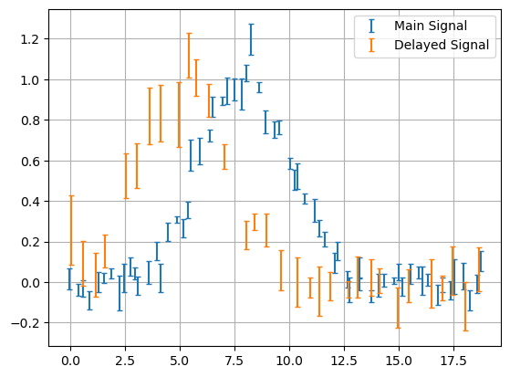
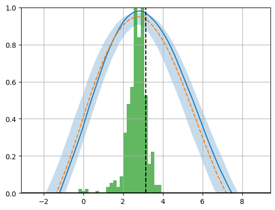

# JAX Test
A test notebook for exploring how to `jit` and `vmap` functions


```python
import jax
import jax.numpy as jnp
from jax.random import PRNGKey

from functools import partial

import numpy as np
import matplotlib.pyplot as plt
```

Example: calculate the correlation of two time series


```python
f = lambda x: np.exp(-((x-8)/2)**2/2)
X1 = np.linspace(0, 2*np.pi*3, 64)
X2 = np.copy(X1)[::2]
X1 += np.random.randn(len(X1))* X1.ptp() / (len(X1)-1)*0.25
X2 += np.random.randn(len(X2))* X2.ptp() / (len(X2)-1)*0.25

E1, E2 = [np.random.poisson(10,size=len(X)) * 0.005 for i,X in enumerate([X1,X2])]
E2*=2
lag_true = np.pi
Y1 = f(X1) + np.random.randn(len(E1))*E1
Y2 = f(X2+lag_true) + np.random.randn(len(E2))*E2

plt.figure()
plt.errorbar(X1,Y1,E1,fmt='none', capsize=2)
plt.errorbar(X2,Y2,E2,fmt='none', capsize=2 , c='tab:orange')
plt.grid()
plt.legend(["Main Signal", "Delayed Signal"])
plt.show()
```


    

    


## Naive Python, Using Numpy


```python
def correl(X1, Y1, X2, Y2, Nterp = 1024):
    Xmin, Xmax = [ f( (f(X1), f(X2)))  for f in (np.min, np.max)]
    X_interp = np.linspace(Xmin,Xmax,Nterp)
    Y1_interp = np.interp(X_interp, X1, fp=Y1, left=0, right=0)
    Y2_interp = np.interp(X_interp, X2, fp=Y2, left=0, right=0)
    out = np.corrcoef(x=Y1_interp, y = Y2_interp)[0][1]
    return(out)

def correl_func(lags, X1, Y1, X2, Y2, Nterp = 1024):
    out = np.zeros_like(lags)
    for i, lag in enumerate(lags):
        out[i] = correl(X1-lag, Y1, X2, Y2, Nterp=Nterp)
    return(out)

def correl_func_boot(lags, X1, Y1, X2, Y2, E1, E2, Nterp = 1024, Nboot = 512):
    mean = np.zeros_like(lags)
    out = np.tile(mean, [Nboot, 1])
    for i in range(Nboot):
        I1 = np.random.choice(range(len(X1)), size = int(len(X1)*np.exp(-1)), replace=False)
        I2 = np.random.choice(range(len(X2)), size = int(len(X2)*np.exp(-1)), replace=False)
        I1, I2 = np.sort(I1), np.sort(I2)

        X1p, X2p = X1[I1], X2[I2]
        Y1p = Y1[I1] + np.random.randn(len(I1))*E1[I1]
        Y2p = Y2[I2] + np.random.randn(len(I2))*E2[I2]
        out[i] = correl_func(lags, X1[I1], Y1[I1] + np.random.randn(len(I1))*E1[I1], X2[I2], Y2[I2] + np.random.randn(len(I2))*E2[I2], Nterp = Nterp)

    return(out)

#-----------------------------------
# Running
lags = np.linspace(-X1.ptp(), X1.ptp(), 512)
mean_correls = correl_func(lags, X1, Y1, X2, Y2)
scatter_correls = correl_func_boot(lags, X1, Y1, X2, Y2, E1, E2)

#-----------------------------------
# Plotting
plt.plot(lags, mean_correls)
plt.plot(lags, np.median(scatter_correls,axis=0), ls='--')
plt.fill_between(lags, np.percentile(scatter_correls,axis=0, q = 16), np.percentile(scatter_correls,axis=0,q  = 84), zorder=-10, alpha=0.25)
plt.axhline(0,c='k')
plt.hist(lags[np.argmax(scatter_correls,axis=1)], density=True, bins=24, alpha=0.75)
plt.axvline(lag_true,c='k', ls='--')
plt.ylim(0,1)
plt.xlim(-lag_true,lag_true*3)
plt.grid()
plt.show()

#-------------------------
res_mean, res_std = lags[np.argmax(scatter_correls,axis=1)].mean(), lags[np.argmax(scatter_correls,axis=1)].std()
print("Lag = %.2f +/- %.2f, consistent with true lag of %.2f at %.2f sigma" %(res_mean, res_std, lag_true, abs(lag_true-res_mean) / res_std))
```


    

    


    Lag = 2.67 +/- 0.52, consistent with true lag of 3.14 at 0.90 sigma


## Vectorized Numpy


```python
def correl_lag(lag, X1, Y1, X2, Y2, Nterp=1024):
    return(correl(X1-lag,Y1,X2,Y2,Nterp))
correlfunc_v = np.vectorize(correl_lag, excluded = ["X1","X2","Y1","Y2","Nterp"])

@np.vectorize(excluded = ["lags", "X1","X2","Y1","Y2","Nterp", "E1", "E2"])
def correl_func_boot_v(seed, lags, X1, Y1, X2, Y2, E1, E2, Nterp = 1024):
    np.random.seed(seed)
    
    I1 = np.random.choice(np.arange(len(X1)), size = int(len(X1)*np.exp(-1)), replace=False)
    I2 = np.random.choice(np.arange(len(X2)), size = int(len(X2)*np.exp(-1)), replace=False)
    I1, I2 = np.sort(I1), np.sort(I2)

    X1p, X2p = X1[I1], X2[I2]
    Y1p = Y1[I1] + np.random.randn(len(I1))*E1[I1]
    Y2p = Y2[I2] + np.random.randn(len(I2))*E2[I2]
    correls = correlfunc_v(lag=lags, X1=X1p, Y1=Y1p, X2=X2p, Y2=Y2p, Nterp=1024)
    i_max = np.argmax(correls)
    return(lags[i_max])


#-----------------------------------
# Running
correls_v = correlfunc_v(lag=lags, X1=X1, Y1=Y1, X2=X2, Y2=Y2, Nterp=1024)
vec_samples = correl_func_boot_v(seed = np.arange(512), lags=lags, X1=X1, X2=X2, Y1=Y1, Y2=Y2, E1=E1, E2=E2, Nterp=1024)

#-----------------------------------
# Plotting
plt.plot(lags, correls_v)
#plt.plot(lags, np.median(scatter_correls,axis=0), ls='--')
#plt.fill_between(lags, np.percentile(scatter_correls,axis=0, q = 16), np.percentile(scatter_correls,axis=0,q  = 84), zorder=-10, alpha=0.25)
plt.axhline(0,c='k')
plt.hist(vec_samples, density=True, bins=24, alpha=0.75)
plt.axvline(lag_true,c='k', ls='--')
plt.ylim(0,1)
plt.xlim(-lag_true,lag_true*3)
plt.grid()
plt.show()

#-------------------------
res_mean_v, res_std_v = vec_samples.mean(), vec_samples.std()
print("Lag = %.2f +/- %.2f, consistent with true lag of %.2f at %.2f sigma" %(res_mean_v, res_std_v, lag_true, abs(lag_true-res_mean_v) / res_std_v))
```

## Using JAX Vectorization


```python
def correl_jax(X1, Y1, X2, Y2, Nterp = 1024):
    Xmin, Xmax = [ f( jnp.array([f(X1), f(X2)]))  for f in (jnp.min, jnp.max)]
    X_interp = jnp.linspace(Xmin,Xmax,1024)
    Y1_interp = jnp.interp(X_interp, X1, fp=Y1, left=0, right=0)
    Y2_interp = jnp.interp(X_interp, X2, fp=Y2, left=0, right=0)
    out = jnp.corrcoef(x=Y1_interp, y = Y2_interp)[0][1]
    return(out)

correl_jax_jitted = jax.jit(correl_jax, static_argnames = ["Nterp"])
#::::::::

def correlfunc_jax(lag, X1, Y1, X2, Y2, Nterp=1024):
    return(
        correl_jax(X1 - lag,Y1,X2,Y2,Nterp)
    )

correlfunc_jax_vmapped = jax.vmap(correlfunc_jax, in_axes = (0, None, None, None, None, None))
#::::::::

def correl_func_boot_jax(seed, lags, X1, Y1, X2, Y2, E1, E2, Nterp = 1024, N1=2, N2=2):
    key = jax.random.key(seed)
    
    I1 = jax.random.choice(key = key, a = jnp.arange(X1.size), shape = (N1,), replace = False)
    I2 = jax.random.choice(key = key, a = jnp.arange(X2.size), shape = (N2,), replace = False)
    I1, I2 = jnp.sort(I1), jnp.sort(I2)

    X1p, X2p = X1[I1], X2[I2]
    Y1p = Y1[I1] + jax.random.normal(key, shape = (I1.size,) ) * E1[I1]
    Y2p = Y2[I2] + jax.random.normal(key, shape = (I2.size,) ) * E2[I2]
    correls = correlfunc_jax_vmapped(lags, X1p, Y1p, X2p, Y2p, 1024)
    i_max = jnp.argmax(correls)
    return(lags[i_max])


correl_func_boot_jax_nomap = jax.jit(correl_func_boot_jax, static_argnames=["Nterp", "N1", "N2"])

correl_func_boot_jax = jax.vmap(correl_func_boot_jax, in_axes = (0, None, None, None, None, None, None, None, None, None, None ) )
correl_func_boot_jax = jax.jit(correl_func_boot_jax, static_argnames=["Nterp", "N1", "N2"])

def correl_func_boot_jax_wrapper(lags, X1, Y1, X2, Y2, E1, E2, Nterp = 1024, Nboot=512, r=jnp.exp(-1)):
    seeds = jnp.arange(Nboot)
    N1, N2 = int(len(X1)*r), int(len(X2)*r)

    out = correl_func_boot_jax(seeds, lags, X1, Y1, X2, Y2, E1, E2, Nterp, N1, N2)
    
    return(out)

def correl_func_boot_jax_wrapper_nomap(lags, X1, Y1, X2, Y2, E1, E2, Nterp = 1024, Nboot = 512, r=jnp.exp(-1)):
    seeds = jnp.arange(Nboot)
    N1, N2 = int(len(X1)*r), int(len(X2)*r)

    out = [correl_func_boot_jax_nomap(seed, lags, X1, Y1, X2, Y2, E1, E2, Nterp, N1, N2) for seed in range(Nboot)]
    
    return(jnp.array(out))

#-----------------------------------
# Running
correls_jax = correlfunc_jax_vmapped(lags, X1, Y1, X2, Y2, 1024)
jax_samples = correl_func_boot_jax_wrapper_nomap(lags, X1, Y1, X2, Y2, E1, E2, Nterp = 1024, Nboot = 128)

#-----------------------------------
# Plotting
plt.plot(lags, correls_jax)
plt.axhline(0,c='k')
plt.hist(jax_samples, density=True, bins=24, alpha=0.75)
plt.axvline(lag_true,c='k', ls='--')
plt.ylim(0,1)
plt.xlim(-lag_true,lag_true*3)
plt.grid()
plt.show()
```


```python
Nterp, Nboot = 1024, 512

print("Non-Vectorized")
%time correl_func_boot(Nboot = Nboot, lags=lags, X1=X1, X2=X2, Y1=Y1, Y2=Y2, E1=E1, E2=E2, Nterp=Nterp)

print("Numpy vectorized")
%time correl_func_boot_v(seed = np.arange(Nboot), lags=lags, X1=X1, X2=X2, Y1=Y1, Y2=Y2, E1=E1, E2=E2, Nterp=Nterp)

print("JAX vectorized")
#%time correl_func_boot_jax_wrapper(Nboot=Nboot, lags=lags, X1=X1, X2=X2, Y1=Y1, Y2=Y2, E1=E1, E2=E2, Nterp=Nterp).block_until_ready()

print("JAX Jitted")
%time correl_func_boot_jax_wrapper_nomap(Nboot=Nboot, lags=lags, X1=X1, X2=X2, Y1=Y1, Y2=Y2, E1=E1, E2=E2, Nterp=Nterp).block_until_ready()

print("Done.")
```

## Jit and Vmap from scratch
The most stripped down JAX example for jitting and vmapping I can get running


```python
def f(X, N, a, seed):
    '''
    For a vector X, draw 'N' samples from a*X and return the mean
    '''
    out = jax.random.choice(jax.random.key(seed), a=a*X, shape=(N,))
    return(out.mean())

#---------------
X = np.linspace(0,1,512)
N = 32
a = 5
#---------------

# Standard Run
print(
    f(X, N=N, a=a, seed = 1)
)

# Jitted run
f_jit = jax.jit(f, static_argnames=['N'])
print(
    f_jit(X, N=N, a=a, seed = 1)
)

# Vmapped run. Indicates that we vmap over the zeroth axis of the fourth arg. No way to feed this by name without a dict input ATM
f_vmap = jax.vmap(f, (None, None, None, 0))
print(
    f_vmap( X, N, a, jnp.arange(5)) # Once vmapped, we can no longer feed args by keyword
)

# Both
f_vjit = jax.jit(f_vmap, static_argnames=['N'])
print(
    f_vjit( X, N, a, jnp.arange(5))
)
```
