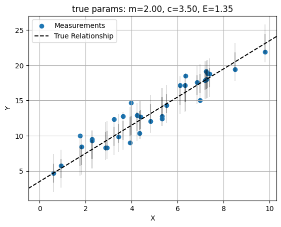
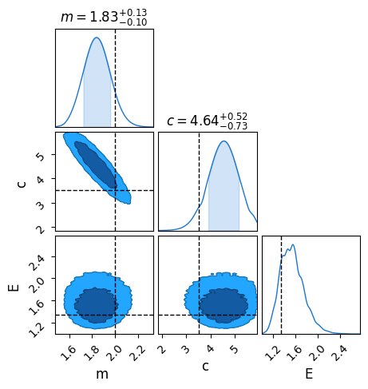
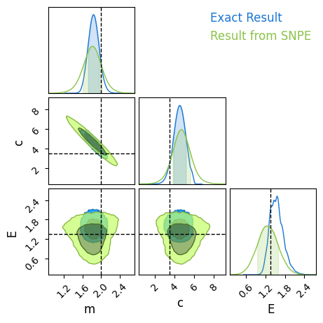

```python
import torch
from sbi import utils as utils
from sbi import analysis as analysis
from sbi.inference.base import infer

import numpy as np
import matplotlib.pyplot as plt
from chainconsumer import ChainConsumer
```

## Linear Regression
First generate some data. Here we have a case of a linear regression with constant scatter:

$$
y_i \sim m \cdot x_i + c + \mathcal{N}(0,E)
$$

Where $x\sim U(0,10)$ and $(m,c,E) = (2,3.5,1.35)$, and we have $32$ observations.


```python
# Model 'truth' parameters  
m_true = 2  
c_true = 3.5  
E_true = 1.35
  
#----------------------------  
# Data generation  
ebar, escatter = 1.5, 10 # Average & spread of error bar  
  
np.random.seed(123) # Fix the random seed so results are consistent across different examples  
X = np.random.rand(32) * 10  
E = np.random.poisson(lam=escatter, size=1) / escatter * ebar  
E = float(E)
Y = m_true*X + c_true + E*np.random.normal(size=len(X)) # Linear rel /w random noise based on 'E'  
  
#--------------  
# Plotting  
plt.figure()  
plt.scatter(X,Y,label='Measurements')  
plt.errorbar(X,m_true*X+c_true,E,fmt='none', capsize=0, c='k', alpha=0.25)  
plt.errorbar(X,m_true*X+c_true,E*2,fmt='none', capsize=0, c='k', alpha=0.125)  
plt.axline( [0,c_true], slope=m_true, c='k', ls='--', label='True Relationship')  
plt.legend(loc='best')  
plt.xlabel("X"), plt.ylabel("Y")  

plt.title("true params: m=%.2f, c=%.2f, E=%.2f" %(m_true,c_true,E))
plt.grid()  
plt.show()  
```


    

    


## Analytic Example

In this example we know the likelihood function analytically. Ignoring matters of normalization, it obeys:

$$
\mathcal{L}(x\vert\theta) \propto \prod_i \frac{1}{E} \exp \left(\frac{-1}{2} \left( \frac{m\cdot x_i  + c - y_i}{E} \right)^2 \right)
$$

Defining as a function:


```python
def f_LL_exact(m,c,E,X,Y):
    Y_pred = X*m + c
    out = -1/2 * (Y-Y_pred)**2 / E**2 - np.log(E)
    out = out.sum()
    return(out)
```

And then evaluating this on a grid...


```python
Mgrid, Cgrid, Egrid = np.linspace(1.2,3,64+1, endpoint=False)[1:], np.linspace(0,6,64+1, endpoint=False)[1:], np.linspace(0,5,64+1, endpoint=False)[1:]
Mgrid, Cgrid, Egrid = np.meshgrid(Mgrid, Cgrid, Egrid)
Mgrid, Cgrid, Egrid = Mgrid.flatten(), Cgrid.flatten(), Egrid.flatten()

LL_exact = np.array([f_LL_exact(m, c, e, X, Y) for m,c,e in zip(Mgrid, Cgrid, Egrid)])
```

...and passing to `chainconsumer` to see observe the ground truth:


```python
C = ChainConsumer()
truth = {'m': m_true, 'c': c_true, 'E': E}
C.add_chain({'m': Mgrid, 'c':Cgrid, 'E': Egrid}, weights=np.exp((LL_exact-LL_exact.max())), name="Exact Result")
C.plotter.plot(truth = truth)
plt.show()
```

    WARNING:chainconsumer:Parameter E in chain Exact Result is not constrained


    

    


## Attacking this with SNPE
Now on to `sbi`, specifically the **Simulated Neural Posterior Estimation**. This simulates a large set of data and then trains a neural network to learn what the posterior distribution looks like for some data set. To begin, set up a prior distribution for `sbi` and turn the numpy-like data `X,Y` into `torch`-friendly tensors:


```python
prior = utils.BoxUniform(low=torch.Tensor([-5, -10, 0]),
                        high=torch.Tensor([5, 10, 5]))

Xtorch, Ytorch = torch.from_numpy(X), torch.from_numpy(Y)
```

Then create a generative model. I'm training this one to take the entire vectors `X` and `Y` as its input and output. We generate simulations and train the neural network to learn what posteriors should look like:


```python
def simulator_SNPE(parameter_set: 'm, c, E'):
    m, c, _E = parameter_set
    out = m*Xtorch + c + _E * torch.randn(Xtorch.shape)
    return out

posterior_SNPE = infer(simulator_SNPE, prior, method="SNPE", num_simulations=10_000)
```


    Running 10000 simulations.:   0%|          | 0/10000 [00:00<?, ?it/s]


     Neural network successfully converged after 139 epochs.

Now we can draw MCMC-like samples for our observed data, which lives in `Ytorch`:


```python
samples_SNPE = posterior_SNPE.sample((50_000,), x=Ytorch)
```


    Drawing 50000 posterior samples:   0%|          | 0/50000 [00:00<?, ?it/s]


Now make a torch-friendly grid of sites and fire them in 

With samples like this, we can extract them into a `chainconsumer` friendly format. `torch` tensors dont play nice with `chainconsumer`, unfortunately, so we need to transform them back into `numpy` arrays with a somewhat obtuse command:


```python
samples_forcc = {'m':samples_SNPE[:,0].detach().cpu().numpy(), 
                 'c':samples_SNPE[:,1].detach().cpu().numpy(), 
                 'E':samples_SNPE[:,2].detach().cpu().numpy()
                }
```

With this in hand we can compare to the ground truth. The neural net has done a good job of learning what the gradient and offset look like, but has had a little trouble with estimating the scatter. With a longer training run / more simulations this would eventually converge.


```python
C.add_chain(samples_forcc, name = "Result from SNPE")
C.plotter.plot(truth = truth)
plt.show()
```

    WARNING:chainconsumer:Configure has been called 2 times - this is not good - it should be once!
    WARNING:chainconsumer:To avoid this, load your chains in first, then call analysis/plotting methods


    

    


## SNLE

Unlike SNPE, SNLE limits its scope to using neural nets to learn a shape for the likelihood function, filling in that specific gap in cases where we don't have a closed form mathematical expression. In that spirit, I'm going to set the generative model up to only simulate _one_ data point at a time, i.e.:

$$
\mathcal{L}(\vec{x} ,\vec{y} \vert x,m,c,E) = \exp \left( \sum_i f(x_i,y_i\vert m,c,E) \right)
$$

Where $f(x , y \vert m,c,E)$ is some function learned by a neural net:


```python
def simulator_SNLE(parameter_set: 'm, c, E'):
    m, c, _E = parameter_set
    _X = torch.rand(1)*10
    _Y = m*_X + c + _E * torch.randn(1)
    out = torch.cat([_X, _Y])
    return out

posterior_SNLE = infer(simulator_SNLE, prior, method="SNLE", num_simulations=1_000)
```


    Running 1000 simulations.:   0%|          | 0/1000 [00:00<?, ?it/s]


     Neural network successfully converged after 83 epochs.

Now we can evaluate this function over the same grid as before, after doing a little rearranging of the data:


```python
observation = [[x,y] for x,y in zip(X,Y)]
sites = [[float(x), float(y), float(e)] for x, y, e in zip(Mgrid,Cgrid, Egrid)]
LL = sum([posterior_SNLE.log_prob( sites, x=observation[i]) for i in range(len(observation))])
```

    /home/hughmc/anaconda3/envs/sbi_env/lib/python3.7/site-packages/sbi/inference/posteriors/mcmc_posterior.py:174: UserWarning: `.log_prob()` is deprecated for methods that can only evaluate the
                log-probability up to a normalizing constant. Use `.potential()` instead.
      log-probability up to a normalizing constant. Use `.potential()` instead."""
    /home/hughmc/anaconda3/envs/sbi_env/lib/python3.7/site-packages/sbi/inference/posteriors/mcmc_posterior.py:176: UserWarning: The log-probability is unnormalized!
      warn("The log-probability is unnormalized!")


Comparing, we see that this hasn't done the best job of converging, even with $10,000$ simulated datapoints.


```python
C.add_chain({'m': Mgrid, 'c':Cgrid, 'E': Egrid}, weights=np.exp((LL-LL.max())).detach().cpu().numpy(), name = "Result from SNLE")
C.plotter.plot(truth = truth, chains = ["Exact Result", "Result from SNLE"])
plt.show()
```
