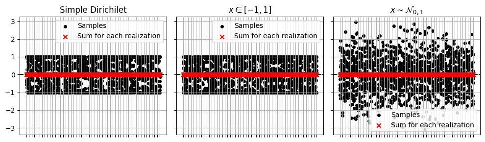
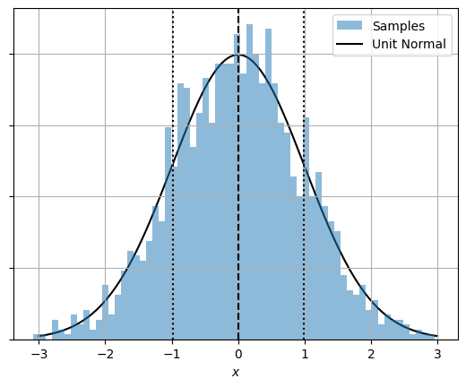
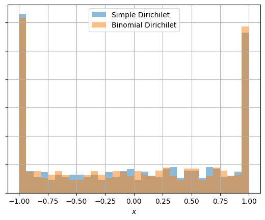

Previous Entry: [Is the Raffle Rigged?](.\..\03_raffle\page.html)	&nbsp;	   
  
  
Go Back: [Statistics Articles](.\..\page.html)	&nbsp;	Return to [Blog Home](.\..\..\bloghome.html)  
  
[Return to Site Home](https://hughmcdougall.github.io/)  
  
---------------------------------------------------------------------------  
  
---------  
  
  
```python  
import jax.numpy as jnp  
import numpyro  
import matplotlib.pyplot as plt  
import numpy as np  
import numpyro.distributions as dist  
import jax  
```  
  
There are two domains we might want to generate $\sum x = 0.0$ over:  
 * With $x\in[-1,1]$   
 * With $x\in \mathbb{R}$ and distributed over a unit normal, $x\sim\mathcal{N}_{0,1}$  
  
For the first case there are two ways to do this: a simple but less obvious way and a more labrious but easier to interpret way.  
1. Draw from a dirichilet distribution and subtract off the average  
2. We don't know how many samples will be $x>0$ and how many will fall below the zero line, but we can randomize these numbers, $N_1$ and $N_2$ with an equally weighted binomial distribution. Then, knowing that the "mass" (sum) of points either side must be equal, we can draw the values for the $N_{1/2}$ samples and invert the $x<0$ values. There's the caveat that we need $N_{1/2} > 0$, but this just takes a few tweaks to how we sample them.  
These end up being equivalent (see last fig).  
  
For the continuous domain things are much easier. Draw $N$ samples from a unit normal and subtract off the mean so that they sum to zero. This constrains the values and narrows the overall distribution, and so we need to scale up by a factor $\sqrt{1+\frac{1}{N-1}}$ to get the right variance.  
  
  
```python  
  
def model_simple(N):  
    x = numpyro.sample('x', dist.Dirichlet(jnp.ones(N)))  
    x-=X.mean()  
    return(x)  
      
def model_cont(N):  
    x = numpyro.sample('x1', dist.Normal(0,1), sample_shape=(N,))  
    x-=x.sum()/N  
    x*=jnp.sqrt(1+1/(N-1))  
    return(x)  
      
  
def model_disc(N):  
    N1 = numpyro.sample('N1',dist.Binomial(N-2,0.5)) + 1  
    N2 = numpyro.deterministic('N2',N-1-N1) + 1  
  
    if N1>1:  
        x1 = numpyro.sample('x1', dist.Dirichlet(jnp.ones(N1)))  
    elif N1==1:  
        x1 = jnp.array([1.0])  
  
    if N2>1:  
        x2 = numpyro.sample('x2', dist.Dirichlet(jnp.ones(N2))) * -1  
      
    elif N2==1:  
        x2 = jnp.array([-1.0,])  
      
    return(jnp.concatenate([x1,x2]))  
```  
  
Now testing this for $N=3$ samples over $M=512$ realizations:  
  
  
```python  
N = 3  
M = 512  
X0 = np.zeros(N*M)  
X1 = np.zeros(N*M)  
X2 = np.zeros(N*M)  
for i in range(M):  
    #if i//(M//100)==0: print(i,end='\t')  
    with numpyro.handlers.seed(rng_seed=jax.random.PRNGKey(i)):  
        X0[i*(N):(i+1)*(N)] = np.array(model_disc(N))  
        X1[i*(N):(i+1)*(N)] = np.array(model_disc(N))  
        X2[i*(N):(i+1)*(N)] = np.array(model_cont(N))  
```  
  
We can plot the results to confirm that their sums are zero (to within `jax` default `32-bit` precision.  
  
  
```python  
f, (a0,a1,a2) = plt.subplots(1,3,sharey=True, figsize=(10,3))  
  
a0.scatter(np.tile(np.arange(M),[N,1]), X0.reshape(M,N), label = "Samples", s=16, marker='o', c='k')  
a0.scatter(np.arange(M), X0.reshape(M, N).sum(axis=1), label = "Sum for each realization", marker='x' , zorder=10, c='r')  
  
a1.scatter(np.tile(np.arange(M),[N,1]), X1.reshape(M,N), label = "Samples", s=16, marker='o', c='k')  
a1.scatter(np.arange(M), X1.reshape(M, N).sum(axis=1), label = "Sum for each realization", marker='x' , zorder=10, c='r')  
  
a2.scatter(np.tile(np.arange(M),[N,1]), X2.reshape(M,N), label = "Samples", s=16, marker='o', c='k')  
a2.scatter(np.arange(M), X2.reshape(M, N).sum(axis=1), label = "Sum for each realization", marker='x' , zorder=10, c='r')  
for a in (a0,a1,a2):  
    a.axhline(0,ls='--',c='k')  
    a.grid()  
    a.legend()  
    a.set_xticks(range(M)[::max(1,M//50)])  
    a.set_xticklabels([])  
  
a0.set_title("Simple Dirichilet")  
a1.set_title("$x\in[-1,1]$")  
a2.set_title("$x\sim\mathcal{N}_{0,1}$")  
f.tight_layout()  
plt.show()  
```  
  
  
      
  
      
  
  
And now confirm that the normal distribution is in fact normally distributed:  
  
  
```python  
xplot = np.linspace(-3,3,1024)  
  
plt.hist(X2,bins=64,density=True, label = 'Samples', alpha=0.5)  
plt.axvline(X2.mean(),c='k',ls='--')  
for sign in [+1,-1]: plt.axvline(X2.mean() + sign*X2.std(),c='k',ls=':')  
plt.plot(xplot,1/np.sqrt(2*np.pi)*np.exp(-xplot**2/2), label = 'Unit Normal', c='k', zorder=-1)  
  
plt.xlabel('$x$')  
plt.grid()  
plt.legend()  
plt.gca().set_yticklabels([])  
plt.show()  
  
```  
  
  
      
  
      
  
  
Finally, confirm that the simple dirichilet and more explicit dirichilet are identical:  
  
  
```python  
plt.hist(X0,32,alpha=0.5,density=True, label='Simple Dirichilet')  
plt.hist(X1,32,alpha=0.5,density=True, label='Binomial Dirichilet')  
plt.xlabel('$x$')  
plt.grid()  
plt.legend()  
plt.gca().set_yticklabels([])  
plt.show()  
```  
  
  
      
  
      
  
  
  
---------  
  
This page by Hugh McDougall, 2024  
  
  
  
For more detailed information, feel free to check my [GitHub repos](https://github.com/HughMcDougall/) or [contact me directly](mailto: hughmcdougallemail@gmail.com).  
  
