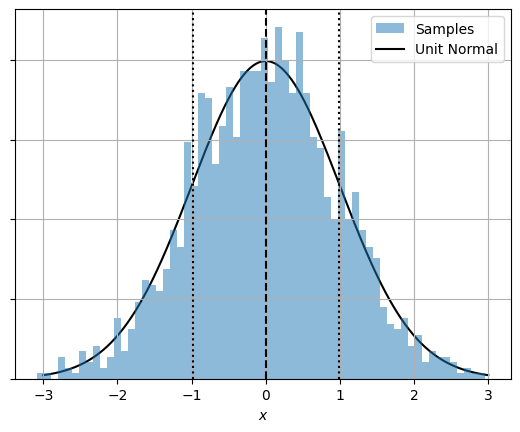

```python
import jax.numpy as jnp
import numpyro
import matplotlib.pyplot as plt
import numpy as np
import numpyro.distributions as dist
import jax
```

There are two domains we might want to generate $\sum x = 0.0$ over:
 * With $x\in[-1,1]$ 
 * With $x\in \mathbb{R}$ and distributed over a unit normal, $x\sim\mathcal{N}_{0,1}$

For the first case there are two ways to do this: a simple but less obvious way and a more labrious but easier to interpret way.
1. Draw from a dirichilet distribution and subtract off the average
2. We don't know how many samples will be $x>0$ and how many will fall below the zero line, but we can randomize these numbers, $N_1$ and $N_2$ with an equally weighted binomial distribution. Then, knowing that the "mass" (sum) of points either side must be equal, we can draw the values for the $N_{1/2}$ samples and invert the $x<0$ values. There's the caveat that we need $N_{1/2} > 0$, but this just takes a few tweaks to how we sample them.
These end up being equivalent (see last fig).

For the continuous domain things are much easier. Draw $N$ samples from a unit normal and subtract off the mean so that they sum to zero. This constrains the values and narrows the overall distribution, and so we need to scale up by a factor $\sqrt{1+\frac{1}{N-1}}$ to get the right variance.


```python

def model_simple(N):
    x = numpyro.sample('x', dist.Dirichlet(jnp.ones(N)))
    x-=X.mean()
    return(x)
    
def model_cont(N):
    x = numpyro.sample('x1', dist.Normal(0,1), sample_shape=(N,))
    x-=x.sum()/N
    x*=jnp.sqrt(1+1/(N-1))
    return(x)
    

def model_disc(N):
    N1 = numpyro.sample('N1',dist.Binomial(N-2,0.5)) + 1
    N2 = numpyro.deterministic('N2',N-1-N1) + 1

    if N1>1:
        x1 = numpyro.sample('x1', dist.Dirichlet(jnp.ones(N1)))
    elif N1==1:
        x1 = jnp.array([1.0])

    if N2>1:
        x2 = numpyro.sample('x2', dist.Dirichlet(jnp.ones(N2))) * -1
    
    elif N2==1:
        x2 = jnp.array([-1.0,])
    
    return(jnp.concatenate([x1,x2]))
```

Now testing this for $N=3$ samples over $M=512$ realizations:


```python
N = 3
M = 512
X0 = np.zeros(N*M)
X1 = np.zeros(N*M)
X2 = np.zeros(N*M)
for i in range(M):
    #if i//(M//100)==0: print(i,end='\t')
    with numpyro.handlers.seed(rng_seed=jax.random.PRNGKey(i)):
        X0[i*(N):(i+1)*(N)] = np.array(model_disc(N))
        X1[i*(N):(i+1)*(N)] = np.array(model_disc(N))
        X2[i*(N):(i+1)*(N)] = np.array(model_cont(N))
```

We can plot the results to confirm that their sums are zero (to within `jax` default `32-bit` precision.


```python
f, (a0,a1,a2) = plt.subplots(1,3,sharey=True, figsize=(10,3))

a0.scatter(np.tile(np.arange(M),[N,1]), X0.reshape(M,N), label = "Samples", s=16, marker='o', c='k')
a0.scatter(np.arange(M), X0.reshape(M, N).sum(axis=1), label = "Sum for each realization", marker='x' , zorder=10, c='r')

a1.scatter(np.tile(np.arange(M),[N,1]), X1.reshape(M,N), label = "Samples", s=16, marker='o', c='k')
a1.scatter(np.arange(M), X1.reshape(M, N).sum(axis=1), label = "Sum for each realization", marker='x' , zorder=10, c='r')

a2.scatter(np.tile(np.arange(M),[N,1]), X2.reshape(M,N), label = "Samples", s=16, marker='o', c='k')
a2.scatter(np.arange(M), X2.reshape(M, N).sum(axis=1), label = "Sum for each realization", marker='x' , zorder=10, c='r')
for a in (a0,a1,a2):
    a.axhline(0,ls='--',c='k')
    a.grid()
    a.legend()
    a.set_xticks(range(M)[::max(1,M//50)])
    a.set_xticklabels([])

a0.set_title("Simple Dirichilet")
a1.set_title("$x\in[-1,1]$")
a2.set_title("$x\sim\mathcal{N}_{0,1}$")
f.tight_layout()
plt.show()
```


    

    


And now confirm that the normal distribution is in fact normally distributed:


```python
xplot = np.linspace(-3,3,1024)

plt.hist(X2,bins=64,density=True, label = 'Samples', alpha=0.5)
plt.axvline(X2.mean(),c='k',ls='--')
for sign in [+1,-1]: plt.axvline(X2.mean() + sign*X2.std(),c='k',ls=':')
plt.plot(xplot,1/np.sqrt(2*np.pi)*np.exp(-xplot**2/2), label = 'Unit Normal', c='k', zorder=-1)

plt.xlabel('$x$')
plt.grid()
plt.legend()
plt.gca().set_yticklabels([])
plt.show()

```


    

    


Finally, confirm that the simple dirichilet and more explicit dirichilet are identical:


```python
plt.hist(X0,32,alpha=0.5,density=True, label='Simple Dirichilet')
plt.hist(X1,32,alpha=0.5,density=True, label='Binomial Dirichilet')
plt.xlabel('$x$')
plt.grid()
plt.legend()
plt.gca().set_yticklabels([])
plt.show()
```


    

    

