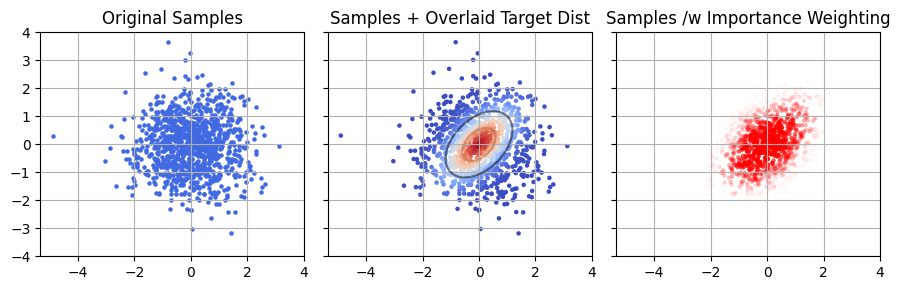
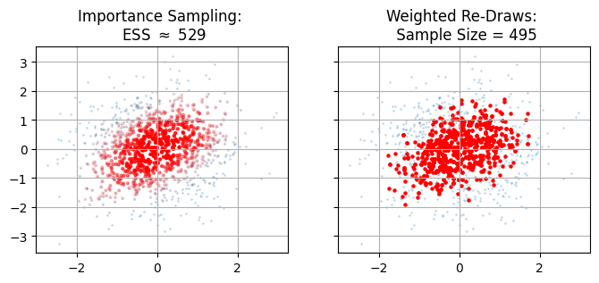

Previous Entry: [The Bayes-Sics](.\..\06_bayesics\page.html)	&nbsp;	   
  
  
Go Back: [Statistics Articles](.\..\page.html)	&nbsp;	Return to [Blog Home](.\..\..\bloghome.html)  
  
[Return to Site Home](https://hughmcdougall.github.io/)  
  
---------------------------------------------------------------------------  
  
---------  
  
  
  
# The Importance of Importance Sampling  
  
If you've spent more than a few minutes working in Bayesian numerical statistics, you've probably run across [**importance sampling**](https://en/wikipedia.org/importance_sampling), the ugly ducking of Bayesian methods. The idea behind importance sampling is to take sample from one distribution (usually the output of something like an MCMC sampler) and, using sample weights, nudge them in a way that lets us re-use them as though they were from a _different_ but _similar_ distribution.  
  
**An Overly General Derivation**  
  
A common problem in statistics is wanting to know the average value of some property over some **target distribution**, i.e. finding some expected value:  
  
$$  
E_T \left[ f(\theta) \right]=\int f(\theta) P_T(\theta) d\theta  
$$  
  
This might seem a bit abstract, but as we'll see later this covers a lot of use cases. If you have some set of $I$ samples drawn from the target distribution $\{ \theta_i \} \sim P_T(\theta)$ (e.g. from MCMC), then this expected value can be found easily by averaging over the samples:  
  
$$  
E_T \left[ f(\theta) \right] = \frac{1}{I} \sum_i f(\theta_i)  
$$  
  
But what if we _don't_ have those samples, and instead have them drawn from a similar but distinct **sampling distribution**, $\{ \theta_i \} \sim P_S(\theta)$. This is where importance sampling comes in: we can easily express that integral over the sampling distribution:  
  
$$  
\int f(\theta) P_T(\theta) d\theta = \int f(\theta) \frac{P_T(\theta)}{P_S(\theta)} P_S(\theta) d\theta = E_S \left[ f(\theta) \frac{P_T(\theta)}{P_S(\theta)} \right]  
$$  
  
Meaning we can get an average over the target distribution with a weighted sum over the sampling distribution:  
  
$$  
E_S \left[ f(\theta)\frac{P_T(\theta)}{P_S(\theta)} \right] =  \frac{1}{I} \sum_i{ \frac{P_T(\theta_i)}{P_S(\theta_i)} f(\theta_i)}  
$$  
  
You'll notice that this is functionally the same as taking weighted redraws of out samples with weights $w_i=\frac{P_T(\theta_i)}{P_S(\theta_i)}$.  
  
  
  
  
      
  
      
  
  
In most contexts, importance sampling is used to describe cases where our samples are drawn in some stochastic way, e.g. them being the output of some MCMC or nested sampling run on a similar problem. In these cases, the sampling density is the posterior density normalized by the model evidence, i.e. if our sampling distribution is the posterior for model $S$ fitting some data $d$ then:  
  
$$  
P_S(\theta) = \frac{1}{Z_S(d)} \mathcal{L}(\theta\vert d,S) \times \pi(\theta \vert S)  
$$  
  
I discuss this more at the end of this article, but the same reasoning can be applied in a much broader sense. Prior sampling, nested sampling, and any number of other methods can all be described as various flavours of importance sampling.  
  
**But Why?**  
  
Given importance sampling is conceptually analagous to weighted re-draws, you might find yourself asking "why bother?" The answer is down to sample size - anything we do to recycle existing samples is necessarily going to result in a _smaller_ final chain of sample, and we want to keep this loss rate as low as possible. For weighted redraws, our new sample size is just the number of unique samples that we've retained. For importance sampling, we can make use of an estimator outline in [this paper](https://arxiv.org/pdf/1602.03572), which gives an effective sample size (ESS) of:  
$$  
\mathrm{ESS}_\mathrm{Imp. Samp.} = \frac{\left( \sum_{i}{w_i} \right)^2}{\sum_{i}{w_i^2}}  
$$  
If we do this for our example above, we find that full importance sampling gives us a markedly higher sample size. The reason is pretty intuitive: re-drawing necessarily throws away all our low-density samples. Individually these aren't interesting, but in aggregate those low weight samples stack up to a significant amount of the domain. In importance sampling, we keep track of every sample site we can. This low weight "shell" mightn't be that big In this 2D example, but it's easy to imagine how it might grow to form the lion's share of the samples in higher dimensions or in distributions with long tails.  
  
  
  
  
      
  
      
  
  
## Evidences from Importance Sampling  
  
Up to now, I've talked about importance sampling to get "integrals" in the general sense, but this is a bit vague. Let's look at maybe the most common integral we come across in Bayes work: the [model evidence](https://en.wikipedia.org/wiki/Marginal_likelihood) (or more generally, marginal probability). For some model $M$ with parameters $\theta$, the evidence is the total ability of the model to explain some observed data $d$:  
  
$$  
Z_M = \int \mathcal{L}(d \vert \theta,M) \pi(\theta \vert M) d\theta  
$$  
  
Doing our importance sampling trick, we can turn this into an expected value over ours sampling distribution $S$:  
  
$$  
Z_M = \int \frac{\mathcal{L}(d \vert \theta,M) \pi(\theta \vert M) }{P_S(\theta)} P(\theta)d\theta = E_S \left[\frac{\rho_m(\theta)}{P_s(\theta)} \right]  
$$  
  
I've wrapped the whole numerator up in a single _non_-normalized "mass density" $\rho_M(\theta)$, and we'll see why in a moment. Assuming we know the density for $P_S(\theta)$ and can draw samples from it, this is again a nice tidy discrete summation:  
  
$$  
Z_m \approx \sum_i \frac{\rho_m(\theta)}{P_s(\theta)},\ \ \{\theta_i\} \sim P_s(\theta)  
$$  
  
Let's take a beat and think about what this actually means. Every sample $\theta_i$ "owns" a region of parameter space with volume $\Delta V_i = 1/P_s(\theta)$, i.e. "one sample per volume $\Delta V_i$. Thinking in this way, the summation looks a lot more like the familiar idea of evidence being the "probability mass" to $\rho_M$'s "probability density":  
  
$$  
Z_m \approx \sum_i \rho_m(\theta) \Delta V_i  
$$  
  
  
  
**A Simple But Motivated Example - Recycling Posterior Chains for Changing Priors**  
  
This can all seem a little abstract, but there's a simple motivated case example: changing priors without having to run an expensive MCMC run. Consider Gravitational Wave (GW) science, where we get a waveform describing how a particular GW event distort space as it passes over our detectors. Programs like [`bilby`](https://bilby-dev.github.io/bilby/) take these waveforms and do an expensive Bayesian fit for an entire _fifteen_ model parameters, an endeavour that can take multiple days on a computer cluster. These fits usually assume the vaguest possible priors to avoid confirmation bias, but we have plenty of physically motivated priors for things like the mass, spin alignment etc of the colliding objects that produced the wave.  
  
In strict Bayesian nonclemature, these two priors are two models. We have a "null" model with vague priors, $\varnothing$, and a physics model with informative priors, $M$. In both models the likelihood is the same for some data $d$, i.e.:  
  
$$  
\mathcal{L}(d \vert \theta , \varnothing) = \mathcal{L}(d \vert \theta , M) = \mathcal{L}(d \vert \theta)  
$$  
  
Our target distribution is the posterior with the informative priors:  
  
$$  
P_T(\theta) = \pi(\theta \vert M) \mathcal{L}(d \vert \theta)  
$$  
  
While our sampling distribution is the posterior with the null priors:  
  
$$  
P_S(\theta) = \pi(\theta \vert \varnothing) \mathcal{L}(d \vert \theta)  
$$  
  
So the sampling ratio is just the ratio of the priors:  
  
$$  
\frac{P_T(\theta)}{P_S(\theta)} = \frac{\pi(\theta \vert M)}{\pi(\theta \vert \varnothing)}  
$$  
  
Meaning we could get $\theta \sim P(\theta |d,M)$ by doing a weighted redraw of $\theta \sim P(\theta |d,\varnothing)$. In GW circles this is called _recycling_ of the posterior chains. The motivation here is that fitting the posterior chains is expensive and time consuming, and we'd rather not burn all that CPU time to slightly nudge our priors. Importance sampling shines here because it lets us re-shape our samples without needing to re-do the onerous likelihood calculations and without needing to tangle with the difficult task of finding contours in high dimensions, as the heavy lifting was already done in the initial fit to $\varnothing$.  
  
  
  
    /tmp/ipykernel_56396/3089753056.py:24: DeprecationWarning: `trapz` is deprecated. Use `trapezoid` instead, or one of the numerical integration functions in `scipy.integrate`.  
      a.plot(Xgrid, prior_old(Xgrid) / np.trapz(Xgrid, prior_old(Xgrid)) * -1 , label = "Original Prior", color = 'tab:orange')  
    /tmp/ipykernel_56396/3089753056.py:26: DeprecationWarning: `trapz` is deprecated. Use `trapezoid` instead, or one of the numerical integration functions in `scipy.integrate`.  
      a.plot(Xgrid, prior_new(Xgrid) / np.trapz(Xgrid, prior_new(Xgrid)) * -1 , label = "New Prior", color = 'tab:green')  
  
  
  
      
  
      
  
  
**A More Realistic Example - Hierarchical Models**    
If we're being realistic, slightly altering out priors is probably not the best justified case for using importance sampling. If we can run a sampler once, we can probably run it twice. However we might _not_ be able to justify running it _hundreds_ of times if we, for the sake of argument, wanted to trial many different priors. Similarly, the cost of re-running samplers rapidly blows out if we need to do it for many many sources, and the problem compounds if we need to do both at once. Of course, we have a name for trialling many different types of prior with many sources simultaneously: we call it a _hierarchical model_.   
  
Let's consider a practical example: my home turf of [AGN reverberation mapping](#missingno)(RM). In RM we measure a lag $\Delta t$ between two signals from a distant quasar, and use this echo RM to measure how large the system is. RM is a fiddly problem (see [my paper](#missingno) on the difficulties if you're interested) but numerically definitely in the "low dimension" scale: including the lag we only need to fit about $6$ parameters. When fitting lags, we usually adopt a generously vague prior over $\Delta t$, but we also know that there's a scaling relationship between the lag and the luminosity of the quasar, a power-law "Radius-Luminosity" (R-L) relationship, which is a necessarily more informative prior. If we're doing thing's properly, we would want to fit both the slope, offset and spread of the R-L relationship at the same time as a giant set of lags, i.e. we'd want to fit a _hierarchical model_.   
  
In hierarchical models, every event $j$ is fit to a prior $\pi(\theta_j \vert \Lambda)$, where $\Lambda$ are the parameters that describe the prior itself:  
  
$$  
\pi(\theta \vert \varnothing) \rightarrow \pi(\Lambda \vert M) \pi(\theta \vert \Lambda)  
$$  
  
We fit for $\{\theta_j\}$ _at the same time_ as $\Lambda$. Assuming each source $j$ is uncorrelated, the marginal likelihood (i.e. 'goodness of fit') for a particular population model is  
  
\begin{align}  
\mathcal{L}(\Lambda \vert d)   
&= P(\Lambda) \prod_j \left( {\int P(\theta_k \vert d_j) d\theta_j} \right)  
\\&= P(\Lambda) \prod_j \frac{1}{Z(d_j)} \left( {\int \mathcal{L}(d_j \vert \theta_j) \pi (\theta_j \vert \Lambda ) d\theta_j} \right)  
\end{align}  
  
The problem here is simple: if we have a few dozen RM sources and a half dozen parameters each, we very quickly climb into the $100$'s of parameters, making this numerically _extremely_ difficult. This is where importance sampling can show its value: we can break the fitting down into two steps: first, fitting each source with vague priors, and then _re-cycling_ those samples to do a true hierarchical fit:  
  
\begin{align}  
\mathcal{L}(\Lambda \vert d)   
&=  
\prod_j \frac{1}{Z(d_j)} \left( {\int \mathcal{L}(\theta_j \vert d_j) \frac{\pi (\theta_j \vert \Lambda )}{\pi (\theta_j \vert \varnothing)} \times \pi (\theta_j \vert \varnothing) d\theta_j} \right)  
\\&\propto P(\Lambda) \prod_j E_{\theta_j \sim P(\theta_j|d_j,\varnothing)} \left[ {\frac{\pi (\theta_j \vert \Lambda )}{\pi (\theta_j \vert \varnothing)} } \right]  
\\&\approx P(\Lambda) \prod_j\frac{1}{I} \sum_i  {\frac{\pi (\theta_j^i \vert \Lambda )}{\pi (\theta_j^i \vert \varnothing)} }  
, \;\;  
\{ \theta_j^i\}  \sim P(\theta_j|d_j,\varnothing)  
\end{align}  
  
In the above, we'd ended up with an approximate form for $\mathcal{L}(d \vert \Lambda)$ that only requires basic operations (multiplication, addition, etc), but more importantly we've reduced the degrees of freedom we need to explore to the dimensionality of $\Lambda$. Essentially, we've used our vague fits of $P(\theta_j \vert d_j, \varnothing)$ to marginalize over the individual source parameters. In the RM example, this reduces our free dimensions from hundreds to a breazy $3$.  
  
**ELBO and EUBO**    
For brevity define some importance ratio $\mathcal{R}\left(\theta\right)=\frac{\rho_M\left(\theta\right)}{P_S\left(\theta\right)}$. From what we saw above, we know that our best (i.e. _unbiased_ estimate of $Z_m$ comes from the expected value of $\mathcal{R}(\theta)$, i.e. "the average ratio of the distributions":  
  
$$  
Z_M = E_S \left[ \mathcal{R}(\theta)\right]  
$$  
  
  
If you're familiar with SVI (I have introductory writeup [here](https://hughmcdougall.github.io/blog/02_numpyro/06_SVI/01_part1/page.html)), this might have some nagging familiarity. It looks very similar to the Evidence Lower Bound ($\mathrm{ELBO}$), which takes the same average over _log_ ratio, and gives a _minimum_ estimate of the evidence:  
  
  
$$  
\ln \left| Z_m \right| \ge \mathrm{ELBO} = \mathrm{KL}_{S \rightarrow M} = E_S \left[ \ln \left| \mathcal{R}(\theta)\right| \right]  
$$  
  
Here $\mathrm{KL}_{S \rightarrow M}$ is the [Kullback-Leibler Divergence](https://en.wikipedia.org/wiki/Kullback%E2%80%93Leibler_divergence) between the sampling and target distributions, a measure of how different they are. The core idea of SVI is to have some parameter $P_S (\theta)$ and tweak those parameters to get the ELBO as low as possible, and because of the one-sided inequality as close to the actual evidence as possible.   
  
A slightly less known cousin to the $\mathrm{ELBO}$ is the evidence _upper_ bound, the $\mathrm{EUBO}$. This can be drived pretty directly from symmetry. If the KL divergence from $S \rightarrow M$ puts a lower bound on $Z_m$, the inverse distance KLD from $M \rightarrow S$ should put a lower bond on the inverse evidence:  
$$  
\ln \left| \frac{1}{Z_m} \right| \ge \mathrm{KL}_{M \rightarrow S} = E_M \left[\ln \left| \frac{1}{\mathcal{R}(\theta)} \right| \right]  
$$  
  
We can't take an expected value over $\theta \sim M$ directly, but importance sampling lets us do it over $\theta \sim S$:  
  
$$  
\ln \left| Z_m \right| \le \mathrm{UEBO} = E_S \left[ \frac{-\mathcal{R}(\theta)}{E_S \left[ \mathcal{R}(\theta) \right]} \ln \left| \mathcal{R}(\theta) \right| \right]  
$$  
  
What's neat about all of this is that none of these estimators require new calculations. We still have $\{\mathcal{R}(\theta_i)\}$ from estimating $Z_M$, and so we can also gets bounds on this number for free:  
  
$$  
Z_M \approx E_S\left[\mathcal{R}\left(\theta\right)\right],\ \ \ln{\left|Z_M\right|}\in\left[E_S\left[\ln{\left|\mathcal{R}\left(\theta\right)\right|}\right],\ \ \frac{1}{E_S\left[\mathcal{R}\left(\theta\right)\right]}E_S\left[-\mathcal{R}\left(\theta\right)\ln{\left|\mathcal{R}\left(\theta\right)\right|}\right]\right]  
$$  
  
## Danger Modes & Their Solutions  
Importance sampling might bea  crude tool, but that doesn't mean that it's free of subtle failure modes. There are two basic ways you can break importance sampling: either sampling so tightly that you fail to map the full breadth  of the distribution, or either sampling too coarsely to map the fine details of the target distribution.   
  
### Missing the Tails (Over-Concentration / Misalignment)  
  
The easiest way to mess up importance sampling is to use a sampling distribution that isn't wide enough to properly map out the target distribution. If $P_S(\theta)$ is narrower than $P_T(\theta)$ then our re-weighting over-stresses samples at the wings and becomes unstable. Formally, we can say that the importance ratio must decrease as we go to low sample density:  
  
$$  
\frac{P_T(\theta) }{P_S(\theta) }\rightarrow 0\;\; \mathrm{as}\;\; P_S(\theta)\rightarrow0   
$$  
  
If this _isn't_ the case, we 're-weight' to the fringes of the distribution where everything is poorly conditioned. We need the importance of each sample to _decrease_ as we go out to the wings of our samples.  
  
  
  
  
      
  
      
  
  
 In the example above, we can see the failure of the weighting visually, but we can't always gauge things by eye in higher dimensions. Another way to frame the problem is to say that $P_S(\theta)$ has to drop _slower_ than $P_T(\theta)$. One way to diagnose this is to plot the two against one another and see if, as we trend to low density (LHS of the plot), whether we trend above (unstable) or below (stable) the $1:1$ line of stability. Doing this below, we can see that the sample density drops too quickly compared to the target density, and so this importance sampling is numerically unstable:  
  
  
  
  
      
  
      
  
  
How to we fix this? Unfortunately there's no immediate cure, we just need to find a way to get a better sample distribution. If our sample distribution is analytical we can just alter it to purpose: widen our gaussians, flatten our power laws etc. If it's stochastic, like a chain of posterior samples, our options are more limited. The only real solution is to use some sort of density estimate (e.g. a kernel density estimator) to turn out sample chain into a closed form density and then defer back to our existing bag of tricks.  
  
### Missing the Peaks (Under-Concentration)  
  
  
  
  
```python  
np.random.seed(2)  
Nspot = 100  
Xspot, Yspot, SIGspot = [np.random.rand(Nspot) * b + a for a,b in zip([0,0,.01], [4,4,0.025])]  
  
def prior_old(X,Y):  
    out =  np.exp(-((X)**2+(Y-2)**2))  
    out *= X**4  
    return out  
def prior_new(X,Y):  
    out1 = prior_old(X,Y)  
    out2 = np.zeros_like(out1)  
    for x,y,sig in zip(Xspot,Yspot,SIGspot):  
        out2+=np.exp(-0.5*((X-x)**2+(Y-y)**2)/sig**2) / np.sqrt(2*np.pi*sig**2)  
    complet = np.exp(-X/2)  
    out = out2*complet*np.exp(-(Y-2)**2) + out1*(1-complet)*40  
    return out  
Xgrid,Ygrid = np.meshgrid(*[np.linspace(0,4,256)]*2)  
  
fig, [a1,a2] = plt.subplots(1,2, sharex=True, sharey=True)  
  
cmap='Oranges_r'  
a1.imshow(prior_old(Xgrid,Ygrid), origin='lower', extent = [Xgrid.min(), Xgrid.max(), Ygrid.min(), Ygrid.max()], cmap = cmap)  
a2.imshow(prior_new(Xgrid,Ygrid), origin='lower', extent = [Xgrid.min(), Xgrid.max(), Ygrid.min(), Ygrid.max()], cmap = cmap)  
fig.tight_layout()  
plt.show()  
  
```  
  
  
```python  
  
```  
  
**The Marginalization Trick**  
  
What we'd like to to in this case is use importance sampling for _some_ of the parameters, but replace old  
  
## Why Nested Samples are Better than Posterior Samples  
  
  
  
---------  
  
This page by Hugh McDougall, 2024  
  
  
  
For more detailed information, feel free to check my [GitHub repos](https://github.com/HughMcDougall/) or [contact me directly](mailto: hughmcdougallemail@gmail.com).  
  
