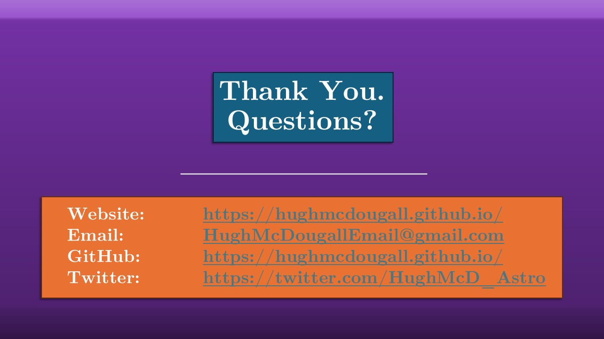

# Statistical Methods: Important but not Scary
## OzGrav ECR Workshop 2024 

This is a rough transcript of a talk I presented to the early career researcher (ECR) workshop at the OzGrav 2024 retreat, hosted at the University of Queensland. You can download the slides directly [here]().

  

This is aimed at graduate students and early career post-docs, aiming to cover two main areas:
1. That the tendency to treat statistical methods as black boxes can lead to dangerous failure modes 
2. Despite their reputation, stats methods are actually quite easy to understand, and even a basic understanding equips you to know what tools will / won't fail in different jobs.

Part one: why stats methods are important, and something we, as scientists, need a functional understanding of even if they aren't the main focus of our work.

In physics, we're in the business of working with _models_. When we first start learning in highschool, things are nice and simple: we have some physics that we describe with a mathematical model, and we combine this with data to gain some understanding about reality. Of course very quickly gets more complicated: the universe has randomness, our data has noise, are models are approximate, and so we need _statistical_ models to bridge the gap between our theory and our data. For all but the simplest cases, these statistical models are too complicated to get results by hand, and so we more often than not also need some _numerical_ model to actually do the calculations, and finally use those results to make some conclusions about physical reality. Sow what we is this hierarchy of modelling, each layer stacked on top of one another.

The danger is that it's really only these first and last layers that are Capital P __physics__, and there can be this problem where these middle two blocks go under-examined, with people relying on existing pre-made tools to handle their stats and their calculations without looking too closely. This forms a "blind-spot" in our models, a zone of ambivalence that people don't alot much attention. 

If there's one thing I want to leave you with today, it's that sometimes things will go wrong in this blind-spot, and that will follow through to your results. If you're lucky, your final results will look like garbage and you'll know you have to go back to the drawing board. If you're _un_-lucky, your tools can fail _invisibly_, giving results that look completely reasonable but are actually completely wrong. If you don't know what to look for, if you don't know how these tools work and how they break, you can end up this incorrect results forwards and affecting your physics.

  

To demonstrate that this is a real thing that happens and not some scary story I've made up to frighten you, I'm going to share a cautionary tale from my neck of the woods in Reverberation Mapping. So, what exactly is that? If you're not familiar, Reverberation Mapping is a clever trick where we use time-domain observations to infer the masses of the super-massive black holes at the core of distant galaxies. 

  

  

  

  

  

  

  

  

  

  

  

  

  

  

  

  

  

  

  

  

  

  

  

  

  

  

  

  

  

  

