# Statistical Methods: Important but not Scary
## OzGrav ECR Workshop 2024

This is a rough transcript of a talk I presented to the early career researcher (ECR) workshop at the OzGrav 2024 retreat, hosted at the University of Queensland. You can download the slides directly [here](./OzGravTalk_slides.pptx).

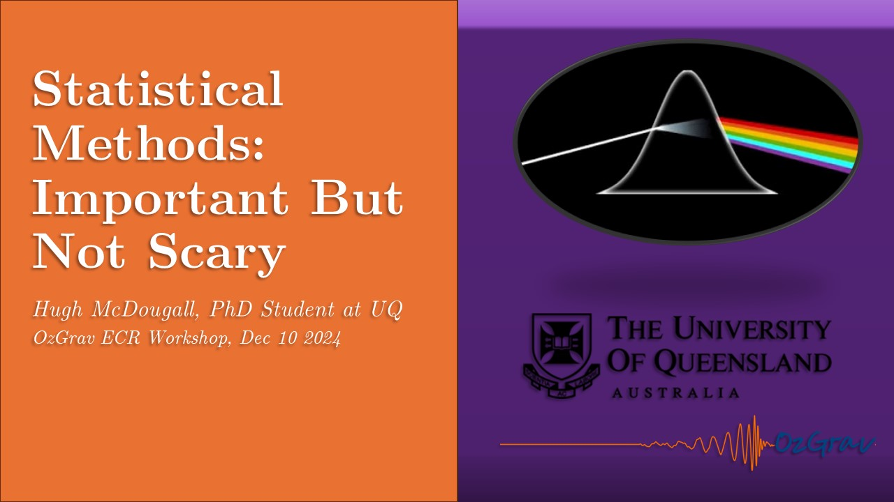  

This is aimed at graduate students and early career post-docs, aiming to cover two main areas:
1. That the tendency to treat statistical methods as black boxes can lead to dangerous failure modes 
2. Despite their reputation, stats methods are actually quite easy to understand, and even a basic understanding equips you to know what tools will / won't fail in different jobs.

Part one: why stats methods are important, and something we, as scientists, need a functional understanding of even if they aren't the main focus of our work.

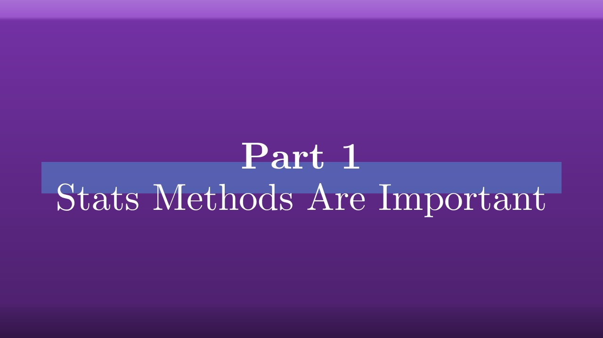

In physics, we're in the business of working with _models_. When we first start learning in highschool, things are nice and simple: we have some physics that we describe with a mathematical model, and we combine this with data to gain some understanding about reality. Of course very quickly gets more complicated: the universe has randomness, our data has noise, are models are approximate, and so we need _statistical_ models to bridge the gap between our theory and our data. For all but the simplest cases, these statistical models are too complicated to get results by hand, and so we more often than not also need some _numerical_ model to actually do the calculations, and finally use those results to make some conclusions about physical reality. Sow what we is this hierarchy of modelling, each layer stacked on top of one another.

The danger is that it's really only these first and last layers that are Capital P __physics__, and there can be this problem where these middle two blocks go under-examined, with people relying on existing pre-made tools to handle their stats and their calculations without looking too closely. This forms a "blind-spot" in our models, a zone of ambivalence that people don't alot much attention. 

If there's one thing I want to leave you with today, it's that sometimes things will go wrong in this blind-spot, and that will follow through to your results. If you're lucky, your final results will look like garbage and you'll know you have to go back to the drawing board. If you're _un_-lucky, your tools can fail _invisibly_, giving results that look completely reasonable but are actually completely wrong. If you don't know what to look for, if you don't know how these tools work and how they break, you can end up this incorrect results forwards and affecting your physics.

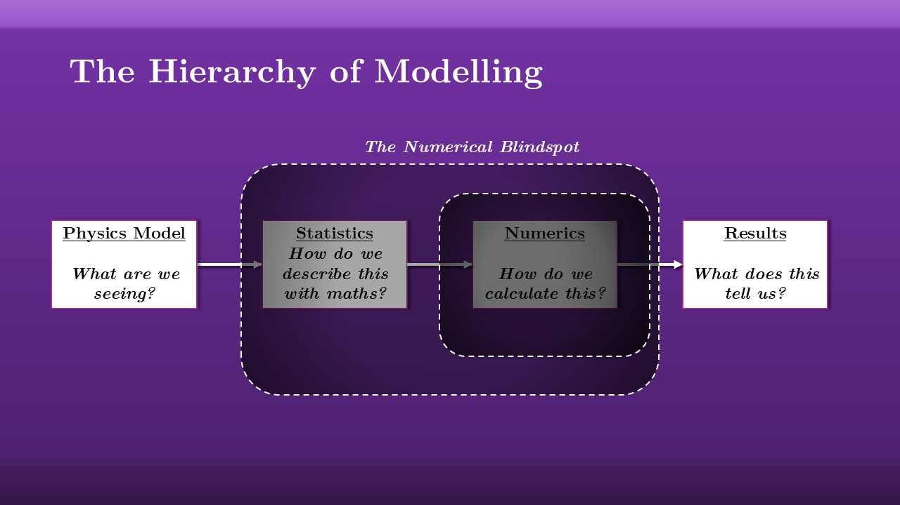  

To demonstrate that this is a real thing that happens and not some scary story I've made up to frighten you, I'm going to share a cautionary tale from my neck of the woods in Reverberation Mapping. So, what exactly is that? If you're not familiar, Reverberation Mapping is a clever trick where we use time-domain observations to infer the masses of the super-massive black holes at the core of distant galaxies. 

In brief: every galaxy as a a super-massive black hole at its core, and we want to know how heavy they are because this helps us answer all sorts of questions. These galactic nuclei are involved in galaxy evolution through AGN feedback, there's open questions about how they initially formed and how they act in galaxy mergers, all things we can probe by looking at how the masses of the SMBH population has evolved over cosmological time.

The issue, of course, is that SMBH's dark, compact and extremely far away: it's very hard to measure their masses directly. Fortunately, we're in luck. Some of these black holes have matter falling onto them, scrunching down into these enormous, ultra-hot, accretion disks, easily producing more light than the rest of the host galaxy. These _active_ galactic nuclei are bright enough to see at cosmological distances.

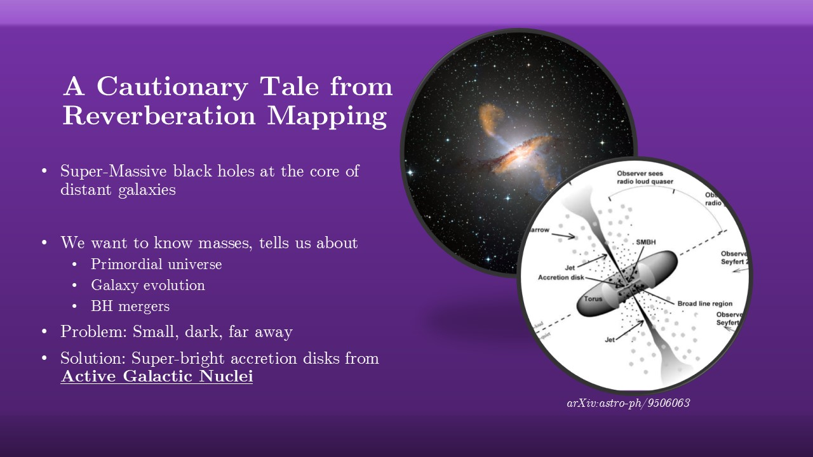  

So how do we use this to get the mass? Well, an AGN has more than just the black hole and disk, it has this entire complex geometry that builds up around it. For our purposes today, the AGN has only two parts: the accretion disk that throws of enormous amounts of light, and this fast-orbiting cloud around it called the broad line region that captures some of that light and re-emits it as emission lines. The width of the lines tells us how fast the orbit is, and so basic high-school level physics lets us get the central mass of the black hole, but only if we know the orbital radius.

That's where reverberation mapping comes in. The accretion disk isn't a static light source: it flickers wildly, AGN are highly variable. This flickering is "echoed" off the broad line region in the same pattern, but with a delay between the two because it takes time for the light to travel. If we can observe both objects for long enough, building up light-curves and measuring that delay, we can use this lag as a ruler to measure the scale of the system, and from there get the mass.

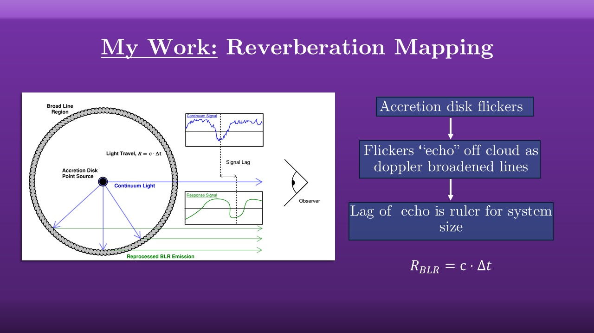

If you entered reverberation mapping ten years ago, you would think that this was a solved problem. We have the physics which I just described, and we have a statistical model that describes the AGN light-curves as something called a damped random walk, a particular stochastic process that explains the properties of the flickering really well. This damped random walk is an example of a Gaussian process, which means we can simulate it, which means we can build a full Bayesian generative model and do Bayesian statistics.

There's software that does this: a [program called `JAVELIN`](https://arxiv.org/abs/1008.0641) that fits the lag, plus a half dozen other parameters, and does its fitting using Markov Chain Monte Carlo (MCMC). Specifically, it uses the package program `emcee`, which you may have used or heard of as it's probably the most popular MCMC package in astrophysics. 

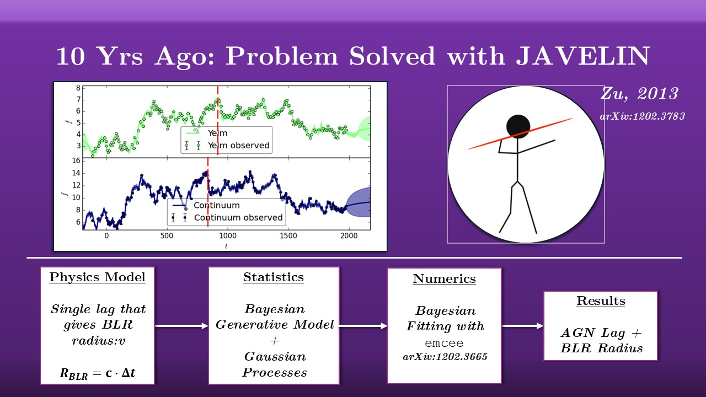  

So what's the problem? What's changed in the last ten years? What's changed more than anything is the sorts of surveys we do reverberation mapping with. For early surveys you'd track a handful of nearby sources, at low redshift, really intensely for a couple of months. Now we work with in __industrial scale__ surveys like OzDES or the Sloan Digital Sky Survey (SDSS), which track hundreds to thousands of AGN out to deep redshifts over multiple years, working at lower precision and cadence but making up for it in depth and shear weight of numbers.

The problem with these multi-year surveys is that, when you track any one AGN, you get half-yearly seasonal gaps in your observations owing to the Sun being in the way for half of that time. These seasonal gaps give rise to the problem of __aliasing__: when you run light-curves like this through `JAVELIN`, you get these multiple peaks in your recovered lag posterior distribution. This is for simulated data, with the true lag at $180$ days, but there's a second _aliasing peak_ that emerges at $540$ days. What's going on here is that if you test a lag at half a year or one and a half years or so forth, there's no overlap in the data of your two light curves and so you can't tell if this is a good fit or not. It's an ambigious fit, a locally optimal one, and so you get these aliasing peaks emerging.

If you're lucky, your aliasing looks like this where you can clearly tell that something has gone wrong. If you're _un_-lucky you can end up with the false aliasing peak being much clearer and more prevalent than the true peak, and you can end up moving forward with a __false positive__. You get a lag and a mass that is completely non-physical.

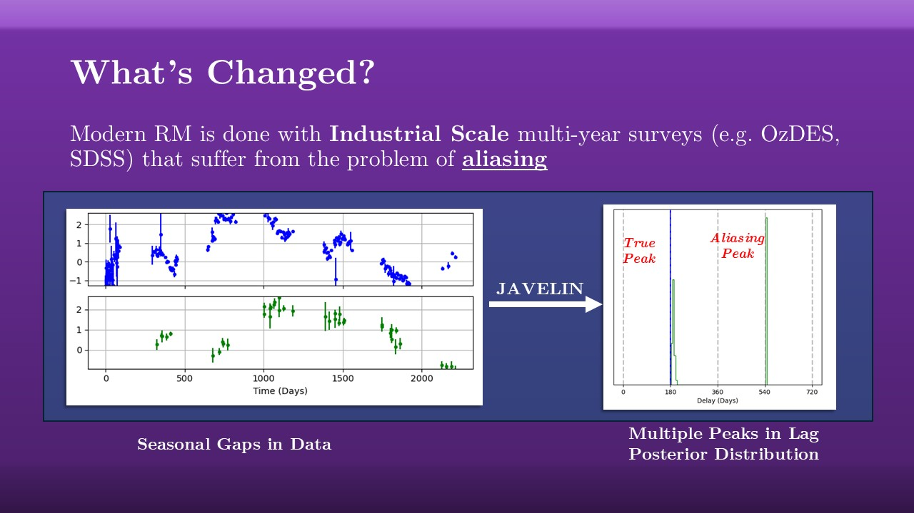  

These false positives are dangerous: not only do they distort our understanding of the individual object, but that propogates through to other work as well. For example, in reverberation mapping we tune these scaling relationships between the luminosity of the AGN and its radius / lag, these so-called $R-L$ relationships. If these are contaminated by incorrect lags, we end up with the wrong scalings and we end up with the wrong answer anywhere that we use them.

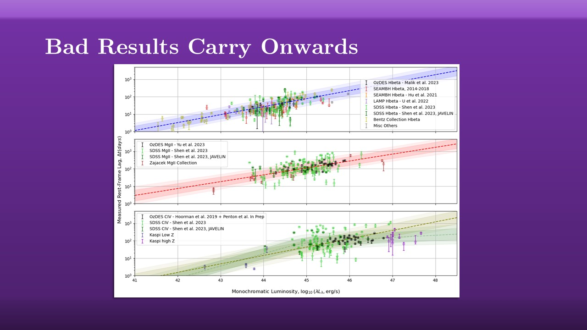  

This aliasing problem is basically _the_ defining problem of reverberation mapping in the last generation of surveys, and there's been an incredible amount of time and effort put into characterising or counteracting it. Entire papers, thousands of human science hours and at least one entire PhD have been spent trying to come to grips with it. In OzDES, the survey I work with, we found that the best, most reliable, approach was to look for certain warning signs in the recovered lag distribution, tuned with simulations, and perform quality cuts to throw away anything that we didnt $100$ percent trust.

This method works: we know from these simulations that it brings out false positive rate all the way down, but it comes at a high cost. Out of the nearly $800$ AGN that OzDES tracks, we only get to hold on to a few dozen, a loss rate of over $90 \%$. But hey, if that's what the statistics tells us, if that's what our data is doing, then that's the world we're living in and the one we need to make peace with, right?

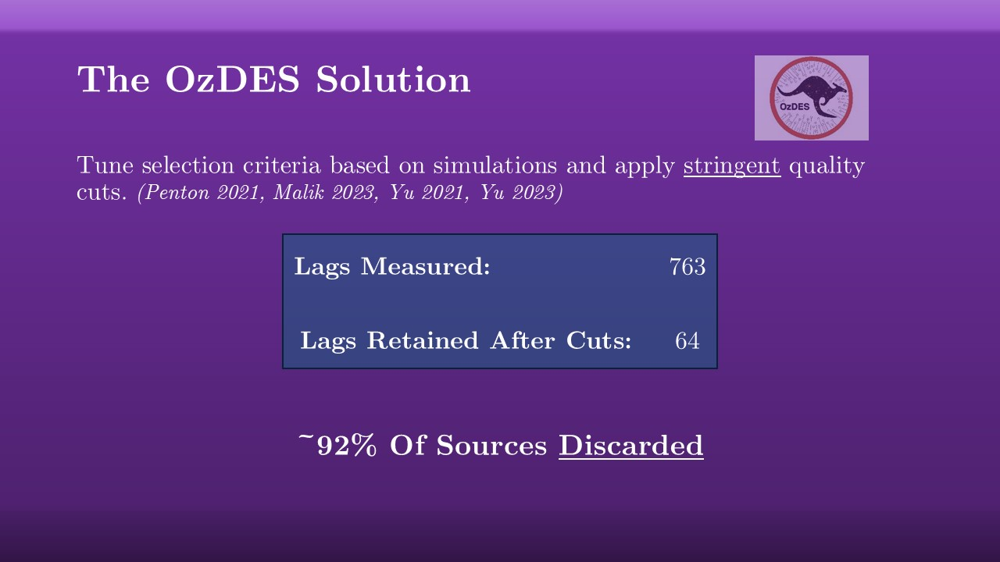  

Well, actually no. Earlier, when I said that `JAVELIN` gives a lag posterior distribution like the top panel (below) when we feed it OzDES-like seasonal light-curves, this is only half true. This _is_ absolutely what `JAVELIN` gives you, but it's _not_ the true lag posterior. Instead, the _bottom_ panel is the real result. Notice that those dangerous all-destroying aliasing peaks have suddenly vanished. 

Going back to our layers of modelling, I need to stress that these two plots are for the same data, the same physics, the same statistics. The only thing that differs between them is the _statistical method_. The aliasing problem has been misdiagnosed as a problem of our data or our observations, when it is, in large part, a problem of our _calculations_.

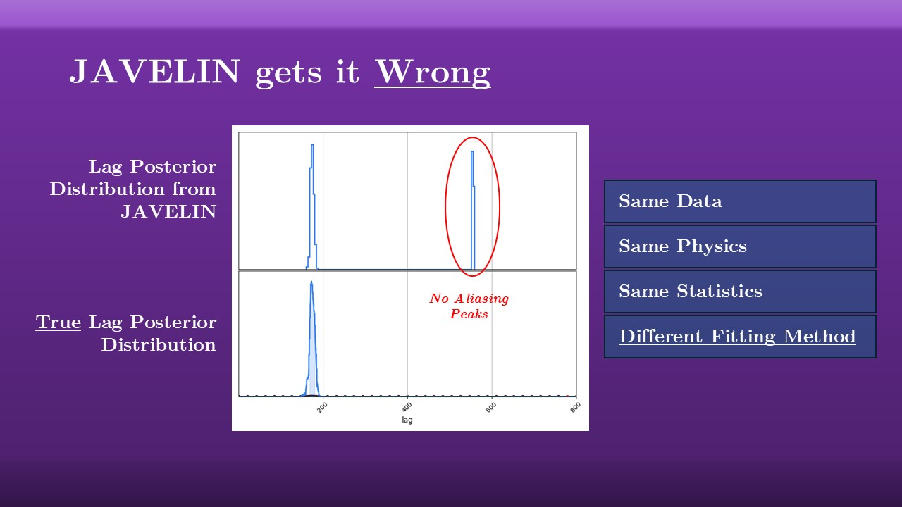  

So, what's gone wrong here? Well, earlier I said that `JAVELIN` does its Bayesian fitting with the package `emcee`. `emcee` is an incredibly useful tool, a robust and easy to use MCMC package that is widely popular for a reason. But, if we go [crack open the paper](https://arxiv.org/abs/1202.3665) where it was first introduced, we find something interesting. __`emcee` doesn't work for multimodal distributions__. It doesn't converge properly: it simply will not give you the right answer. 

This is not some deviously complicated failure state, it's sitting right there in this very short and readable paper. But very smart and dedicated people have skated right over it when working with `JAVELIN` because it had fallen into that dreaded numerical blind-spot.

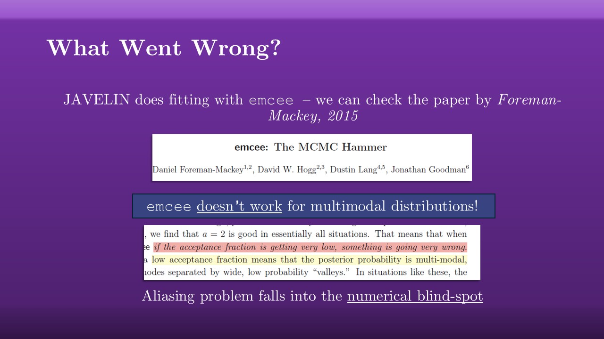  

So what went wrong in a literal sense is that `JAVELIN` wasn't built for multi-modal distributions. What went wrong in a more abstract sense is that `JAVELIN` had fallen foul of one of the four demons of Bayesian fitting, the four failure states of different statistical engines. We'll re-visit these in detail a little later, but for now just keep in mind that there are these ways that our stats tools can fail us, and if we're un-aware they will do so invisibly and without us knowing.

  

So, all is lost, right? Our stats tools, which we rely on every day, can and will betray us without us being any the wiser. We should all board up our doors and windows and give up on science, right? Well, obviously no. The good news is that you can avoid problems like this ahead of time by making sure you understand your stats tools and can pick the right one for your job. You don't actually need that detailed of an understanding to get have a workable knowledge base, and in fact I'll be able to cover a solid majority of it in the rest of this talk.

  

In astrophysics we typically work with __Bayesian__ statistics rather than __frequentist__. As a rough summary:
 * If there's a $P$ value, it's probably frequentist
 * If there's a prior, it's probably Bayesian
 * If there's both, it's some unholy union of the two
In Bayesian stats, we take the __prior__, which is everything we knew about the world before we got any data, and combine it with the __likelihood__, which is everything our data tells us, and combine them to get the __posterior density__.

There's a lot of subtle details about these that you can find explained better elsewhere, but for our purposes today this posterior density is just some high-dimensional function, where some of the inputs are things we care about (in RM, the lag) and the rest are ones that we don't (in RM, everything else).

There are three jobs we might want to do with this function:
1. We can optimize, i.e. find the highest point in that function, the point in parameter space that best describes reality. This actually doesn't come up too often, so we won't spend a lot of time on it here
2. We can _explore_ the shape of the distribution, integrating over all the parameters we don't care about to get an idea of the shape and density of the probability distribution for the ones we do. This is how we measure or _constrain_ physical properties, and it's how we get those familiar corner plots.
3. We can also keep going, integrating over _every_ parameter to turn out probability density into a sort of probability mass. This is called the Bayesian evidence, it's a single number that gives a goodness of fit for the entire model over all parameters. By itself it tells us very little, but if we compare it for two different models, we get a relative measure of how well they describe reality.

Really these are the two jobs we care about doing: _exploring_ for parameter _constraint_, and integrating to get _evidence_ for model _comparison_.

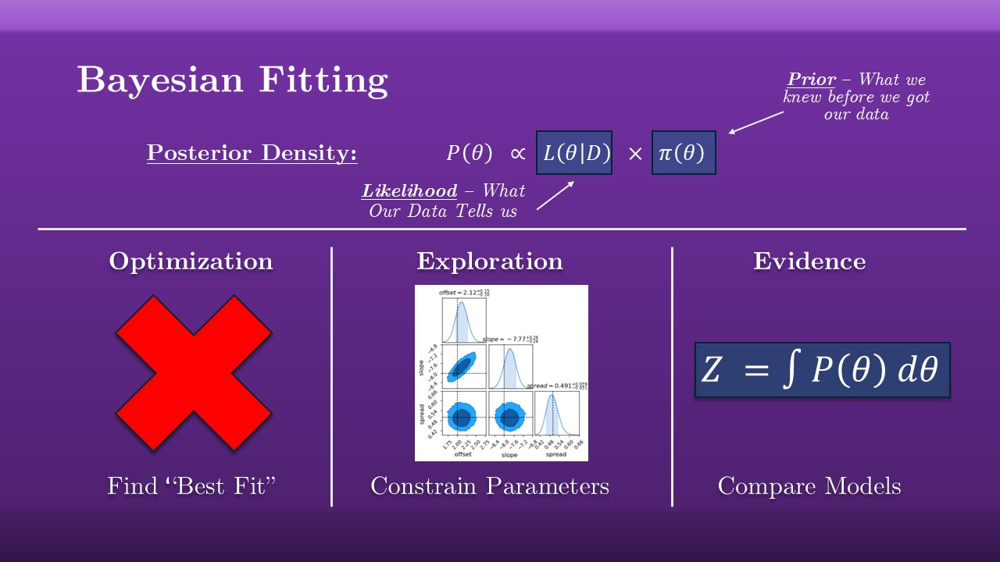  

If you're new to this sort of modelling it can be easy to get bowled over by the sheer number of fitting methods and the dense terminology. The good news is that they can be broken up into a relatively narrow family tree, and often only need to care about a few of the branches. These are organized, left to right, from least fancy to most fancy. 

On the left are what are called the __information criteria__. These aren't fully Bayesian methods, their _psuedo_ Bayesian ways of doing model comparison when you either don't have meaningful priors or don't have the computational power to do a full evidence integral. In short, they work by optimizing to find the best fit in the posterior density and then applying penalties based on how many parameters the model has (we want less complicated models). These are rough "shoot from the hip" tools, they're not fully Bayesian and we'll not dwell on them here.

Next on is the family of Markov Chain Monte Carlo (MCMC) methods, the workhorse of astrostatistics. These are the powerful and widely used tools for doing parameter constraint, but they can't get integrals. Next on is Nested Sampling, the new kid on the block. In OzGrav you'd be familiar with this: Nested Sampling is what [Bibly](https://learn.adacs.org.au/project/bilby/) uses to fit your gravitational waves. Nested sampling is slower than MCMC on average, but it _can_ get those valuable evidence integrals.

Anything off to right-hand side, things like [stochastic variational inference](https://hughmcdougall.github.io/blog/02_numpyro/06_SVI/page.html) or [simulated Bayesian inference](https://www.pnas.org/doi/10.1073/pnas.1912789117), tools which you either won't need to use or would look into as a focused speciality topic.

That really just leaves these two central branches here: MCMC and Nested sampling. In a huge majority of cases, these two branches will be enough to handle most of the Bayesian fitting you might need to do in day-to-day science. Over the next while I'm going to cover these, how they work, how they differ within and between their genealogical branches, and what they can / can't do.

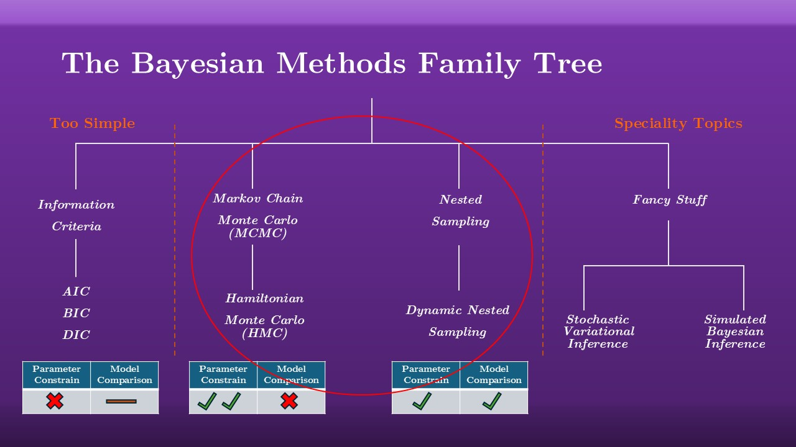  

First up, MCMC, the go-to tool that has dominated Bayesian fitting for the better part of a century. MCMC is an example of a __sampler__, meaning it's end result is a list of points, an MCMC-_chain_, that is distributed proportional to the posterior density. We can throw these chains into a scatterplot or a histogram to get an idea of the _shape_ of the distribution, but MCMC _cannot_ get the integral / model evidence.

Rather than explain its inner workings in detail, I'm going to step through a hypothetical of how you, as physicists, might have invented the [Metropolis-Hastings Algorithm](https://en.wikipedia.org/wiki/Metropolis%E2%80%93Hastings_algorithm), the first and oldest MCMC engine that all others are descended from. This won't be rigorous, but I think it'll do a better job of giving you a gut-feeling physical intuition for how these sorts of samplers work.

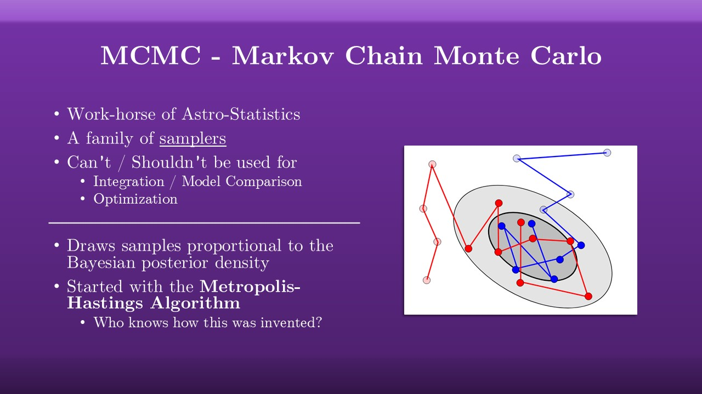  

So, put yourself in the shoes of a scientist in the first half of the 20th century: you're working at Los Alamos working on some terrifying project for the US government, and you've got a problem. You have this physical system, this bundle of particles, than can be in all sorts of configurations, and you want to know the probability distribution of one or more of its properties (magnetic field, spin etc). You know that each of these possbile states has an energy, and statistical mechanics tells us that the probability the system will be in that state is based on the energy via the [Boltzmann Distribution](https://en.wikipedia.org/wiki/Boltzmann_distribution). You know that the _proper_ way to do this is to calculate every energy for every state and then map out the distribution with weighted averages. The problem is that this is absurdly expensive: you have thousands or tens of thousands of states, and this early in time (the macbook being half a century away) you simply do not have the requisite computational grunt.

So what do you do? Well, you get clever and you _simulate_ it. You start with the system in some random configuration, and you make a __proposal__ of some nearby similar state that it wants to move to. If that state's at a lower energy, you go their immediately: highschool physics tells us that systems want to decrease their energy. If it's at a higher energy, there's still a chance you can make up the difference by absorbing it from the environment, with that chance again being given by the Boltzmann Distribution.

So you either move or stay, you either _accept_ or _reject_ this proposal. Then you do this again and again and again, and your imaginary particle wanders around parameter space, mapping out the states that the system wants to be in. The joy of this is that, after some __burn-in__ time, you're only spending effort to calculate the low energy / high probability states that you actually care about.

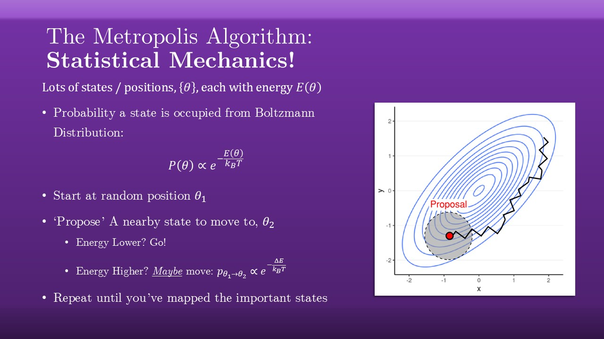  

Fast forward a few years and you have another clever idea. This works for statistical mechanics, but there's nothing here that actually _requires_ the mechanics part. Instead of having a system with physical energies that correspond to probabilities, you could take some probability distribution (e.g. a Bayesian posterior density) and just _pretend_ that this corresponds to some energy landscape. 

Without changing anythng else, you've just invented the Metropolis-Hastings Algorithm. This is the core idea that underpins pretty much every MCMC engine that has descended from here: you have a particle or cloud of particles wandering around some energy landscape, with various methods differing in how they make that proposal of where to go next. I also want to stress that it's this energy landscape, this _log_ probability landscape, which is where stats-methods actually live and work, and importantly where they break.

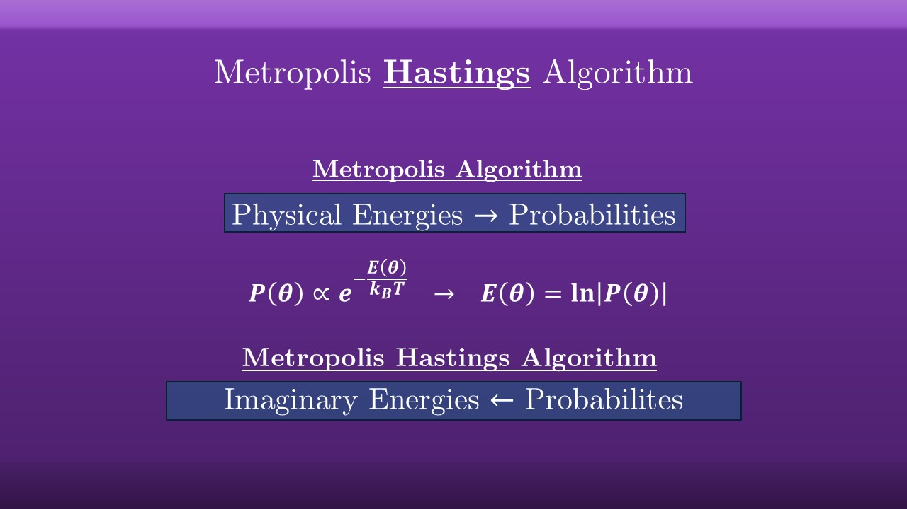  

You may have noticed back in the family tree slide that I showed another branch descended from MCMC. This is the new kid on the block: __Hamiltonian Monte Carlo__ (HMC). HMC is a fancy new way of sampling that works well in complicated or high dimensional functions. The idea is this: suppose you have not only the energy function, but also its _gradient_, its slope. If you have slopes, you have the notion of forces. If you have forces, you have the notion of acceleration, momentum, _kinetic_ energy.

By combining potential energy _and_ kinetic energy, HMC moves the analogy from a particle hopping around a potential well into a projectile navigating around the energy landscape. This might seem like a small change, but this ends up being stable and efficient into enormously more dimensions than regular MCMC. Where most MCMC engines will begin to stumble or falter after a few dozen dimensions, HMC can easily breeze into the thousands. For any one source it's unlikely you'll need that many, but if you were doing some _hierarchical model_, e.g. fitting a population of thousands of gravitational waves at once, this sort of tool is going to become necessary. 

This sort of thing used to be difficult to implement, because you'd need to take the derivatives of your function by hand to get the gradients. Fortunately, we're all living in the future. Today there are automatic-differentiation tools like [`JAX`](https://jaxns.readthedocs.io/) which can calculate the gradients for you. To stress, this isn't finite differences are approximations like that, they literally perform the chain rule derivatives for you. This means that HMC can be used "out of the box" just like MCMC has been for decades.

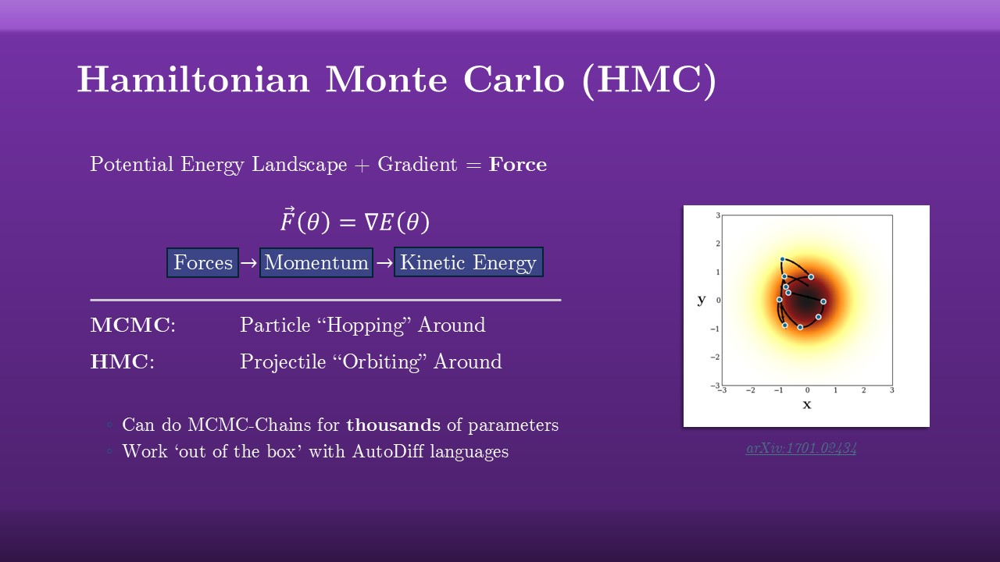  

So that's MCMC, by covering that you're now equipped with the understanding for a pretty large portion of day-to-day Bayesian fitting. But MCMC is not a universal tool: most obviously, MCMC cannot be used to get evidence integrals: it might seem like you can, but at a fundamental level it cannot give reliable answers. That's where Nested Sampling comes in. Nested sampling is first and foremost a tool for efficiently integrating fuctions, in our case for getting Bayesian evidences for model comparison.

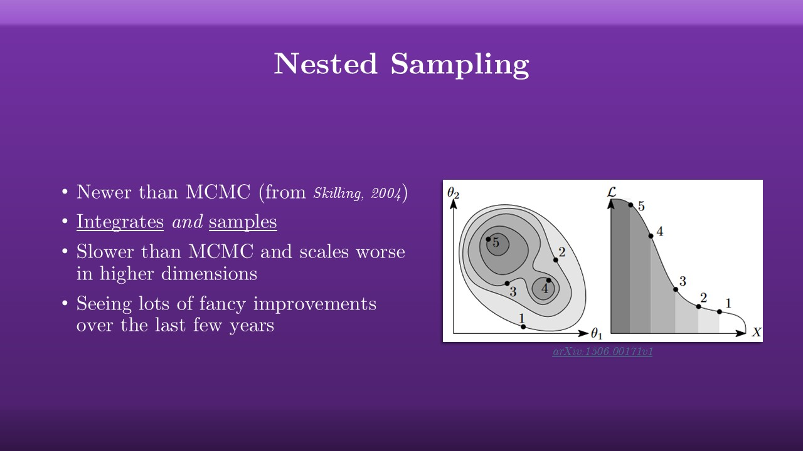  

So Nested sampling is an integrator, but how exactly does it do this? First we need to introduce the idea of the Lebesgue integral. If you've taken any under-grad numerical methods course then you've probably encountered this common problem of "how do we find the mass / area under some function", and you've probably seen it approached like this figure on the left, where we break the function up into a series of chunks of known _area_ and estimate their average _height_. This is a [Riemann integral](https://en.wikipedia.org/wiki/Riemann_integral), and its the idea behind [Simpson's rule](https://en.wikipedia.org/wiki/Simpson%27s_rule), the rectangular and [trapezoidal](https://en.wikipedia.org/wiki/Trapezoidal_rule) rules and so forth.

Nested sampling, meanwhile, relies on [Lebesgue Integration](https://en.wikipedia.org/wiki/Lebesgue_integral), where we break the mass up into plates of known _height_ and then approximate their _area_. This might seem like a trivial difference, but notice that the Riemann integral has multiple axes of integration, it has rows _and_ columns, while the Lebesgue integral is _one_ dimensional, the plates stack on top of one another in one direction.

  

How does this actually work in Nested samplers? Well, to begin with nested sampling only works on functions defined over a unit square, unit cube or so forth. If you don't have this, that's fine, you can just do a change of variables until you do. Then, we throw down a uniformly and randomly distributed set of __live points__ across that volume. For the sake of example I've used $15$, but normally you'd have dozens or hundreds. Next, we calculate the posterior density at each of these points and we sort them in order of the "worst" lowest density to the "best" highest density.

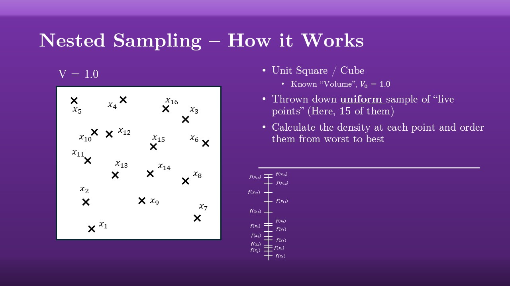  

Next, we find the worst live point, and we kill it. This forms our first __dead point__. When we do this, we're sort of partitioning the volume into two regions: the points that are worse than this dead points and the region of points that are better. Now, we don't know the exact _shape_ of the contour that divides these regions, but we do have an estimate of the _size_. Here, we "killed" one out of fifteen of our live points, and so the idea goes that this is a proxy for about one fifteenth of the volume. We know that the height of the function in this region is between zero and density of our dead point, and so we have the heigh and an esimate of the area, enough information to build our first Lebesgue plate.

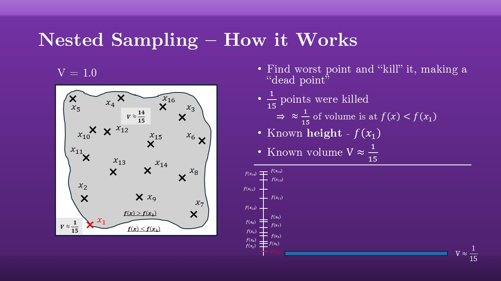  

Now we draw a __replacement point__ from the uphill region, making sure we draw it _uniformly_. Now we're right back where we started: we have a set of fifteen uniformly distributed points of a region of (approximately) known volume. Again we sort them from worst to best, and again we kill the worst one, and again we make another Lebesgue plate.

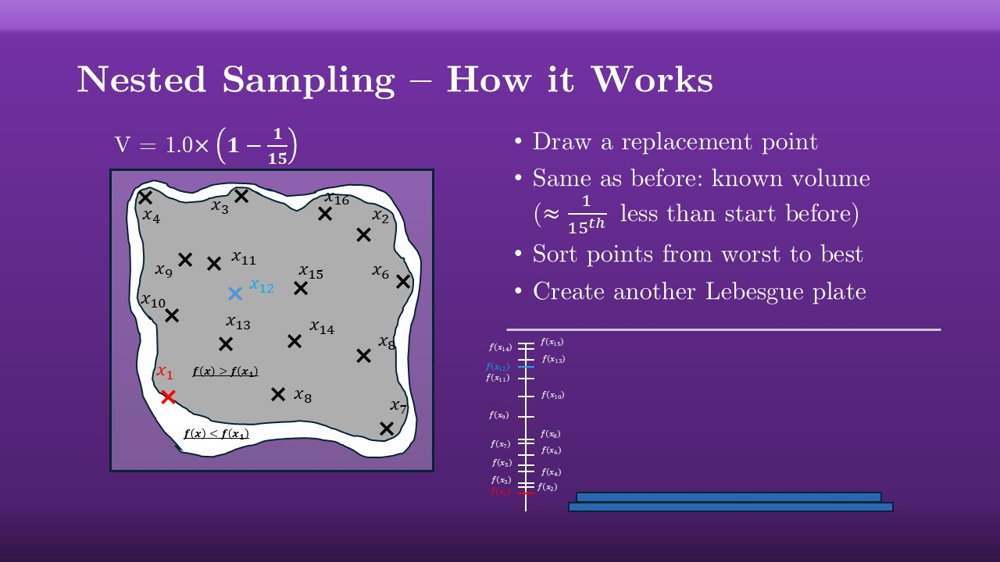  

Then we just keep doing this over and over, killing and replacing points and stacking this Lebesgue plates on top of eachother until we've built up a full picture of the mass of the entire distribution.

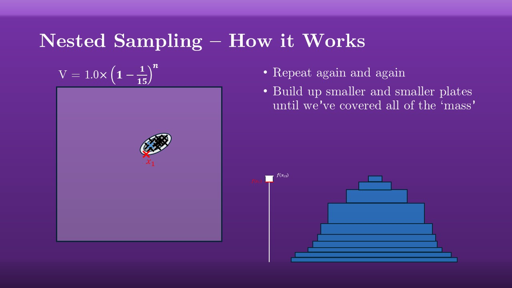  

So that's nested sampling: a fundamentally different technique to MCMC, one that focuses on getting integrals. It just so happens that we can take our list of dead points and re-weight them by the mass of their Lebesgue plates to get something that _looks_ very much like an MCMC chain, and so nested sampling is a solid sampler as well. Unlike MCMC, where you can just run the chains longer if you want better resolution, nested sampling has a termination condition: if you run it longer you just add more tiny plates to the top of your stack. If you want better precision on nested sampling what you need to is increase the number of live points over all, so the plates shrink in more slowly.

The difficult part of Nested Sampling is that part about "uniformly drawing a new replacement point". Much like how MCMC methods differ in their means of generating proposals, nested sampling methods differ in how they draw their replacement points. This is really hard to do efficiently and robustly, and this is why nested sampling often scales worse in complex models.  The good news is that a lot of the methods we've found to do this efficiently tend to also work well in multimodal distributions.

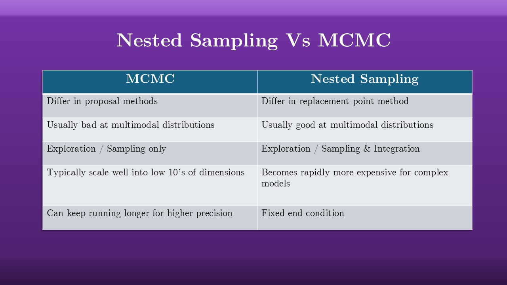  

Okay, we now know the two main families of fitting methods: how they work and how different implementations differ. But how exactly do we know _which_ tool to use, and which ones to avoid for a particular problem? That's what we'll cover now.

  

Going back to the `JAVELIN` example I gave earlier, I mentioned that it had fallen fowl of one of the four demons of Bayesian fitting: the  challenges that your tool can break when it comes up against.

1. `JAVELIN` specifically failed against multi-modal distributions: particularly for samplers, if you have multiple islands of probability it can be hard to migrate between them.
2. Next up, Non-Gaussianity. This is usually the least catastrophic of the failure modes, but many fitting methods assume that your distributions are roughly gaussian. If you have shapes that are too wibbly-wobbly, or that have drastic changes from broad and smooth to extremely tight, many fitting methods have a really hard time adapting to this.
3. Earlier on I emphasised that fitting lives and dies in the energy landscape. If those energies have really sharp pits or walls, many methods can get trapped up against them.
4. And finally, the one that looms over everything, important enough to have its own special name, the "curse of dimensionality". As your models have more and more parameters, different methods can get slower, less efficient, and in some cases begin to veer off course entirely.

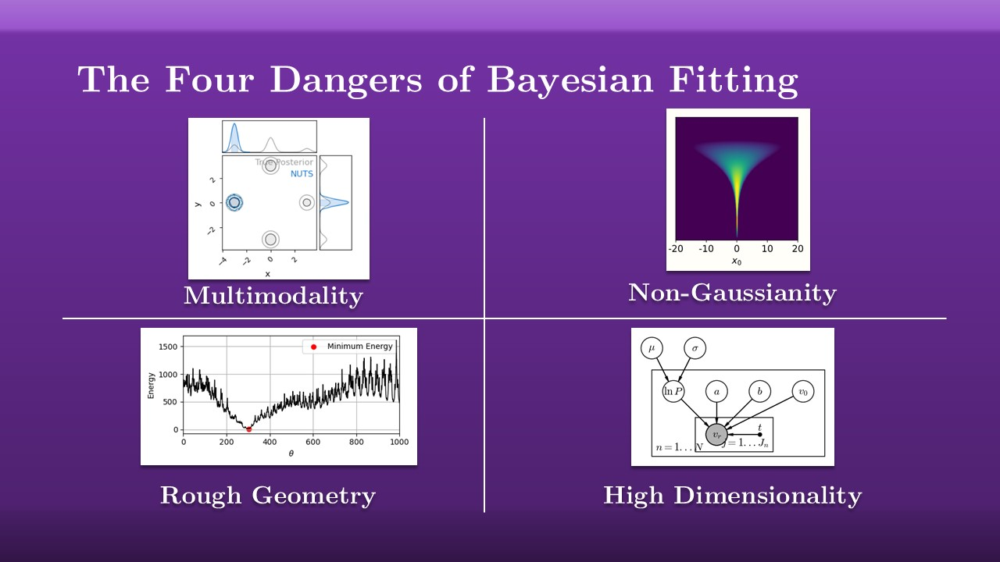  

So are you expected to have an encyclopedic knowledge of every single MCMC and nested sampling engine on the planet and their inner workings? Absolutely not, but what you _should_ know is these four failure modes, and be able to ask the question about whether _your_ problem is likely to involve them and whether or not your tools are built to handle them.

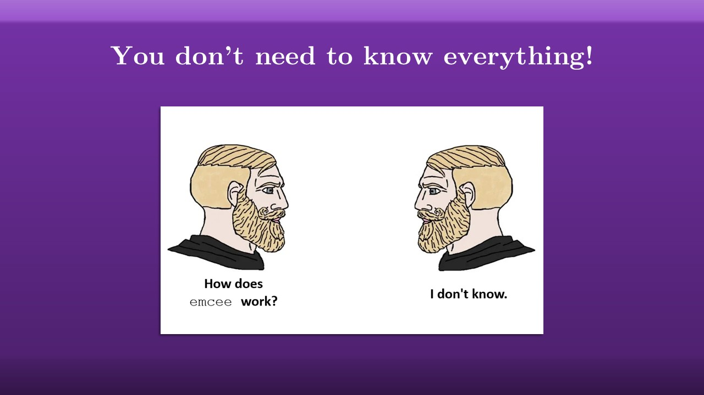  

Rather than going through a list of dozens of specific algorithms, I'm instead going to offer a bit of an analogy to give you an intuitive gut-feeling about what tools work and where. We imagine the failure modes sitting on a sort of triangle, where I've lumped Non-Gaussianity and high dimensionality because often tools that are good for one are good for the other. 

Suppose you have a really rough and messy posterior that you need to explore: you'd need something like `emcee`, a rough and tumble tool, a bit like a dune buggy. Even though it broken in our reverberation mapping example, `emcee` is a popular tool for a reason: it's not the fastest or fanciest but it's _extremely_ robust and hard to break. If you have something that's really complex, maybe a hierarchichal model or a wobbly twisted posterior geometry, you need some high performance machine like HMC. These are like formula one race-cars: blisteringly fast, but they often need some fancy equipment to get running and tend to need a nice smooth track to run on. If you have a multi-modal distribution, that's a bit like moving house: you're going to need a speciality tool that's built to handle that specific problem, like a moving van. Just like a race-car isn't going to help you move a couch, if you have a tool that can't handle multi-modality it simply won't work.

These categories are not absolute: just like cars we can have things that sit in between. Just like there are race-cars that can handle rough terrain, there are samplers that can navigate rough geometry at a decent level of complexity. Just like there are methods that can handle choppy posteriors _and_ multimodality, there are cars with good suspension and lots of boots space. The thing to focus on here is that the better you get at handling one thing, the worse you're likely to be at the others. If someone tries to tell you that they've invented some fancy new tool that can handle all problems all the time in every situation, they probably don't know what they're talking about.

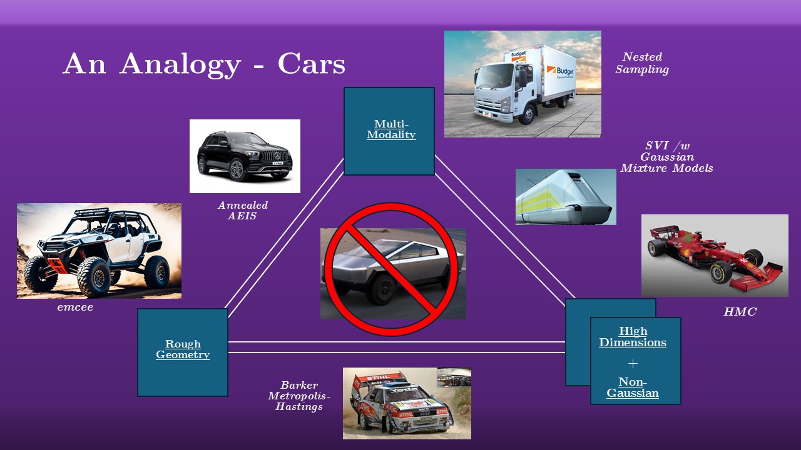  

There's an exception to this rule though. As it happens, reverberation mapping is a particularly nasty numerical problem: it runs into three out of four of the demons of Bayesian fitting. It happens that Nested Sampling tends to be a decent enough tool for handling it, but it's a bit of a brute-force approach and it can be slow and unwieldy. My work is on building _speciality_ tools that can handle all of these problems at once. The result is `LITMUS` - __L__ag __I__nference __T__hrough the __M__ixed __U__se of __S__amplers, a python package I've written myself specifically for doing reverberation mapping extremely fast. In short, `LITMUS`:
1. Does lag recovery accurately, handling the multimodal distributions properly
2. Is an order of magnitude faster than existing methods
3. Is built in a modular way so that, unlike other Reverberation Mapping tools that have their physics models hard-coded, it can be extended to more complex models.

The trick to `LITMUS`'s performance is that it doesn't use MCMC or Nested Sampling, instead it's a new algorithm that I built myself, tuned for this problem in particular. It works by tracing out a ridge of the best fit parameters at each lag, this orange line on this sketch here, and then slicing the function up into these sort of Gaussian slices along a grid. This lets us map out the shape of the distribution, but because we know the area under these curves we can also get the evidence integral really easily.

This sort of thing is only possible because of modern tools like `JAX`. These Gaussian slices are possible because `JAX` can get slopes _and_ curvatures. If we take the curvature of the log-probability, that's the same as a quadratic Taylor series, and a Gaussian in probability is the same as a quadratic in log probability. These days we have the ability to build these reliable ultra-fast tools for stats, but it comes at the cost of having someone sit down and build them for a particular job instead of using off-the-shelf pre-built tools. Sometimes, this just what we have to do.

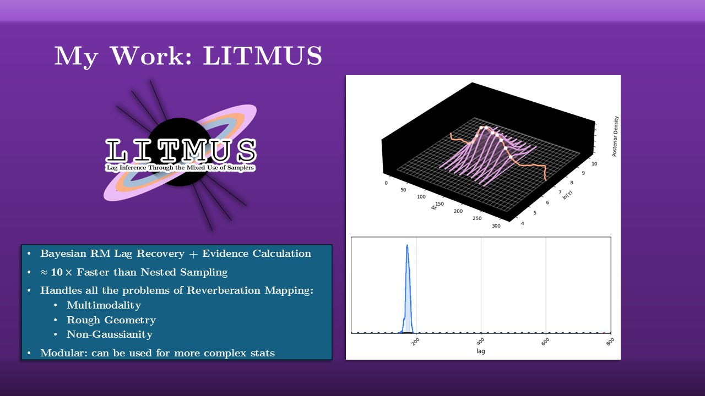  

So that's everything I have room to cover here. To review: your stats methods are not some tangential detail you can afford to ignore, they have a material impact on the science you can do and the results you get out. I gave an overview of the two families of Bayesian stats tools that cover the lion's share of the work we do in astrophysics: MCMC and Nested Sampling, and then gave an outline of how these tools can break and what to replace them with when they do. If there's one key takeaway here, it's that stats methods are not mystifying arcane machinery: they're really just layers of simple common sense stacked on top of one another. They can be understood, and you should always be aware of how your tools do or don't work to avoid nasty problems creeping in through that numerical blind-spot.

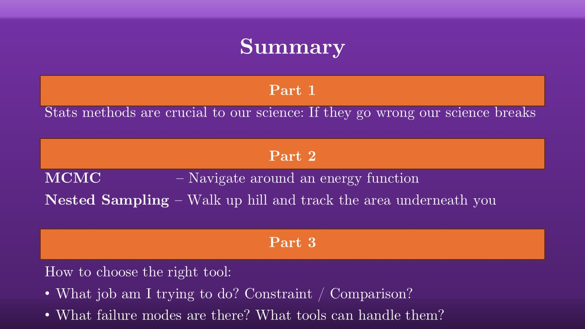  

