# A Quick Quasar Quintroduction
## Pint of Science Brisbane 2024

I presented this outreach talk as a part of the Brisbane [Pint of Science](https://pintofscience.com.au/) festival, a week long collection of talks from scientists of all disciplines to explain the joy of science to the general public. My talk was on the discovery of Quasars, using this as a launching point to discuss the break-neck pace that astrophysics evolved with over the 20th century and to introduce the audience to the big ideas of cosmology and supermassive black holes.

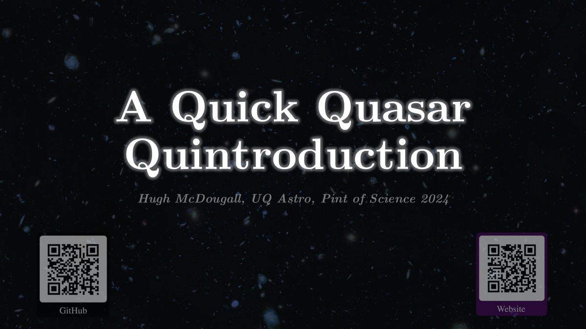  

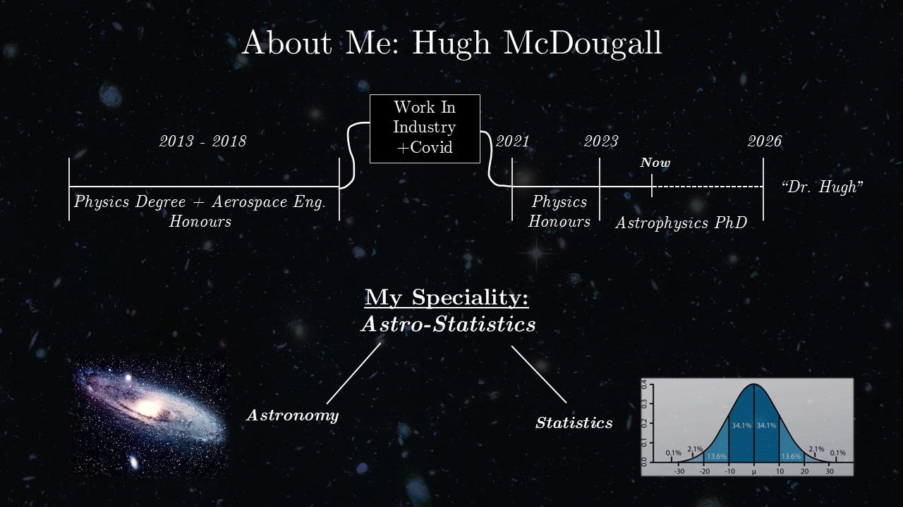  

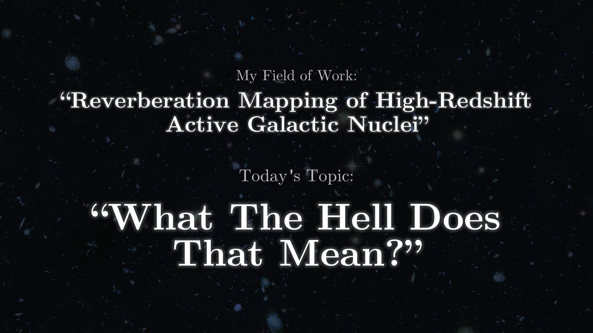  

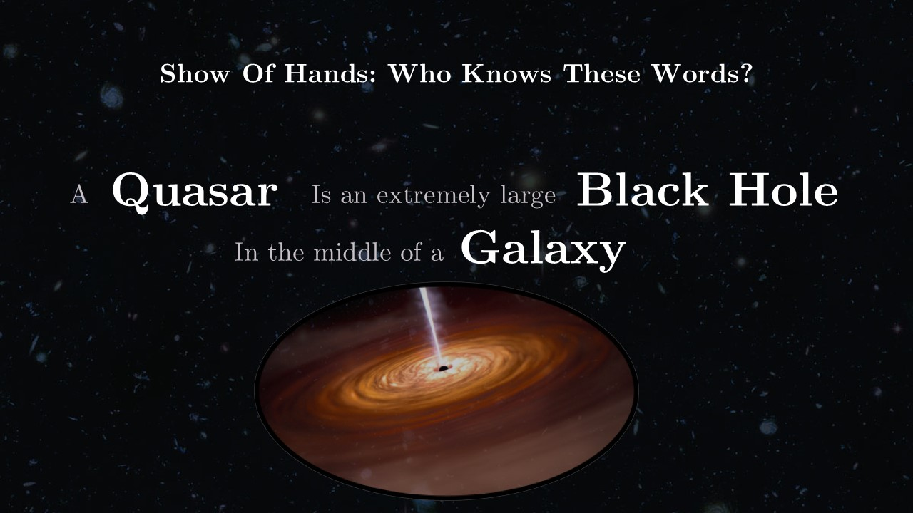  

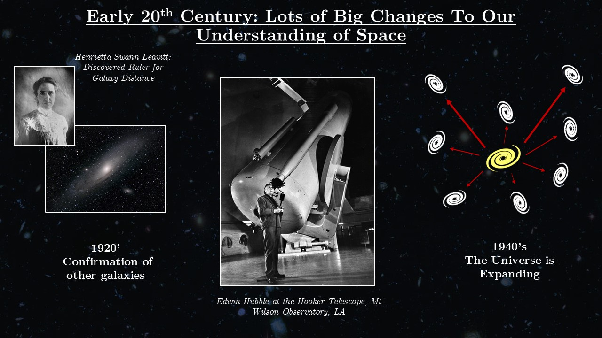  

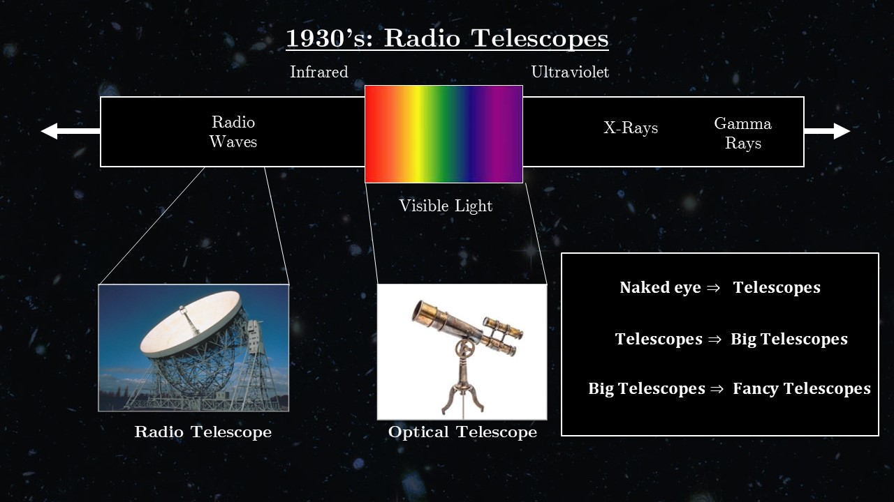  

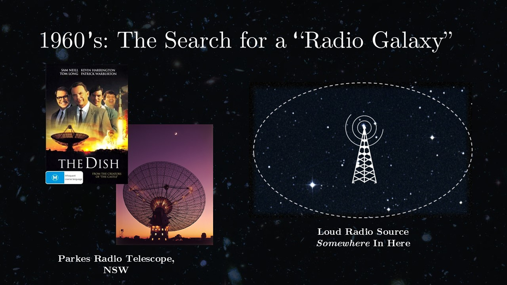  

  

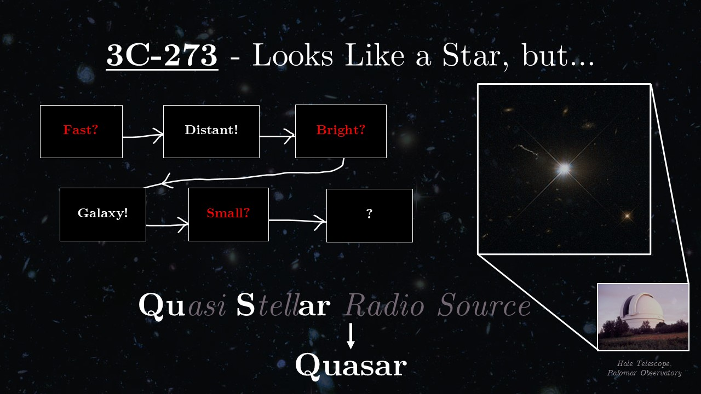  

  

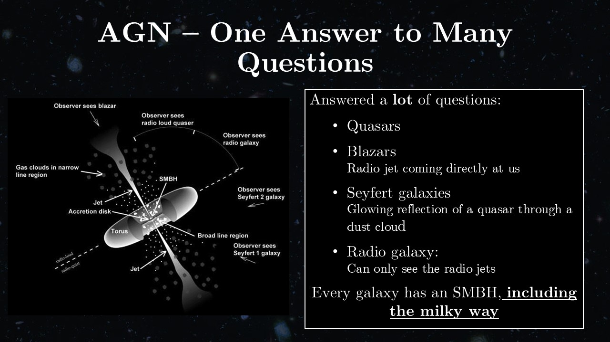  

  

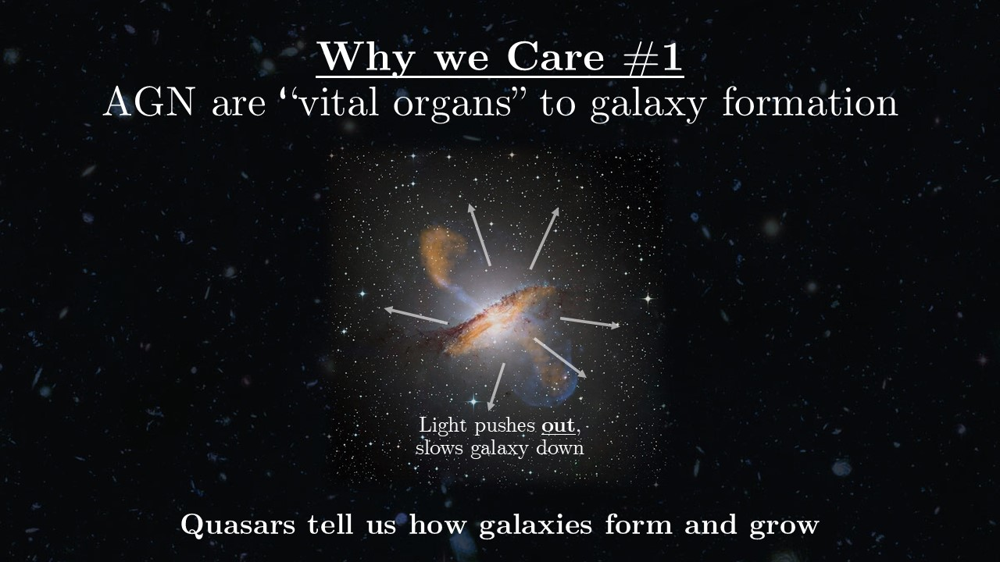  

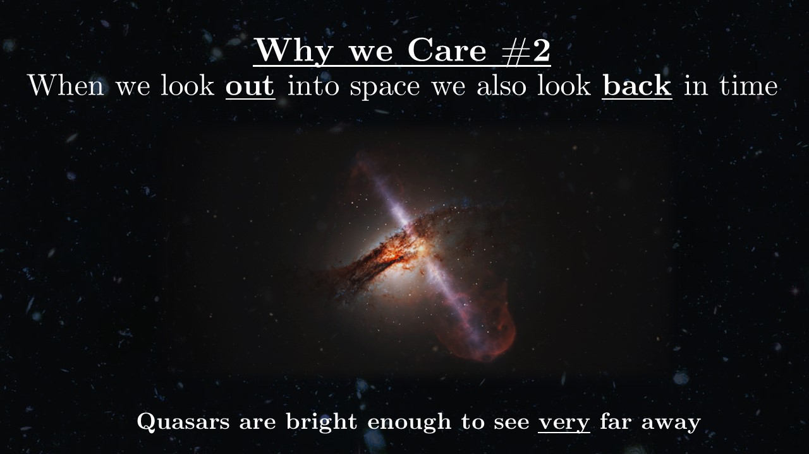  

  

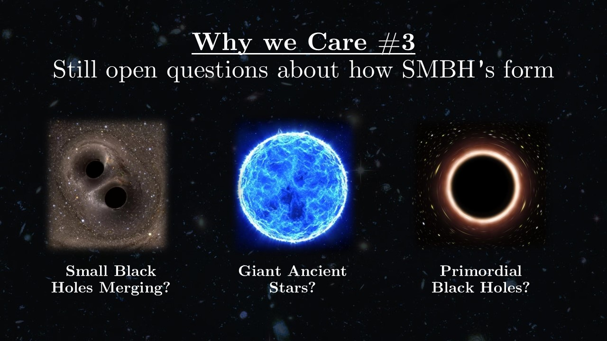  

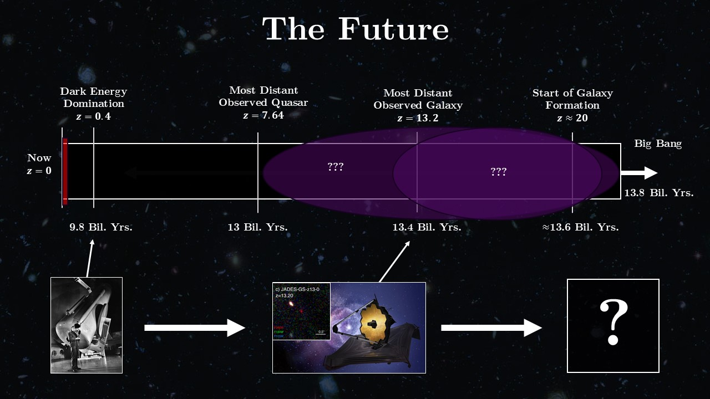  

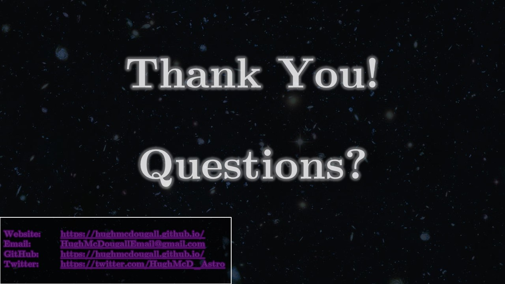  

