# A Quick Quasar Quintroduction
## Pint of Science Brisbane 2024

I presented this outreach talk as a part of the Brisbane [Pint of Science](https://pintofscience.com.au/) festival, a week long collection of talks from scientists of all disciplines to explain the joy of science to the general public. My talk was on the discovery of Quasars, using this as a launching point to discuss the break-neck pace that astrophysics evolved with over the 20th century and to introduce the audience to the big ideas of cosmology and supermassive black holes.

If you'd like to download the powerpoint file, you can find it [here](./Presentation_v2.pptx).

------------

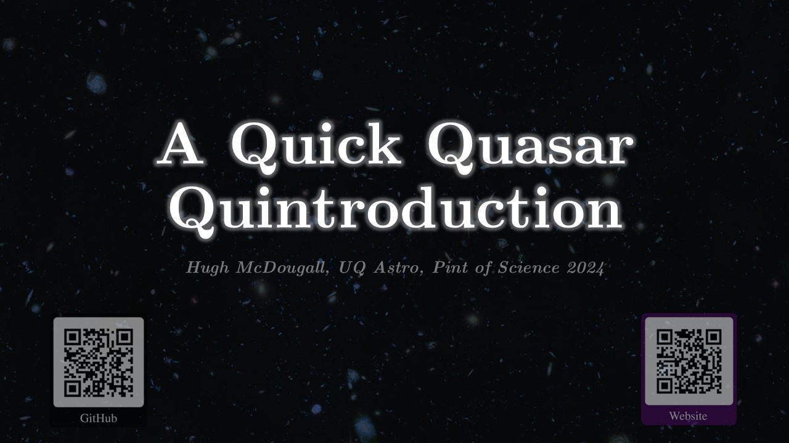  

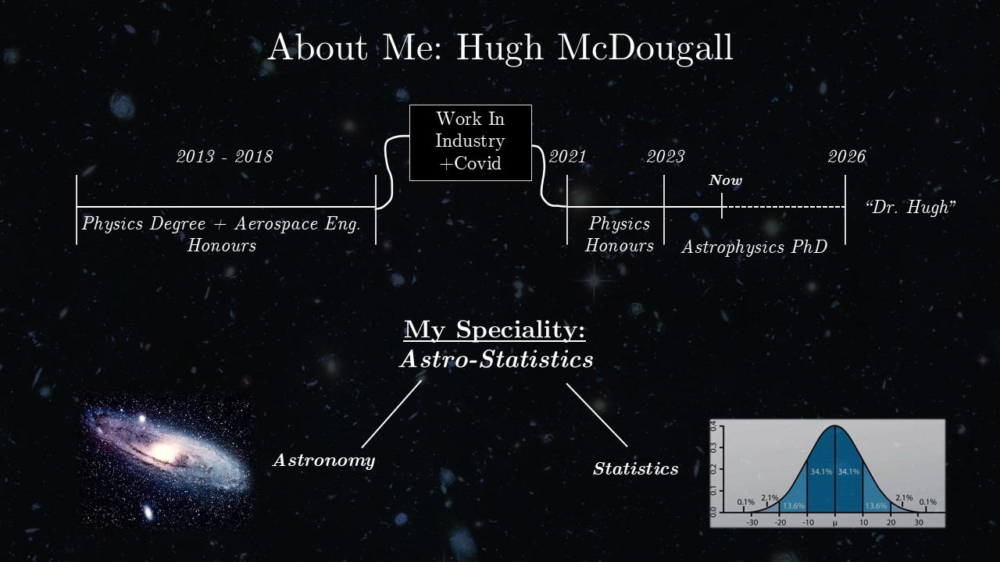  

This talk was aimed at general audiences with the aim of explaining what quasars / active galactic nuclei are through the lens of a history lesson about how they were discovered. The main goal is to help people understand how the scientific method builds on itself so that basic problem solving can incrementally lead to things that might seem outlandish, but with explanation are the only thing that makes sense. I've pitched this writeup at a similar audience: keeping things nice and simple so that a keen reader from any background can walk away understanding the sort of field I work in.

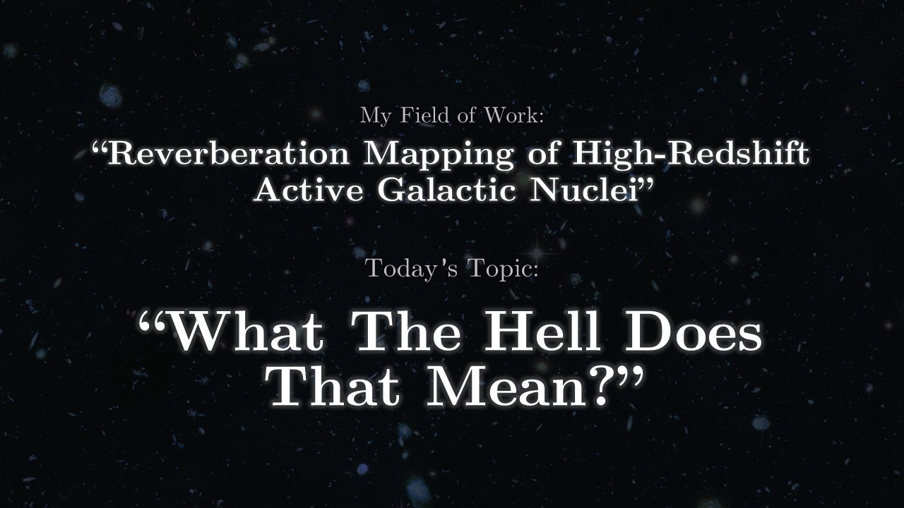  

I work in the field of "reverberation mapping of active galactic nuclei at high redshift", a phrase that is, to a non-scientist, practically impenetrable. I've learned to give more abstract descriptions like "I study space" in view of the number of times people have followed up that explanation with something in the direction of "what the hell does that mean?". When I delivered this talk at [Brisbane's Stone and Wood Brewery](https://stoneandwood.com.au/pages/brisbane), I promised the audience that, by the end of the talk, they'd at walk away understanding what my work is, and why it matters to cosmologists.

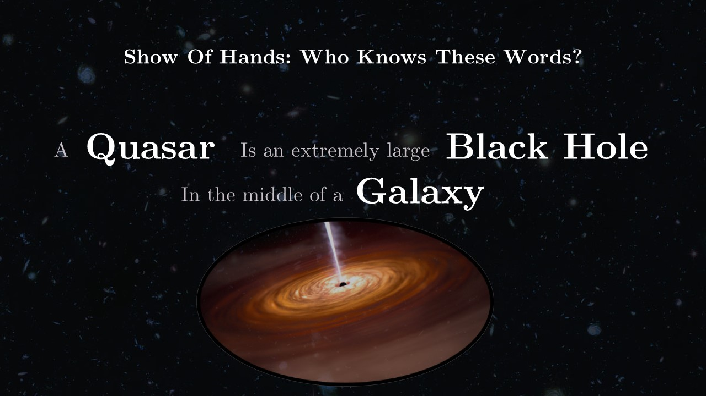  

Depending on how keyed in they are to space trivia, a non-scientist probably isn't familiar with the word **"Quasar"** outside of the fact that it's vaguely spacey. However, even if they've never studied a moment of physics in their life, they almost definitely know what a **galaxy** is, and have some idea of **black hole** as being invisible planet eating things in the dark of space. Scientistist love specificity, and one or two will probably blow a gasket with this simplification, but whenever you hear the word **quasar** you can basically replace it with **really big black hole in a distant galaxy**.

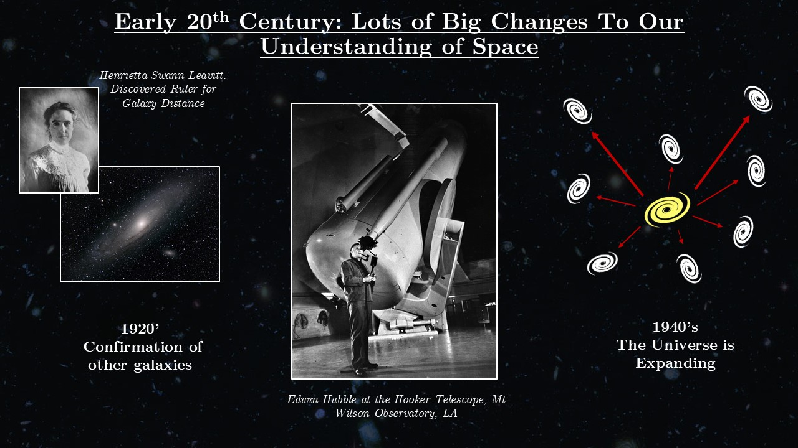  

It's all well and good to tell someone that, but a loose definition is trivia, not understanding; it's a lot more helpful to understand how we discoverd these things. In the first half of the 20th century our understanding of the universe underwent a massive paradigm shift several times over. In the 1920's our telescopes become good enough that, for the first time, we could resolve other galaxies. These "[island universes](https://en.wikipedia.org/wiki/Great_Debate_(astronomy))" revealed that existence didn't end at the Milky Way's edge, something we these days take as a given. A few decades later we realized also that these galaxies were _moving away from us_, and not only that but they [moved faster](https://en.wikipedia.org/wiki/Hubble%27s_law) the farther away they are. When astronomers talk about "[the Universe expanding](https://en.wikipedia.org/wiki/Expansion_of_the_universe)", this is what they mean.

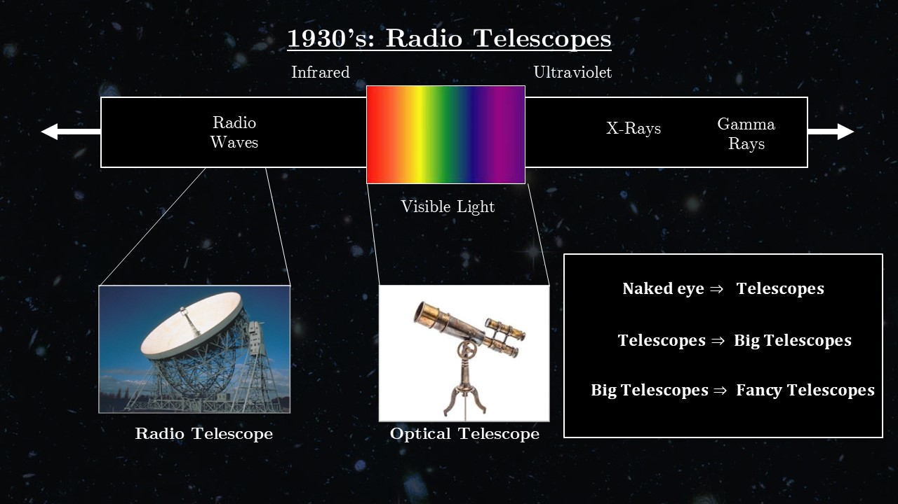  

You're probably aware that light exists on a spectrum going from red to blue: this is where we get rainbows from. You're probably also aware that this spectrum keeps going. You can go up past blue, through ultraviolet, and get to X-rays and gamma rays. You can also go down, past red and through infra-red, and reach microwaves and radio waves. In the same way we build the familiar [optical telescopes](https://en.wikipedia.org/wiki/Optical_telescope) to capture visible light, we can also build [radio telescopes](https://en.wikipedia.org/wiki/Radio_telescope) to watch the sky with radio-waves.

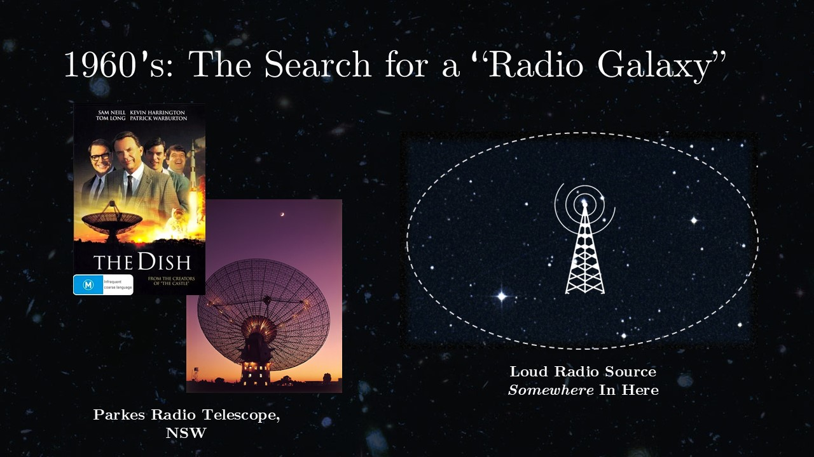  

Back in the 1960's, a lot of these radio telescopes were working on the same problem. When we pointed them at the sky, we could see _something_ up there that was giving off a bunch of radio noise: it was a "radio loud source". The problem was that out radio telescopes were "blurry": we could get a vague idea _roughly_ where the signals were coming from, but that fuzzy patch of sky still contained a massive pile of possible sources for the signal. There's actually a really famous telescope in Australia that was leading the charge on cracking this case: the [Parkes Radio Telescope](https://en.wikipedia.org/wiki/Parkes_Observatory) in New South Wales. Australians younger than the movie shrek will recognise its iconic shape immediately: it had a starring role in the psuedo-historical drama [The Dish (2000)](https://en.wikipedia.org/wiki/The_Dish), where it played the titular dish. \\

So, we knew that _something_ up in the sky was blasting our radio waves: how did we figure out _what_? The radio telescopes of the time were [fundamentally limited](https://en.wikipedia.org/wiki/Diffraction-limited_system) in their resolution, no clever wrangling of the data was going to narrow things down. Instead, the scienstists at Parkes used a clever trick. Where you're sitting right now, try to find some bright light source: a street light, kitchen light or so forth. Now, squint your eyes until the light goes really blurry and you can't quite see where it is: you're now in the same place as the Parkes team. Now, stick your thumb out and slowly sweep it left to right. At a certain point, your thumb's going to pass in front of the light source and its fuzzy image will vanish from view, before reappearing as your thumb continues its transit. Even if your vision is blurry, if you know where your thumb is that is by itself enough to know where the light is.

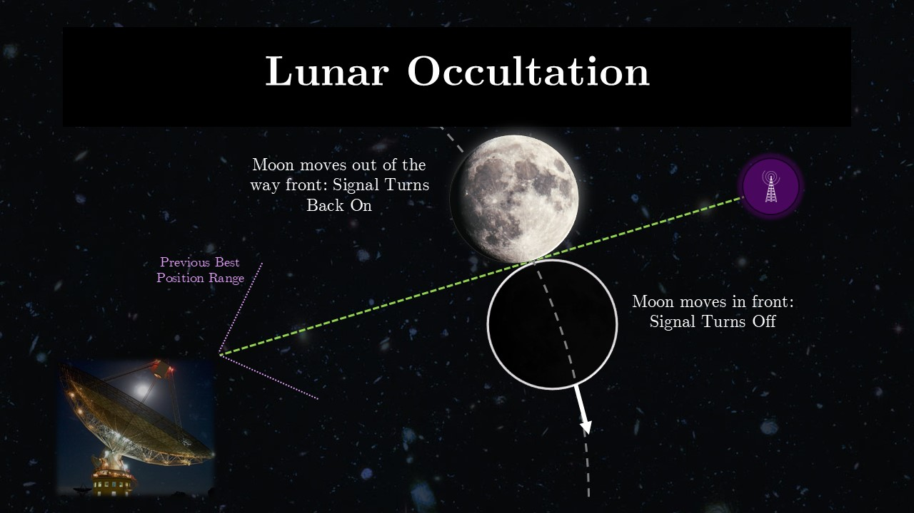  

Sadly, the scientists at Parkes were not hanging off the dish with their thumbs stuck out to the night sky, as good of a story that would make. Instead, they used something else, something much bigger. They used the [Moon](https://en.wikipedia.org/wiki/Moon). We've been keeping track of the moon _very_ precisely for a _very_ long time, and so we have a good idea where it's going to be at any given moment. By pointing the dish at the sky and waiting for the moon to pass over that fuzzy patch, Parkes saw the radio signal vanish at some moment, and then reappear some time later as the moon passed overhead. By checking the exact thing in the sky that the Moon was blocking and revealing, they could figure out _exactly_ what object was giving off those mystery radio waves. This trick of "hiding with the Moon" is called a [Lunar Occulation](https://en.wikipedia.org/wiki/Occultation).

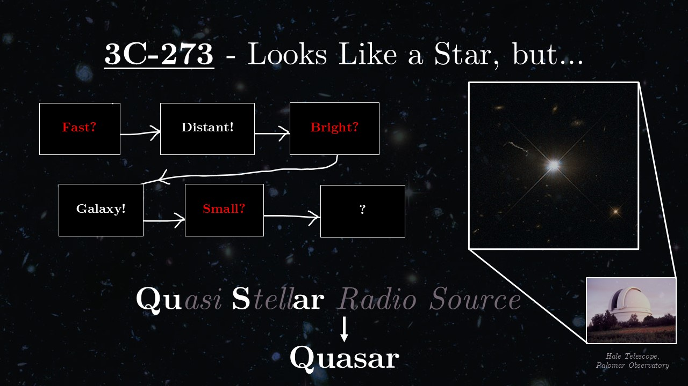  

Now we have a prime suspect: an object called [3C-273](https://en.wikipedia.org/wiki/3C_273) (meaning the two hundred and seventy third object in the [third Cambridge catalogue](https://en.wikipedia.org/wiki/Third_Cambridge_Catalogue_of_Radio_Sources) of the sky). Once we knew where to look, we could drill into it with the a more precise optical telescope, namely the [Hale Telescope](https://en.wikipedia.org/wiki/Hale_Telescope) in California. What they saw baffled them: this shining point of light _looked_ very much like a star, but it seemed like it was moving away from us. Fast. As in, about one fifth the speed of light fast. We already knew that distant galaxies moved away from us, so an obvious answer was that this thing was just in a very distant galaxy- but this just raised more questions! If it was billions of light years away, how was it bright enough to look like a star all the way away? An obvious answer is that it's something enormous, like a whole galaxy, but on closer inspection the source was also _flickering_, and very quickly. If it was large, any flickering would sort of "average out", so it needed to also be less than a few light-days across. By contrast, our galaxy is about a hundred thousdand light _years_ across.

Confused by this odd little thing, astronomers of the time labeled it a "Quasi-Stellar Radio Source" (Quasar for short), basically meaning "weird star thing with radio waves". Even the name was essentially an admission that we had no idea what it was.

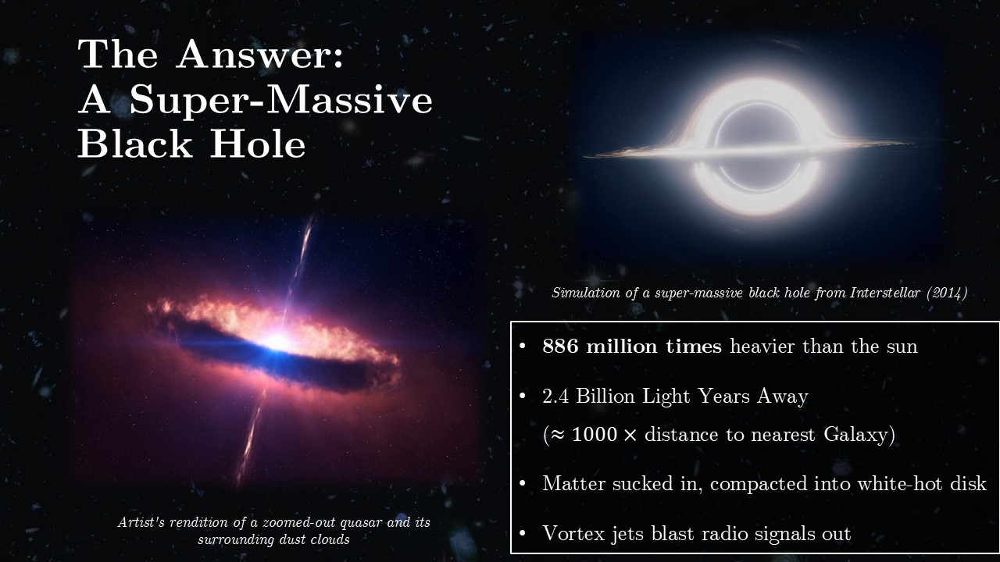  

It took a few decades for us to figure this puzzle out, and the answer ended up being surprisingly simple. The reason this "quasar" looked small, bright and far away was because it _was_. What we were seeing was the first ever discovery of a [super-massive black hole](https://en.wikipedia.org/wiki/Supermassive_black_hole). Right in the heart of a distant galaxy was an enormous object, 886 million times heavier than the sun (for contrast, the absolute heaviest of your ["every day" black holes](https://en.wikipedia.org/wiki/Stellar_black_hole) cap out at a few dozen solar masses at a stretch). This monster was sucking in matter from the core of the galaxy, and that matter was circling the black hole like water circling the drain, crashing into itself, frothing and churning and heating up until it glowed like the surface of the sun. This black hole was so massive, its gravity to intense, that it was packing an incredible amount of power down to a (astronomically speaking) tiny space, bright enough to look like a star from earth. Some of this matter getting pulled in was also getting twisted up and jetted out into these "radio jets", firing out and extending like giant antennae and ringing with radio signals: the same radio signals that had tipped Parkes off in the first place.

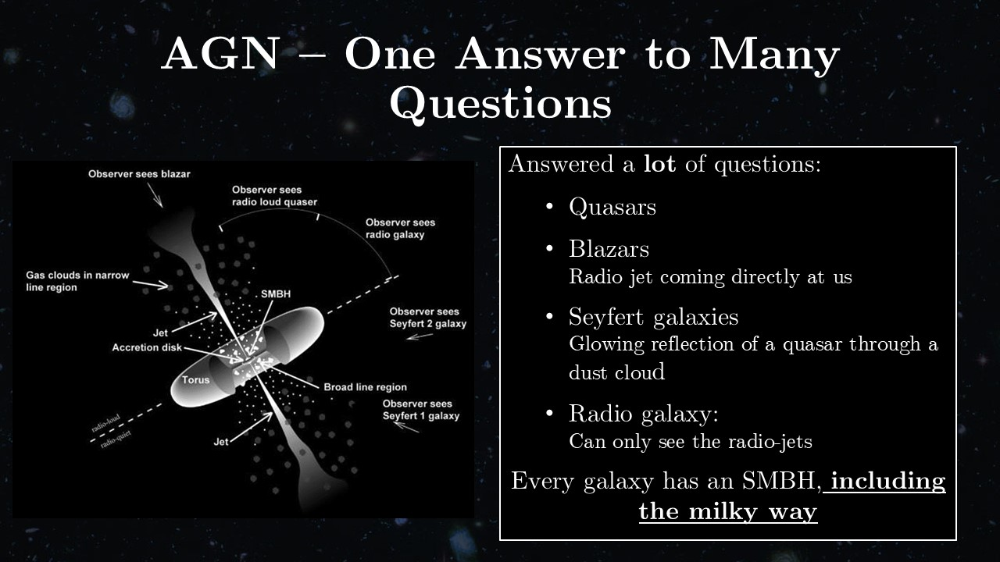  

Since their discovery, we've come to see these supermassive black holes all over the place, and they've graduated to the more general name "Active Galactic Nuclei" (AGN). Not only are they everywhere, but their discovery also solved a pile of other mysteries. AGN have a complex geometry, the black hole's gravity forming not just that glowing accretion disk but also this layered structure of clouds. Depending on what angle the AGN is sitting at, different parts are blocked or visible, and this single class of object can explain all sorts of weird in-sky objects. Radio galaxies like 3C-273, yes, but also everything from [X-Ray emitting galaxies](https://en.wikipedia.org/wiki/Astrophysical_X-ray_source), gamma ray emitting "[Blazars](https://en.wikipedia.org/wiki/Blazar)", the list goes on. Quasars output such incredible energy, the brightest outshining all the stars in their galaxy put together, and wear so many faces owing to their complex geometry, that they dot the sky with all sorts of fascinating and powerful signals.

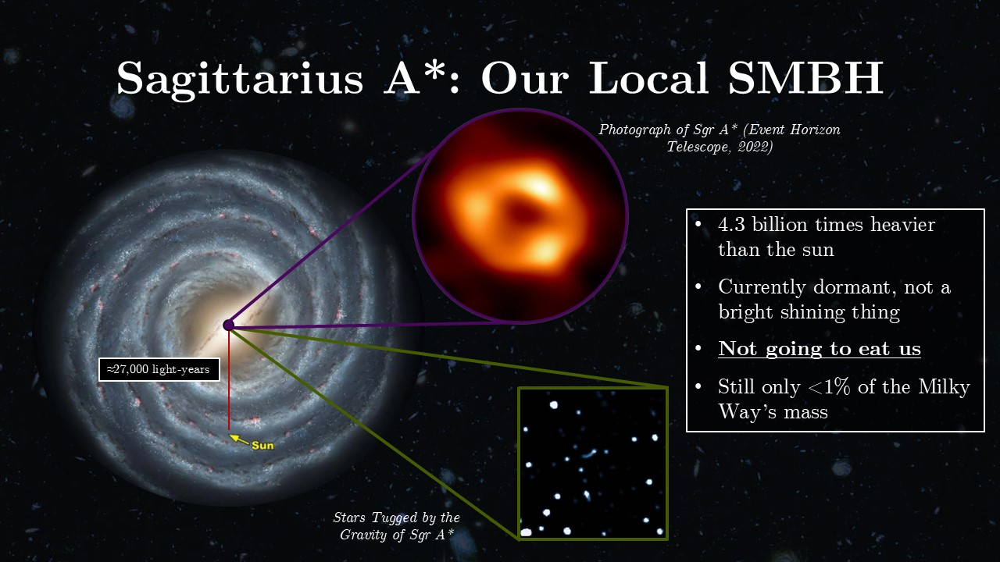  

Not only have all sorts of things turned out to be AGN, but it turns out that _every_ galaxy, even the ones without AGN, _do_ have a supermassive black hole. And yes, that includes out _own_ galaxy. That's right, the Milky Way has its own black hole: it's in the constellation Sagittarius about 27 thousand light years way. Ours is a _dormant_ black hole, not producing the incredible amounts of light of a quasar, but we can still see it pulling on the stars that flit around it in the Galactic core. Here's the good news: while an invisible massive planet eating monster might sound scary, we, and the rest of the Galaxy, are very much safe. Black holes only consume things that are relatively near by, and the rest of the Galaxy is coasting along on nice stable orbits and under no threat of being eaten.

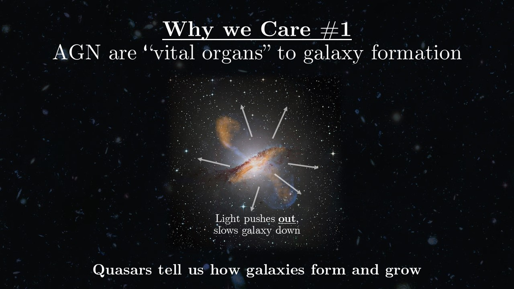  

So, why do we care about these things? It turns out that AGN play an extremely important role in how galaxies "grow" up from baby galaxies into full-grown adults like the Milky Way. You might think that all that mass and gravity would want to scrunch the galaxy down, make it denser and more active, but actually the opposite is true. As matter falls onto the black hole and that accretion disk burns, it blasts out an incredible amount of light that hammers into the gas of the galaxy that feeds the formation of stars. It thins the galaxy out, slows down its progress. These AGN _regulate_ how quickly galaxies evolve. If we want to understand how galaxies happen, and by extension how you and I got here, we need to have a good understanding of these AGN.

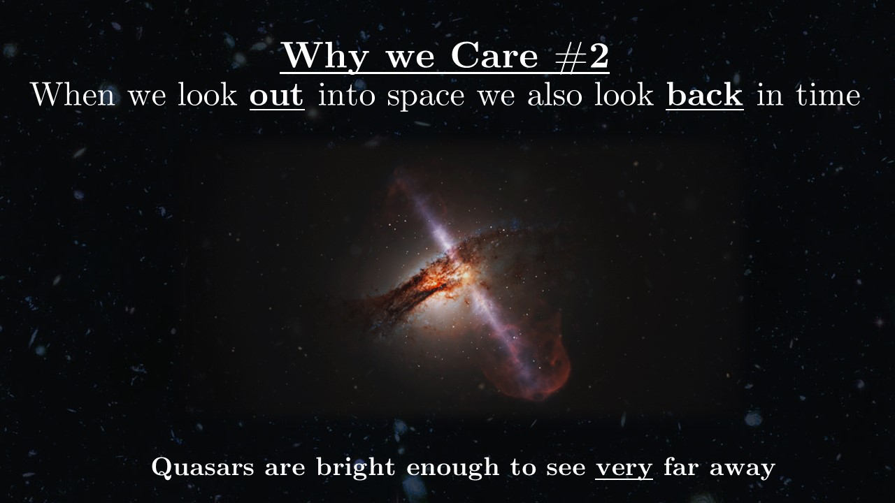  

The other reason we care is that AGN are _bright_. Unimaginably bright. They are one of the few things bright enough to see out at cosmological distances. Remember that when you look at something billions of light years away, you are also looking at light which is billions of years old. By looking _out_ in space, you also look _back_ in time. AGN give us little pin-prick snapshots of what galaxies and the universe was doing back billions of years ago, across the history of the Universe.

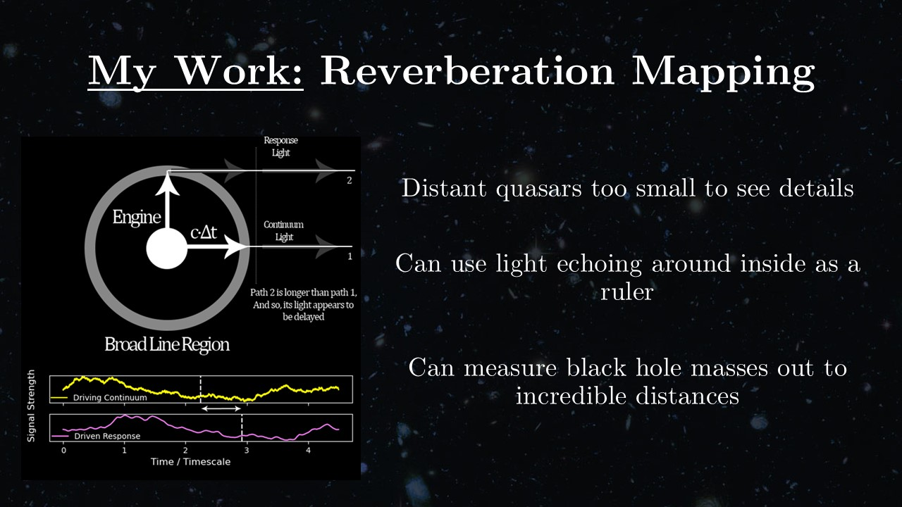  

This is my job: trying to figure out how heavy these supermassive black holes were way back in the past. I specifically work in this trick called **reverberation mapping**: using the way light echoes around the black hole to measure its mass. Remember that complex geometry that AGN have? One feature is a dust cloud called the **broad line region**, orbiting around the black hole a ways out from the disk, capturing and re-emitting its light like a lampshade. The disk isn't a static light source, it flickers, and we can see those flickers "echoe" off the broad line region. If we can measure that flicker, we can see how long the echo takes to figure out how far the light had to travel, using the echo as a ruler to "map" out the geometry. From there, highschool physics lets us get the mass of the black hole.

  

The other reason we care about measuring SMBH masses is that, embarassingly, we don't know where they come from. It could be lots of black holes merging in young galaxies, it could be giant first generation progenitor stars growing to enormous masses and collapsing like a house of cards, it could be that the black holes have always been there and acted as the initial seed-beds for galaxy formation. We have ideas, but we just don't know for sure.

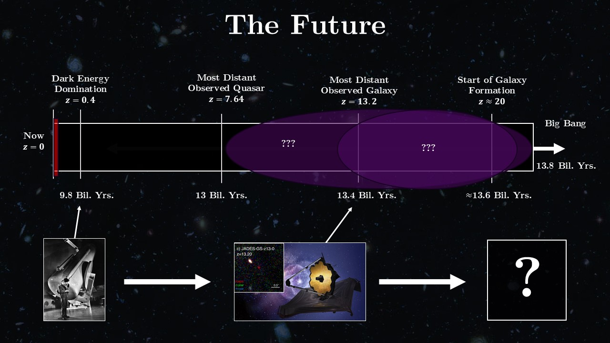  

The exciting news is that we might be able to find out. When we first discovered the universe was expanding, we managed to glean that information from when our window into the universe extended out to only a pitiful distance. As cosmologists we talk about distances in [redshift](https://en.wikipedia.org/wiki/Redshift#Cosmic_expansion). When we discovered the Universe was expanding, we could only see galaxies out to a redshift of $<0.005$. In the century since, we've pushed that out farther and farther, until, with the launch of [JWST](https://en.wikipedia.org/wiki/James_Webb_Space_Telescope), we've pushed that envelope out to more than a thousand times beyond that first Hubble diagram. This is already yielding exciting new mysteries: we're seeing mature galaxies much younger than we thought, quasars older than they should be. This current generation of telescopes have already pushed our view out until we're able to see the very youngest galaxies, but in all likelihood the _next_ generation will be able to image the first AGN sparking to life as the first galaxies form around them. Within our lifetime, we may be able to actually _see_ how all of this came together.

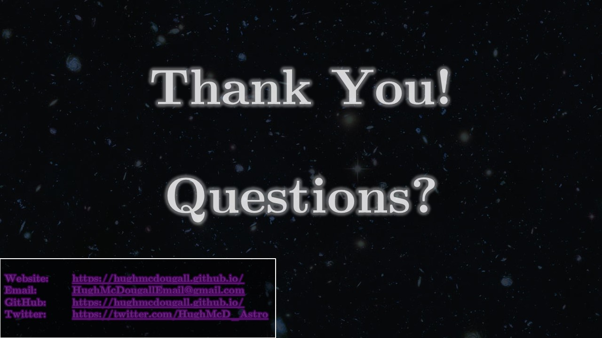  

