# The Brightest Black Holes
## Pint of Science Brisbane 2025

I presented this outreach talk as a part of the Brisbane [Pint of Science](https://pintofscience.com.au/) festival, my second time presenting at this week long festival of public outreach. This talk was focused on AGN / quasars: where they come from, how they effect their host galaxies and why they're useful to cosmologists.

If you'd like to download the powerpoint file, you can find it [here](./Presentation_pos_2025.pptx).

------------

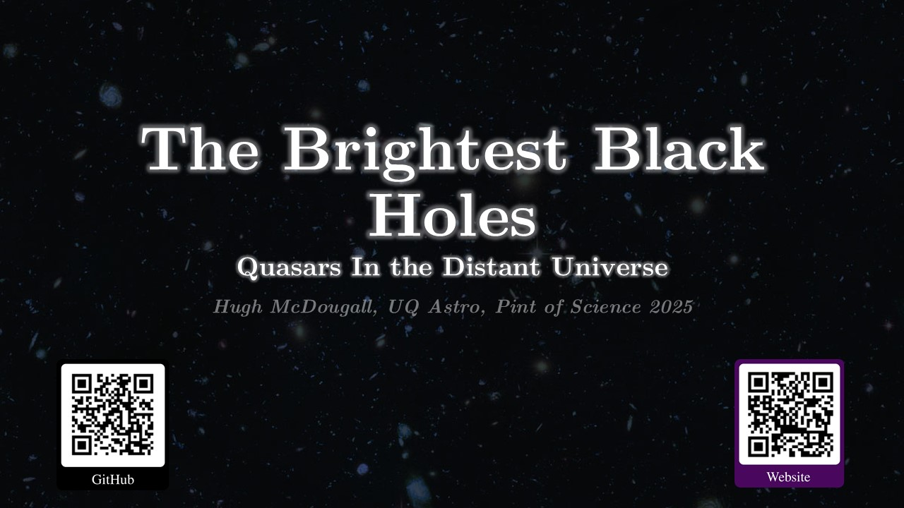

This talk was aimed at general audiences with the aim of clearing up what black holes were / how they worked, and explaining the importance of supermassive black holes. As a secondary goal, I wanted to help the audience understand what "statistics" meant in the context of astrophysics at an abstract level.

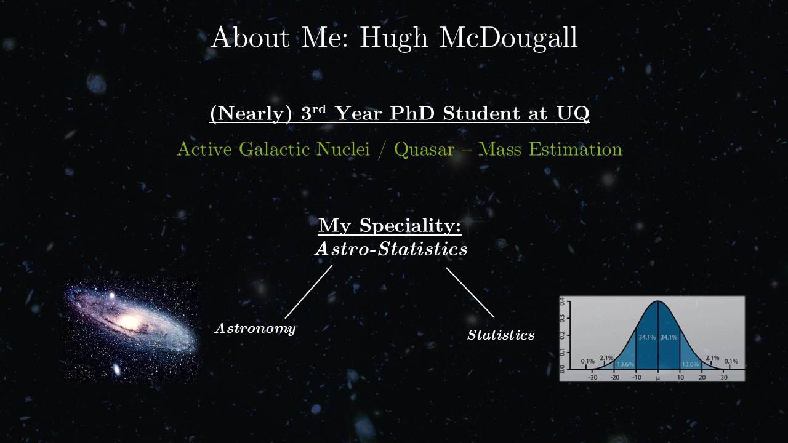  

Statistics has a bit of a nasty reputation in everyday life, it's opaque and unfriendly and often leads people to tune out the moment you bring it up. Here I promise that there will be no maths or equations at any point, instead I'll limit it to the general ideas at play. I'll also explain about quasars: the brightest single objects in the universe despite being the blackest and hole-iest of black holes.

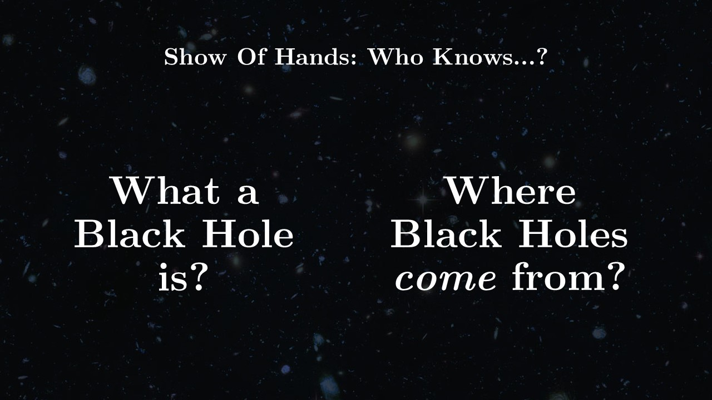  
Most people already have a pretty good idea of what a black hole is, at least loosely. They might exaggerate them a bit, imagining them as invisible monsters skulking about space and gobbling planets down their maw, but they do at least understand the idea of them being a thing that uses gravity to suck in. If you can envision this, you probably feel pretty confident in answering yes if I ask you "do you know what a black hole is". But do you still feel as confident if I ask you where black holes _come from_?

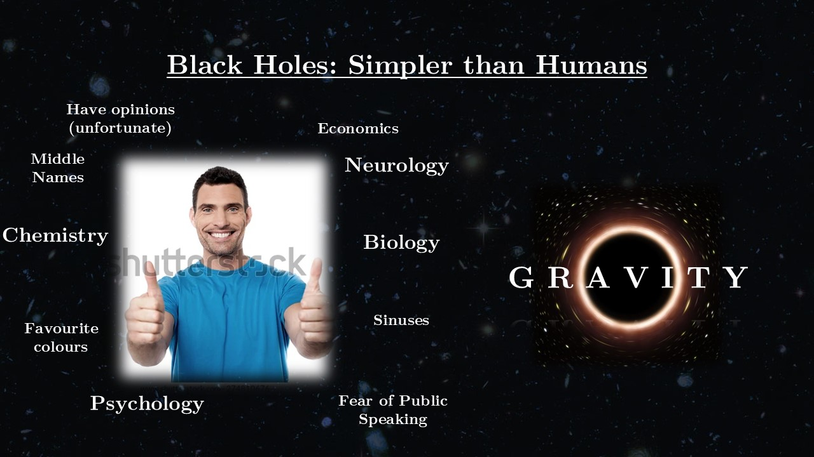  

Despite their expotic repuration, black holes are surprisingly simple creatures. They're in fact much simpler than human beings. If you want to understand a human, you need to understand chemisty, biology, psychology, economics and so forth, but if you want to understand black holes you only need to understand one thing: **gravity**.

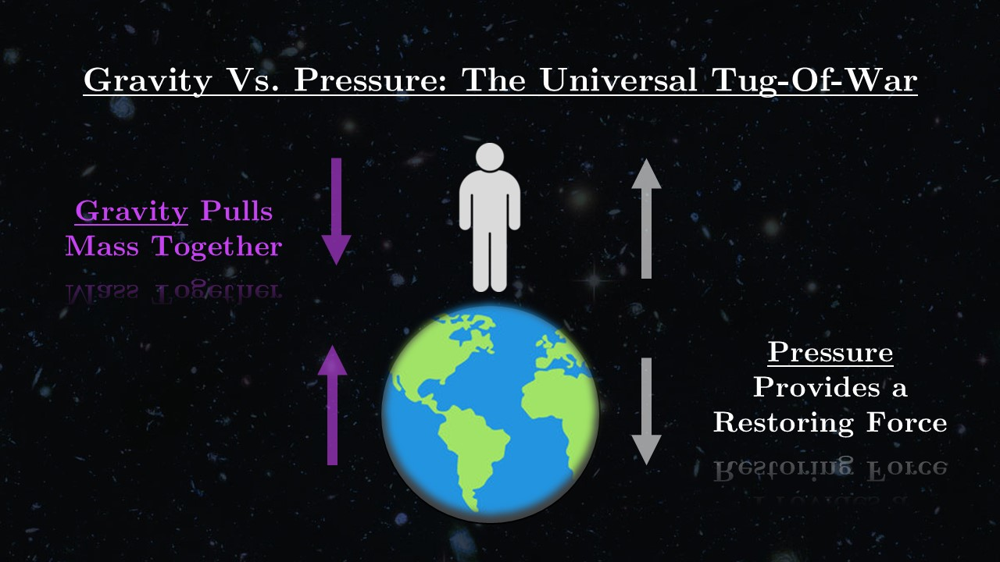  

Gravity, for our purposes, is just a force that pulls _stuff_ together. You are made of stuff, the Earth is made of stuff. If you were to jump from a roof, it'd be gravity that pulls you down to the ground. It would also, at is happens, pull the ground towards you, but as the earth is (slightly) heavier than the average person, it would move much less. That pull is still dragging on you right now, but you will notice that you are not falling down into the Earth's core. Why? Simple-the floor's in the way. The atoms of your feet and the atoms of the ground don't want to get close to one another, and so they push out with a restoring force, a pressure, that holds you up against gravity. It turns out that this is a general statement about _everything_ in the Universe: every thing, from planets to galaxies, is in the middle of a tug-of-war between gravity trying to collapse it down, and some sort of pressure holding it up.

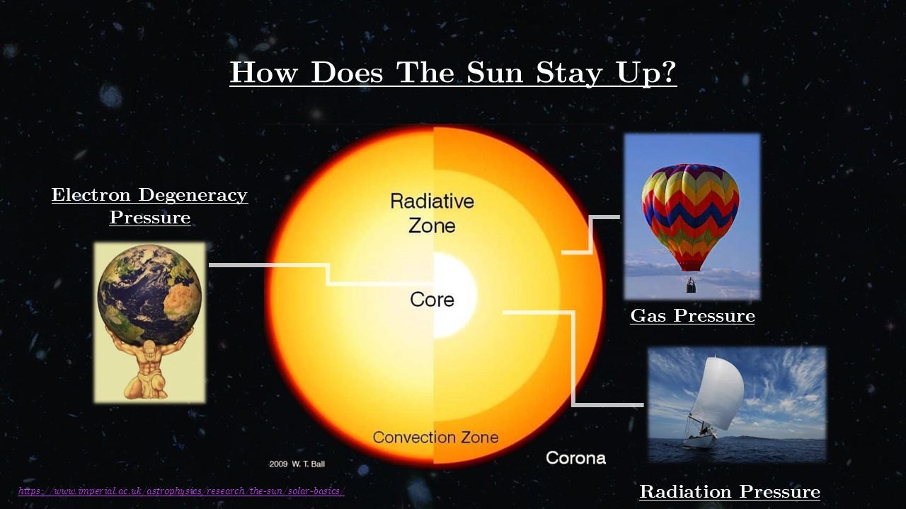  

That's easy to understand here on the Earth where we have solid ground, but what about the Sun? The Sun is much heavier, a lot more gravity to go around, and it doesn't have any solid ground to speak of, so how does it stay up? The answer is pressure. At the outer layers that's **gas pressure**, like a hot air balloon. The sun is made of gas, that gas is hot, which means those gase particles are wizzing around and puffing themselves up. If you go in a little further gas pressure isn't enough and you need something stronger. You need **radiation pressure**: the light of the star shining out and slamming into the gas like wind on a sail. As you go right down to the core you need something even stronger, you need **electron degeneracy pressure**. A full explanation of what this is would take maths, quantum mechanics and more space than I have here, but as a rough idea you can think of it was the electrons in the atoms being scrunched so tight they they start to rub up against one another. They take exception to this, throw a massive fit, and the force of that is enough to support the mass of an entire star.

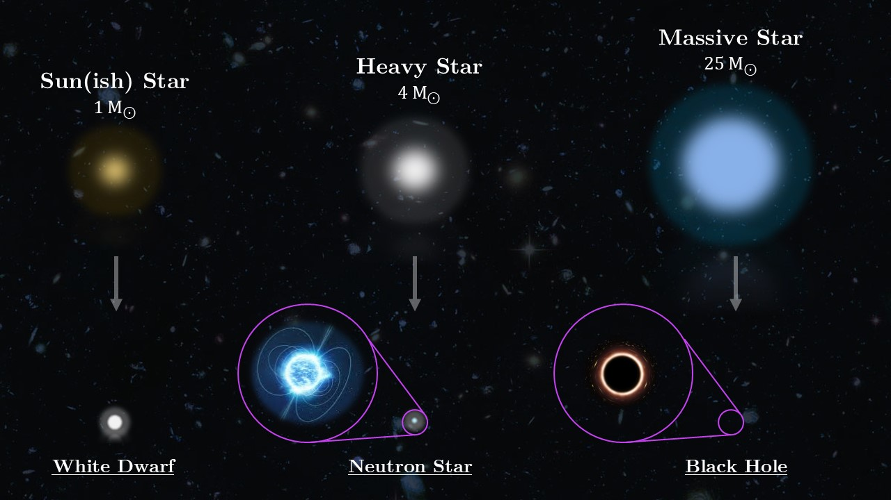 

For our Sun, in the war between pressure and gravity, victory is going to go to pressure. Even as our star ages and it's outer layers flake away, that degenerate core is going to remain as a white hot chunk of stuff floating around space: a [white dwarf](https://en.wikipedia.org/wiki/White_dwarf). But the story changes if we go to a heavier star, say 4-5 times heavier. As a star burns, it dumps nuclear ash onto its core and gradually increases its mass. It turns out that electron degeneracy pressure has an upper limit, the [Chandrasekhar limit](https://en.wikipedia.org/wiki/Chandrasekhar_limit), and when you go above that the gravity squeezes all of the space out of the atoms, until the atomic nuclei are crammed up against eachother and you form a [neutron star](https://en.wikipedia.org/wiki/Neutron_star). Neutron stars are the densest material in the Universe: a single teaspoon would weight as much as a mountain. But we can go further - once we get to about 25 times the mass of the Sun, even a neutron star can't support that weight. We've crossed the last line of defence in the war against gravity, and the star just falls in and in and in, down to a single point of mass: a __singularity__.

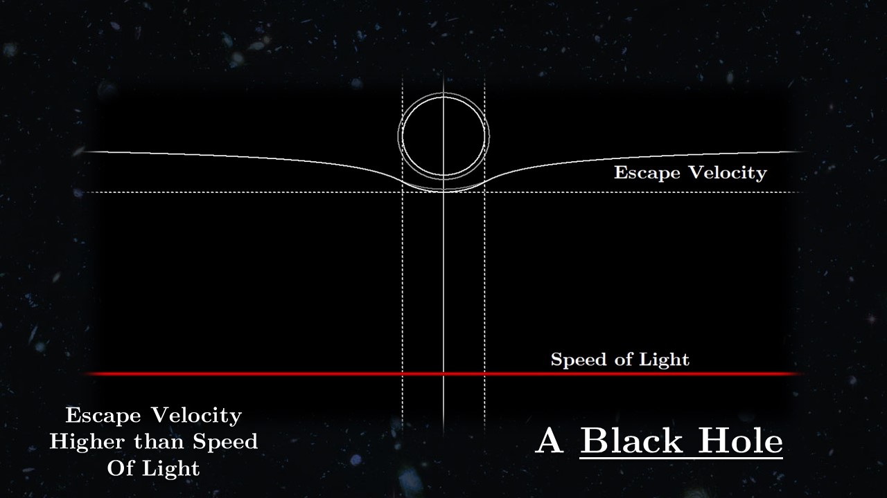  
Gravity gets stronger the closer you are to something. Here on earth, We're as close as I can get - We're right on the surface. If we were to try and get closer, we'd be inside the earth, and there'd be less _stuff_ to pull on us, so gravity would actually get weaker. But with a singularity, this isn't the case: you can just get closer and closer, and gravity can get stronger and stronger, until at a certain point it becomes so strong that even light can't escape. You have a pit of gravity that, once it falls in, light can't escape from. You have a __black hole__.

	<video width="640" height="360" controls>
	  <source src="SCM_anim.mp4" type="video/mp4">
	Your browser does not support the video tag.
	</video> 

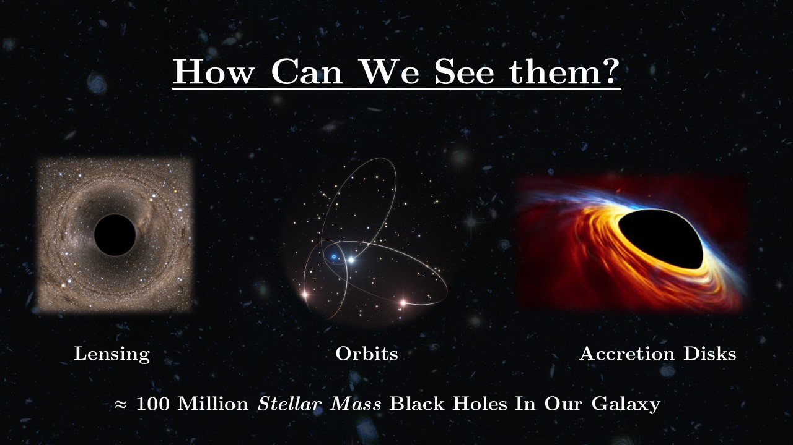  

How do we know these things exist? For starts because the physics tells us they have to, but also we can see them. Even though they're "black", we can see the effect they have on space around them.
1. That trapping of light isn't an all or nothing affair - we can see the light that makes a near miss having it's path bent like a lens
2. Black holes tug on their neighbours, and we can see stars having their paths disturbed or orbiting around black holes
3. Most important for us here, we can see black holes when they're eating. Matter doesn't fall straight in, it misses and loops around like water circling a drain. It crashes into itself, frothing and churning and heating up until it glows red hot, white hot, blue hot. We can see these glowing swirls that we call an __accretion disk__

These are what we call "stellar mass black holes", i.e. black hole that's "about as heavy as the sun". They're not particularly rare: ball park estimate puts about 100 million of the in the Milky Way.

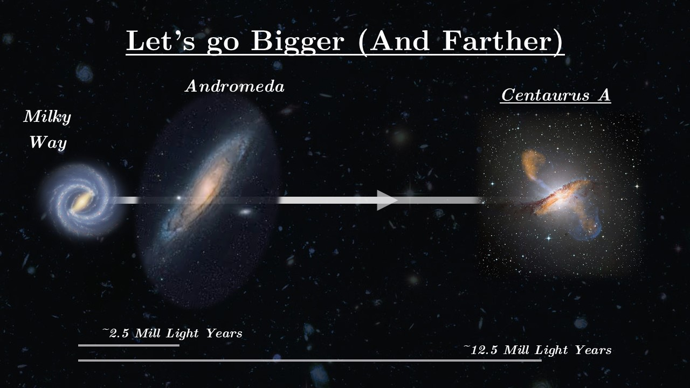  
That's pretty cool, but I promised the brightest holes in the Universe, and for that we need to go a little farther out. Our nearest galaxy is Andromeda, but if we go about 5 times further out we get to Centaurus A. This is another galaxy, about as big as the Milky Way, but it has these giant bits blasting out its sides. These aren't made of stars like the rest of the galaxy, they're what are called __radio jets__, streams of matter being blasted out from a single point in the galaxy's core with enough energy that they ring like radio antennae. So, what could be generating enough force, enough energy, to blitz material out farther than the diameter of an entire galaxy?

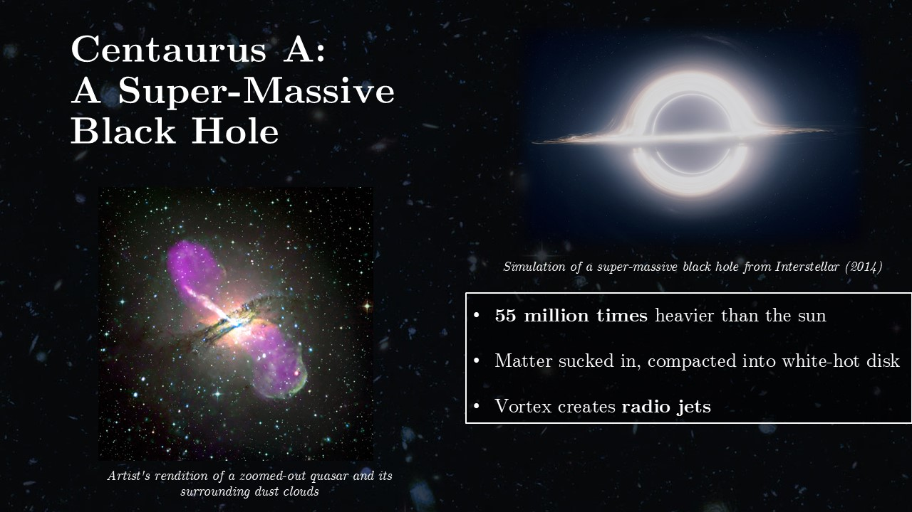  

Given the time of this article, you can probably guess that the answer is a very heavy black hole. To stress, "very heavy" here doesn't mean 100 times or a thousand times heavier than the sun, but __55 million times__ heavier. At Centaurus A's core is a __supermassive black hole__, gobling down matter and forming an extremely luminous accretion disk. Some of that matter is splashing up the sides, like when you try to rinse a teaspoon in the sink, and getting jetted out with enough force to blast out farther than the width of the entire galaxy. We call this an __active galactic nucleus__ (AGN), "the center of a galaxy that's doin' stuff".

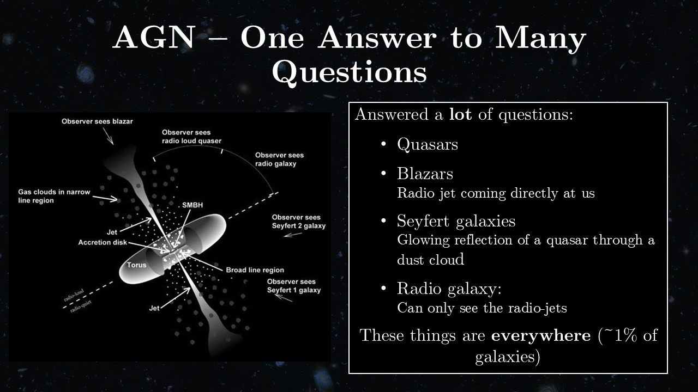  

It turns out these guys are all over the place. About 1% of galaxies have these AGN in them in the modern Universe, and not only are they everywhere but all sorts of things turn out to be them. If you look at one from the side, this cloud called the dusty torus blocks your view and you just see those radio lobes. If you look right down from the top you get hit with gamma rays and you see something called a [blazar](https://en.wikipedia.org/wiki/Blazar). If you peak just over the rim, you can see down into that incredibly bright disk along with a bunch of dust clouds like the **broad line region**, these are the ones that I study. 

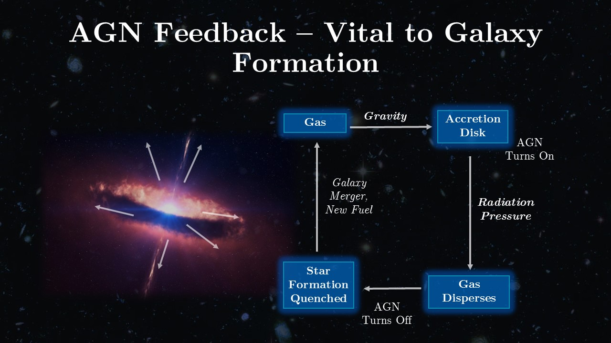  

We care about these AGN, not just because they're really cool, but because they play a starring role in how galaxies evolve. You'd think that, in the war against gravity, a supermassive black hole would be on the side of gravity - but they're not. Imagine a young galaxy: gas is collapsing into stars, and also falling onto the supermassive black hole. As it does it sparks up that accretion disk, it turns the AGN "on", and it begins blitzing out all that light. But that light has radiation pressure, which slams back into the gas, slowing it down and turning the AGN back "off". Not only that, but it disperses the star forming gas, it "quenches" the star formation. We call this "AGN feedback", and it sets a sort of speed limit on how quickly galaxies can evolve.
	
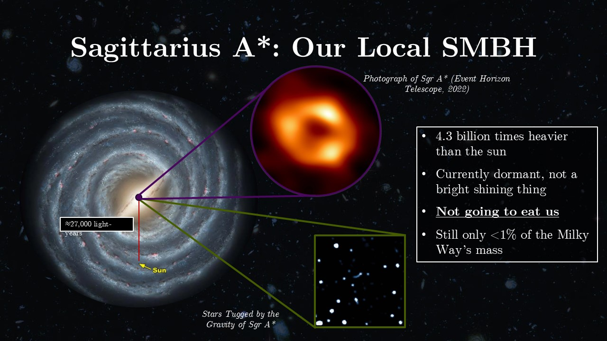  

It turns out that _every_ galaxy has gone through this process at some point in the past. About 1% of galaxies _have_ an AGN in them, but the remaining 99% _did_ have one in the past, and that includes _our own galaxy_. How do we know? For starters: the black hole is still there! We have our own supermassive black hole in the constellation Sagittarius, about 27 thousand light years away. Unlike Centaurus A, ours is _dormant_, it's not gobbling down matter and so we can't see it, it's an _in_-active galactic nucleus, but we _can_ see it tugging on the stars around it.

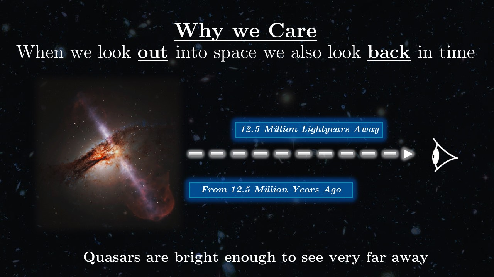  

So understanding these AGN is important for understanding how galaxies happen, how we got here. How do we investigate this history? Fortunately, AGN are _bright_. They're incredibly bright - a single AGN can easily produce more light than all the stars in the rest of its host galaxy combined. This means we can see them at cosmological distances. Remember that when you look at something millions of light years away, that light took time to reach you, and so you are also looking millions of years _back in time_. AGN are one of the few things bright enough to see at those distances, and they give us snapshots of what the Universe has been doing across its history.

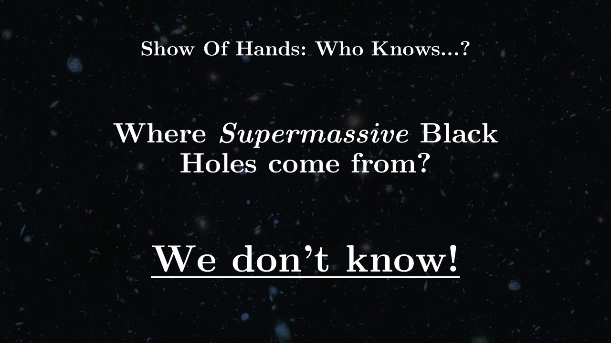  

Taking a moment: we know that stellar mass black holes come from stellar mass stars. So would you are to hazzard a guess where supermassive black holes come from?

We don't know.

A little embarassingly, we don't actually know where these things come from, even though they show up in every one of the billions of galaxies we've observed. The obvious answer is that you start with a stellar mass black hole and it absorbs matter and grows over time, but when you do the maths this idea starts to strain believability.

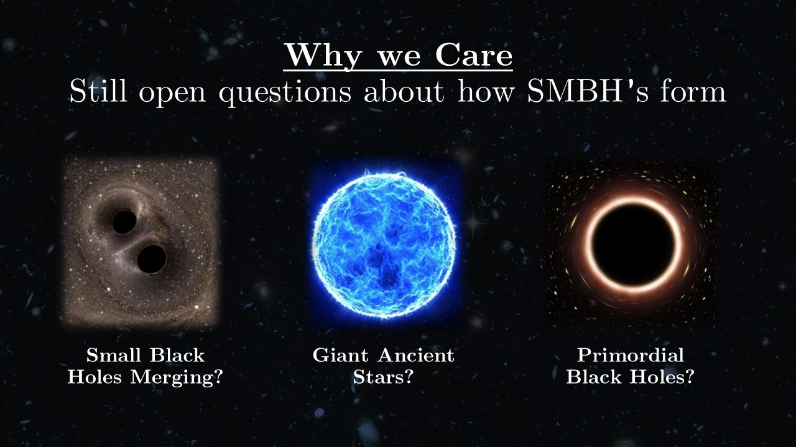  

We're not lacking for ideas though! It could be that lots of smaller black holes join together in what we call "hierarchical mergers". It could be that stars in the early universe were just extremely heavy so that the black hole "seeds" where already really big. It could be that there were _already_ black holes at the very start of the universe, pre-dating the galaxies and giving them a headstart on growing. 

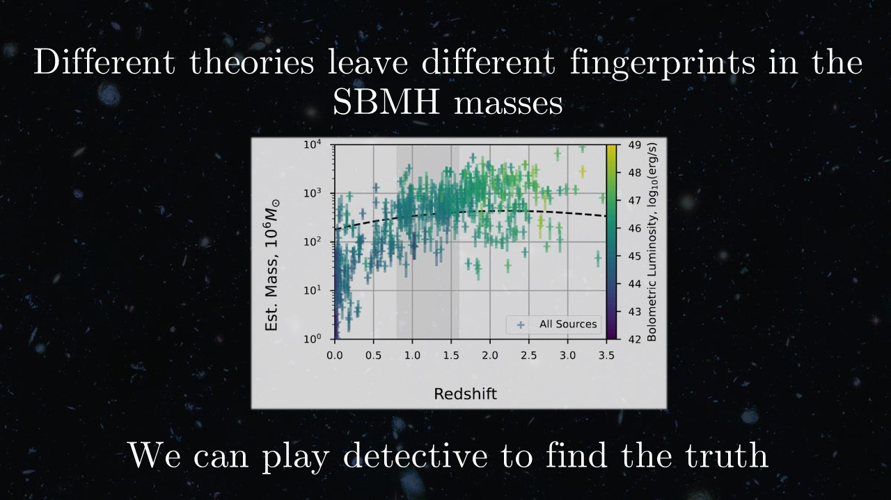  

We don't know, but we do have ways of finding out. Each of these ideas would leave certain fingerprints on the distribution of black hole masses, and on how this has changed over time. At this point we have to play detective - we need to go around putting together lots of little bits and bobs of information like we're examining a crime scene. Any one galaxy or black hole won't be enough to crack the case, but if we put enough bits of information together we can build a clearer and clearer picture of what the truth is. There's a name for this art of assembling lots of loose information into a clear picture: we call it **statistics**.

  

This is the area I work in: my job is to estimate how heavy these supermassive black holes are. The accretion disk isn't a static light source: it bounces some of its light off this hazy atmosphere of electrons around the black hole called the corona, and some of that light reflects back down onto the disk and excites it. This makes noise, like feedback on a guitar amp, and so the accretion disk flickers by a lot. Some of that light rattles around those dust clouds and gets re-emitted, following that same flickering, but with a _delay_. It takes time for the light to travel from the disk to the clouds, and if we can measure that delay we can figure out how big the AGN is. This is a lot like how you can tell how far away a storm is by counting the gap between thunder and lightning. 

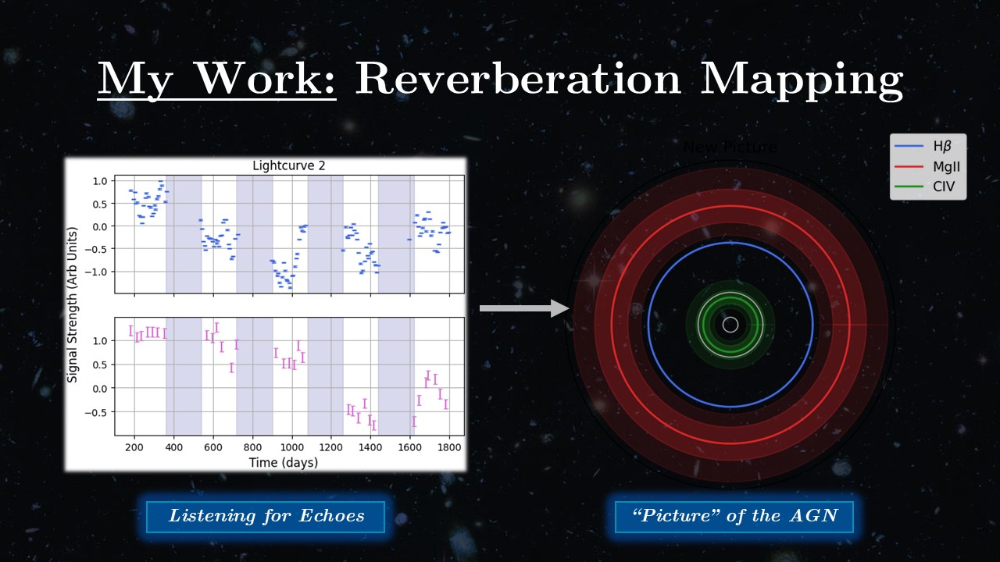  

What that looks like in the actual day-to-day is taking signals of light from the disk and light from the cloud, and turning that into a picture of what the AGN looks like.

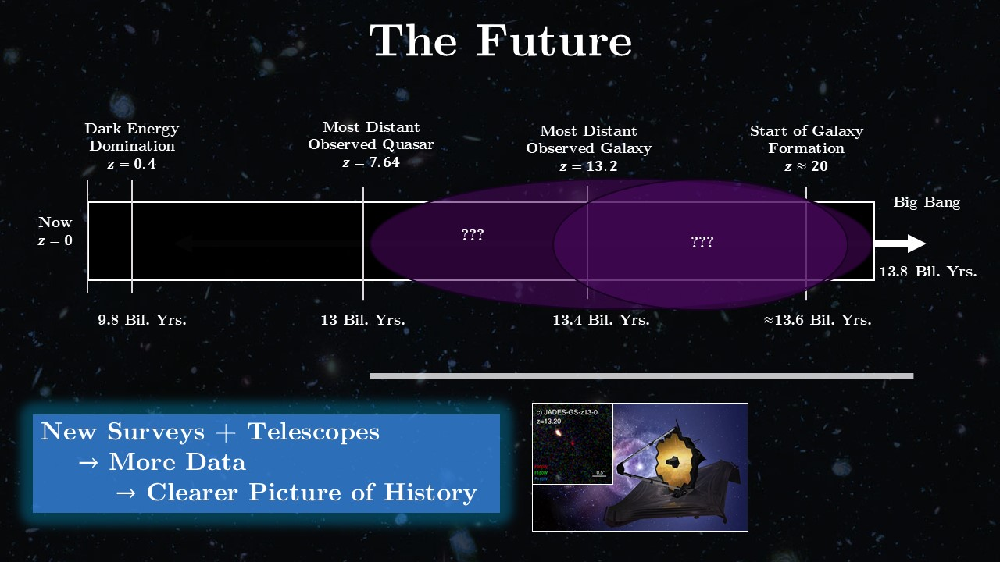  

It's an exciting time to be working in this field. In the last few years we've sent up new telescopes that can see farther out and further back in time, seeing the earlier stages of these AGN in the first galaxies. We're not there yet, but with the right data and enough statistics, we might be able to answer the big questions about where these black holes come from within our lifetimes.

  

